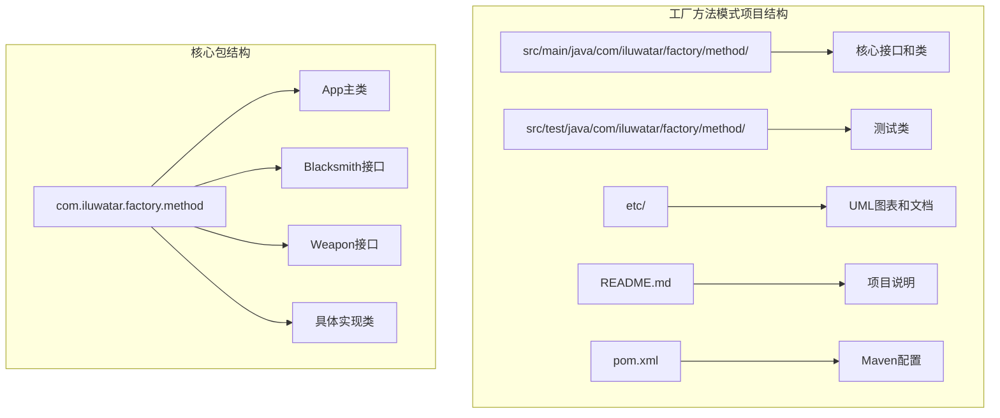
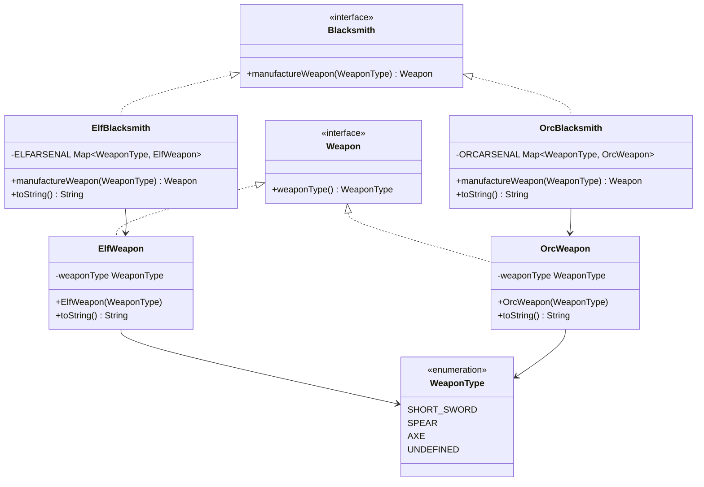
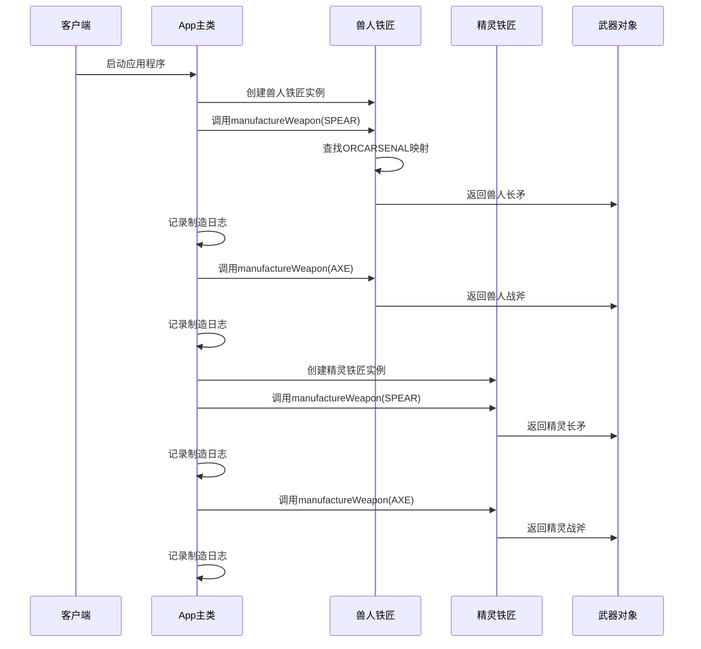
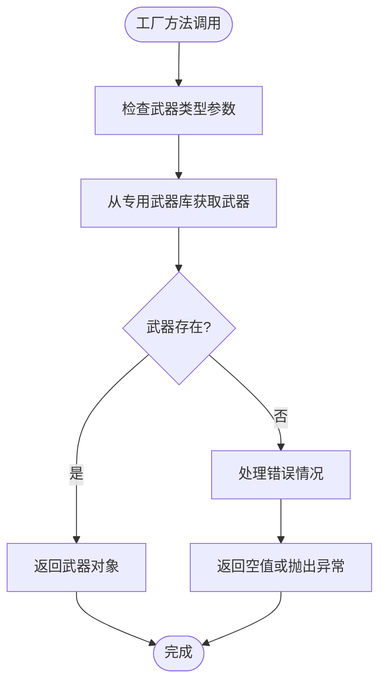
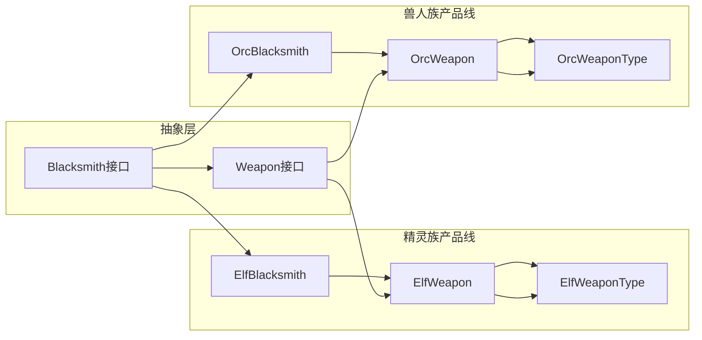
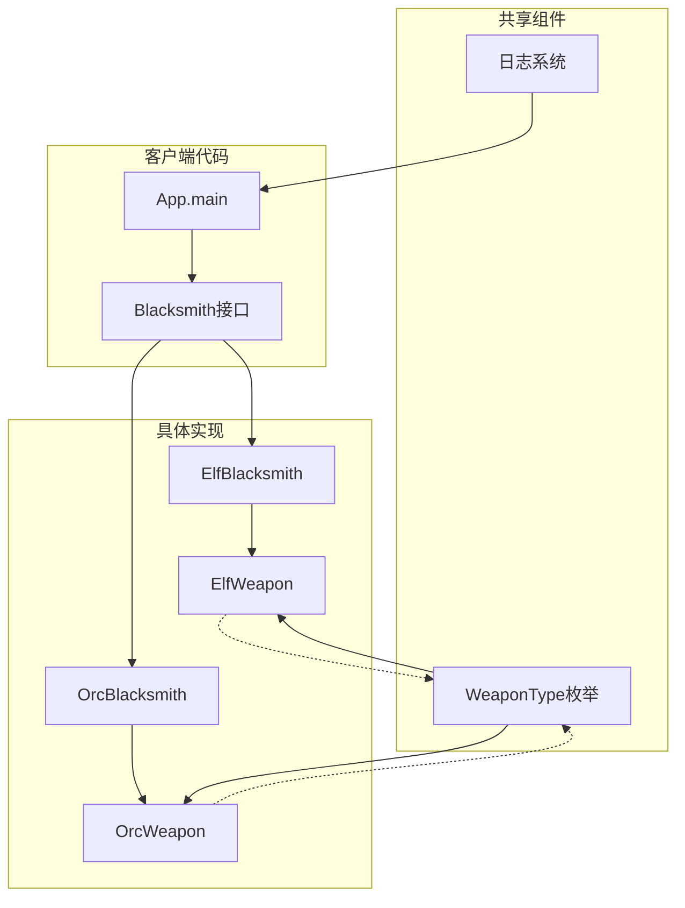
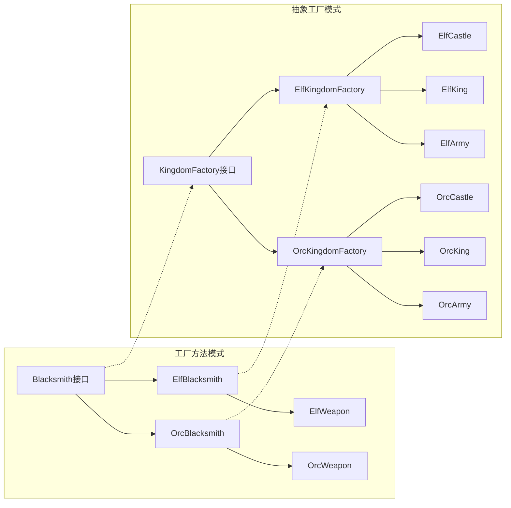

# 工厂方法模式

<cite>
**本文档引用的文件**
- [README.md](file://factory-method/README.md)
- [App.java](file://factory-method/src/main/java/com/iluwatar/factory/method/App.java)
- [Blacksmith.java](file://factory-method/src/main/java/com/iluwatar/factory/method/Blacksmith.java)
- [ElfBlacksmith.java](file://factory-method/src/main/java/com/iluwatar/factory/method/ElfBlacksmith.java)
- [OrcBlacksmith.java](file://factory-method/src/main/java/com/iluwatar/factory/method/OrcBlacksmith.java)
- [Weapon.java](file://factory-method/src/main/java/com/iluwatar/factory/method/Weapon.java)
- [ElfWeapon.java](file://factory-method/src/main/java/com/iluwatar/factory/method/ElfWeapon.java)
- [OrcWeapon.java](file://factory-method/src/main/java/com/iluwatar/factory/method/OrcWeapon.java)
- [WeaponType.java](file://factory-method/src/main/java/com/iluwatar/factory/method/WeaponType.java)
- [FactoryMethodTest.java](file://factory-method/src/test/java/com/iluwatar/factory/method/FactoryMethodTest.java)
- [factory-method.urm.puml](file://factory-method/etc/factory-method.urm.puml)
- [README.md](file://abstract-factory/README.md)
</cite>

## 目录
1. [简介](#简介)
2. [项目结构](#项目结构)
3. [核心组件](#核心组件)
4. [架构概览](#架构概览)
5. [详细组件分析](#详细组件分析)
6. [依赖关系分析](#依赖关系分析)
7. [性能考虑](#性能考虑)
8. [故障排除指南](#故障排除指南)
9. [结论](#结论)
10. [附录](#附录)

## 简介

工厂方法模式（Factory Method Pattern）是23种经典设计模式之一，属于创建型设计模式。该模式定义了一个用于创建对象的接口，但让子类决定实例化哪一个类。工厂方法使一个类的实例化延迟到其子类。

在Java设计模式中，工厂方法模式扮演着至关重要的角色，它提供了灵活的对象创建机制，避免了直接使用构造函数来创建对象，从而增强了代码的灵活性和可维护性。

本项目通过"武器锻造系统"这一具体示例，展示了工厂方法模式在实际开发中的应用。系统模拟了精灵族和兽人族的武器锻造过程，每个种族都有自己的铁匠来制造符合其文化特点的武器。

## 项目结构

工厂方法模式项目的整体结构遵循标准的Maven项目布局，采用分层组织方式：

**图表来源**
- [App.java](file://factory-method/src/main/java/com/iluwatar/factory/method/App.java#L1-L66)
- [Blacksmith.java](file://factory-method/src/main/java/com/iluwatar/factory/method/Blacksmith.java#L1-L35)

**章节来源**
- [README.md](file://factory-method/README.md#L1-L133)
- [App.java](file://factory-method/src/main/java/com/iluwatar/factory/method/App.java#L1-L66)

## 核心组件

工厂方法模式的核心由以下关键组件构成：

### 抽象产品接口
`Weapon` 接口定义了所有武器产品的共同行为规范，确保不同类型的武器都具备统一的接口。

### 具体产品实现
- `ElfWeapon`: 精灵族武器的具体实现
- `OrcWeapon`: 兽人族武器的具体实现

### 抽象工厂接口
`Blacksmith` 接口定义了工厂方法，负责创建武器对象。

### 具体工厂实现
- `ElfBlacksmith`: 精灵族铁匠工厂
- `OrcBlacksmith`: 兽人族铁匠工厂

### 产品类型枚举
`WeaponType` 枚举定义了所有可用的武器类型，包括短剑、长矛、战斧等。

**章节来源**
- [Weapon.java](file://factory-method/src/main/java/com/iluwatar/factory/method/Weapon.java#L1-L35)
- [Blacksmith.java](file://factory-method/src/main/java/com/iluwatar/factory/method/Blacksmith.java#L1-L35)
- [WeaponType.java](file://factory-method/src/main/java/com/iluwatar/factory/method/WeaponType.java#L1-L47)

## 架构概览

工厂方法模式的架构设计体现了面向对象设计的基本原则，通过抽象和多态实现了高度的灵活性：

**图表来源**
- [Blacksmith.java](file://factory-method/src/main/java/com/iluwatar/factory/method/Blacksmith.java#L1-L35)
- [ElfBlacksmith.java](file://factory-method/src/main/java/com/iluwatar/factory/method/ElfBlacksmith.java#L1-L53)
- [OrcBlacksmith.java](file://factory-method/src/main/java/com/iluwatar/factory/method/OrcBlacksmith.java#L1-L53)
- [Weapon.java](file://factory-method/src/main/java/com/iluwatar/factory/method/Weapon.java#L1-L35)
- [ElfWeapon.java](file://factory-method/src/main/java/com/iluwatar/factory/method/ElfWeapon.java#L1-L40)
- [OrcWeapon.java](file://factory-method/src/main/java/com/iluwatar/factory/method/OrcWeapon.java#L1-L40)
- [WeaponType.java](file://factory-method/src/main/java/com/iluwatar/factory/method/WeaponType.java#L1-L47)

## 详细组件分析

### 应用程序入口点

`App` 类作为应用程序的主入口点，演示了工厂方法模式的实际使用场景：

**图表来源**
- [App.java](file://factory-method/src/main/java/com/iluwatar/factory/method/App.java#L51-L64)

### 工厂方法实现机制

工厂方法模式的核心在于延迟对象创建决策到子类。每个具体的铁匠类都实现了自己的工厂方法：

**图表来源**
- [ElfBlacksmith.java](file://factory-method/src/main/java/com/iluwatar/factory/method/ElfBlacksmith.java#L44-L46)
- [OrcBlacksmith.java](file://factory-method/src/main/java/com/iluwatar/factory/method/OrcBlacksmith.java#L44-L46)

### 产品层次结构设计

系统采用了清晰的产品层次结构，确保了良好的扩展性和维护性：

**图表来源**
- [Blacksmith.java](file://factory-method/src/main/java/com/iluwatar/factory/method/Blacksmith.java#L30-L34)
- [Weapon.java](file://factory-method/src/main/java/com/iluwatar/factory/method/Weapon.java#L30-L34)
- [ElfBlacksmith.java](file://factory-method/src/main/java/com/iluwatar/factory/method/ElfBlacksmith.java#L34-L52)
- [OrcBlacksmith.java](file://factory-method/src/main/java/com/iluwatar/factory/method/OrcBlacksmith.java#L34-L52)

**章节来源**
- [App.java](file://factory-method/src/main/java/com/iluwatar/factory/method/App.java#L1-L66)
- [ElfBlacksmith.java](file://factory-method/src/main/java/com/iluwatar/factory/method/ElfBlacksmith.java#L1-L53)
- [OrcBlacksmith.java](file://factory-method/src/main/java/com/iluwatar/factory/method/OrcBlacksmith.java#L1-L53)

## 依赖关系分析

工厂方法模式的依赖关系体现了松耦合的设计原则：

**图表来源**
- [App.java](file://factory-method/src/main/java/com/iluwatar/factory/method/App.java#L51-L64)
- [Blacksmith.java](file://factory-method/src/main/java/com/iluwatar/factory/method/Blacksmith.java#L30-L34)
- [ElfBlacksmith.java](file://factory-method/src/main/java/com/iluwatar/factory/method/ElfBlacksmith.java#L36-L46)
- [OrcBlacksmith.java](file://factory-method/src/main/java/com/iluwatar/factory/method/OrcBlacksmith.java#L36-L46)

### 与简单工厂的区别

工厂方法模式与简单工厂模式的关键区别在于：

| 特征 | 工厂方法模式 | 简单工厂模式 |
|------|-------------|-------------|
| **创建逻辑** | 延迟到子类实现 | 在工厂类内部集中处理 |
| **扩展性** | 易于添加新的产品类型 | 需要修改现有工厂类 |
| **开闭原则** | 符合开闭原则 | 违反开闭原则 |
| **复杂度** | 较高，需要多个类 | 较低，集中在一个类中 |
| **灵活性** | 更高，支持多态 | 有限，依赖条件判断 |

### 与抽象工厂模式的关系

工厂方法模式与抽象工厂模式既有联系又有区别：

**图表来源**
- [Blacksmith.java](file://factory-method/src/main/java/com/iluwatar/factory/method/Blacksmith.java#L30-L34)
- [ElfBlacksmith.java](file://factory-method/src/main/java/com/iluwatar/factory/method/ElfBlacksmith.java#L34-L52)
- [OrcBlacksmith.java](file://factory-method/src/main/java/com/iluwatar/factory/method/OrcBlacksmith.java#L34-L52)
- [README.md](file://abstract-factory/README.md#L91-L137)

**章节来源**
- [README.md](file://factory-method/README.md#L92-L122)
- [README.md](file://abstract-factory/README.md#L19-L38)

## 性能考虑

工厂方法模式在性能方面具有以下特点：

### 内存使用优化
- 使用静态枚举映射存储武器实例，避免重复创建
- 每个武器类型只创建一次实例，提高内存效率

### 执行效率
- 工厂方法调用开销小，主要是简单的映射查找操作
- 避免了复杂的条件判断逻辑

### 可扩展性影响
- 新增武器类型时需要修改工厂类的初始化逻辑
- 添加新种族时需要创建新的工厂类

## 故障排除指南

### 常见问题及解决方案

**问题1：武器类型不匹配**
- 现象：返回的武器类型与请求不符
- 解决方案：检查武器类型枚举定义和工厂映射表

**问题2：工厂类未正确实现**
- 现象：编译错误或运行时异常
- 解决方案：确保实现类正确实现工厂方法并返回正确的武器类型

**问题3：内存泄漏风险**
- 现象：应用程序内存使用持续增长
- 解决方案：确认静态映射表的生命周期管理

**章节来源**
- [FactoryMethodTest.java](file://factory-method/src/test/java/com/iluwatar/factory/method/FactoryMethodTest.java#L46-L103)

## 结论

工厂方法模式通过将对象创建的职责委托给子类，实现了高度的灵活性和可扩展性。在武器锻造系统的示例中，该模式成功地解决了以下关键问题：

1. **解耦客户端代码**：客户端只需依赖抽象接口，无需关心具体实现细节
2. **支持多态性**：不同类型的工厂可以生产不同类型的产品
3. **遵循开闭原则**：对扩展开放，对修改关闭
4. **提高代码复用性**：抽象接口可以在多个场景中重用

工厂方法模式特别适用于需要根据运行时条件选择不同实现的场景，如配置管理、插件系统、UI组件创建等。通过合理使用该模式，可以构建更加灵活、可维护的软件系统。

## 附录

### 实际应用场景

工厂方法模式在Java生态系统中有广泛的应用：

- **集合框架**：`java.util.Calendar.getInstance()` 方法
- **国际化**：`java.util.ResourceBundle.getBundle()` 方法  
- **格式化**：`java.text.NumberFormat.getInstance()` 方法
- **网络编程**：`java.net.URLStreamHandlerFactory.createURLStreamHandler()` 方法

### 最佳实践建议

1. **保持接口简洁**：工厂方法应该专注于对象创建，避免承担其他职责
2. **合理命名**：使用语义化的名称来表达工厂方法的目的
3. **文档化契约**：明确工厂方法的输入输出约定
4. **测试覆盖**：为每个具体的工厂实现编写单元测试