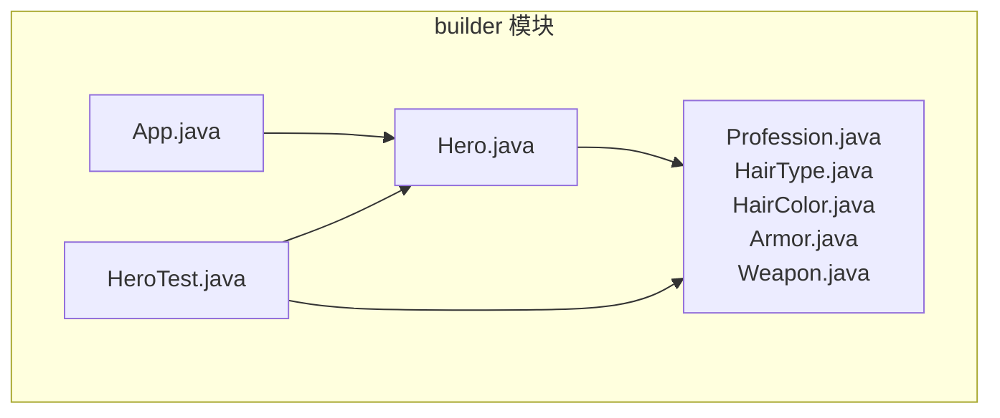
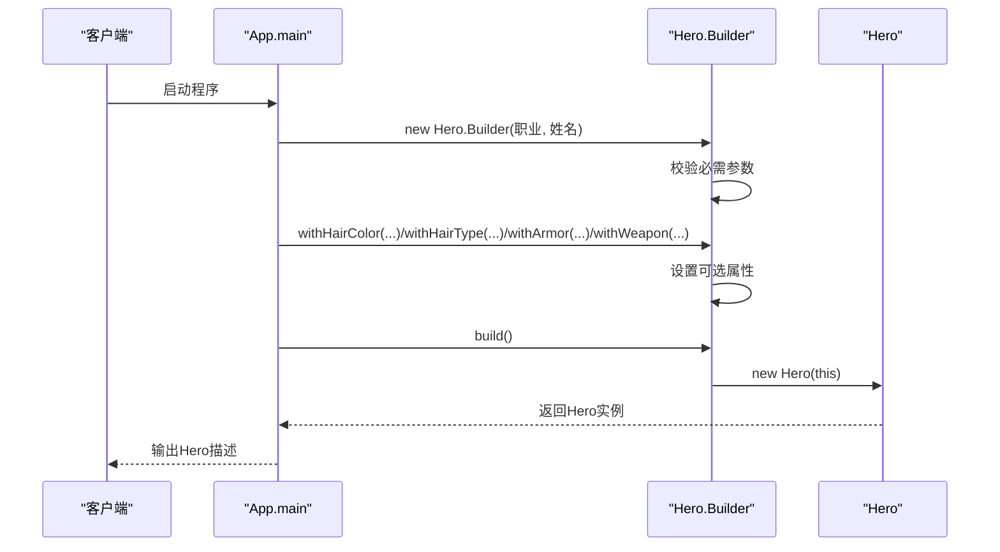
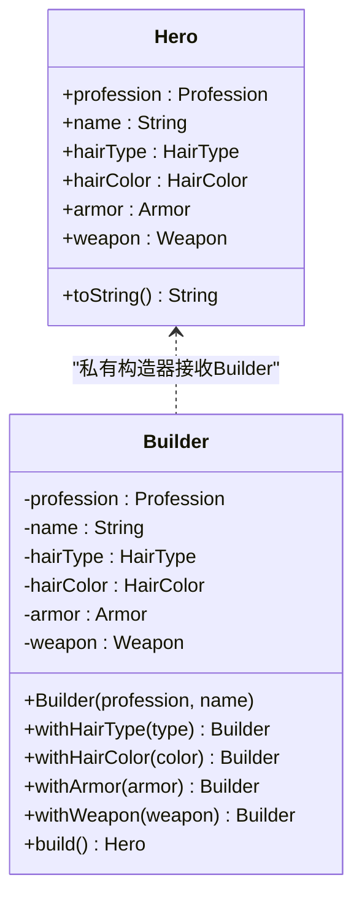
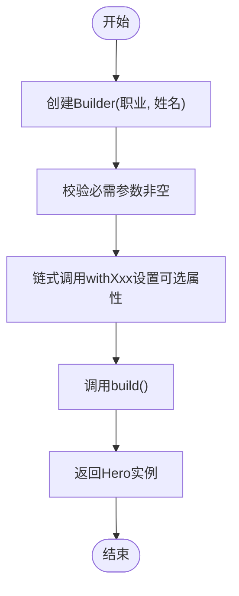
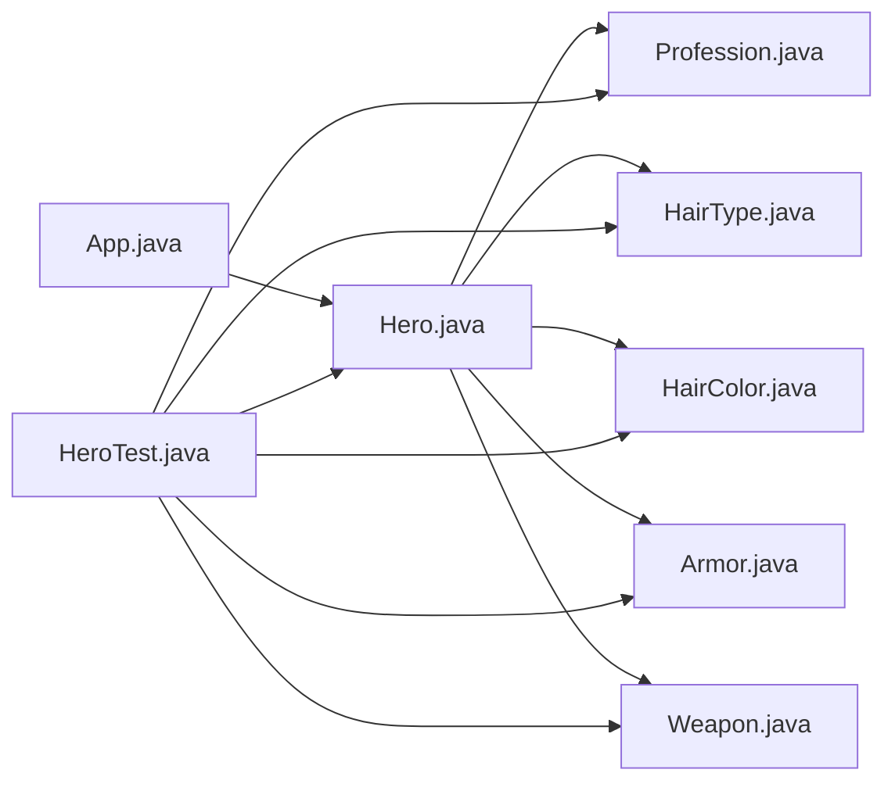
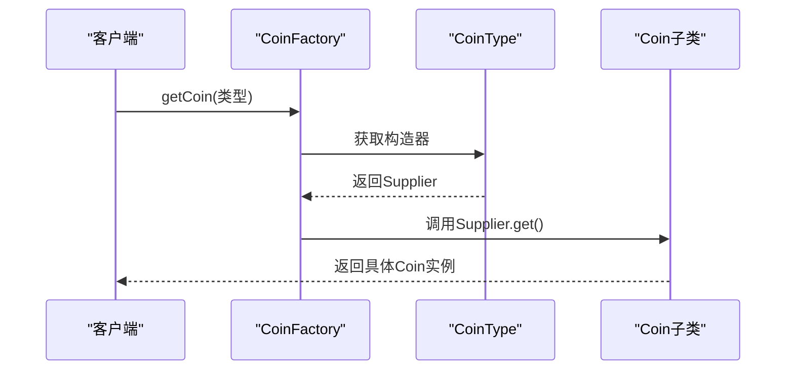

# 建造者模式

<cite>
**本文引用的文件**
- [App.java](file://builder/src/main/java/com/iluwatar/builder/App.java)
- [Hero.java](file://builder/src/main/java/com/iluwatar/builder/Hero.java)
- [Profession.java](file://builder/src/main/java/com/iluwatar/builder/Profession.java)
- [HairColor.java](file://builder/src/main/java/com/iluwatar/builder/HairColor.java)
- [HairType.java](file://builder/src/main/java/com/iluwatar/builder/HairType.java)
- [Armor.java](file://builder/src/main/java/com/iluwatar/builder/Armor.java)
- [Weapon.java](file://builder/src/main/java/com/iluwatar/builder/Weapon.java)
- [HeroTest.java](file://builder/src/test/java/com/iluwatar/builder/HeroTest.java)
- [README.md](file://builder/README.md)
- [CoinFactory.java](file://factory/src/main/java/com/iluwatar/factory/CoinFactory.java)
- [CoinType.java](file://factory/src/main/java/com/iluwatar/factory/CoinType.java)
- [Blacksmith.java](file://factory-method/src/main/java/com/iluwatar/factory/method/Blacksmith.java)
</cite>

## 目录
1. [引言](#引言)
2. [项目结构](#项目结构)
3. [核心组件](#核心组件)
4. [架构总览](#架构总览)
5. [详细组件分析](#详细组件分析)
6. [依赖关系分析](#依赖关系分析)
7. [性能考量](#性能考量)
8. [故障排查指南](#故障排查指南)
9. [结论](#结论)
10. [附录](#附录)

## 引言
本文件围绕Java建造者模式展开，结合仓库中的英雄创建系统示例，系统阐述建造者模式的设计目的、核心思想与实现机制。我们将通过Hero类及其Builder内部类，演示如何将复杂对象的构建过程与表示分离，支持分步骤构建与可选参数配置；并对比建造者模式与工厂模式的区别，说明其在处理大量可选参数时的优势。同时，文档覆盖适用场景（不可变对象构建、复杂对象组装、配置对象创建）、扩展性、性能考虑、测试策略与最佳实践。

## 项目结构
本节聚焦builder模块的文件组织与职责划分：
- App：程序入口，展示不同角色的构建流程与输出。
- Hero：目标复杂对象，采用记录类（record）定义不可变数据结构，并内嵌Builder用于构造。
- 枚举类型：Profession、HairType、HairColor、Armor、Weapon，作为Hero的属性值域。
- 测试：HeroTest验证异常输入、构建结果与字段一致性。

**图表来源**
- [App.java](file://builder/src/main/java/com/iluwatar/builder/App.java#L52-L79)
- [Hero.java](file://builder/src/main/java/com/iluwatar/builder/Hero.java#L31-L112)
- [Profession.java](file://builder/src/main/java/com/iluwatar/builder/Profession.java#L30-L38)
- [HairType.java](file://builder/src/main/java/com/iluwatar/builder/HairType.java#L32-L47)
- [HairColor.java](file://builder/src/main/java/com/iluwatar/builder/HairColor.java#L30-L43)
- [Armor.java](file://builder/src/main/java/com/iluwatar/builder/Armor.java#L32-L46)
- [Weapon.java](file://builder/src/main/java/com/iluwatar/builder/Weapon.java#L30-L38)
- [HeroTest.java](file://builder/src/test/java/com/iluwatar/builder/HeroTest.java#L37-L79)

**章节来源**
- [App.java](file://builder/src/main/java/com/iluwatar/builder/App.java#L52-L79)
- [Hero.java](file://builder/src/main/java/com/iluwatar/builder/Hero.java#L31-L112)
- [HeroTest.java](file://builder/src/test/java/com/iluwatar/builder/HeroTest.java#L37-L79)

## 核心组件
- Hero（目标对象）
  - 不可变数据结构，包含职业、姓名、发色、发型、护甲、武器等字段。
  - 提供toString用于格式化输出。
- Hero.Builder（建造器）
  - 负责收集各属性值，提供链式配置方法（withXxx），并在build阶段一次性产出Hero实例。
  - 构造函数校验必需参数（职业与姓名）非空。
- 枚举类型（Profession、HairType、HairColor、Armor、Weapon）
  - 作为属性取值域，统一字符串表示逻辑。

优势与特性
- 避免“康拓展构造函数反模式”：当参数众多时，无需为每种组合编写构造函数。
- 支持分步骤构建：按需设置可选属性，最终调用build生成对象。
- 不可变性：Hero为记录类，构建完成后状态固定，线程安全友好。

**章节来源**
- [Hero.java](file://builder/src/main/java/com/iluwatar/builder/Hero.java#L31-L112)
- [Profession.java](file://builder/src/main/java/com/iluwatar/builder/Profession.java#L30-L38)
- [HairType.java](file://builder/src/main/java/com/iluwatar/builder/HairType.java#L32-L47)
- [HairColor.java](file://builder/src/main/java/com/iluwatar/builder/HairColor.java#L30-L43)
- [Armor.java](file://builder/src/main/java/com/iluwatar/builder/Armor.java#L32-L46)
- [Weapon.java](file://builder/src/main/java/com/iluwatar/builder/Weapon.java#L30-L38)

## 架构总览
下图展示了Hero对象的构建流程：客户端通过Hero.Builder逐步配置属性，最终由build方法产出Hero实例。

**图表来源**
- [App.java](file://builder/src/main/java/com/iluwatar/builder/App.java#L59-L78)
- [Hero.java](file://builder/src/main/java/com/iluwatar/builder/Hero.java#L68-L112)

**章节来源**
- [App.java](file://builder/src/main/java/com/iluwatar/builder/App.java#L59-L78)
- [Hero.java](file://builder/src/main/java/com/iluwatar/builder/Hero.java#L68-L112)

## 详细组件分析

### Hero 类与不可变性
- 数据结构：记录类自动提供不可变字段与equals/hashCode/toString等。
- 构造约束：通过私有构造器接收Builder，确保仅能通过Builder创建Hero。
- 表示层：toString根据已设置属性动态拼接描述，体现“构建过程与表示分离”。

**图表来源**
- [Hero.java](file://builder/src/main/java/com/iluwatar/builder/Hero.java#L31-L112)

**章节来源**
- [Hero.java](file://builder/src/main/java/com/iluwatar/builder/Hero.java#L31-L112)

### Builder 内部类与链式配置
- 必需参数：在Builder构造函数中强制要求职业与姓名非空。
- 可选参数：提供多个withXxx方法设置发色、发型、护甲、武器等。
- 返回this：实现链式调用，提升可读性与易用性。
- build：一次性产出Hero实例，避免中间状态暴露。

**图表来源**
- [Hero.java](file://builder/src/main/java/com/iluwatar/builder/Hero.java#L68-L112)

**章节来源**
- [Hero.java](file://builder/src/main/java/com/iluwatar/builder/Hero.java#L68-L112)

### 枚举类型与属性取值域
- Profession：角色职业枚举，自定义toString返回小写名称。
- HairType：发型枚举，含标题字符串，toString返回自定义标题。
- HairColor：发色枚举，toString返回小写名称。
- Armor：护甲枚举，toString返回自定义标题。
- Weapon：武器枚举，toString返回小写名称。

这些枚举统一了属性的取值范围与字符串表示，便于Hero.toString的格式化输出。

**章节来源**
- [Profession.java](file://builder/src/main/java/com/iluwatar/builder/Profession.java#L30-L38)
- [HairType.java](file://builder/src/main/java/com/iluwatar/builder/HairType.java#L32-L47)
- [HairColor.java](file://builder/src/main/java/com/iluwatar/builder/HairColor.java#L30-L43)
- [Armor.java](file://builder/src/main/java/com/iluwatar/builder/Armor.java#L32-L46)
- [Weapon.java](file://builder/src/main/java/com/iluwatar/builder/Weapon.java#L30-L38)

### 程序入口与使用示例
- App.main展示了三种角色的构建流程：法师、战士、盗贼。
- 每个角色按需设置可选属性，最后调用build生成Hero并打印描述。

**章节来源**
- [App.java](file://builder/src/main/java/com/iluwatar/builder/App.java#L59-L78)

### 测试策略与断言
- 缺失必需参数：当职业或姓名为null时，构造Builder应抛出IllegalArgumentException。
- 构建结果：验证Hero的各个字段与期望值一致，且toString不为空。

**章节来源**
- [HeroTest.java](file://builder/src/test/java/com/iluwatar/builder/HeroTest.java#L37-L79)

## 依赖关系分析
- Hero对枚举类型的依赖：Hero的字段类型来自上述枚举，确保取值合法与表示一致。
- App对Hero.Builder的依赖：通过Builder完成Hero的分步骤构建。
- 测试对Hero与枚举的依赖：验证构造行为与输出。

**图表来源**
- [App.java](file://builder/src/main/java/com/iluwatar/builder/App.java#L52-L79)
- [Hero.java](file://builder/src/main/java/com/iluwatar/builder/Hero.java#L31-L112)
- [HeroTest.java](file://builder/src/test/java/com/iluwatar/builder/HeroTest.java#L37-L79)
- [Profession.java](file://builder/src/main/java/com/iluwatar/builder/Profession.java#L30-L38)
- [HairType.java](file://builder/src/main/java/com/iluwatar/builder/HairType.java#L32-L47)
- [HairColor.java](file://builder/src/main/java/com/iluwatar/builder/HairColor.java#L30-L43)
- [Armor.java](file://builder/src/main/java/com/iluwatar/builder/Armor.java#L32-L46)
- [Weapon.java](file://builder/src/main/java/com/iluwatar/builder/Weapon.java#L30-L38)

**章节来源**
- [App.java](file://builder/src/main/java/com/iluwatar/builder/App.java#L52-L79)
- [Hero.java](file://builder/src/main/java/com/iluwatar/builder/Hero.java#L31-L112)
- [HeroTest.java](file://builder/src/test/java/com/iluwatar/builder/HeroTest.java#L37-L79)

## 性能考量
- 对象不可变性：Hero为记录类，构建后无修改操作，天然线程安全，减少同步开销。
- 构建成本：Builder在build阶段一次性产出Hero，避免多次状态检查与中间对象创建。
- 字符串拼接：Hero.toString使用StringBuilder，时间复杂度线性于输出长度，适合短文本描述。
- 枚举访问：枚举字段与toString均为常量/轻量操作，对性能影响可忽略。

[本节为通用性能讨论，不直接分析具体文件]

## 故障排查指南
- 必需参数缺失
  - 现象：构造Hero.Builder时抛出IllegalArgumentException。
  - 定位：检查Builder构造函数参数是否为null。
  - 处理：确保职业与姓名均非null后再创建Builder。
- 构建结果不符预期
  - 现象：Hero字段与期望值不一致。
  - 定位：核对链式调用顺序与参数值；确认枚举toString是否符合预期。
  - 处理：在测试中逐一断言关键字段，定位问题点。
- 输出为空或异常
  - 现象：toString返回空或异常。
  - 定位：检查Hero.toString的条件分支与可选属性设置。
  - 处理：确保至少有一个可选属性被设置，或调整条件分支逻辑。

**章节来源**
- [Hero.java](file://builder/src/main/java/com/iluwatar/builder/Hero.java#L38-L63)
- [HeroTest.java](file://builder/src/test/java/com/iluwatar/builder/HeroTest.java#L37-L79)

## 结论
建造者模式通过分离复杂对象的构建过程与最终表示，显著提升了可读性与可维护性，尤其适用于参数众多且存在可选配置的场景。Hero示例展示了如何利用Builder进行分步骤构建、链式配置与一次性产出，配合不可变对象实现线程安全与简洁的测试断言。与工厂模式相比，建造者更强调“构建步骤与顺序”，而工厂侧重“单一创建入口”。在实际项目中，建议结合抽象工厂或原型模式进一步解耦部件创建与装配流程。

[本节为总结性内容，不直接分析具体文件]

## 附录

### 与工厂模式的对比
- 工厂（CoinFactory）
  - 通过工厂方法根据类型参数返回具体产品实例，关注“创建什么”。
  - 示例：根据CoinType选择构造器，返回Coin子类实例。
- 建造者（Hero.Builder）
  - 通过链式方法逐步设置属性，关注“如何创建”和“顺序控制”。
  - 示例：先指定职业与姓名，再按需设置发色、发型、护甲、武器，最后build。

**图表来源**
- [CoinFactory.java](file://factory/src/main/java/com/iluwatar/factory/CoinFactory.java#L30-L38)
- [CoinType.java](file://factory/src/main/java/com/iluwatar/factory/CoinType.java#L34-L42)

**章节来源**
- [CoinFactory.java](file://factory/src/main/java/com/iluwatar/factory/CoinFactory.java#L30-L38)
- [CoinType.java](file://factory/src/main/java/com/iluwatar/factory/CoinType.java#L34-L42)

### 与工厂方法模式的关系
- 工厂方法（Blacksmith接口）
  - 通过接口定义“制造武器”的方法，不同实现类负责具体生产。
  - 与建造者互补：工厂方法关注“谁来生产”，建造者关注“如何一步步组装”。

**章节来源**
- [Blacksmith.java](file://factory-method/src/main/java/com/iluwatar/factory/method/Blacksmith.java#L30-L34)

### 适用场景与最佳实践
- 适用场景
  - 不可变对象构建：Hero为记录类，适合通过Builder一次性产出。
  - 复杂对象组装：当对象由多个可选部件组成时，Builder提供清晰的装配顺序。
  - 配置对象创建：集中管理配置项，避免构造函数膨胀。
- 最佳实践
  - 将必需参数放入Builder构造函数，可选参数通过withXxx设置。
  - 在build前进行必要的参数校验，保证产物有效。
  - 使用单元测试覆盖关键路径与边界条件（如缺失必需参数、字段一致性）。

**章节来源**
- [README.md](file://builder/README.md#L13-L198)