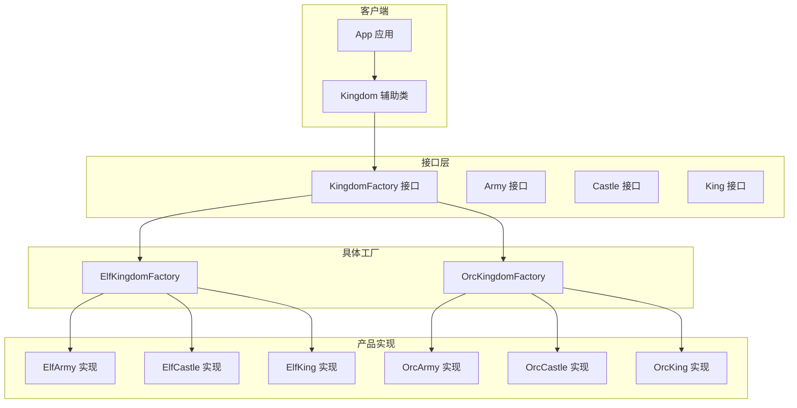
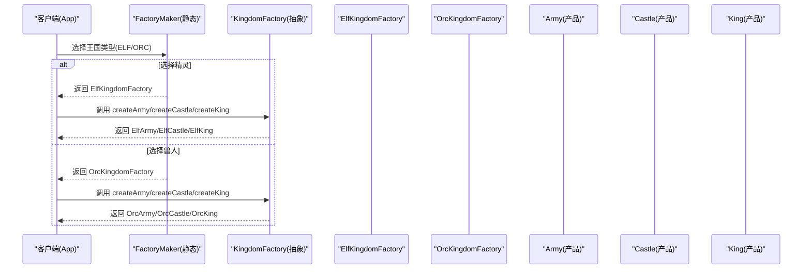
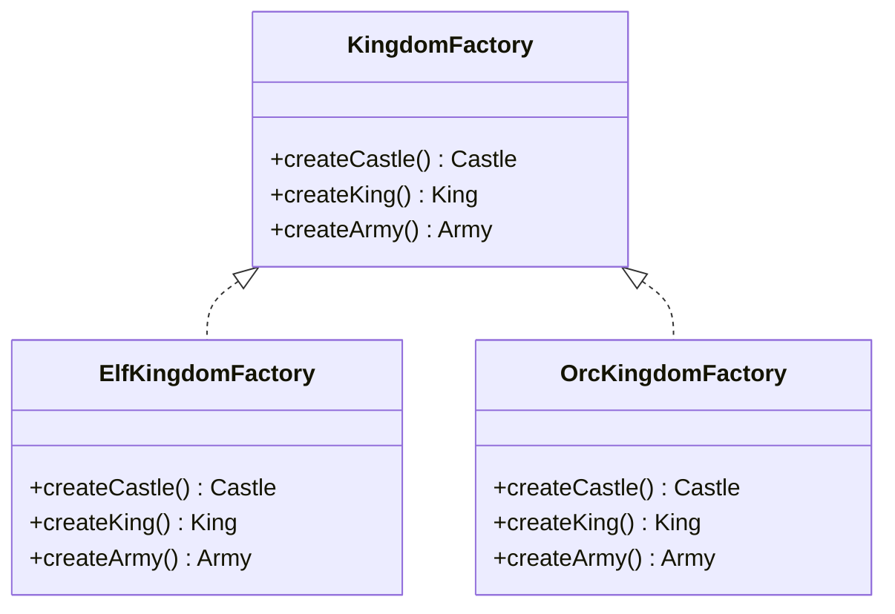
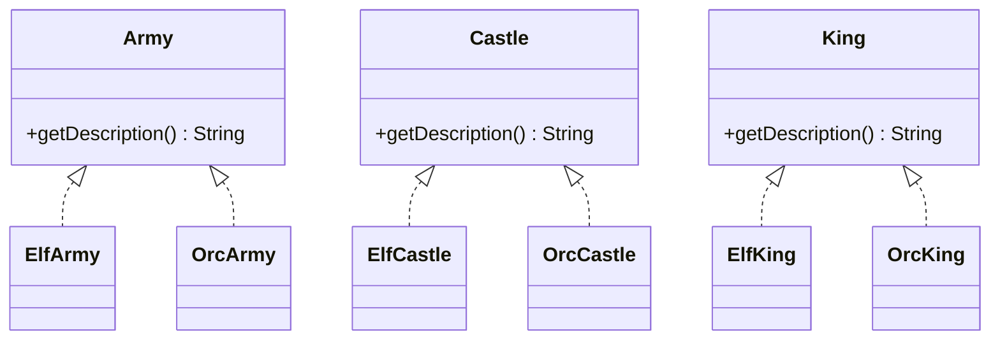
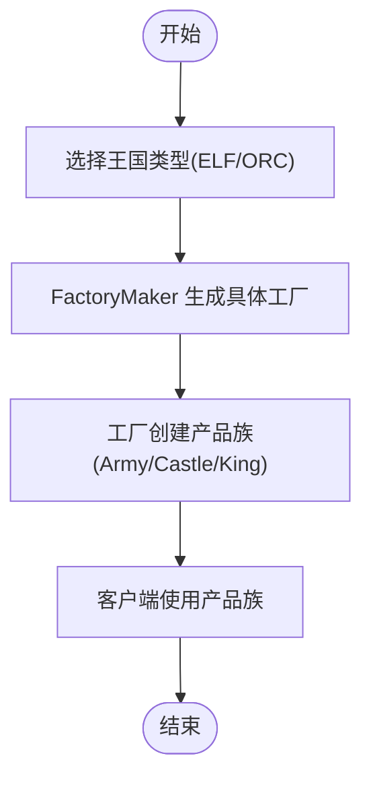
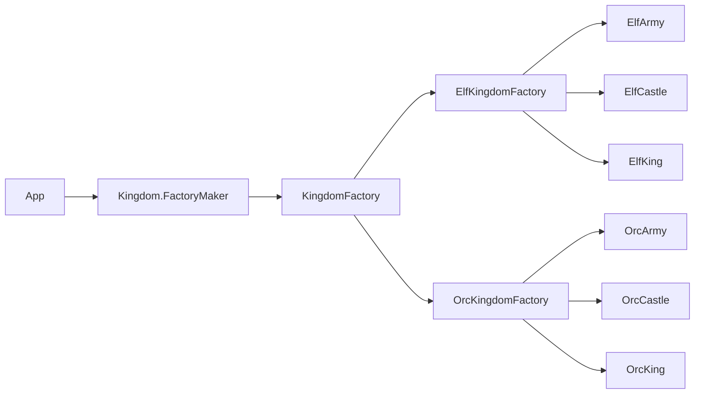

# 抽象工厂模式

<cite>
**本文引用的文件**
- [README.md](file://abstract-factory/README.md)
- [App.java](file://abstract-factory/src/main/java/com/iluwatar/abstractfactory/App.java)
- [Kingdom.java](file://abstract-factory/src/main/java/com/iluwatar/abstractfactory/Kingdom.java)
- [KingdomFactory.java](file://abstract-factory/src/main/java/com/iluwatar/abstractfactory/KingdomFactory.java)
- [Army.java](file://abstract-factory/src/main/java/com/iluwatar/abstractfactory/Army.java)
- [Castle.java](file://abstract-factory/src/main/java/com/iluwatar/abstractfactory/Castle.java)
- [King.java](file://abstract-factory/src/main/java/com/iluwatar/abstractfactory/King.java)
- [ElfKingdomFactory.java](file://abstract-factory/src/main/java/com/iluwatar/abstractfactory/ElfKingdomFactory.java)
- [OrcKingdomFactory.java](file://abstract-factory/src/main/java/com/iluwatar/abstractfactory/OrcKingdomFactory.java)
- [ElfArmy.java](file://abstract-factory/src/main/java/com/iluwatar/abstractfactory/ElfArmy.java)
- [ElfCastle.java](file://abstract-factory/src/main/java/com/iluwatar/abstractfactory/ElfCastle.java)
- [ElfKing.java](file://abstract-factory/src/main/java/com/iluwatar/abstractfactory/ElfKing.java)
- [OrcArmy.java](file://abstract-factory/src/main/java/com/iluwatar/abstractfactory/OrcArmy.java)
- [OrcCastle.java](file://abstract-factory/src/main/java/com/iluwatar/abstractfactory/OrcCastle.java)
- [OrcKing.java](file://abstract-factory/src/main/java/com/iluwatar/abstractfactory/OrcKing.java)
</cite>

## 目录
1. [引言](#引言)
2. [项目结构](#项目结构)
3. [核心组件](#核心组件)
4. [架构总览](#架构总览)
5. [详细组件分析](#详细组件分析)
6. [依赖关系分析](#依赖关系分析)
7. [性能考量](#性能考量)
8. [故障排查指南](#故障排查指南)
9. [结论](#结论)
10. [附录](#附录)

## 引言
本文件系统性阐述Java抽象工厂模式的设计理念、产品族概念与实现策略，并以“精灵王国”和“兽人王国”的完整示例为主线，展示如何创建相互关联的产品系列（国王、城堡、军队）。文档同时对比抽象工厂与工厂方法模式的差异，解释其如何解决产品族扩展问题；并给出工厂层次结构与产品层次结构图、适用场景、复杂度与维护成本评估、最佳实践与反模式警示。

## 项目结构
该模块采用按职责分层的组织方式：接口层定义产品族契约，具体工厂负责生产同一主题下的产品集合，客户端通过统一入口选择工厂并获得产品族。

图表来源
- [App.java](file://abstract-factory/src/main/java/com/iluwatar/abstractfactory/App.java#L46-L85)
- [Kingdom.java](file://abstract-factory/src/main/java/com/iluwatar/abstractfactory/Kingdom.java#L35-L63)
- [KingdomFactory.java](file://abstract-factory/src/main/java/com/iluwatar/abstractfactory/KingdomFactory.java#L30-L38)
- [ElfKingdomFactory.java](file://abstract-factory/src/main/java/com/iluwatar/abstractfactory/ElfKingdomFactory.java#L30-L47)
- [OrcKingdomFactory.java](file://abstract-factory/src/main/java/com/iluwatar/abstractfactory/OrcKingdomFactory.java#L30-L46)
- [Army.java](file://abstract-factory/src/main/java/com/iluwatar/abstractfactory/Army.java#L30-L33)
- [Castle.java](file://abstract-factory/src/main/java/com/iluwatar/abstractfactory/Castle.java#L30-L33)
- [King.java](file://abstract-factory/src/main/java/com/iluwatar/abstractfactory/King.java#L30-L33)

章节来源
- [App.java](file://abstract-factory/src/main/java/com/iluwatar/abstractfactory/App.java#L46-L85)
- [Kingdom.java](file://abstract-factory/src/main/java/com/iluwatar/abstractfactory/Kingdom.java#L35-L63)

## 核心组件
- 工厂接口：定义产品族的创建方法，确保客户端只依赖抽象。
- 具体工厂：实现工厂接口，负责生产同一主题下的产品集合。
- 产品接口：定义产品族内各产品的通用行为。
- 产品实现：具体工厂内部生产的实体类，满足产品接口契约。
- 客户端与辅助类：封装工厂选择逻辑，向客户端暴露统一的使用入口。

章节来源
- [KingdomFactory.java](file://abstract-factory/src/main/java/com/iluwatar/abstractfactory/KingdomFactory.java#L30-L38)
- [ElfKingdomFactory.java](file://abstract-factory/src/main/java/com/iluwatar/abstractfactory/ElfKingdomFactory.java#L30-L47)
- [OrcKingdomFactory.java](file://abstract-factory/src/main/java/com/iluwatar/abstractfactory/OrcKingdomFactory.java#L30-L46)
- [Army.java](file://abstract-factory/src/main/java/com/iluwatar/abstractfactory/Army.java#L30-L33)
- [Castle.java](file://abstract-factory/src/main/java/com/iluwatar/abstractfactory/Castle.java#L30-L33)
- [King.java](file://abstract-factory/src/main/java/com/iluwatar/abstractfactory/King.java#L30-L33)

## 架构总览
抽象工厂模式通过“工厂的工厂”将产品族的创建过程集中管理，客户端仅面向抽象交互，从而实现解耦与可替换性。下图展示了从客户端到具体工厂再到产品族的调用链路。

图表来源
- [App.java](file://abstract-factory/src/main/java/com/iluwatar/abstractfactory/App.java#L79-L84)
- [Kingdom.java](file://abstract-factory/src/main/java/com/iluwatar/abstractfactory/Kingdom.java#L56-L61)
- [ElfKingdomFactory.java](file://abstract-factory/src/main/java/com/iluwatar/abstractfactory/ElfKingdomFactory.java#L32-L45)
- [OrcKingdomFactory.java](file://abstract-factory/src/main/java/com/iluwatar/abstractfactory/OrcKingdomFactory.java#L32-L45)

## 详细组件分析

### 工厂层次结构
- 工厂接口：统一声明创建三类产品的方法，保证产品族一致性。
- 具体工厂：分别实现工厂接口，内部直接返回对应主题的产品实例。

图表来源
- [KingdomFactory.java](file://abstract-factory/src/main/java/com/iluwatar/abstractfactory/KingdomFactory.java#L30-L38)
- [ElfKingdomFactory.java](file://abstract-factory/src/main/java/com/iluwatar/abstractfactory/ElfKingdomFactory.java#L30-L47)
- [OrcKingdomFactory.java](file://abstract-factory/src/main/java/com/iluwatar/abstractfactory/OrcKingdomFactory.java#L30-L46)

章节来源
- [KingdomFactory.java](file://abstract-factory/src/main/java/com/iluwatar/abstractfactory/KingdomFactory.java#L30-L38)
- [ElfKingdomFactory.java](file://abstract-factory/src/main/java/com/iluwatar/abstractfactory/ElfKingdomFactory.java#L30-L47)
- [OrcKingdomFactory.java](file://abstract-factory/src/main/java/com/iluwatar/abstractfactory/OrcKingdomFactory.java#L30-L46)

### 产品层次结构
- 产品接口：定义产品族的通用行为。
- 产品实现：每个具体工厂内部提供同一主题的产品实现。

图表来源
- [Army.java](file://abstract-factory/src/main/java/com/iluwatar/abstractfactory/Army.java#L30-L33)
- [Castle.java](file://abstract-factory/src/main/java/com/iluwatar/abstractfactory/Castle.java#L30-L33)
- [King.java](file://abstract-factory/src/main/java/com/iluwatar/abstractfactory/King.java#L30-L33)
- [ElfArmy.java](file://abstract-factory/src/main/java/com/iluwatar/abstractfactory/ElfArmy.java#L30-L38)
- [ElfCastle.java](file://abstract-factory/src/main/java/com/iluwatar/abstractfactory/ElfCastle.java#L30-L38)
- [ElfKing.java](file://abstract-factory/src/main/java/com/iluwatar/abstractfactory/ElfKing.java#L30-L38)
- [OrcArmy.java](file://abstract-factory/src/main/java/com/iluwatar/abstractfactory/OrcArmy.java#L30-L38)
- [OrcCastle.java](file://abstract-factory/src/main/java/com/iluwatar/abstractfactory/OrcCastle.java#L30-L38)
- [OrcKing.java](file://abstract-factory/src/main/java/com/iluwatar/abstractfactory/OrcKing.java#L30-L38)

章节来源
- [Army.java](file://abstract-factory/src/main/java/com/iluwatar/abstractfactory/Army.java#L30-L33)
- [Castle.java](file://abstract-factory/src/main/java/com/iluwatar/abstractfactory/Castle.java#L30-L33)
- [King.java](file://abstract-factory/src/main/java/com/iluwatar/abstractfactory/King.java#L30-L33)
- [ElfArmy.java](file://abstract-factory/src/main/java/com/iluwatar/abstractfactory/ElfArmy.java#L30-L38)
- [ElfCastle.java](file://abstract-factory/src/main/java/com/iluwatar/abstractfactory/ElfCastle.java#L30-L38)
- [ElfKing.java](file://abstract-factory/src/main/java/com/iluwatar/abstractfactory/ElfKing.java#L30-L38)
- [OrcArmy.java](file://abstract-factory/src/main/java/com/iluwatar/abstractfactory/OrcArmy.java#L30-L38)
- [OrcCastle.java](file://abstract-factory/src/main/java/com/iluwatar/abstractfactory/OrcCastle.java#L30-L38)
- [OrcKing.java](file://abstract-factory/src/main/java/com/iluwatar/abstractfactory/OrcKing.java#L30-L38)

### 客户端工作流
- 客户端通过统一入口选择工厂类型，随后由工厂创建产品族。
- 客户端不关心具体工厂与产品实现类，仅依赖抽象接口。

图表来源
- [App.java](file://abstract-factory/src/main/java/com/iluwatar/abstractfactory/App.java#L79-L84)
- [Kingdom.java](file://abstract-factory/src/main/java/com/iluwatar/abstractfactory/Kingdom.java#L56-L61)

章节来源
- [App.java](file://abstract-factory/src/main/java/com/iluwatar/abstractfactory/App.java#L60-L84)
- [Kingdom.java](file://abstract-factory/src/main/java/com/iluwatar/abstractfactory/Kingdom.java#L35-L63)

### 与工厂方法模式的对比
- 工厂方法：针对单一产品等级结构，一个工厂只负责一类产品。
- 抽象工厂：针对多个产品等级结构，一个工厂负责一组相关或依赖的产品。

在本示例中，抽象工厂通过统一接口创建“国王+城堡+军队”这一产品族，而工厂方法通常只负责创建“国王”或“城堡”等单一产品。

章节来源
- [README.md](file://abstract-factory/README.md#L172-L183)
- [KingdomFactory.java](file://abstract-factory/src/main/java/com/iluwatar/abstractfactory/KingdomFactory.java#L30-L38)

## 依赖关系分析
- 客户端依赖工厂接口，不直接依赖具体工厂与产品实现，降低耦合。
- 具体工厂依赖产品接口，向上提供抽象，向下封装实现细节。
- 产品实现彼此独立，仅需满足各自接口契约，便于扩展与替换。

图表来源
- [App.java](file://abstract-factory/src/main/java/com/iluwatar/abstractfactory/App.java#L79-L84)
- [Kingdom.java](file://abstract-factory/src/main/java/com/iluwatar/abstractfactory/Kingdom.java#L56-L61)
- [ElfKingdomFactory.java](file://abstract-factory/src/main/java/com/iluwatar/abstractfactory/ElfKingdomFactory.java#L30-L47)
- [OrcKingdomFactory.java](file://abstract-factory/src/main/java/com/iluwatar/abstractfactory/OrcKingdomFactory.java#L30-L46)

章节来源
- [App.java](file://abstract-factory/src/main/java/com/iluwatar/abstractfactory/App.java#L46-L85)
- [Kingdom.java](file://abstract-factory/src/main/java/com/iluwatar/abstractfactory/Kingdom.java#L35-L63)

## 性能考量
- 创建开销：抽象工厂引入一层间接调用，通常影响极小；可通过缓存或延迟初始化优化。
- 可维护性：产品族扩展时，新增工厂与产品实现，对现有代码无侵入，利于长期演进。
- 运行时选择：通过枚举或配置选择工厂，避免硬编码分支，提升灵活性。

## 故障排查指南
- 症状：客户端无法获取产品族对象
  - 检查工厂选择逻辑是否正确传入类型参数
  - 确认具体工厂实现了工厂接口的所有方法
- 症状：产品描述不符合预期
  - 核对产品实现类的描述常量与方法返回值
- 症状：新增产品后编译错误
  - 补充工厂接口与具体工厂中的相应创建方法
  - 在客户端调用处更新产品族组装流程

章节来源
- [App.java](file://abstract-factory/src/main/java/com/iluwatar/abstractfactory/App.java#L79-L84)
- [KingdomFactory.java](file://abstract-factory/src/main/java/com/iluwatar/abstractfactory/KingdomFactory.java#L30-L38)
- [ElfKingdomFactory.java](file://abstract-factory/src/main/java/com/iluwatar/abstractfactory/ElfKingdomFactory.java#L30-L47)
- [OrcKingdomFactory.java](file://abstract-factory/src/main/java/com/iluwatar/abstractfactory/OrcKingdomFactory.java#L30-L46)

## 结论
抽象工厂模式通过“工厂的工厂”将产品族的创建过程抽象化，使客户端与具体实现解耦，便于在不修改既有代码的前提下切换或扩展产品族。结合本示例的“精灵王国/兽人王国”主题，读者可清晰理解产品族一致性、工厂层次与产品层次之间的关系，并据此在大型软件架构中进行模块化与可替换性设计。

## 附录
- 适用场景
  - 需要在运行时根据参数选择产品族
  - 强制产品族内各产品的一致性与协同
  - 希望对外暴露接口而不暴露具体实现
- 设计复杂度与维护成本
  - 初期需要定义抽象接口与多组具体实现，增加少量复杂度
  - 扩展新工厂或新产品族时，遵循开闭原则，改动集中在新增类
- 最佳实践
  - 将工厂选择逻辑集中于辅助类或配置层，避免散落各处
  - 保持产品族内各产品行为一致，便于替换与测试
  - 对工厂与产品实现进行单元测试，确保契约稳定
- 反模式警示
  - 忽视产品族一致性：不同工厂产出的产品风格不统一
  - 过度抽象：仅因“可能扩展”而引入抽象，导致不必要的复杂度
  - 硬编码类型：将工厂类型写死在业务逻辑中，失去灵活性

章节来源
- [README.md](file://abstract-factory/README.md#L172-L228)