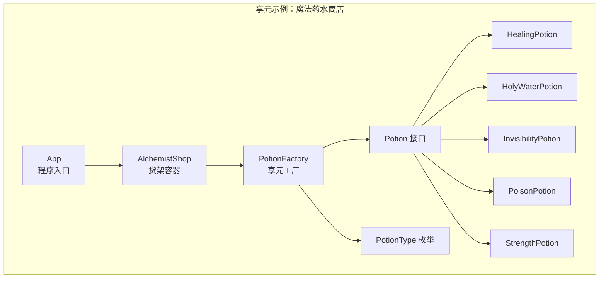
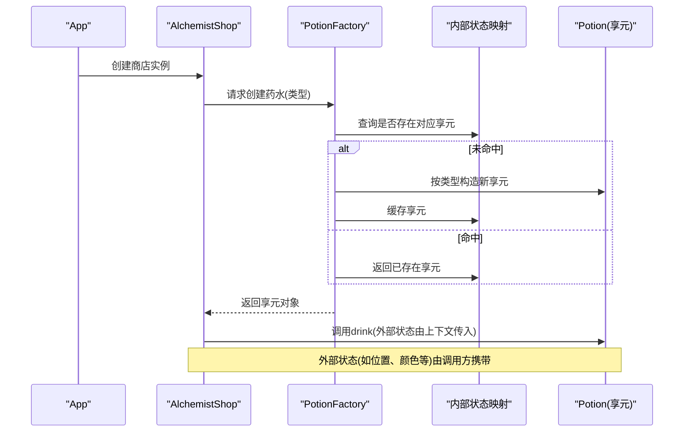
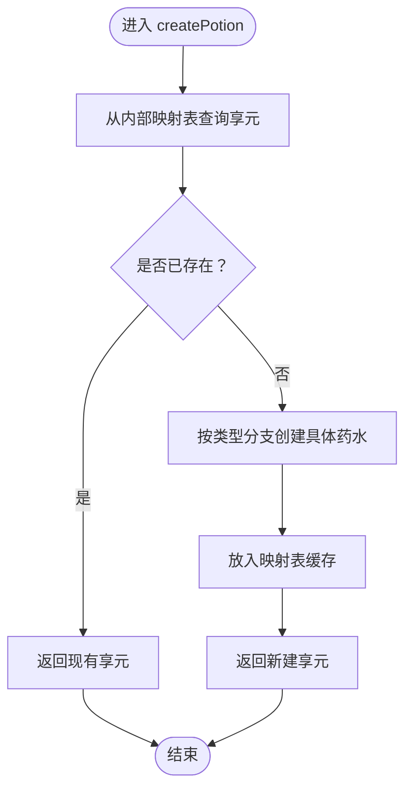
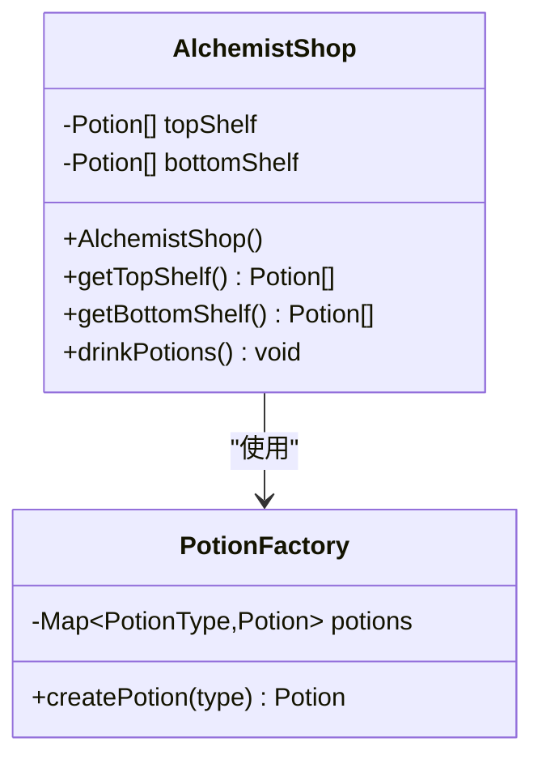
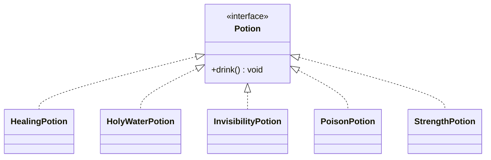
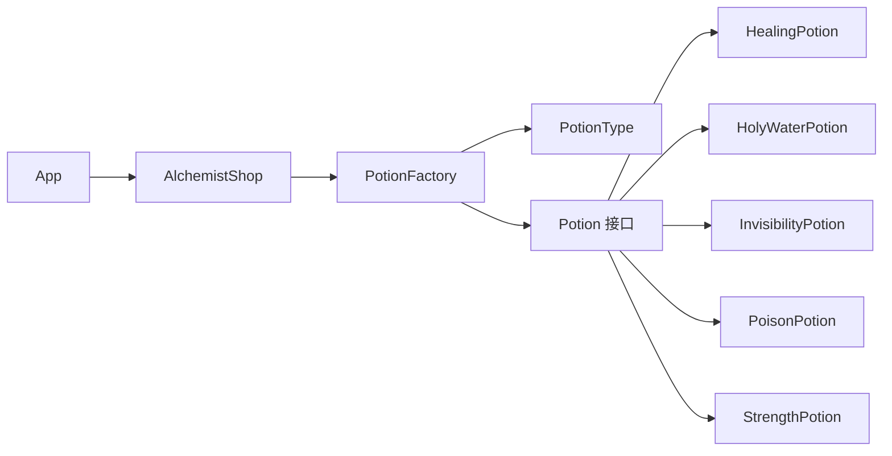

# 享元模式

<cite>
**本文引用的文件**
- [App.java](file://flyweight/src/main/java/com/iluwatar/flyweight/App.java)
- [AlchemistShop.java](file://flyweight/src/main/java/com/iluwatar/flyweight/AlchemistShop.java)
- [PotionFactory.java](file://flyweight/src/main/java/com/iluwatar/flyweight/PotionFactory.java)
- [PotionType.java](file://flyweight/src/main/java/com/iluwatar/flyweight/PotionType.java)
- [Potion.java](file://flyweight/src/main/java/com/iluwatar/flyweight/Potion.java)
- [HealingPotion.java](file://flyweight/src/main/java/com/iluwatar/flyweight/HealingPotion.java)
- [HolyWaterPotion.java](file://flyweight/src/main/java/com/iluwatar/flyweight/HolyWaterPotion.java)
- [InvisibilityPotion.java](file://flyweight/src/main/java/com/iluwatar/flyweight/InvisibilityPotion.java)
- [PoisonPotion.java](file://flyweight/src/main/java/com/iluwatar/flyweight/PoisonPotion.java)
- [StrengthPotion.java](file://flyweight/src/main/java/com/iluwatar/flyweight/StrengthPotion.java)
- [AlchemistShopTest.java](file://flyweight/src/test/java/com/iluwatar/flyweight/AlchemistShopTest.java)
- [README.md](file://flyweight/README.md)
- [pom.xml](file://flyweight/pom.xml)
</cite>

## 目录
1. [引言](#引言)
2. [项目结构](#项目结构)
3. [核心组件](#核心组件)
4. [架构总览](#架构总览)
5. [详细组件分析](#详细组件分析)
6. [依赖关系分析](#依赖关系分析)
7. [性能考量](#性能考量)
8. [故障排查指南](#故障排查指南)
9. [结论](#结论)
10. [附录：适用场景与最佳实践](#附录适用场景与最佳实践)

## 引言
本技术指南围绕Java享元模式展开，系统讲解如何通过“共享”技术高效管理大量细粒度对象，显著降低内存占用。文档以魔法药水商店（Alchemist Shop）为载体，完整演示享元工厂PotionFactory如何区分内部状态与外部状态，以及在游戏开发、文本编辑器、图形系统等内存敏感场景中的应用策略。同时覆盖适用条件、性能优化、线程安全与生命周期管理、缓存失效机制等关键主题。

## 项目结构
该模块采用按功能分层的组织方式：
- 接口与实现：定义统一的Potion接口及多种具体药水实现
- 工厂：PotionFactory负责按需创建并复用享元对象
- 客户端：AlchemistShop持有货架列表，通过工厂获取药水实例
- 测试：验证实例数量与行为正确性
- 文档与构建：README说明设计动机与使用场景；pom.xml配置构建与运行入口

图表来源
- [App.java](file://flyweight/src/main/java/com/iluwatar/flyweight/App.java#L27-L52)
- [AlchemistShop.java](file://flyweight/src/main/java/com/iluwatar/flyweight/AlchemistShop.java#L30-L91)
- [PotionFactory.java](file://flyweight/src/main/java/com/iluwatar/flyweight/PotionFactory.java#L30-L61)
- [Potion.java](file://flyweight/src/main/java/com/iluwatar/flyweight/Potion.java)
- [HealingPotion.java](file://flyweight/src/main/java/com/iluwatar/flyweight/HealingPotion.java#L29-L40)
- [HolyWaterPotion.java](file://flyweight/src/main/java/com/iluwatar/flyweight/HolyWaterPotion.java#L29-L40)
- [InvisibilityPotion.java](file://flyweight/src/main/java/com/iluwatar/flyweight/InvisibilityPotion.java#L29-L40)
- [PoisonPotion.java](file://flyweight/src/main/java/com/iluwatar/flyweight/PoisonPotion.java#L29-L40)
- [StrengthPotion.java](file://flyweight/src/main/java/com/iluwatar/flyweight/StrengthPotion.java#L29-L40)
- [PotionType.java](file://flyweight/src/main/java/com/iluwatar/flyweight/PotionType.java#L27-L34)

章节来源
- [App.java](file://flyweight/src/main/java/com/iluwatar/flyweight/App.java#L27-L52)
- [AlchemistShop.java](file://flyweight/src/main/java/com/iluwatar/flyweight/AlchemistShop.java#L30-L91)
- [PotionFactory.java](file://flyweight/src/main/java/com/iluwatar/flyweight/PotionFactory.java#L30-L61)
- [PotionType.java](file://flyweight/src/main/java/com/iluwatar/flyweight/PotionType.java#L27-L34)
- [README.md](file://flyweight/README.md#L15-L33)

## 核心组件
- Potion接口：定义统一的行为契约（如drink），作为所有具体药水的抽象基类
- 具体药水实现：HealingPotion、HolyWaterPotion、InvisibilityPotion、PoisonPotion、StrengthPotion
- PotionFactory（享元工厂）：维护一个内部状态映射表（EnumMap<PotionType, Potion>），按需创建并缓存享元对象
- AlchemistShop：持有货架列表，通过工厂获取药水实例，体现外部状态的传递与使用
- App：程序入口，演示客户端如何消费工厂提供的共享对象

章节来源
- [Potion.java](file://flyweight/src/main/java/com/iluwatar/flyweight/Potion.java)
- [HealingPotion.java](file://flyweight/src/main/java/com/iluwatar/flyweight/HealingPotion.java#L29-L40)
- [HolyWaterPotion.java](file://flyweight/src/main/java/com/iluwatar/flyweight/HolyWaterPotion.java#L29-L40)
- [InvisibilityPotion.java](file://flyweight/src/main/java/com/iluwatar/flyweight/InvisibilityPotion.java#L29-L40)
- [PoisonPotion.java](file://flyweight/src/main/java/com/iluwatar/flyweight/PoisonPotion.java#L29-L40)
- [StrengthPotion.java](file://flyweight/src/main/java/com/iluwatar/flyweight/StrengthPotion.java#L29-L40)
- [PotionFactory.java](file://flyweight/src/main/java/com/iluwatar/flyweight/PotionFactory.java#L30-L61)
- [AlchemistShop.java](file://flyweight/src/main/java/com/iluwatar/flyweight/AlchemistShop.java#L30-L91)
- [App.java](file://flyweight/src/main/java/com/iluwatar/flyweight/App.java#L27-L52)

## 架构总览
下图展示了从客户端到工厂再到具体享元对象的调用链路，以及内部状态与外部状态的交互：

图表来源
- [App.java](file://flyweight/src/main/java/com/iluwatar/flyweight/App.java#L46-L52)
- [AlchemistShop.java](file://flyweight/src/main/java/com/iluwatar/flyweight/AlchemistShop.java#L42-L61)
- [PotionFactory.java](file://flyweight/src/main/java/com/iluwatar/flyweight/PotionFactory.java#L43-L60)
- [Potion.java](file://flyweight/src/main/java/com/iluwatar/flyweight/Potion.java)

## 详细组件分析

### 组件一：PotionFactory（享元工厂）
- 角色定位：享元工厂，负责创建与复用共享对象
- 内部状态：内部状态映射表（EnumMap<PotionType, Potion>），存储已创建的享元实例
- 外部状态：通过方法参数或调用时上下文传递（例如AlchemistShop中对药水的摆放位置、数量等）
- 关键流程：
  - 若映射表中不存在指定类型的享元，则根据类型分支创建新的具体药水实例，并放入映射表
  - 若已存在，则直接返回已有实例
- 线程安全：当前实现未加锁，若多线程并发访问，建议使用并发安全的Map或在调用侧加同步控制

图表来源
- [PotionFactory.java](file://flyweight/src/main/java/com/iluwatar/flyweight/PotionFactory.java#L43-L60)

章节来源
- [PotionFactory.java](file://flyweight/src/main/java/com/iluwatar/flyweight/PotionFactory.java#L30-L61)

### 组件二：AlchemistShop（客户端）
- 角色定位：持有货架列表，通过工厂获取药水实例
- 外部状态：货架上的位置、数量、组合等
- 行为：提供只读视图，遍历并调用每个药水的drink方法

图表来源
- [AlchemistShop.java](file://flyweight/src/main/java/com/iluwatar/flyweight/AlchemistShop.java#L34-L91)
- [PotionFactory.java](file://flyweight/src/main/java/com/iluwatar/flyweight/PotionFactory.java#L35-L61)

章节来源
- [AlchemistShop.java](file://flyweight/src/main/java/com/iluwatar/flyweight/AlchemistShop.java#L30-L91)

### 组件三：Potion接口与具体实现
- 接口职责：定义统一行为（如drink）
- 实现职责：封装各自内部状态（如效果描述、日志标识）
- 一致性：所有实现均不可变，确保多处共享的安全性

图表来源
- [Potion.java](file://flyweight/src/main/java/com/iluwatar/flyweight/Potion.java)
- [HealingPotion.java](file://flyweight/src/main/java/com/iluwatar/flyweight/HealingPotion.java#L29-L40)
- [HolyWaterPotion.java](file://flyweight/src/main/java/com/iluwatar/flyweight/HolyWaterPotion.java#L29-L40)
- [InvisibilityPotion.java](file://flyweight/src/main/java/com/iluwatar/flyweight/InvisibilityPotion.java#L29-L40)
- [PoisonPotion.java](file://flyweight/src/main/java/com/iluwatar/flyweight/PoisonPotion.java#L29-L40)
- [StrengthPotion.java](file://flyweight/src/main/java/com/iluwatar/flyweight/StrengthPotion.java#L29-L40)

章节来源
- [Potion.java](file://flyweight/src/main/java/com/iluwatar/flyweight/Potion.java)
- [HealingPotion.java](file://flyweight/src/main/java/com/iluwatar/flyweight/HealingPotion.java#L29-L40)
- [HolyWaterPotion.java](file://flyweight/src/main/java/com/iluwatar/flyweight/HolyWaterPotion.java#L29-L40)
- [InvisibilityPotion.java](file://flyweight/src/main/java/com/iluwatar/flyweight/InvisibilityPotion.java#L29-L40)
- [PoisonPotion.java](file://flyweight/src/main/java/com/iluwatar/flyweight/PoisonPotion.java#L29-L40)
- [StrengthPotion.java](file://flyweight/src/main/java/com/iluwatar/flyweight/StrengthPotion.java#L29-L40)

### 组件四：App（程序入口）
- 角色定位：演示客户端如何创建商店并消费药水
- 关注点：强调享元对象的共享特性与内存效率

章节来源
- [App.java](file://flyweight/src/main/java/com/iluwatar/flyweight/App.java#L27-L52)

## 依赖关系分析
- 组件耦合：AlchemistShop依赖PotionFactory；PotionFactory依赖PotionType枚举与具体Potion实现
- 可能的循环依赖：无直接循环依赖
- 外部依赖：使用Lombok注解简化日志输出；使用JUnit进行单元测试

图表来源
- [App.java](file://flyweight/src/main/java/com/iluwatar/flyweight/App.java#L46-L52)
- [AlchemistShop.java](file://flyweight/src/main/java/com/iluwatar/flyweight/AlchemistShop.java#L42-L61)
- [PotionFactory.java](file://flyweight/src/main/java/com/iluwatar/flyweight/PotionFactory.java#L35-L61)
- [PotionType.java](file://flyweight/src/main/java/com/iluwatar/flyweight/PotionType.java#L30-L34)
- [Potion.java](file://flyweight/src/main/java/com/iluwatar/flyweight/Potion.java)
- [HealingPotion.java](file://flyweight/src/main/java/com/iluwatar/flyweight/HealingPotion.java#L33-L39)
- [HolyWaterPotion.java](file://flyweight/src/main/java/com/iluwatar/flyweight/HolyWaterPotion.java#L33-L39)
- [InvisibilityPotion.java](file://flyweight/src/main/java/com/iluwatar/flyweight/InvisibilityPotion.java#L33-L39)
- [PoisonPotion.java](file://flyweight/src/main/java/com/iluwatar/flyweight/PoisonPotion.java#L33-L39)
- [StrengthPotion.java](file://flyweight/src/main/java/com/iluwatar/flyweight/StrengthPotion.java#L33-L39)

章节来源
- [AlchemistShopTest.java](file://flyweight/src/test/java/com/iluwatar/flyweight/AlchemistShopTest.java#L38-L60)
- [pom.xml](file://flyweight/pom.xml#L36-L62)

## 性能考量
- 内存优化
  - 使用EnumMap作为内部状态映射，避免装箱与哈希计算开销，提升查找与插入性能
  - 通过共享享元对象，显著降低大量重复对象带来的内存占用
- 计算优化
  - 仅在首次请求时创建对象，后续直接复用，减少构造成本
- 复杂度分析
  - 查找与插入：平均O(1)，取决于底层Map实现
  - 实例总数：与唯一类型数成正比，而非与总数量成正比
- 线程安全
  - 当前实现非线程安全；多线程环境下建议：
    - 使用ConcurrentHashMap替换普通Map
    - 在createPotion方法上加synchronized或使用原子操作
    - 将享元对象设计为完全不可变，避免并发修改
- 生命周期与缓存失效
  - 生命周期：随应用启动而初始化，随应用退出而销毁
  - 缓存失效：可引入弱引用Map（WeakHashMap）或带TTL的缓存策略，结合LRU淘汰
  - 清理策略：提供显式清理方法或基于监控指标的自动回收

## 故障排查指南
- 现象：实例数量与预期不符
  - 检查AlchemistShop构造逻辑，确认是否通过工厂获取实例
  - 验证享元映射表是否正确缓存了不同类型的药水
- 现象：日志显示多个实例ID相同
  - 这属于正常现象，表明享元被成功复用
- 现象：测试断言失败
  - 使用AlchemistShopTest验证唯一实例数与总数的关系
  - 确认HashSet去重后唯一实例数应等于唯一类型数

章节来源
- [AlchemistShopTest.java](file://flyweight/src/test/java/com/iluwatar/flyweight/AlchemistShopTest.java#L40-L60)

## 结论
享元模式通过内部状态共享与外部状态分离，在需要大量相似对象的场景中显著降低内存占用与构造成本。在本示例中，PotionFactory以EnumMap为核心实现享元缓存，AlchemistShop以只读视图与外部状态驱动行为，形成清晰的职责划分。实际工程中应关注线程安全、生命周期管理与缓存失效策略，以获得更稳健的性能表现。

## 附录：适用场景与最佳实践
- 适用条件
  - 对象数量巨大且内部状态可共享
  - 可将大部分状态转换为外部状态
  - 不依赖对象身份（共享对象可能被误判为同一实例）
- 应用场景
  - 游戏开发：大量相同单位、子弹、粒子等
  - 文本编辑器：字符对象共享（字形、字体、颜色等作为外部状态）
  - 图形系统：字体、图标、UI控件等资源复用
- 最佳实践
  - 享元对象必须不可变
  - 明确区分内外部状态，外部状态由调用方管理
  - 合理选择缓存容器（EnumMap、ConcurrentHashMap、弱引用Map等）
  - 在高并发场景下确保线程安全
  - 提供生命周期管理与缓存失效策略，避免内存泄漏

章节来源
- [README.md](file://flyweight/README.md#L181-L218)