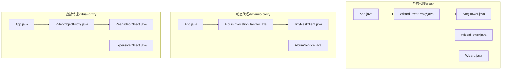
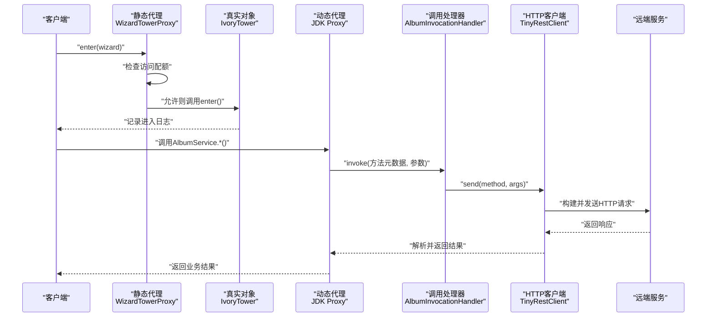
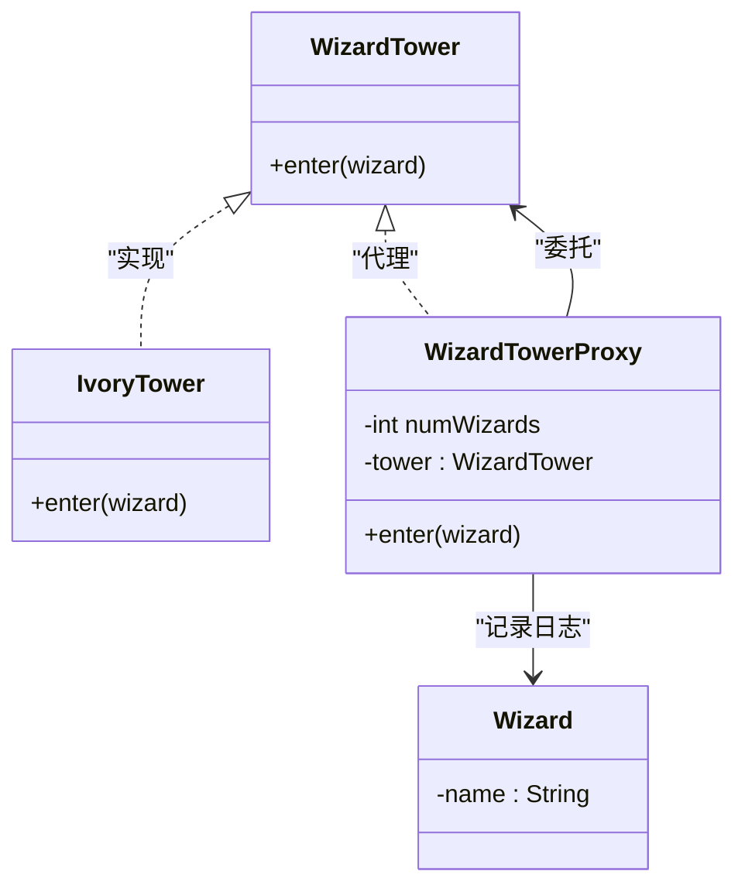
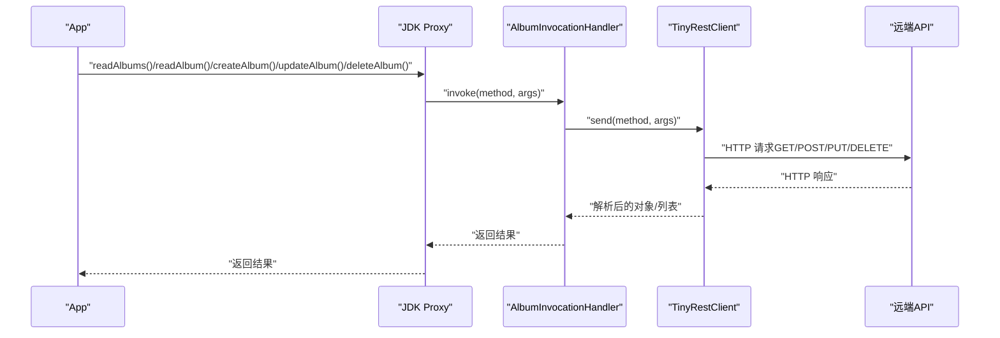
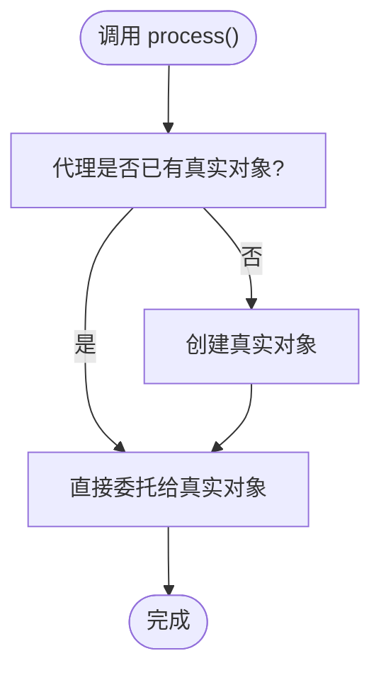
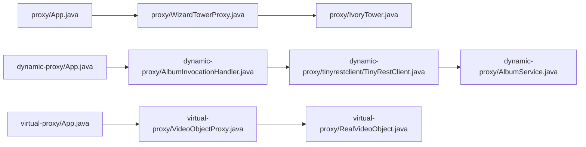

# 代理模式

<cite>
**本文引用的文件**
- [proxy/App.java](file://proxy/src/main/java/com/iluwatar/proxy/App.java)
- [proxy/WizardTower.java](file://proxy/src/main/java/com/iluwatar/proxy/WizardTower.java)
- [proxy/IvoryTower.java](file://proxy/src/main/java/com/iluwatar/proxy/IvoryTower.java)
- [proxy/WizardTowerProxy.java](file://proxy/src/main/java/com/iluwatar/proxy/WizardTowerProxy.java)
- [proxy/Wizard.java](file://proxy/src/main/java/com/iluwatar/proxy/Wizard.java)
- [dynamic-proxy/App.java](file://dynamic-proxy/src/main/java/com/iluwatar/dynamicproxy/App.java)
- [dynamic-proxy/AlbumService.java](file://dynamic-proxy/src/main/java/com/iluwatar/dynamicproxy/AlbumService.java)
- [dynamic-proxy/AlbumInvocationHandler.java](file://dynamic-proxy/src/main/java/com/iluwatar/dynamicproxy/AlbumInvocationHandler.java)
- [dynamic-proxy/tinyrestclient/TinyRestClient.java](file://dynamic-proxy/src/main/java/com/iluwatar/dynamicproxy/tinyrestclient/TinyRestClient.java)
- [virtual-proxy/App.java](file://virtual-proxy/src/main/java/com/iluwatar/virtual/proxy/App.java)
- [virtual-proxy/ExpensiveObject.java](file://virtual-proxy/src/main/java/com/iluwatar/virtual/proxy/ExpensiveObject.java)
- [virtual-proxy/RealVideoObject.java](file://virtual-proxy/src/main/java/com/iluwatar/virtual/proxy/RealVideoObject.java)
- [virtual-proxy/VideoObjectProxy.java](file://virtual-proxy/src/main/java/com/iluwatar/virtual/proxy/VideoObjectProxy.java)
</cite>

## 目录
1. [引言](#引言)
2. [项目结构](#项目结构)
3. [核心组件](#核心组件)
4. [架构总览](#架构总览)
5. [详细组件分析](#详细组件分析)
6. [依赖关系分析](#依赖关系分析)
7. [性能考量](#性能考量)
8. [故障排查指南](#故障排查指南)
9. [结论](#结论)
10. [附录](#附录)

## 引言
本技术文档围绕Java代理模式展开，系统解析代理模式的设计目的与实现方式，并通过仓库中的多个示例（静态代理、动态代理、虚拟代理）深入说明其在访问控制、远程调用、延迟加载等场景中的应用。文档同时提供性能优化与内存管理建议，帮助读者在实际工程中正确选择与使用代理模式。

## 项目结构
本仓库包含三个与代理模式直接相关的示例模块：
- 静态代理：proxy 模块演示了基于接口的静态代理，用于访问控制（限制进入巫师塔的人数）。
- 动态代理：dynamic-proxy 模块演示了基于JDK动态代理的HTTP客户端封装，通过InvocationHandler拦截接口方法并转发到TinyRestClient。
- 虚拟代理：virtual-proxy 模块演示了延迟加载与对象复用，通过VideoObjectProxy按需创建RealVideoObject。

**图表来源**
- [proxy/App.java](file://proxy/src/main/java/com/iluwatar/proxy/App.java#L46-L55)
- [proxy/WizardTower.java](file://proxy/src/main/java/com/iluwatar/proxy/WizardTower.java#L30-L33)
- [proxy/IvoryTower.java](file://proxy/src/main/java/com/iluwatar/proxy/IvoryTower.java#L33-L39)
- [proxy/WizardTowerProxy.java](file://proxy/src/main/java/com/iluwatar/proxy/WizardTowerProxy.java#L33-L54)
- [proxy/Wizard.java](file://proxy/src/main/java/com/iluwatar/proxy/Wizard.java#L33-L42)
- [dynamic-proxy/App.java](file://dynamic-proxy/src/main/java/com/iluwatar/dynamicproxy/App.java#L67-L107)
- [dynamic-proxy/AlbumService.java](file://dynamic-proxy/src/main/java/com/iluwatar/dynamicproxy/AlbumService.java#L40-L87)
- [dynamic-proxy/AlbumInvocationHandler.java](file://dynamic-proxy/src/main/java/com/iluwatar/dynamicproxy/AlbumInvocationHandler.java#L38-L61)
- [dynamic-proxy/tinyrestclient/TinyRestClient.java](file://dynamic-proxy/src/main/java/com/iluwatar/dynamicproxy/tinyrestclient/TinyRestClient.java#L52-L100)
- [virtual-proxy/App.java](file://virtual-proxy/src/main/java/com/iluwatar/virtual/proxy/App.java#L37-L41)
- [virtual-proxy/ExpensiveObject.java](file://virtual-proxy/src/main/java/com/iluwatar/virtual/proxy/ExpensiveObject.java#L30-L31)
- [virtual-proxy/RealVideoObject.java](file://virtual-proxy/src/main/java/com/iluwatar/virtual/proxy/RealVideoObject.java#L36-L49)
- [virtual-proxy/VideoObjectProxy.java](file://virtual-proxy/src/main/java/com/iluwatar/virtual/proxy/VideoObjectProxy.java#L34-L43)

**章节来源**
- [proxy/App.java](file://proxy/src/main/java/com/iluwatar/proxy/App.java#L46-L55)
- [dynamic-proxy/App.java](file://dynamic-proxy/src/main/java/com/iluwatar/dynamicproxy/App.java#L67-L107)
- [virtual-proxy/App.java](file://virtual-proxy/src/main/java/com/iluwatar/virtual/proxy/App.java#L37-L41)

## 核心组件
- 静态代理（proxy）
  - 接口：WizardTower，定义统一入口方法。
  - 真实对象：IvoryTower，实现具体业务逻辑。
  - 代理类：WizardTowerProxy，负责访问控制与计数。
  - 客户端：App，通过代理访问真实对象。
- 动态代理（dynamic-proxy）
  - 接口：AlbumService，声明REST操作方法并标注注解。
  - 动态代理：由JDK Proxy生成，绑定InvocationHandler。
  - 调度器：AlbumInvocationHandler，拦截方法调用并转交TinyRestClient。
  - HTTP客户端：TinyRestClient，解析注解、构造请求、处理响应。
- 虚拟代理（virtual-proxy）
  - 接口：ExpensiveObject，统一对外行为。
  - 真实对象：RealVideoObject，昂贵对象，初始化与处理逻辑。
  - 代理类：VideoObjectProxy，按需创建真实对象，避免重复初始化。

**章节来源**
- [proxy/WizardTower.java](file://proxy/src/main/java/com/iluwatar/proxy/WizardTower.java#L30-L33)
- [proxy/IvoryTower.java](file://proxy/src/main/java/com/iluwatar/proxy/IvoryTower.java#L33-L39)
- [proxy/WizardTowerProxy.java](file://proxy/src/main/java/com/iluwatar/proxy/WizardTowerProxy.java#L33-L54)
- [proxy/App.java](file://proxy/src/main/java/com/iluwatar/proxy/App.java#L46-L55)
- [dynamic-proxy/AlbumService.java](file://dynamic-proxy/src/main/java/com/iluwatar/dynamicproxy/AlbumService.java#L40-L87)
- [dynamic-proxy/AlbumInvocationHandler.java](file://dynamic-proxy/src/main/java/com/iluwatar/dynamicproxy/AlbumInvocationHandler.java#L38-L61)
- [dynamic-proxy/tinyrestclient/TinyRestClient.java](file://dynamic-proxy/src/main/java/com/iluwatar/dynamicproxy/tinyrestclient/TinyRestClient.java#L52-L100)
- [virtual-proxy/ExpensiveObject.java](file://virtual-proxy/src/main/java/com/iluwatar/virtual/proxy/ExpensiveObject.java#L30-L31)
- [virtual-proxy/RealVideoObject.java](file://virtual-proxy/src/main/java/com/iluwatar/virtual/proxy/RealVideoObject.java#L36-L49)
- [virtual-proxy/VideoObjectProxy.java](file://virtual-proxy/src/main/java/com/iluwatar/virtual/proxy/VideoObjectProxy.java#L34-L43)

## 架构总览
下图展示了三种代理模式的典型交互流程与职责边界：

**图表来源**
- [proxy/WizardTowerProxy.java](file://proxy/src/main/java/com/iluwatar/proxy/WizardTowerProxy.java#L46-L53)
- [proxy/IvoryTower.java](file://proxy/src/main/java/com/iluwatar/proxy/IvoryTower.java#L35-L37)
- [dynamic-proxy/App.java](file://dynamic-proxy/src/main/java/com/iluwatar/dynamicproxy/App.java#L76-L107)
- [dynamic-proxy/AlbumInvocationHandler.java](file://dynamic-proxy/src/main/java/com/iluwatar/dynamicproxy/AlbumInvocationHandler.java#L52-L59)
- [dynamic-proxy/tinyrestclient/TinyRestClient.java](file://dynamic-proxy/src/main/java/com/iluwatar/dynamicproxy/tinyrestclient/TinyRestClient.java#L79-L100)

## 详细组件分析

### 静态代理：访问控制与配额管理
- 设计要点
  - 通过代理类集中处理访问控制逻辑，不侵入真实对象。
  - 使用固定上限常量进行配额控制，便于扩展策略（如角色过滤、时间窗口）。
- 关键流程
  - 客户端调用代理的enter方法。
  - 代理检查当前人数与上限，决定放行或拒绝。
  - 放行时委托真实对象执行业务逻辑。

**图表来源**
- [proxy/WizardTower.java](file://proxy/src/main/java/com/iluwatar/proxy/WizardTower.java#L30-L33)
- [proxy/IvoryTower.java](file://proxy/src/main/java/com/iluwatar/proxy/IvoryTower.java#L33-L39)
- [proxy/WizardTowerProxy.java](file://proxy/src/main/java/com/iluwatar/proxy/WizardTowerProxy.java#L33-L54)
- [proxy/Wizard.java](file://proxy/src/main/java/com/iluwatar/proxy/Wizard.java#L33-L42)

**章节来源**
- [proxy/WizardTowerProxy.java](file://proxy/src/main/java/com/iluwatar/proxy/WizardTowerProxy.java#L33-L54)
- [proxy/IvoryTower.java](file://proxy/src/main/java/com/iluwatar/proxy/IvoryTower.java#L33-L39)
- [proxy/App.java](file://proxy/src/main/java/com/iluwatar/proxy/App.java#L46-L55)

### 动态代理：远程调用与注解驱动
- 设计要点
  - 借助JDK Proxy在运行时生成接口实现，避免手写重复样板代码。
  - 通过自定义InvocationHandler拦截所有方法调用，统一注入横切逻辑（如日志、参数解析、HTTP转发）。
  - AlbumService接口使用注解标记HTTP方法、路径与请求体，TinyRestClient解析注解并构造请求。
- 关键流程
  - 应用启动后创建动态代理实例。
  - 客户端调用代理接口方法。
  - 调用处理器将方法元数据与参数传递给TinyRestClient。
  - TinyRestClient根据注解构建URL、参数与请求体，发起HTTP请求并解析响应。

**图表来源**
- [dynamic-proxy/App.java](file://dynamic-proxy/src/main/java/com/iluwatar/dynamicproxy/App.java#L76-L107)
- [dynamic-proxy/AlbumInvocationHandler.java](file://dynamic-proxy/src/main/java/com/iluwatar/dynamicproxy/AlbumInvocationHandler.java#L52-L59)
- [dynamic-proxy/tinyrestclient/TinyRestClient.java](file://dynamic-proxy/src/main/java/com/iluwatar/dynamicproxy/tinyrestclient/TinyRestClient.java#L79-L100)
- [dynamic-proxy/AlbumService.java](file://dynamic-proxy/src/main/java/com/iluwatar/dynamicproxy/AlbumService.java#L40-L87)

**章节来源**
- [dynamic-proxy/App.java](file://dynamic-proxy/src/main/java/com/iluwatar/dynamicproxy/App.java#L67-L107)
- [dynamic-proxy/AlbumInvocationHandler.java](file://dynamic-proxy/src/main/java/com/iluwatar/dynamicproxy/AlbumInvocationHandler.java#L38-L61)
- [dynamic-proxy/tinyrestclient/TinyRestClient.java](file://dynamic-proxy/src/main/java/com/iluwatar/dynamicproxy/tinyrestclient/TinyRestClient.java#L52-L100)
- [dynamic-proxy/AlbumService.java](file://dynamic-proxy/src/main/java/com/iluwatar/dynamicproxy/AlbumService.java#L40-L87)

### 虚拟代理：延迟加载与资源复用
- 设计要点
  - 代理持有真实对象的引用，首次调用时才创建真实对象，实现延迟初始化。
  - 后续调用直接复用已创建的真实对象，避免重复开销。
- 关键流程
  - 客户端调用代理的process方法。
  - 代理检查是否已存在真实对象；若无则创建。
  - 将处理逻辑委托给真实对象。

**图表来源**
- [virtual-proxy/VideoObjectProxy.java](file://virtual-proxy/src/main/java/com/iluwatar/virtual/proxy/VideoObjectProxy.java#L37-L43)
- [virtual-proxy/RealVideoObject.java](file://virtual-proxy/src/main/java/com/iluwatar/virtual/proxy/RealVideoObject.java#L36-L49)

**章节来源**
- [virtual-proxy/App.java](file://virtual-proxy/src/main/java/com/iluwatar/virtual/proxy/App.java#L37-L41)
- [virtual-proxy/VideoObjectProxy.java](file://virtual-proxy/src/main/java/com/iluwatar/virtual/proxy/VideoObjectProxy.java#L34-L43)
- [virtual-proxy/RealVideoObject.java](file://virtual-proxy/src/main/java/com/iluwatar/virtual/proxy/RealVideoObject.java#L36-L49)

### 静态代理 vs 动态代理：实现差异与适用场景
- 静态代理
  - 优点：实现简单、编译期类型安全、易于理解与调试。
  - 缺点：每个接口都需要编写对应代理类，重复工作多。
  - 场景：访问控制、权限校验、日志记录等轻量横切逻辑。
- 动态代理
  - 优点：运行时生成代理，减少样板代码；可统一处理多种接口方法。
  - 缺点：反射开销、调试复杂度增加；仅支持接口代理。
  - 场景：远程调用、RPC封装、HTTP客户端、AOP前置/后置处理。

**章节来源**
- [proxy/WizardTowerProxy.java](file://proxy/src/main/java/com/iluwatar/proxy/WizardTowerProxy.java#L33-L54)
- [dynamic-proxy/AlbumInvocationHandler.java](file://dynamic-proxy/src/main/java/com/iluwatar/dynamicproxy/AlbumInvocationHandler.java#L38-L61)

## 依赖关系分析
- 静态代理
  - App 依赖 WizardTowerProxy；Proxy 依赖 IvoryTower；均实现 WizardTower 接口。
- 动态代理
  - App 创建 JDK Proxy 并绑定 AlbumInvocationHandler；Handler 依赖 TinyRestClient；TinyRestClient 解析 AlbumService 注解。
- 虚拟代理
  - App 依赖 VideoObjectProxy；Proxy 依赖 RealVideoObject；二者实现 ExpensiveObject 接口。

**图表来源**
- [proxy/App.java](file://proxy/src/main/java/com/iluwatar/proxy/App.java#L46-L55)
- [proxy/WizardTowerProxy.java](file://proxy/src/main/java/com/iluwatar/proxy/WizardTowerProxy.java#L33-L54)
- [proxy/IvoryTower.java](file://proxy/src/main/java/com/iluwatar/proxy/IvoryTower.java#L33-L39)
- [dynamic-proxy/App.java](file://dynamic-proxy/src/main/java/com/iluwatar/dynamicproxy/App.java#L76-L81)
- [dynamic-proxy/AlbumInvocationHandler.java](file://dynamic-proxy/src/main/java/com/iluwatar/dynamicproxy/AlbumInvocationHandler.java#L38-L61)
- [dynamic-proxy/tinyrestclient/TinyRestClient.java](file://dynamic-proxy/src/main/java/com/iluwatar/dynamicproxy/tinyrestclient/TinyRestClient.java#L52-L100)
- [dynamic-proxy/AlbumService.java](file://dynamic-proxy/src/main/java/com/iluwatar/dynamicproxy/AlbumService.java#L40-L87)
- [virtual-proxy/App.java](file://virtual-proxy/src/main/java/com/iluwatar/virtual/proxy/App.java#L37-L41)
- [virtual-proxy/VideoObjectProxy.java](file://virtual-proxy/src/main/java/com/iluwatar/virtual/proxy/VideoObjectProxy.java#L34-L43)
- [virtual-proxy/RealVideoObject.java](file://virtual-proxy/src/main/java/com/iluwatar/virtual/proxy/RealVideoObject.java#L36-L49)

**章节来源**
- [proxy/WizardTower.java](file://proxy/src/main/java/com/iluwatar/proxy/WizardTower.java#L30-L33)
- [proxy/WizardTowerProxy.java](file://proxy/src/main/java/com/iluwatar/proxy/WizardTowerProxy.java#L33-L54)
- [dynamic-proxy/AlbumService.java](file://dynamic-proxy/src/main/java/com/iluwatar/dynamicproxy/AlbumService.java#L40-L87)
- [virtual-proxy/ExpensiveObject.java](file://virtual-proxy/src/main/java/com/iluwatar/virtual/proxy/ExpensiveObject.java#L30-L31)

## 性能考量
- 反射与代理开销
  - 动态代理通过反射分派方法调用，存在额外开销。对于高频调用场景，建议评估是否可通过静态代理或字节码增强（如ASM/CGLIB）降低反射成本。
- 远程调用延迟
  - 动态代理封装的HTTP调用受网络延迟影响显著。建议结合连接池、超时重试、熔断降级策略提升稳定性与吞吐。
- 延迟加载与内存占用
  - 虚拟代理可有效避免昂贵对象的提前创建，降低峰值内存占用。但需注意首次访问的“冷启动”延迟，可在空闲时段预热。
- 日志与监控
  - 在代理层添加必要的日志与指标（耗时、错误率），有助于定位性能瓶颈与异常。

[本节为通用指导，无需列出具体文件来源]

## 故障排查指南
- 动态代理未生效
  - 确认是否正确传入接口类型与InvocationHandler给Proxy.newProxyInstance。
  - 检查接口方法签名与注解是否匹配，确保TinyRestClient能解析到HTTP注解。
- HTTP请求失败
  - 查看TinyRestClient对状态码的判断与错误日志输出，确认远端服务可用性与参数格式。
- 访问被拒绝（静态代理）
  - 检查配额上限与当前计数，确认代理逻辑是否按预期执行。
- 虚拟代理未复用对象
  - 确认代理内部真实对象引用是否被意外置空，以及process调用链路是否命中代理分支。

**章节来源**
- [dynamic-proxy/tinyrestclient/TinyRestClient.java](file://dynamic-proxy/src/main/java/com/iluwatar/dynamicproxy/tinyrestclient/TinyRestClient.java#L94-L98)
- [proxy/WizardTowerProxy.java](file://proxy/src/main/java/com/iluwatar/proxy/WizardTowerProxy.java#L47-L52)
- [virtual-proxy/VideoObjectProxy.java](file://virtual-proxy/src/main/java/com/iluwatar/virtual/proxy/VideoObjectProxy.java#L37-L43)

## 结论
代理模式通过引入中间层，在不修改真实对象的前提下增强了控制力与可维护性。静态代理适合轻量、稳定的访问控制；动态代理适合统一的远程调用与横切逻辑；虚拟代理适合延迟加载与资源复用。结合合理的性能优化与监控策略，代理模式能在工程实践中发挥巨大价值。

[本节为总结性内容，无需列出具体文件来源]

## 附录
- 典型应用场景
  - 缓存：在代理层实现读写分离与失效策略。
  - 权限控制：在代理层统一校验用户角色与资源授权。
  - 日志记录：在代理层埋点，统一采集调用轨迹与指标。
  - 远程代理：通过动态代理屏蔽网络细节，提供本地化调用体验。
  - 保护代理：对外暴露受控接口，隐藏真实对象的脆弱实现。

[本节为概念性内容，无需列出具体文件来源]