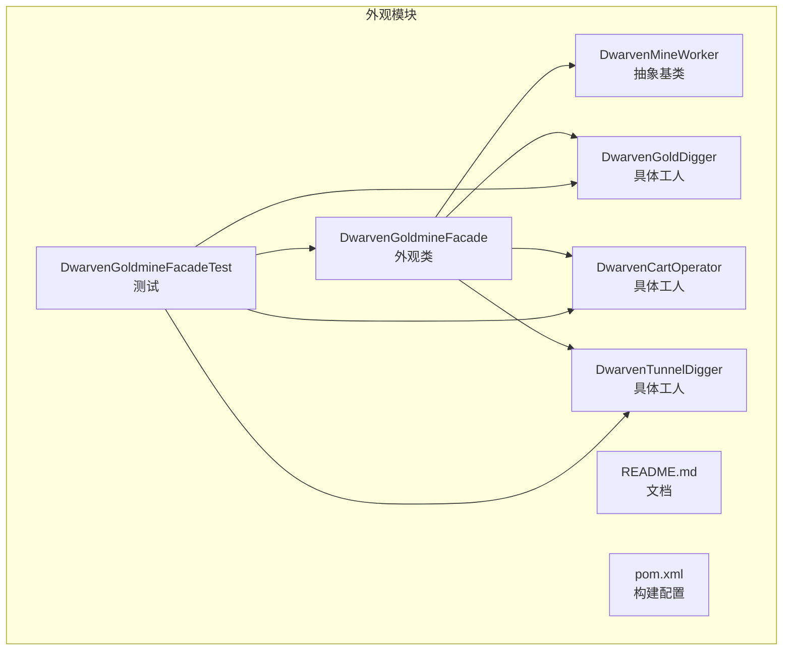
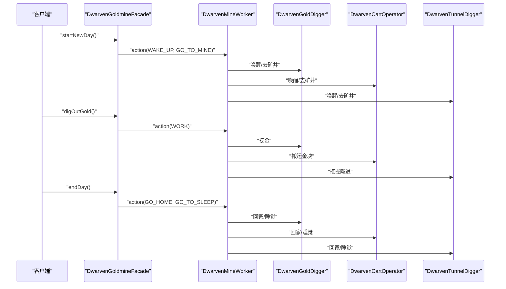
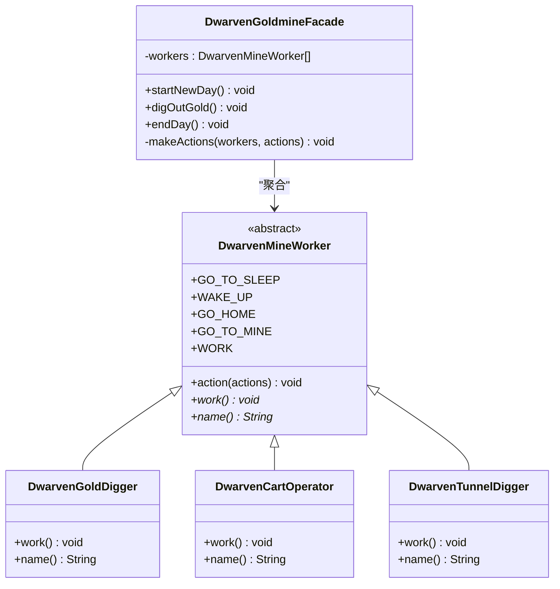
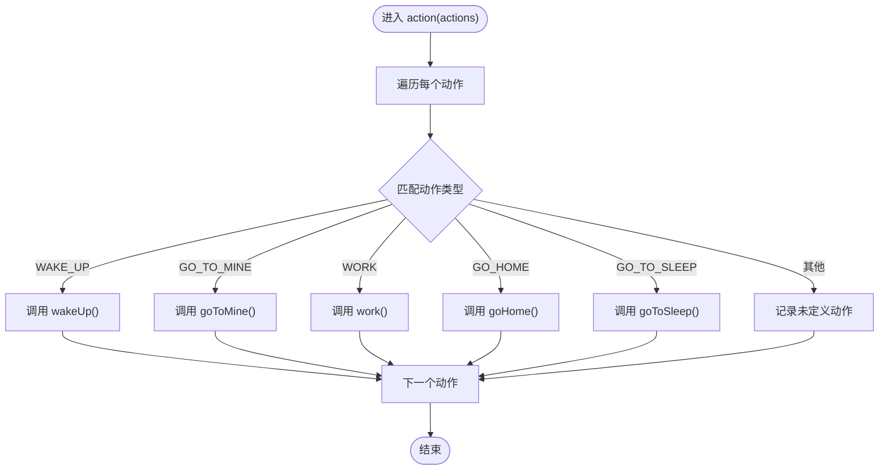
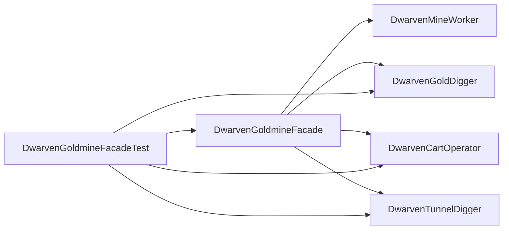

# 外观模式

<cite>
**本文引用的文件**
- [DwarvenGoldmineFacade.java](file://facade/src/main/java/com/iluwatar/facade/DwarvenGoldmineFacade.java)
- [DwarvenMineWorker.java](file://facade/src/main/java/com/iluwatar/facade/DwarvenMineWorker.java)
- [DwarvenGoldDigger.java](file://facade/src/main/java/com/iluwatar/facade/DwarvenGoldDigger.java)
- [DwarvenCartOperator.java](file://facade/src/main/java/com/iluwatar/facade/DwarvenCartOperator.java)
- [DwarvenTunnelDigger.java](file://facade/src/main/java/com/iluwatar/facade/DwarvenTunnelDigger.java)
- [DwarvenGoldmineFacadeTest.java](file://facade/src/test/java/com/iluwatar/facade/DwarvenGoldmineFacadeTest.java)
- [README.md](file://facade/README.md)
- [pom.xml](file://facade/pom.xml)
</cite>

## 目录
1. [引言](#引言)
2. [项目结构](#项目结构)
3. [核心组件](#核心组件)
4. [架构总览](#架构总览)
5. [组件详解](#组件详解)
6. [依赖关系分析](#依赖关系分析)
7. [性能考量](#性能考量)
8. [故障排查指南](#故障排查指南)
9. [结论](#结论)
10. [附录](#附录)

## 引言
本文件围绕外观模式（Facade）在Java中的实践展开，以“矮人金矿”示例为主线，系统阐述外观模式如何为复杂子系统提供统一、简化的接口，隐藏内部细节，降低客户端与子系统之间的耦合度。我们将重点分析DwarvenGoldmineFacade如何协调多个矿工组件的工作，并给出在企业应用、第三方库封装与系统集成中的应用建议；同时对比外观模式与适配器模式的区别，讨论如何在“简化接口”与“保持灵活性”之间取得平衡。

## 项目结构
facade模块包含以下关键文件：
- 子系统组件：抽象工人基类与三个具体工人类型
- 外观类：统一调度所有子系统组件
- 测试类：验证外观在完整工作日流程中的行为
- 文档与构建配置：README说明与Maven配置

图表来源
- [DwarvenGoldmineFacade.java](file://facade/src/main/java/com/iluwatar/facade/DwarvenGoldmineFacade.java#L37-L69)
- [DwarvenMineWorker.java](file://facade/src/main/java/com/iluwatar/facade/DwarvenMineWorker.java#L34-L77)
- [DwarvenGoldDigger.java](file://facade/src/main/java/com/iluwatar/facade/DwarvenGoldDigger.java#L33-L44)
- [DwarvenCartOperator.java](file://facade/src/main/java/com/iluwatar/facade/DwarvenCartOperator.java#L33-L44)
- [DwarvenTunnelDigger.java](file://facade/src/main/java/com/iluwatar/facade/DwarvenTunnelDigger.java#L33-L44)
- [DwarvenGoldmineFacadeTest.java](file://facade/src/test/java/com/iluwatar/facade/DwarvenGoldmineFacadeTest.java#L65-L109)
- [README.md](file://facade/README.md#L36-L180)
- [pom.xml](file://facade/pom.xml#L35-L62)

章节来源
- [README.md](file://facade/README.md#L1-L247)
- [pom.xml](file://facade/pom.xml#L1-L63)

## 核心组件
- 外观类 DwarvenGoldmineFacade
  - 职责：对外暴露三个高层操作方法，屏蔽内部子系统复杂度
  - 关键方法：startNewDay、digOutGold、endDay
  - 内部聚合：持有工人列表，统一调度
- 抽象工人基类 DwarvenMineWorker
  - 职责：定义通用动作与工作接口，集中处理动作分派
  - 动作枚举：唤醒、去矿井、工作、回家、睡觉
- 具体工人
  - DwarvenGoldDigger：挖金
  - DwarvenCartOperator：搬运金块
  - DwarvenTunnelDigger：挖掘隧道

章节来源
- [DwarvenGoldmineFacade.java](file://facade/src/main/java/com/iluwatar/facade/DwarvenGoldmineFacade.java#L37-L69)
- [DwarvenMineWorker.java](file://facade/src/main/java/com/iluwatar/facade/DwarvenMineWorker.java#L34-L77)
- [DwarvenGoldDigger.java](file://facade/src/main/java/com/iluwatar/facade/DwarvenGoldDigger.java#L33-L44)
- [DwarvenCartOperator.java](file://facade/src/main/java/com/iluwatar/facade/DwarvenCartOperator.java#L33-L44)
- [DwarvenTunnelDigger.java](file://facade/src/main/java/com/iluwatar/facade/DwarvenTunnelDigger.java#L33-L44)

## 架构总览
外观模式通过单一入口对外提供简化的API，内部协调多个子系统组件完成复杂任务。在“矮人金矿”示例中，外观类负责组织一天的工作流程，具体工人各自执行专业职责，避免客户端直接与底层组件交互。

图表来源
- [DwarvenGoldmineFacade.java](file://facade/src/main/java/com/iluwatar/facade/DwarvenGoldmineFacade.java#L51-L68)
- [DwarvenMineWorker.java](file://facade/src/main/java/com/iluwatar/facade/DwarvenMineWorker.java#L52-L68)
- [DwarvenGoldDigger.java](file://facade/src/main/java/com/iluwatar/facade/DwarvenGoldDigger.java#L35-L43)
- [DwarvenCartOperator.java](file://facade/src/main/java/com/iluwatar/facade/DwarvenCartOperator.java#L35-L43)
- [DwarvenTunnelDigger.java](file://facade/src/main/java/com/iluwatar/facade/DwarvenTunnelDigger.java#L35-L43)

## 组件详解

### 外观类：DwarvenGoldmineFacade
- 设计要点
  - 聚合多个子系统组件，对外暴露高层语义化方法
  - 使用统一的动作分发机制，减少客户端对内部细节的感知
- 关键行为
  - startNewDay：唤醒并前往矿井
  - digOutGold：执行日常工作
  - endDay：结束并返回休息
- 复杂度与可扩展性
  - 时间复杂度：O(n)，n为工人数量
  - 可扩展性：新增工人只需在构造函数中加入实例，无需修改外观方法

图表来源
- [DwarvenGoldmineFacade.java](file://facade/src/main/java/com/iluwatar/facade/DwarvenGoldmineFacade.java#L37-L69)
- [DwarvenMineWorker.java](file://facade/src/main/java/com/iluwatar/facade/DwarvenMineWorker.java#L34-L77)
- [DwarvenGoldDigger.java](file://facade/src/main/java/com/iluwatar/facade/DwarvenGoldDigger.java#L33-L44)
- [DwarvenCartOperator.java](file://facade/src/main/java/com/iluwatar/facade/DwarvenCartOperator.java#L33-L44)
- [DwarvenTunnelDigger.java](file://facade/src/main/java/com/iluwatar/facade/DwarvenTunnelDigger.java#L33-L44)

章节来源
- [DwarvenGoldmineFacade.java](file://facade/src/main/java/com/iluwatar/facade/DwarvenGoldmineFacade.java#L37-L69)

### 抽象工人基类：DwarvenMineWorker
- 设计要点
  - 将动作分派逻辑集中在基类，避免重复代码
  - 通过抽象方法隔离具体工作内容，便于扩展
- 动作分派流程
  - 接收动作数组，逐个映射到对应方法
  - 支持组合动作，提升外观层调用效率

图表来源
- [DwarvenMineWorker.java](file://facade/src/main/java/com/iluwatar/facade/DwarvenMineWorker.java#L52-L68)

章节来源
- [DwarvenMineWorker.java](file://facade/src/main/java/com/iluwatar/facade/DwarvenMineWorker.java#L34-L77)

### 具体工人：DwarvenGoldDigger / DwarvenCartOperator / DwarvenTunnelDigger
- 设计要点
  - 各自实现特定工作职责，体现单一职责原则
  - 通过统一的基类动作分派，确保外观层调用一致性

章节来源
- [DwarvenGoldDigger.java](file://facade/src/main/java/com/iluwatar/facade/DwarvenGoldDigger.java#L33-L44)
- [DwarvenCartOperator.java](file://facade/src/main/java/com/iluwatar/facade/DwarvenCartOperator.java#L33-L44)
- [DwarvenTunnelDigger.java](file://facade/src/main/java/com/iluwatar/facade/DwarvenTunnelDigger.java#L33-L44)

### 测试：DwarvenGoldmineFacadeTest
- 验证点
  - 完整工作日流程：开始日、挖金、结束日
  - 日志断言：确认每个工人在正确时机执行相应动作
- 测试策略
  - 使用内存日志收集器捕获输出，断言消息存在与总数
  - 保证外观层方法调用顺序与预期一致

章节来源
- [DwarvenGoldmineFacadeTest.java](file://facade/src/test/java/com/iluwatar/facade/DwarvenGoldmineFacadeTest.java#L65-L109)

## 依赖关系分析
- 外观类依赖于工人抽象与具体实现，形成稳定的上层接口
- 工人类之间无直接依赖，仅通过外观类进行编排
- 测试类依赖外观类与具体工人，用于验证行为一致性

图表来源
- [DwarvenGoldmineFacade.java](file://facade/src/main/java/com/iluwatar/facade/DwarvenGoldmineFacade.java#L37-L69)
- [DwarvenMineWorker.java](file://facade/src/main/java/com/iluwatar/facade/DwarvenMineWorker.java#L34-L77)
- [DwarvenGoldDigger.java](file://facade/src/main/java/com/iluwatar/facade/DwarvenGoldDigger.java#L33-L44)
- [DwarvenCartOperator.java](file://facade/src/main/java/com/iluwatar/facade/DwarvenCartOperator.java#L33-L44)
- [DwarvenTunnelDigger.java](file://facade/src/main/java/com/iluwatar/facade/DwarvenTunnelDigger.java#L33-L44)
- [DwarvenGoldmineFacadeTest.java](file://facade/src/test/java/com/iluwatar/facade/DwarvenGoldmineFacadeTest.java#L65-L109)

章节来源
- [DwarvenGoldmineFacade.java](file://facade/src/main/java/com/iluwatar/facade/DwarvenGoldmineFacade.java#L37-L69)
- [DwarvenMineWorker.java](file://facade/src/main/java/com/iluwatar/facade/DwarvenMineWorker.java#L34-L77)
- [DwarvenGoldDigger.java](file://facade/src/main/java/com/iluwatar/facade/DwarvenGoldDigger.java#L33-L44)
- [DwarvenCartOperator.java](file://facade/src/main/java/com/iluwatar/facade/DwarvenCartOperator.java#L33-L44)
- [DwarvenTunnelDigger.java](file://facade/src/main/java/com/iluwatar/facade/DwarvenTunnelDigger.java#L33-L44)
- [DwarvenGoldmineFacadeTest.java](file://facade/src/test/java/com/iluwatar/facade/DwarvenGoldmineFacadeTest.java#L65-L109)

## 性能考量
- 时间复杂度
  - 外观层方法对每个工人执行一次动作分派，整体为O(n)
  - 动作分派内部为线性遍历，单次调用为O(m)，m为动作数量
- 空间复杂度
  - 外观类持有工人集合，空间开销与工人数量线性相关
- 可扩展性
  - 新增工人不影响现有外观方法签名，符合开闭原则
  - 若动作种类增多，可在基类中扩展，避免各子类重复实现

## 故障排查指南
- 症状：外观层调用后无任何日志输出
  - 检查外观类是否正确初始化工人集合
  - 确认动作参数是否包含有效动作
- 症状：测试断言失败（日志数量或内容不匹配）
  - 核对startNewDay/digOutGold/endDay的调用顺序
  - 检查具体工人的工作方法是否按预期输出日志
- 建议
  - 在外观层增加日志或断言，定位具体工人未被调用的情况
  - 对动作分派逻辑进行单元测试，确保每种动作都能正确路由

章节来源
- [DwarvenGoldmineFacadeTest.java](file://facade/src/test/java/com/iluwatar/facade/DwarvenGoldmineFacadeTest.java#L65-L109)
- [DwarvenGoldmineFacade.java](file://facade/src/main/java/com/iluwatar/facade/DwarvenGoldmineFacade.java#L63-L68)
- [DwarvenMineWorker.java](file://facade/src/main/java/com/iluwatar/facade/DwarvenMineWorker.java#L52-L68)

## 结论
外观模式通过“统一入口+动作分派”的设计，在不改变子系统内部结构的前提下，显著降低了客户端的使用成本。在“矮人金矿”示例中，DwarvenGoldmineFacade将复杂的多组件协作抽象为三个高层方法，既提升了易用性，又保持了良好的可扩展性。实践中应避免让外观类演变为“上帝对象”，并通过清晰的职责划分与测试保障，实现“简化接口”与“保持灵活性”的平衡。

## 附录

### 外观模式与适配器模式的区别
- 外观模式
  - 关注“简化接口”，为现有子系统提供统一入口
  - 不改变子系统接口，仅在上层做整合
- 适配器模式
  - 关注“接口转换”，使两个不兼容接口协同工作
  - 通常包装一个或多个旧接口，暴露新接口给客户端

参考来源
- [README.md](file://facade/README.md#L237-L241)

### 应用场景与最佳实践
- 企业应用
  - 将复杂的业务流程封装为高层服务接口，屏蔽内部事务与权限控制
- 第三方库封装
  - 对多组件API进行统一封装，提供领域化方法名
- 系统集成
  - 在微服务或模块边界处提供统一入口，隐藏内部协议差异

参考来源
- [README.md](file://facade/README.md#L202-L222)