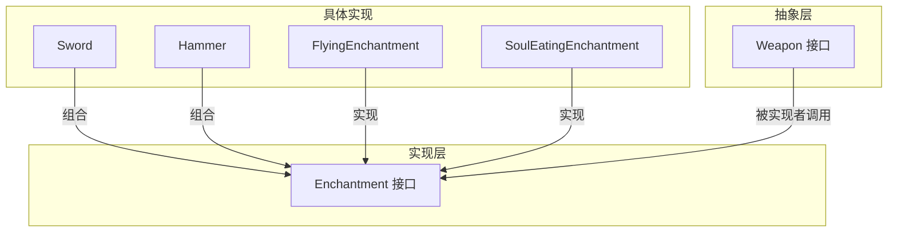
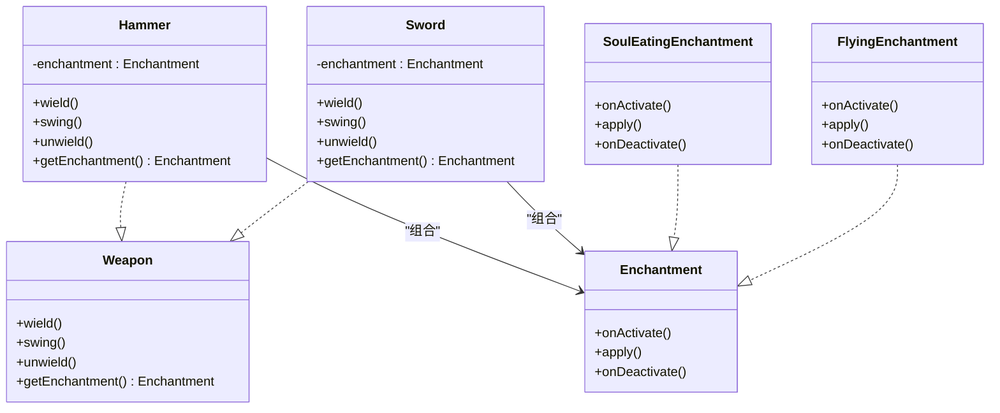
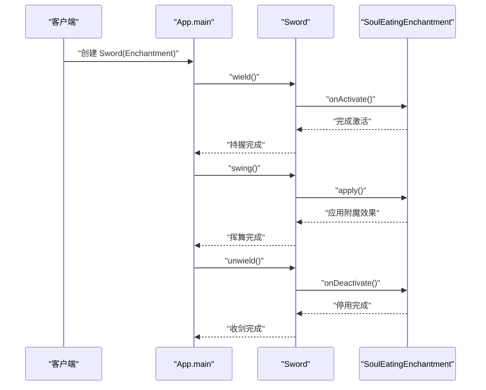
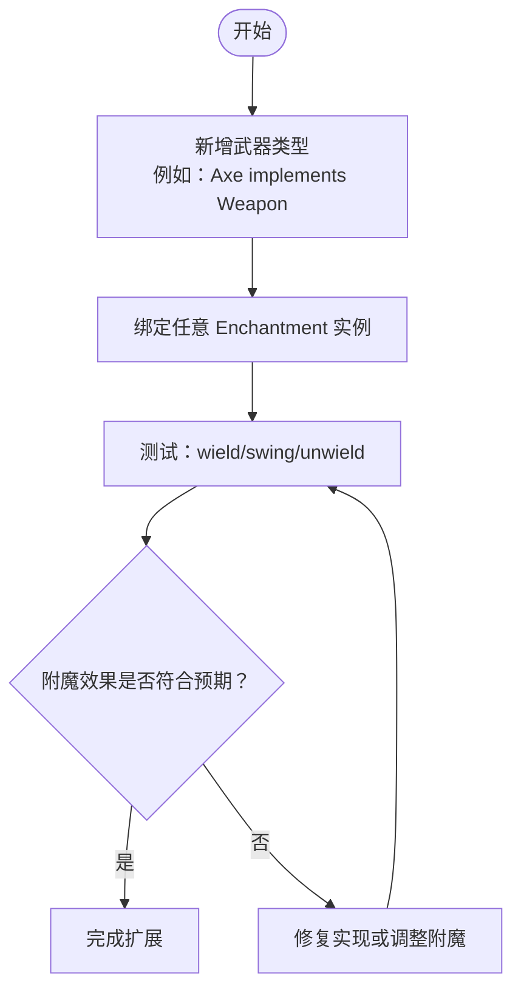
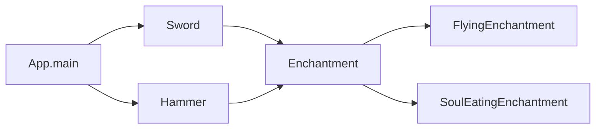

# 桥接模式

<cite>
**本文引用的文件**
- [App.java](file://bridge/src/main/java/com/iluwatar/bridge/App.java)
- [Weapon.java](file://bridge/src/main/java/com/iluwatar/bridge/Weapon.java)
- [Enchantment.java](file://bridge/src/main/java/com/iluwatar/bridge/Enchantment.java)
- [Sword.java](file://bridge/src/main/java/com/iluwatar/bridge/Sword.java)
- [Hammer.java](file://bridge/src/main/java/com/iluwatar/bridge/Hammer.java)
- [FlyingEnchantment.java](file://bridge/src/main/java/com/iluwatar/bridge/FlyingEnchantment.java)
- [SoulEatingEnchantment.java](file://bridge/src/main/java/com/iluwatar/bridge/SoulEatingEnchantment.java)
- [README.md](file://bridge/README.md)
</cite>

## 目录
1. [引言](#引言)
2. [项目结构](#项目结构)
3. [核心组件](#核心组件)
4. [架构总览](#架构总览)
5. [组件详解](#组件详解)
6. [依赖关系分析](#依赖关系分析)
7. [性能考量](#性能考量)
8. [故障排查指南](#故障排查指南)
9. [结论](#结论)
10. [附录：典型应用场景与最佳实践](#附录典型应用场景与最佳实践)

## 引言
本文件系统性阐述 Java 中的桥接模式（Bridge Pattern），并以仓库中的“武器与附魔”示例为主线，深入解析如何通过“组合优于继承”的方式，将“抽象部分”（如武器）与“实现部分”（如附魔）解耦，使两者可以独立演进且互不影响。文档同时给出类图、时序图与流程图，帮助读者从概念到落地全面掌握该模式，并提供在图形界面、数据库驱动、协议栈等多维扩展场景中的应用建议。

## 项目结构
桥接模式示例位于 bridge 模块中，采用接口+具体实现的分层设计，形成两条相互独立的类层次：
- 抽象层：Weapon 接口定义武器的行为契约
- 实现层：Enchantment 接口定义附魔的行为契约
- 具体实现：Sword/Hammer 组合 Enchantment；FlyingEnchantment/SoulEatingEnchantment 实现 Enchantment

图表来源
- [Weapon.java](file://bridge/src/main/java/com/iluwatar/bridge/Weapon.java#L30-L39)
- [Enchantment.java](file://bridge/src/main/java/com/iluwatar/bridge/Enchantment.java#L30-L37)
- [Sword.java](file://bridge/src/main/java/com/iluwatar/bridge/Sword.java#L35-L61)
- [Hammer.java](file://bridge/src/main/java/com/iluwatar/bridge/Hammer.java#L35-L61)
- [FlyingEnchantment.java](file://bridge/src/main/java/com/iluwatar/bridge/FlyingEnchantment.java#L33-L49)
- [SoulEatingEnchantment.java](file://bridge/src/main/java/com/iluwatar/bridge/SoulEatingEnchantment.java#L33-L49)

章节来源
- [README.md](file://bridge/README.md)
- [App.java](file://bridge/src/main/java/com/iluwatar/bridge/App.java#L29-L41)

## 核心组件
- 抽象接口 Weapon：定义武器的统一行为（持握、挥舞、收剑），并暴露当前绑定的 Enchantment 实例，供上层调用。
- 抽象接口 Enchantment：定义附魔生命周期（激活、应用、停用）。
- 具体实现 Sword/Hammer：持有 Enchantment，将自身动作与附魔动作串联，体现“组合”而非“继承”。
- 具体实现 FlyingEnchantment/SoulEatingEnchantment：实现不同附魔效果，彼此可替换、可复用。

章节来源
- [Weapon.java](file://bridge/src/main/java/com/iluwatar/bridge/Weapon.java#L30-L39)
- [Enchantment.java](file://bridge/src/main/java/com/iluwatar/bridge/Enchantment.java#L30-L37)
- [Sword.java](file://bridge/src/main/java/com/iluwatar/bridge/Sword.java#L35-L61)
- [Hammer.java](file://bridge/src/main/java/com/iluwatar/bridge/Hammer.java#L35-L61)
- [FlyingEnchantment.java](file://bridge/src/main/java/com/iluwatar/bridge/FlyingEnchantment.java#L33-L49)
- [SoulEatingEnchantment.java](file://bridge/src/main/java/com/iluwatar/bridge/SoulEatingEnchantment.java#L33-L49)

## 架构总览
桥接模式的核心思想是“将抽象与实现解耦”，通过组合让两个维度各自独立扩展。在本示例中：
- 抽象维度：武器类型（Sword、Hammer）
- 实现维度：附魔类型（FlyingEnchantment、SoulEatingEnchantment）

图表来源
- [Weapon.java](file://bridge/src/main/java/com/iluwatar/bridge/Weapon.java#L30-L39)
- [Enchantment.java](file://bridge/src/main/java/com/iluwatar/bridge/Enchantment.java#L30-L37)
- [Sword.java](file://bridge/src/main/java/com/iluwatar/bridge/Sword.java#L35-L61)
- [Hammer.java](file://bridge/src/main/java/com/iluwatar/bridge/Hammer.java#L35-L61)
- [FlyingEnchantment.java](file://bridge/src/main/java/com/iluwatar/bridge/FlyingEnchantment.java#L33-L49)
- [SoulEatingEnchantment.java](file://bridge/src/main/java/com/iluwatar/bridge/SoulEatingEnchantment.java#L33-L49)

## 组件详解

### 组件一：抽象与实现的协作流程（时序图）
以下时序图展示了客户端通过 Sword 使用 SoulEatingEnchantment 的完整流程，体现“抽象调用实现”的桥接关系。

图表来源
- [App.java](file://bridge/src/main/java/com/iluwatar/bridge/App.java#L50-L62)
- [Sword.java](file://bridge/src/main/java/com/iluwatar/bridge/Sword.java#L39-L55)
- [SoulEatingEnchantment.java](file://bridge/src/main/java/com/iluwatar/bridge/SoulEatingEnchantment.java#L35-L48)

章节来源
- [App.java](file://bridge/src/main/java/com/iluwatar/bridge/App.java#L50-L62)
- [Sword.java](file://bridge/src/main/java/com/iluwatar/bridge/Sword.java#L35-L61)
- [Sword.java](file://bridge/src/main/java/com/iluwatar/bridge/Sword.java#L39-L55)
- [SoulEatingEnchantment.java](file://bridge/src/main/java/com/iluwatar/bridge/SoulEatingEnchantment.java#L33-L49)

### 组件二：抽象层与实现层的独立扩展（流程图）
桥接模式的关键优势在于“抽象”和“实现”均可独立扩展。下图以“武器类型扩展”为例，展示如何在不修改现有附魔的前提下新增武器类型。

图表来源
- [Weapon.java](file://bridge/src/main/java/com/iluwatar/bridge/Weapon.java#L30-L39)
- [Enchantment.java](file://bridge/src/main/java/com/iluwatar/bridge/Enchantment.java#L30-L37)
- [Sword.java](file://bridge/src/main/java/com/iluwatar/bridge/Sword.java#L35-L61)
- [Hammer.java](file://bridge/src/main/java/com/iluwatar/bridge/Hammer.java#L35-L61)

章节来源
- [Weapon.java](file://bridge/src/main/java/com/iluwatar/bridge/Weapon.java#L30-L39)
- [Enchantment.java](file://bridge/src/main/java/com/iluwatar/bridge/Enchantment.java#L30-L37)

### 组件三：组合 vs 继承的对比
- 继承方式：每新增一种附魔，可能需要为每个武器子类都派生一个“X附魔武器”子类，导致类爆炸。
- 组合方式：通过在 Weapon 中注入 Enchantment，实现“武器 × 附魔”的自由组合，避免类爆炸，提升可维护性与可扩展性。

章节来源
- [App.java](file://bridge/src/main/java/com/iluwatar/bridge/App.java#L29-L41)
- [Sword.java](file://bridge/src/main/java/com/iluwatar/bridge/Sword.java#L35-L61)
- [Hammer.java](file://bridge/src/main/java/com/iluwatar/bridge/Hammer.java#L35-L61)

## 依赖关系分析
- Sword/Hammer 依赖 Enchantment 接口，但不关心具体实现，满足“对抽象编程”的开闭原则。
- FlyingEnchantment/SoulEatingEnchantment 可独立演化，不影响武器层。
- App 作为入口，负责装配“武器 + 附魔”的组合实例，体现高层模块不依赖底层细节。

图表来源
- [App.java](file://bridge/src/main/java/com/iluwatar/bridge/App.java#L50-L62)
- [Sword.java](file://bridge/src/main/java/com/iluwatar/bridge/Sword.java#L35-L61)
- [Hammer.java](file://bridge/src/main/java/com/iluwatar/bridge/Hammer.java#L35-L61)
- [FlyingEnchantment.java](file://bridge/src/main/java/com/iluwatar/bridge/FlyingEnchantment.java#L33-L49)
- [SoulEatingEnchantment.java](file://bridge/src/main/java/com/iluwatar/bridge/SoulEatingEnchantment.java#L33-L49)

章节来源
- [App.java](file://bridge/src/main/java/com/iluwatar/bridge/App.java#L50-L62)

## 性能考量
- 调用链深度：组合带来的方法转发属于轻量级调用，通常不会成为性能瓶颈。
- 对象数量：每把武器绑定一个 Enchantment，会增加对象实例数，但换取了灵活性与可维护性。
- 建议：在高频路径中避免过度嵌套组合；对于热点方法，可通过缓存或延迟初始化优化（本示例为教学演示，未涉及此类优化）。

## 故障排查指南
- 症状：调用 swing() 后没有触发附魔效果
  - 排查点：确认 Sword/Hammer 在 swing() 中调用了 enchantment.apply()
  - 参考路径：[Sword.java](file://bridge/src/main/java/com/iluwatar/bridge/Sword.java#L45-L49)、[Hammer.java](file://bridge/src/main/java/com/iluwatar/bridge/Hammer.java#L45-L49)
- 症状：收剑后附魔未正确停用
  - 排查点：确认 unwield() 中调用了 enchantment.onDeactivate()
  - 参考路径：[Sword.java](file://bridge/src/main/java/com/iluwatar/bridge/Sword.java#L51-L55)、[Hammer.java](file://bridge/src/main/java/com/iluwatar/bridge/Hammer.java#L51-L55)
- 症状：日志未输出附魔激活信息
  - 排查点：确认 wield() 中调用了 enchantment.onActivate()
  - 参考路径：[Sword.java](file://bridge/src/main/java/com/iluwatar/bridge/Sword.java#L39-L43)、[Hammer.java](file://bridge/src/main/java/com/iluwatar/bridge/Hammer.java#L39-L43)

章节来源
- [Sword.java](file://bridge/src/main/java/com/iluwatar/bridge/Sword.java#L35-L61)
- [Hammer.java](file://bridge/src/main/java/com/iluwatar/bridge/Hammer.java#L35-L61)

## 结论
桥接模式通过“抽象与实现分离 + 组合替代继承”，有效解决了多维度扩展带来的类爆炸问题。在本示例中，Sword/Hammer 与 FlyingEnchantment/SoulEatingEnchantment 彼此独立演进，既提升了系统的可维护性，也增强了可测试性与可扩展性。对于需要在多个维度上独立扩展的系统（如图形界面渲染管线、数据库驱动适配、协议栈分层），桥接模式是值得优先考虑的设计手段。

## 附录：典型应用场景与最佳实践
- 图形界面（GUI）框架
  - 抽象：控件（按钮、文本框等）
  - 实现：主题/皮肤（明亮、暗黑、高对比度）
  - 方案：控件组合皮肤，无需为每个控件都实现多种皮肤版本
- 数据库驱动
  - 抽象：SQL 执行器
  - 实现：不同数据库方言（MySQL、PostgreSQL、Oracle）
  - 方案：执行器组合具体方言实现，按需切换
- 协议栈
  - 抽象：传输层（TCP/UDP）
  - 实现：加密算法（TLS、DTLS）
  - 方案：传输层组合加密实现，灵活启用/禁用
- 最佳实践
  - 明确两个维度：稳定且独立演进的抽象与实现
  - 优先使用组合，避免继承的类爆炸
  - 将“状态变更”与“业务动作”清晰分离（如 onActivate/apply/onDeactivate）
  - 保持接口最小化，仅暴露必要的能力