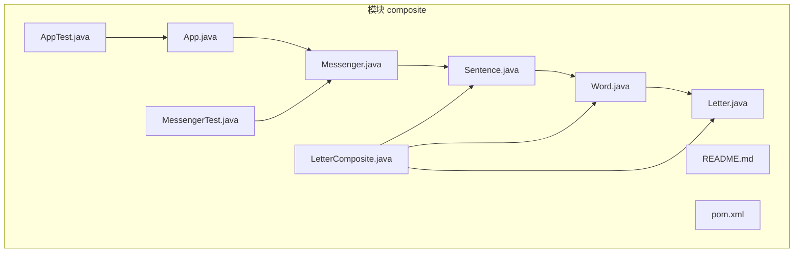
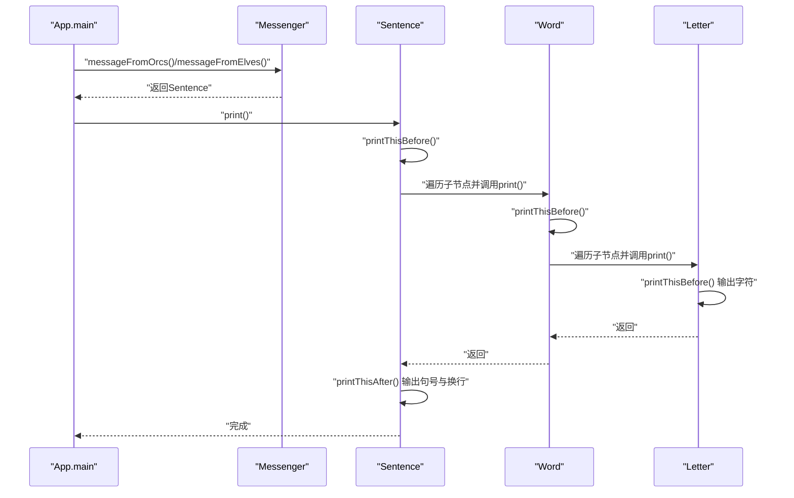
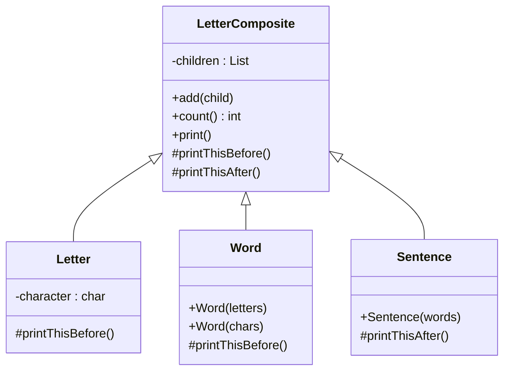
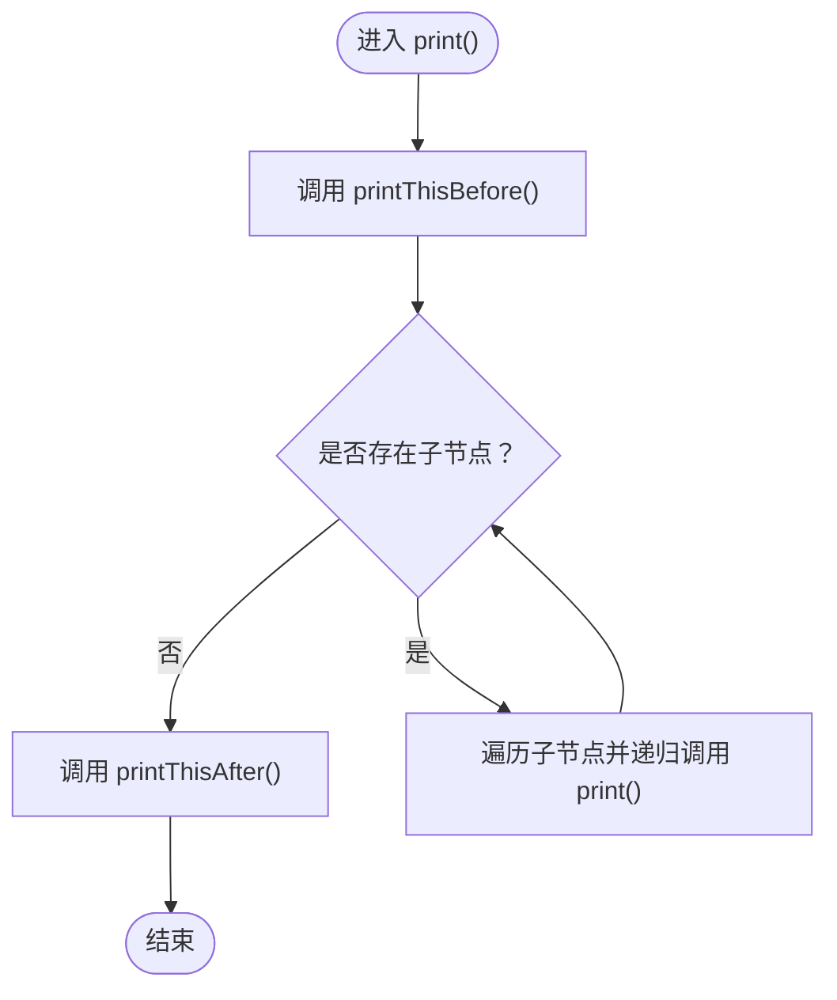
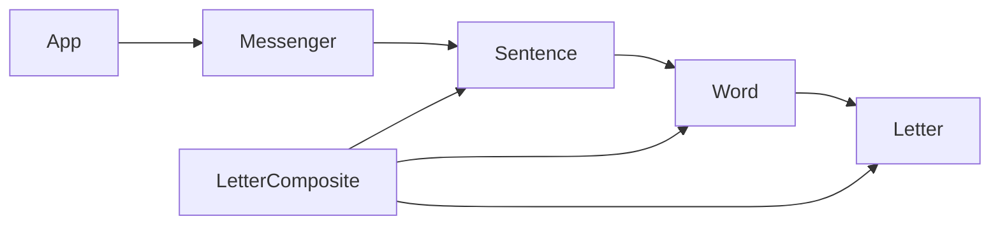

# 组合模式

<cite>
**本文引用的文件**
- [App.java](file://composite/src/main/java/com/iluwatar/composite/App.java)
- [LetterComposite.java](file://composite/src/main/java/com/iluwatar/composite/LetterComposite.java)
- [Letter.java](file://composite/src/main/java/com/iluwatar/composite/Letter.java)
- [Word.java](file://composite/src/main/java/com/iluwatar/composite/Word.java)
- [Sentence.java](file://composite/src/main/java/com/iluwatar/composite/Sentence.java)
- [Messenger.java](file://composite/src/main/java/com/iluwatar/composite/Messenger.java)
- [AppTest.java](file://composite/src/test/java/com/iluwatar/composite/AppTest.java)
- [MessengerTest.java](file://composite/src/test/java/com/iluwatar/composite/MessengerTest.java)
- [README.md](file://composite/README.md)
- [pom.xml](file://composite/pom.xml)
</cite>

## 目录
1. [引言](#引言)
2. [项目结构](#项目结构)
3. [核心组件](#核心组件)
4. [架构总览](#架构总览)
5. [详细组件分析](#详细组件分析)
6. [依赖关系分析](#依赖关系分析)
7. [性能考量](#性能考量)
8. [故障排查指南](#故障排查指南)
9. [结论](#结论)
10. [附录：常见应用场景与最佳实践](#附录常见应用场景与最佳实践)

## 引言
本指南围绕组合模式（Composite）在Java中的实现展开，结合仓库中的具体示例，系统讲解如何将对象组合成树形结构以表示“部分-整体”的层次关系，并使客户端对单个对象与组合对象的使用保持一致。我们将深入解析LetterComposite的抽象设计，展示Letter、Word、Sentence如何通过组合实现递归结构；并提供完整路径级示例，说明组合模式在文件系统、GUI组件树、组织架构等场景的应用思路。最后讨论组合模式与继承的区别，以及透明性与安全性的权衡问题。

## 项目结构
该模块采用标准的分层组织：核心类位于main目录，测试类位于test目录，README提供模式说明与示例输出，pom.xml定义构建与依赖。

图表来源
- [App.java](file://composite/src/main/java/com/iluwatar/composite/App.java#L41-L58)
- [LetterComposite.java](file://composite/src/main/java/com/iluwatar/composite/LetterComposite.java#L33-L59)
- [Letter.java](file://composite/src/main/java/com/iluwatar/composite/Letter.java#L32-L41)
- [Word.java](file://composite/src/main/java/com/iluwatar/composite/Word.java#L32-L55)
- [Sentence.java](file://composite/src/main/java/com/iluwatar/composite/Sentence.java#L32-L45)
- [Messenger.java](file://composite/src/main/java/com/iluwatar/composite/Messenger.java#L32-L67)
- [AppTest.java](file://composite/src/test/java/com/iluwatar/composite/AppTest.java#L33-L46)
- [MessengerTest.java](file://composite/src/test/java/com/iluwatar/composite/MessengerTest.java#L39-L112)
- [README.md](file://composite/README.md#L1-L219)
- [pom.xml](file://composite/pom.xml#L28-L62)

章节来源
- [README.md](file://composite/README.md#L1-L219)
- [pom.xml](file://composite/pom.xml#L28-L62)

## 核心组件
- 抽象构件：LetterComposite
  - 职责：统一管理子节点集合，提供添加、计数、打印等通用能力；通过模板方法printThisBefore/printThisAfter控制打印前后行为。
  - 关键点：内部持有children列表，print()方法先调用printThisBefore，再遍历子节点递归print，最后调用printThisAfter，形成稳定的递归打印流程。
- 叶子构件：Letter
  - 职责：字符级别的叶子节点，仅在打印前输出自身字符。
- 中间构件：Word、Sentence
  - 职责：Word负责在打印前输出空格；Sentence负责在打印后输出句号与换行。
- 消息器：Messenger
  - 职责：构造由Word组成的Sentence，分别模拟“兽人消息”和“精灵消息”，体现组合结构的可复用性。
- 应用入口：App
  - 职责：演示客户端如何统一调用print()，不区分是单个Letter还是由多层组合构成的Sentence。

章节来源
- [LetterComposite.java](file://composite/src/main/java/com/iluwatar/composite/LetterComposite.java#L33-L59)
- [Letter.java](file://composite/src/main/java/com/iluwatar/composite/Letter.java#L32-L41)
- [Word.java](file://composite/src/main/java/com/iluwatar/composite/Word.java#L32-L55)
- [Sentence.java](file://composite/src/main/java/com/iluwatar/composite/Sentence.java#L32-L45)
- [Messenger.java](file://composite/src/main/java/com/iluwatar/composite/Messenger.java#L32-L67)
- [App.java](file://composite/src/main/java/com/iluwatar/composite/App.java#L29-L58)

## 架构总览
下图展示了从应用入口到具体打印的调用链路，体现了客户端与组合结构的解耦。

图表来源
- [App.java](file://composite/src/main/java/com/iluwatar/composite/App.java#L48-L57)
- [Messenger.java](file://composite/src/main/java/com/iluwatar/composite/Messenger.java#L34-L65)
- [Sentence.java](file://composite/src/main/java/com/iluwatar/composite/Sentence.java#L32-L45)
- [Word.java](file://composite/src/main/java/com/iluwatar/composite/Word.java#L32-L55)
- [Letter.java](file://composite/src/main/java/com/iluwatar/composite/Letter.java#L32-L41)

## 详细组件分析

### 抽象构件：LetterComposite
- 设计要点
  - 使用List<LetterComposite>维护子节点，支持递归组合。
  - 提供add(count)用于构建树形结构。
  - print()采用模板方法：先printThisBefore，再遍历子节点递归print，最后printThisAfter，确保打印顺序与格式可控。
- 复杂度
  - 添加子节点：O(1)摊还。
  - 打印：O(N)，N为节点总数（按边遍历）。
- 错误处理
  - 未显式校验空指针，但add时传入null会抛出异常；建议在业务层避免传入null。
- 性能影响
  - 递归深度受树高影响；对于极深结构需注意栈溢出风险。

章节来源
- [LetterComposite.java](file://composite/src/main/java/com/iluwatar/composite/LetterComposite.java#L33-L59)

### 叶子构件：Letter
- 设计要点
  - 仅保存字符，覆盖printThisBefore输出该字符。
- 复杂度
  - 打印O(1)。
- 边界情况
  - 字符可能为空格、标点或普通字母，均以字符形式输出。

章节来源
- [Letter.java](file://composite/src/main/java/com/iluwatar/composite/Letter.java#L32-L41)

### 中间构件：Word
- 设计要点
  - 支持两种构造方式：接收字符数组或Letter列表；前者逐个包装为Letter加入。
  - 覆盖printThisBefore输出前置空格，形成单词间的分隔。
- 复杂度
  - 构造：O(k)，k为字符数量。
  - 打印：O(k)（递归遍历k个Letter）。

章节来源
- [Word.java](file://composite/src/main/java/com/iluwatar/composite/Word.java#L32-L55)

### 中间构件：Sentence
- 设计要点
  - 接收Word列表，逐个加入作为子节点。
  - 覆盖printThisAfter输出句号与换行，形成完整句子。
- 复杂度
  - 构造：O(w)，w为单词数量。
  - 打印：O(N)，N为整句字符数。

章节来源
- [Sentence.java](file://composite/src/main/java/com/iluwatar/composite/Sentence.java#L32-L45)

### 消息器：Messenger
- 设计要点
  - 提供messageFromOrcs与messageFromElves两类消息构造，分别返回Sentence。
  - 展示了组合模式在业务层的复用：Sentence由Word组成，Word由Letter组成，客户端无需感知层级差异。
- 测试验证
  - MessengerTest通过count断言组合结构的单词数量，并通过捕获System.out验证输出格式。

章节来源
- [Messenger.java](file://composite/src/main/java/com/iluwatar/composite/Messenger.java#L32-L67)
- [MessengerTest.java](file://composite/src/test/java/com/iluwatar/composite/MessengerTest.java#L72-L110)

### 应用入口：App
- 设计要点
  - 仅负责调用Messenger构造消息并统一打印，体现客户端对组合结构的透明使用。
- 运行效果
  - 控制台输出两条完整句子，分别来自兽人与精灵的消息。

章节来源
- [App.java](file://composite/src/main/java/com/iluwatar/composite/App.java#L41-L58)

### 类关系图

图表来源
- [LetterComposite.java](file://composite/src/main/java/com/iluwatar/composite/LetterComposite.java#L33-L59)
- [Letter.java](file://composite/src/main/java/com/iluwatar/composite/Letter.java#L32-L41)
- [Word.java](file://composite/src/main/java/com/iluwatar/composite/Word.java#L32-L55)
- [Sentence.java](file://composite/src/main/java/com/iluwatar/composite/Sentence.java#L32-L45)

### 打印流程算法图

图表来源
- [LetterComposite.java](file://composite/src/main/java/com/iluwatar/composite/LetterComposite.java#L54-L58)

## 依赖关系分析
- 模块依赖
  - 测试引擎：JUnit Jupiter Engine（测试）
  - 构建插件：maven-assembly-plugin配置主类，便于打包运行
- 内部依赖
  - App依赖Messenger
  - Messenger依赖Sentence
  - Sentence依赖Word
  - Word依赖Letter
  - LetterComposite被三者共同继承

图表来源
- [App.java](file://composite/src/main/java/com/iluwatar/composite/App.java#L48-L57)
- [Messenger.java](file://composite/src/main/java/com/iluwatar/composite/Messenger.java#L34-L65)
- [Sentence.java](file://composite/src/main/java/com/iluwatar/composite/Sentence.java#L32-L45)
- [Word.java](file://composite/src/main/java/com/iluwatar/composite/Word.java#L32-L55)
- [Letter.java](file://composite/src/main/java/com/iluwatar/composite/Letter.java#L32-L41)
- [LetterComposite.java](file://composite/src/main/java/com/iluwatar/composite/LetterComposite.java#L33-L59)
- [pom.xml](file://composite/pom.xml#L36-L42)

章节来源
- [pom.xml](file://composite/pom.xml#L36-L42)

## 性能考量
- 时间复杂度
  - 打印操作为O(N)，N为树中节点总数；递归遍历所有子节点。
- 空间复杂度
  - 递归调用栈深度等于树高；极端情况下可能导致栈溢出。
- 优化建议
  - 对于超深结构，可考虑迭代式遍历替代递归。
  - 在频繁构造场景下，优先使用字符数组构造Word，减少中间对象创建。
- 可扩展性
  - 新增节点类型只需继承LetterComposite并覆盖print前后钩子，不影响现有客户端。

[本节为通用指导，不直接分析具体文件]

## 故障排查指南
- 常见问题
  - 输出格式异常：检查Sentence的printThisAfter与Word的printThisBefore是否覆盖正确。
  - 单元测试失败：MessengerTest通过捕获System.out进行断言，若输出不匹配，检查构造消息的单词序列与空格/句号逻辑。
- 定位方法
  - 使用MessengerTest中的setUp/tearDown临时替换System.out，断言输出字符串与预期一致。
  - 在App中分别打印两段消息，观察句末句号与换行是否出现。
- 修复建议
  - 确保Sentence在printThisAfter中输出句号与换行。
  - 确保Word在printThisBefore中输出空格，避免单词粘连。

章节来源
- [MessengerTest.java](file://composite/src/test/java/com/iluwatar/composite/MessengerTest.java#L55-L110)
- [App.java](file://composite/src/main/java/com/iluwatar/composite/App.java#L48-L57)

## 结论
组合模式通过统一接口将单个对象与组合对象同等对待，非常适合表达“部分-整体”的层次结构。本示例以LetterComposite为核心，利用模板方法与递归打印，清晰地实现了从字符到单词再到句子的树形结构。在实际工程中，应关注递归深度与格式控制，合理选择透明性与安全性策略，并通过测试保障输出一致性。

[本节为总结性内容，不直接分析具体文件]

## 附录：常见应用场景与最佳实践

### 典型场景
- 文件系统：目录可包含文件与其他目录，统一遍历与统计。
- GUI组件树：容器可包含按钮、标签、面板等，统一布局与事件传播。
- 组织架构：部门可包含子部门与员工，统一计算成本或权限。

### 透明性 vs 安全性
- 透明性：客户端无需区分单个对象与组合对象，简化调用。
- 安全性：限制某些节点只能作为叶子或中间节点，避免错误组合。
- 实践建议
  - 通过构造函数参数类型与add方法签名约束子节点类型。
  - 在printThisBefore/After中增加校验，拒绝非法操作。
  - 对于必须严格限制的场景，可引入访问控制或工厂方法。

### 与继承的区别
- 继承：通过父类方法共享行为，但难以表达“部分-整体”的树形关系。
- 组合：通过对象聚合表达树形结构，更灵活且易于扩展新节点类型。

### 代码级示例路径
- 组合结构构建与打印
  - [App.java](file://composite/src/main/java/com/iluwatar/composite/App.java#L48-L57)
  - [Messenger.java](file://composite/src/main/java/com/iluwatar/composite/Messenger.java#L34-L65)
  - [Sentence.java](file://composite/src/main/java/com/iluwatar/composite/Sentence.java#L32-L45)
  - [Word.java](file://composite/src/main/java/com/iluwatar/composite/Word.java#L32-L55)
  - [Letter.java](file://composite/src/main/java/com/iluwatar/composite/Letter.java#L32-L41)
- 测试验证
  - [MessengerTest.java](file://composite/src/test/java/com/iluwatar/composite/MessengerTest.java#L72-L110)
  - [AppTest.java](file://composite/src/test/java/com/iluwatar/composite/AppTest.java#L42-L45)

章节来源
- [README.md](file://composite/README.md#L179-L219)