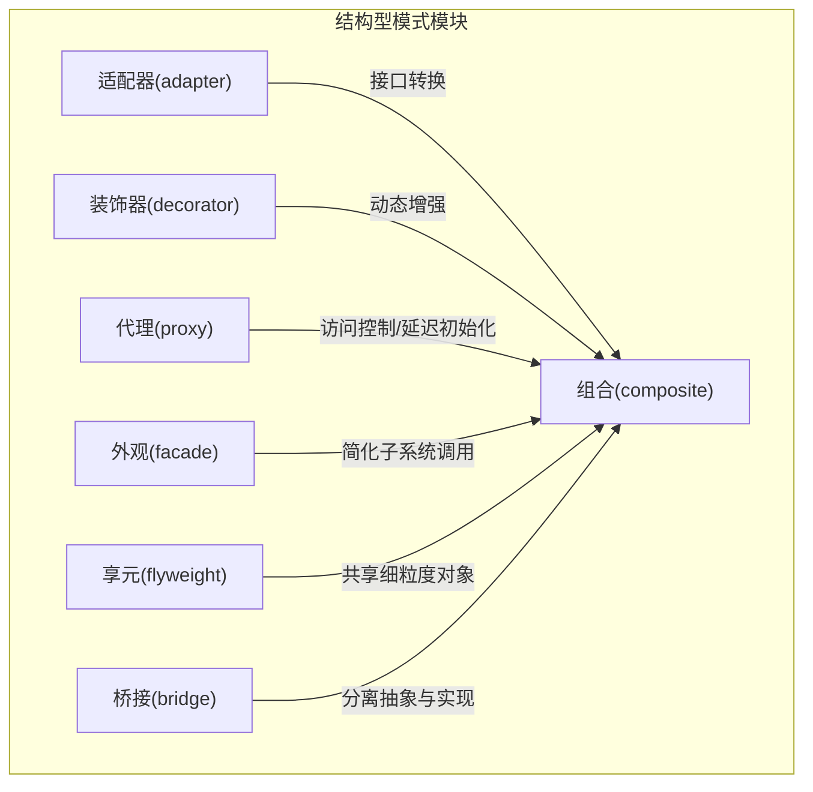
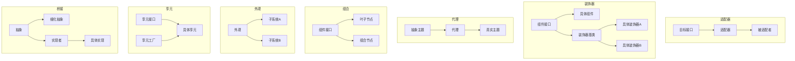
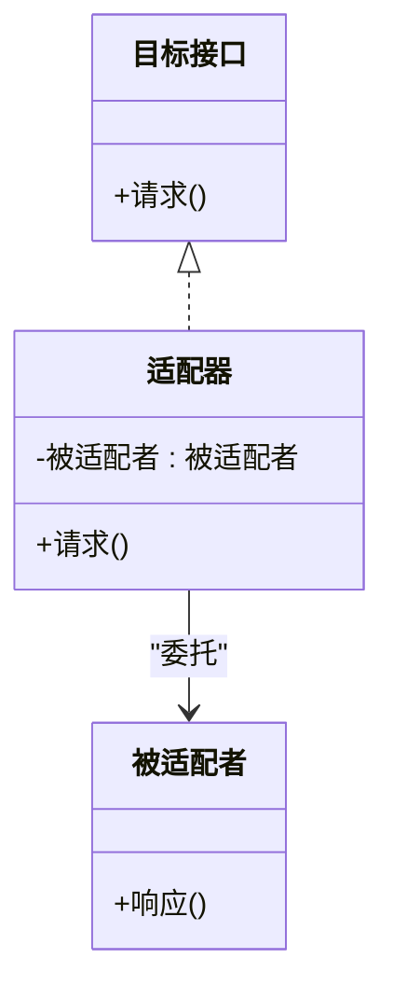
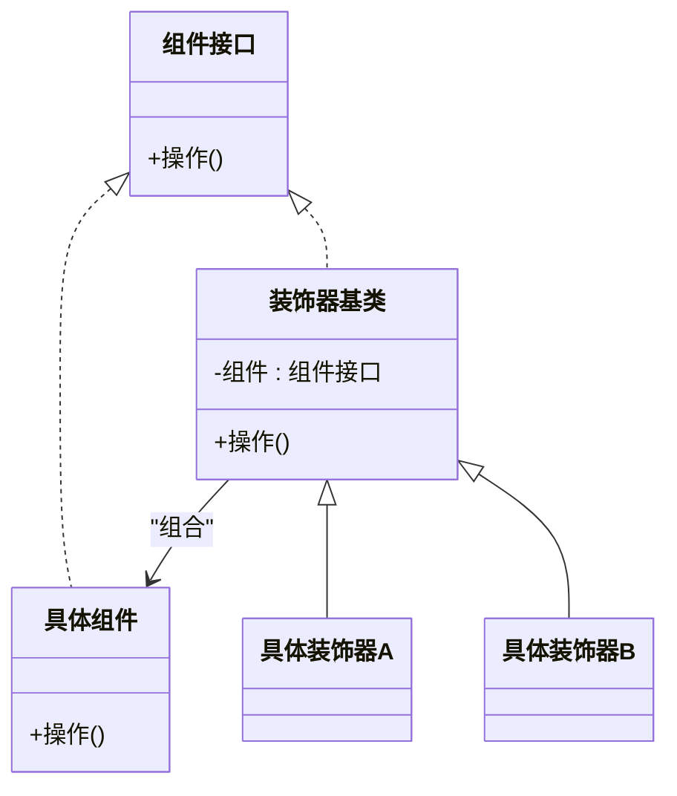
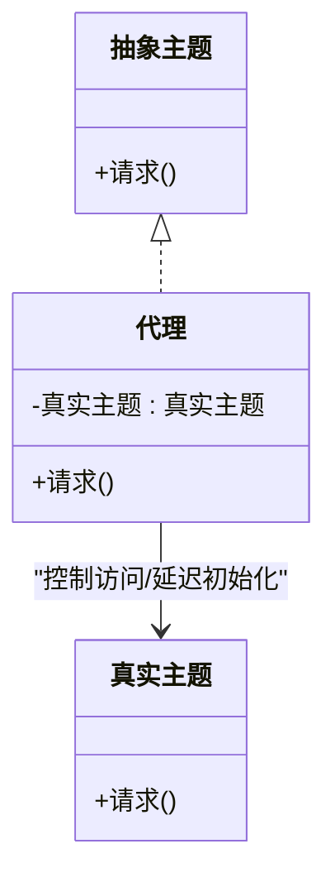
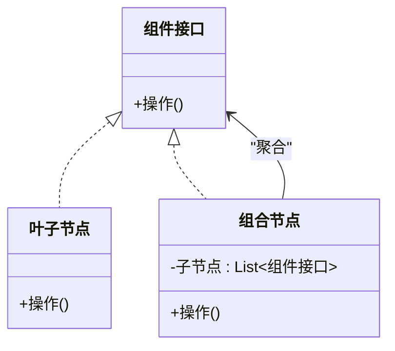
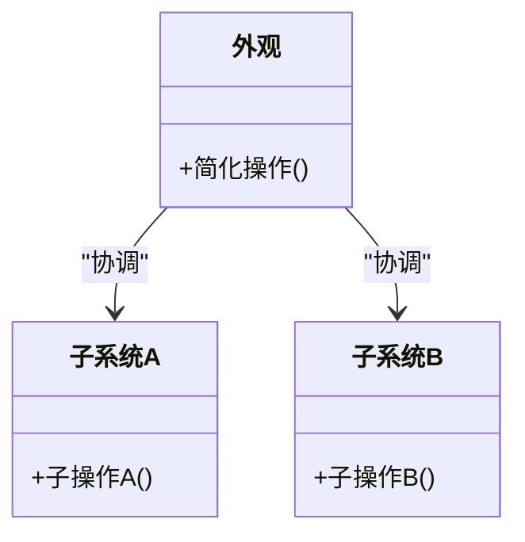
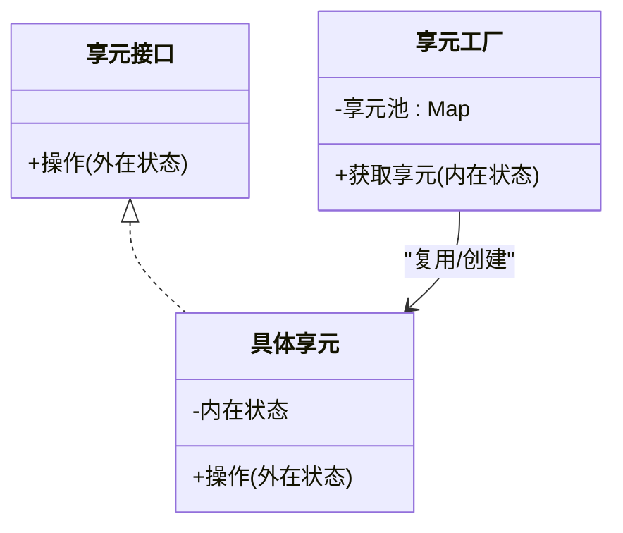
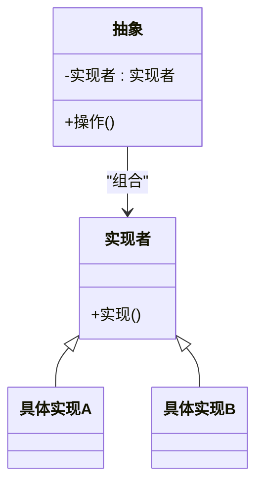
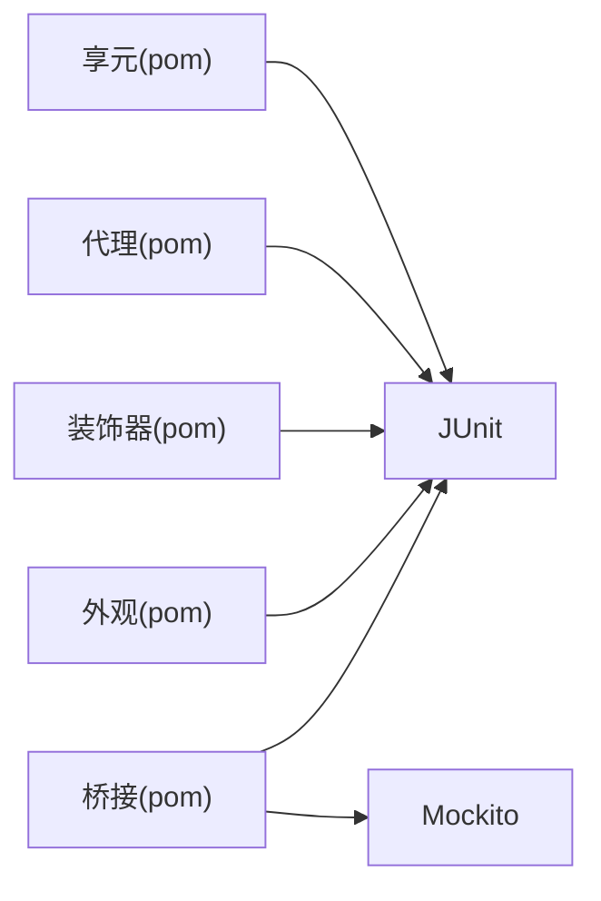

# 结构型模式

<cite>
**本文引用的文件**
- [README.md](file://adapter/README.md)
- [AdapterPatternTest.java](file://adapter/src/test/java/com/iluwatar/adapter/AdapterPatternTest.java)
- [AppTest.java](file://adapter/src/test/java/com/iluwatar/adapter/AppTest.java)
- [README.md](file://decorator/README.md)
- [README.md](file://proxy/README.md)
- [README.md](file://composite/README.md)
- [README.md](file://facade/README.md)
- [README.md](file://flyweight/README.md)
- [README.md](file://bridge/README.md)
- [pom.xml](file://bridge/pom.xml)
- [pom.xml](file://facade/pom.xml)
- [pom.xml](file://decorator/pom.xml)
- [pom.xml](file://proxy/pom.xml)
- [pom.xml](file://flyweight/pom.xml)
</cite>

## 目录
1. [引言](#引言)
2. [项目结构](#项目结构)
3. [核心组件](#核心组件)
4. [架构总览](#架构总览)
5. [详细组件分析](#详细组件分析)
6. [依赖分析](#依赖分析)
7. [性能考量](#性能考量)
8. [故障排查指南](#故障排查指南)
9. [结论](#结论)
10. [附录](#附录)

## 引言
本学习指南聚焦于七种经典的结构型设计模式：适配器、装饰器、代理、组合、外观、享元与桥接。我们将从“结构图解、类图分析、核心组件职责、实现策略对比、性能考量与内存优化”五个维度，系统阐述这些模式如何化解复杂对象关系、提升系统的可扩展性与可维护性，并通过仓库中的真实示例路径帮助读者快速定位到可运行的代码与测试。

## 项目结构
本仓库采用多模块组织，每个模式独立为一个Maven模块，包含示例代码、单元测试与文档。以下为本次涉及的结构型模式模块与关键文件：

- 适配器（adapter）
  - 文档与示例：README.md
  - 测试：AdapterPatternTest.java、AppTest.java
- 装饰器（decorator）
  - 文档与示例：README.md
  - 构建配置：pom.xml
- 代理（proxy）
  - 文档与示例：README.md
  - 构建配置：pom.xml
- 组合（composite）
  - 文档与示例：README.md
- 外观（facade）
  - 文档与示例：README.md
  - 构建配置：pom.xml
- 享元（flyweight）
  - 文档与示例：README.md
  - 构建配置：pom.xml
- 桥接（bridge）
  - 文档与示例：README.md
  - 构建配置：pom.xml

**章节来源**
- file://adapter/README.md#L107-L142
- file://decorator/README.md#L1-L186
- file://proxy/README.md#L36-L174
- file://composite/README.md#L1-L219
- file://facade/README.md#L1-L235
- file://flyweight/README.md#L37-L207
- file://bridge/README.md#L39-L241

## 核心组件
- 适配器（Adapter）
  - 角色：目标接口、被适配者、适配器（类适配器/对象适配器）
  - 关键职责：将不兼容接口转换为客户端期望的统一接口；在第三方库集成中充当解耦中间层
  - 策略对比：类适配器强绑定具体被适配类但可覆写行为；对象适配器可适配父类及其所有子类，便于批量扩展
- 装饰器（Decorator）
  - 角色：组件接口、具体组件、装饰器基类与具体装饰器
  - 关键职责：在不修改原有对象的前提下，动态叠加职责；避免类爆炸
  - 策略对比：与组合的区别在于装饰器强调“职责叠加”，而非“聚合容器”
- 代理（Proxy）
  - 角色：抽象主题、真实主题、代理
  - 关键职责：控制对真实对象的访问，支持懒加载、日志、远程代理、保护代理等
  - 策略对比：静态代理需编译期生成；动态代理通过反射在运行时生成代理类
- 组合（Composite）
  - 角色：组件接口、叶子节点、组合节点
  - 关键职责：统一处理单个对象与对象组合，支持树形结构的递归操作
  - 策略对比：优先使用组合优于继承，以获得更好的扩展性
- 外观（Facade）
  - 角色：外观类、子系统类群
  - 关键职责：为复杂子系统提供统一入口，降低耦合并简化API
- 享元（Flyweight）
  - 角色：享元接口、具体享元、享元工厂
  - 关键职责：通过共享细粒度对象减少内存占用；区分内在状态与外在状态
- 桥接（Bridge）
  - 角色：抽象、细化抽象、实现者、具体实现
  - 关键职责：分离抽象与实现，使二者可独立扩展；避免类层次爆炸

**章节来源**
- file://adapter/README.md#L107-L142
- file://decorator/README.md#L20-L37
- file://proxy/README.md#L36-L76
- file://composite/README.md#L19-L36
- file://facade/README.md#L18-L35
- file://flyweight/README.md#L37-L73
- file://bridge/README.md#L39-L60

## 架构总览
下图展示了七个模式在“对象关系与职责分配”上的共性与差异，以及它们如何协同提升系统的可扩展性与可维护性。

**图表来源**
- file://adapter/README.md#L107-L142
- file://decorator/README.md#L20-L37
- file://proxy/README.md#L36-L76
- file://composite/README.md#L19-L36
- file://facade/README.md#L18-L35
- file://flyweight/README.md#L37-L73
- file://bridge/README.md#L39-L60

## 详细组件分析

### 适配器模式（Adapter）
- 结构图解与类图
  - 类适配器：通过多重继承（或在支持的语言中）将目标接口与被适配者对接
  - 对象适配器：通过组合持有被适配者实例，实现接口转换
- 核心组件职责
  - 目标接口：定义客户端使用的统一方法签名
  - 适配器：实现目标接口并内部委托给被适配者
  - 被适配者：已有功能实现，但接口不兼容
- 实现策略对比
  - 类适配器：强绑定具体类，易覆写但扩展受限
  - 对象适配器：可适配父类及子类集合，扩展灵活
- 性能与内存
  - 仅引入一层间接调用，开销极低；注意避免过度嵌套导致栈深增加
- 应用场景
  - 第三方库集成、遗留系统对接、GUI组件适配、IO流包装

**图表来源**
- file://adapter/README.md#L107-L142

**章节来源**
- file://adapter/README.md#L107-L142
- file://adapter/src/test/java/com/iluwatar/adapter/AdapterPatternTest.java#L67-L78
- file://adapter/src/test/java/com/iluwatar/adapter/AppTest.java#L41-L46

### 装饰器模式（Decorator）
- 结构图解与类图
  - 组件接口定义统一能力；具体组件提供基础实现；装饰器通过组合持有组件并在其前后附加行为
- 核心组件职责
  - 组件接口：统一对外能力
  - 具体组件：提供默认行为
  - 装饰器：在不改变接口的前提下，动态叠加职责
- 实现策略对比
  - 与组合的区别：装饰器强调“职责叠加”，组合强调“整体-部分”
  - 与策略的区别：装饰器在运行时叠加行为，策略在运行时切换算法
- 性能与内存
  - 动态叠加带来小量对象数量增长；可通过装饰链长度控制与缓存装饰器实例优化
- 应用场景
  - IO流包装、GUI组件增强、权限/日志/缓存横切关注点

**图表来源**
- file://decorator/README.md#L20-L37

**章节来源**
- file://decorator/README.md#L20-L37
- file://decorator/README.md#L136-L144
- file://decorator/README.md#L157-L170

### 代理模式（Proxy）
- 结构图解与类图
  - 抽象主题定义对外接口；代理持有真实主题引用，在调用前后执行额外逻辑
- 核心组件职责
  - 抽象主题：统一对外接口
  - 代理：控制访问、延迟初始化、远程代理、保护代理、虚拟代理
  - 真实主题：核心业务实现
- 实现策略对比
  - 静态代理：编译期生成代理类，简单直接，但类爆炸
  - 动态代理：运行时生成代理类，复用性强，适合大量相似代理场景
- 性能与内存
  - 动态代理引入反射开销；可通过缓存代理类与参数类型映射降低重复生成成本
- 应用场景
  - 远程服务代理、数据库连接池、安全控制、懒加载大对象

**图表来源**
- file://proxy/README.md#L36-L76

**章节来源**
- file://proxy/README.md#L36-L76
- file://proxy/README.md#L128-L138
- file://proxy/README.md#L149-L161

### 组合模式（Composite）
- 结构图解与类图
  - 组件接口统一叶子与组合节点；叶子节点无子节点；组合节点持有子节点列表
- 核心组件职责
  - 组件接口：声明统一操作
  - 叶子节点：不可再分的终端对象
  - 组合节点：聚合子节点并转发操作
- 实现策略对比
  - 优先使用组合优于继承，以获得一致的遍历与操作体验
- 性能与内存
  - 树形遍历的时间复杂度与深度相关；可通过缓存计算结果与限制层级深度优化
- 应用场景
  - 文件系统、菜单树、组织架构、GUI容器

**图表来源**
- file://composite/README.md#L19-L36

**章节来源**
- file://composite/README.md#L19-L36
- file://composite/README.md#L179-L185
- file://composite/README.md#L194-L204

### 外观模式（Facade）
- 结构图解与类图
  - 外观类提供简化的统一入口；内部协调多个子系统类
- 核心组件职责
  - 外观：封装子系统复杂度，提供高层API
  - 子系统：各自完成特定领域任务
- 实现策略对比
  - 避免“上帝对象”；按子系统分层定义外观，保持单一职责
- 性能与内存
  - 通过外观集中初始化与资源管理，减少客户端分散调用带来的重复开销
- 应用场景
  - 复杂SDK封装、框架门面、模块化系统入口

**图表来源**
- file://facade/README.md#L18-L35

**章节来源**
- file://facade/README.md#L18-L35
- file://facade/README.md#L202-L210
- file://facade/README.md#L223-L235

### 享元模式（Flyweight）
- 结构图解与类图
  - 享元接口定义共享能力；具体享元保存内在状态；享元工厂负责共享实例的创建与复用
- 核心组件职责
  - 享元：保存内在状态，行为尽量无副作用
  - 享元工厂：管理共享池，返回可复用实例
- 实现策略对比
  - 区分内在状态与外在状态；外在状态由上下文传入
- 性能与内存
  - 显著降低对象数量与内存占用；注意同步与一致性管理
- 应用场景
  - 字符串驻留、图形字体缓存、线程池对象复用

**图表来源**
- file://flyweight/README.md#L37-L73

**章节来源**
- file://flyweight/README.md#L37-L73
- file://flyweight/README.md#L181-L190
- file://flyweight/README.md#L197-L207

### 桥接模式（Bridge）
- 结构图解与类图
  - 抽象与实现分离：抽象定义高层控制；实现者定义底层能力；两者通过组合关联
- 核心组件职责
  - 抽象：面向用户的功能入口
  - 实现者：平台/设备等底层能力
- 实现策略对比
  - 与适配器区别：适配器改的是接口，桥接分离的是抽象与实现
- 性能与内存
  - 增加一层间接调用，通常可忽略；通过共享实现减少对象数量
- 应用场景
  - GUI跨平台、数据库驱动、设备驱动

**图表来源**
- file://bridge/README.md#L39-L60

**章节来源**
- file://bridge/README.md#L39-L60
- file://bridge/README.md#L210-L219
- file://bridge/README.md#L230-L241

## 依赖分析
- 模块间关系
  - 各模式模块相互独立，均通过各自的pom.xml定义测试与打包插件
  - 示例运行入口集中在各模块的App主类（如bridge、facade、decorator、proxy、flyweight的pom中声明了主类）
- 测试依赖
  - 适配器模块：使用JUnit与Mockito进行行为验证
  - 装饰器、代理、桥接、享元、外观模块：均包含对应的测试与构建配置

**图表来源**
- file://bridge/pom.xml#L36-L47
- file://facade/pom.xml#L36-L42
- file://decorator/pom.xml#L36-L47
- file://proxy/pom.xml#L36-L47
- file://flyweight/pom.xml#L36-L42

**章节来源**
- file://bridge/pom.xml#L36-L47
- file://facade/pom.xml#L36-L42
- file://decorator/pom.xml#L36-L47
- file://proxy/pom.xml#L36-L47
- file://flyweight/pom.xml#L36-L42

## 性能考量
- 通用原则
  - 减少间接调用层级，避免过深的装饰链或代理链
  - 在动态代理与反射场景，考虑缓存代理类与参数类型映射
  - 享元模式通过共享内在状态显著降低内存占用，但需注意外在状态传递与一致性
  - 外观模式通过集中初始化与资源管理减少客户端分散调用的重复开销
- 模式特有建议
  - 适配器：仅在必要处引入，避免过度适配导致调用链冗长
  - 装饰器：控制装饰器数量与嵌套深度，必要时合并相近职责
  - 代理：对频繁调用的方法考虑缓存结果或延迟计算
  - 组合：对深层树形结构考虑迭代遍历替代递归，或引入缓存节点结果
  - 桥接：在实现者选择上避免频繁切换，必要时引入实现缓存

[本节为通用指导，无需列出具体文件来源]

## 故障排查指南
- 适配器
  - 症状：客户端调用失败或行为异常
  - 排查：确认适配器是否正确实现了目标接口；检查委托调用顺序与参数传递
  - 测试参考：适配器测试用例验证客户端调用最终委托到被适配者
- 装饰器
  - 症状：装饰后行为不符合预期
  - 排查：确认装饰器顺序；检查装饰器是否正确转发基础行为
- 代理
  - 症状：访问控制或懒加载未生效
  - 排查：确认代理拦截逻辑与真实主题初始化时机
- 组合
  - 症状：遍历或操作异常
  - 排查：确保叶子节点与组合节点遵循统一接口；检查子节点集合管理
- 外观
  - 症状：外观成为“上帝对象”
  - 排查：拆分外观，按子系统分层定义入口
- 享元
  - 症状：并发冲突或状态错乱
  - 排查：确保内在状态不可变；外在状态由上下文传入且线程安全
- 桥接
  - 症状：抽象与实现耦合未达预期
  - 排查：确认抽象与实现通过组合解耦；避免在抽象中硬编码实现细节

**章节来源**
- file://adapter/src/test/java/com/iluwatar/adapter/AdapterPatternTest.java#L67-L78
- file://adapter/src/test/java/com/iluwatar/adapter/AppTest.java#L41-L46

## 结论
结构型模式通过“对象关系重组”解决复杂系统的可扩展性与可维护性问题。适配器与桥接侧重“接口与实现”的解耦；装饰器与组合强调“职责叠加与整体-部分”的统一；代理与外观提供“访问控制与简化入口”；享元通过“共享内在状态”优化内存。结合测试与构建配置，读者可在本仓库中快速定位到对应示例与验证路径，深入理解各模式在工程实践中的权衡与取舍。

[本节为总结性内容，无需列出具体文件来源]

## 附录
- 快速定位示例与测试
  - 适配器：README.md、AdapterPatternTest.java、AppTest.java
  - 装饰器：README.md、pom.xml
  - 代理：README.md、pom.xml
  - 组合：README.md
  - 外观：README.md、pom.xml
  - 享元：README.md、pom.xml
  - 桥接：README.md、pom.xml

[本节为导航性内容，无需列出具体文件来源]