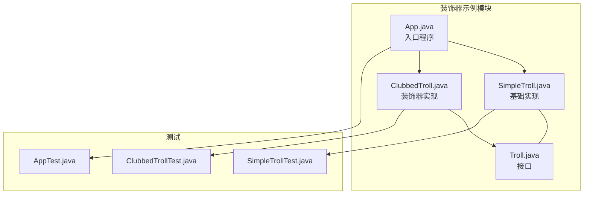
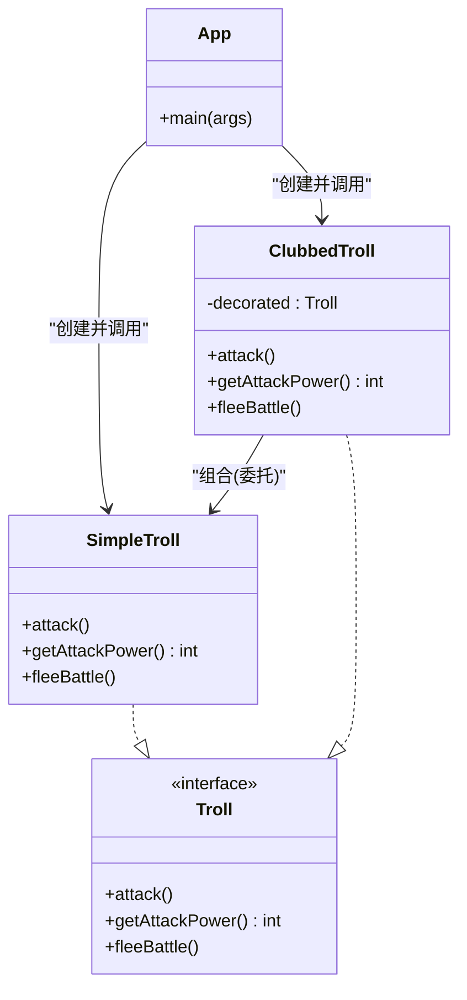
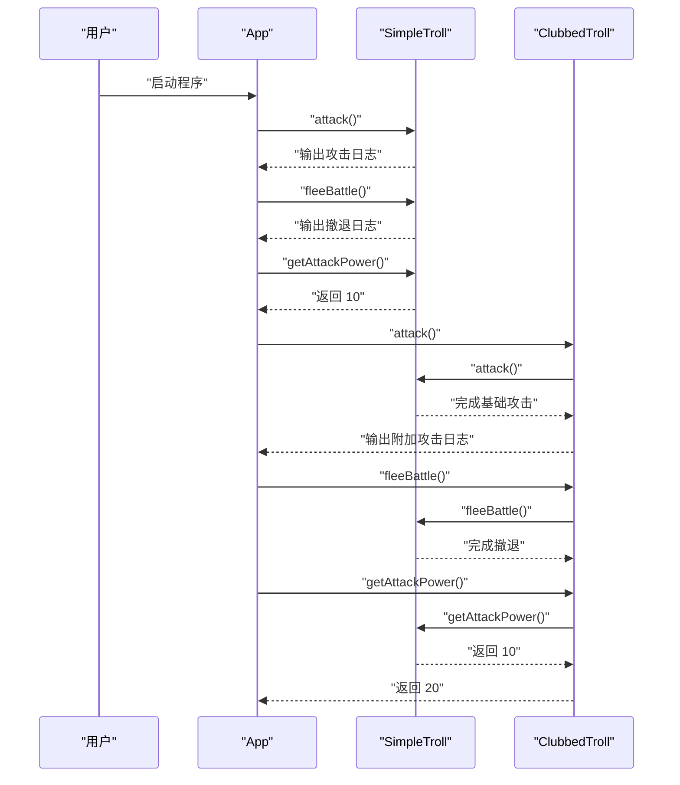
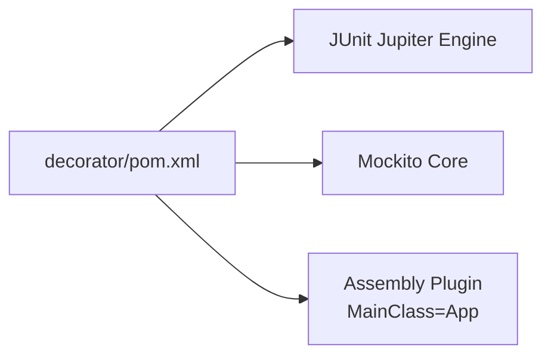

# 装饰器模式

<cite>
**本文引用的文件**   
- [App.java](file://decorator/src/main/java/com/iluwatar/decorator/App.java)
- [Troll.java](file://decorator/src/main/java/com/iluwatar/decorator/Troll.java)
- [SimpleTroll.java](file://decorator/src/main/java/com/iluwatar/decorator/SimpleTroll.java)
- [ClubbedTroll.java](file://decorator/src/main/java/com/iluwatar/decorator/ClubbedTroll.java)
- [AppTest.java](file://decorator/src/test/java/com/iluwatar/decorator/AppTest.java)
- [SimpleTrollTest.java](file://decorator/src/test/java/com/iluwatar/decorator/SimpleTrollTest.java)
- [ClubbedTrollTest.java](file://decorator/src/test/java/com/iluwatar/decorator/ClubbedTrollTest.java)
- [README.md](file://decorator/README.md)
- [pom.xml](file://decorator/pom.xml)
- [decorator.urm.puml](file://decorator/etc/decorator.urm.puml)
</cite>

## 目录
1. [引言](#引言)
2. [项目结构](#项目结构)
3. [核心组件](#核心组件)
4. [架构总览](#架构总览)
5. [详细组件分析](#详细组件分析)
6. [依赖关系分析](#依赖关系分析)
7. [性能考量](#性能考量)
8. [故障排查指南](#故障排查指南)
9. [结论](#结论)
10. [附录](#附录)

## 引言
本技术指南围绕 Java 装饰器模式展开，系统讲解“在不修改原有对象结构的前提下动态为对象添加新功能”的核心思想。通过仓库中的“Troll（巨魔）”示例，深入对比 SimpleTroll 与 ClubbedTroll 的实现差异，阐明装饰器如何借助组合而非继承实现功能扩展；并结合 README 中对 I/O 流、GUI 组件增强等真实场景的说明，帮助读者建立从理论到实践的完整认知。

## 项目结构
该模块以最小可运行示例为核心，包含接口定义、具体实现、装饰器实现、入口程序与单元测试，便于理解装饰器模式的调用链与行为叠加。

图表来源
- [App.java](file://decorator/src/main/java/com/iluwatar/decorator/App.java#L47-L62)
- [SimpleTroll.java](file://decorator/src/main/java/com/iluwatar/decorator/SimpleTroll.java#L33-L49)
- [ClubbedTroll.java](file://decorator/src/main/java/com/iluwatar/decorator/ClubbedTroll.java#L35-L54)
- [Troll.java](file://decorator/src/main/java/com/iluwatar/decorator/Troll.java#L30-L38)

章节来源
- [App.java](file://decorator/src/main/java/com/iluwatar/decorator/App.java#L29-L62)
- [README.md](file://decorator/README.md#L38-L119)

## 核心组件
- 接口层：Troll 定义统一的行为契约（攻击、获取攻击力、撤退）。
- 基础实现：SimpleTroll 直接实现接口，提供默认行为与固定攻击力。
- 装饰器：ClubbedTroll 实现接口并通过组合持有被装饰对象，在调用委托方法前后叠加行为或状态变更。
- 入口程序：App 展示装饰前后的行为差异与攻击力变化。

章节来源
- [Troll.java](file://decorator/src/main/java/com/iluwatar/decorator/Troll.java#L30-L38)
- [SimpleTroll.java](file://decorator/src/main/java/com/iluwatar/decorator/SimpleTroll.java#L33-L49)
- [ClubbedTroll.java](file://decorator/src/main/java/com/iluwatar/decorator/ClubbedTroll.java#L35-L54)
- [App.java](file://decorator/src/main/java/com/iluwatar/decorator/App.java#L47-L62)

## 架构总览
下图展示了装饰器模式在本示例中的类关系与交互：App 创建 SimpleTroll 并直接调用；随后以 SimpleTroll 作为被装饰对象创建 ClubbedTroll，再次调用时 ClubbedTroll 将行为委托给被装饰对象并在其基础上扩展。

图表来源
- [decorator.urm.puml](file://decorator/etc/decorator.urm.puml#L1-L32)
- [App.java](file://decorator/src/main/java/com/iluwatar/decorator/App.java#L47-L62)
- [SimpleTroll.java](file://decorator/src/main/java/com/iluwatar/decorator/SimpleTroll.java#L33-L49)
- [ClubbedTroll.java](file://decorator/src/main/java/com/iluwatar/decorator/ClubbedTroll.java#L35-L54)
- [Troll.java](file://decorator/src/main/java/com/iluwatar/decorator/Troll.java#L30-L38)

## 详细组件分析

### 接口与基础实现
- 接口职责：Troll 明确了对外一致的行为契约，保证装饰器与被装饰对象在同一抽象层级上互换使用。
- 基础实现：SimpleTroll 提供默认攻击、固定攻击力与撤退行为，是装饰链的起点。

章节来源
- [Troll.java](file://decorator/src/main/java/com/iluwatar/decorator/Troll.java#L30-L38)
- [SimpleTroll.java](file://decorator/src/main/java/com/iluwatar/decorator/SimpleTroll.java#L33-L49)

### 装饰器实现与差异
- 组合持有：ClubbedTroll 持有被装饰的 Troll 对象，所有未覆盖的方法均委托给被装饰对象。
- 行为扩展：在攻击方法中先调用被装饰对象的攻击，再追加“挥舞大棒”的动作日志；在获取攻击力时在被装饰对象结果上加 10。
- 委托一致性：撤退方法完全委托给被装饰对象，体现装饰器只在必要点扩展行为的原则。

章节来源
- [ClubbedTroll.java](file://decorator/src/main/java/com/iluwatar/decorator/ClubbedTroll.java#L35-L54)
- [README.md](file://decorator/README.md#L73-L98)

### 执行流程与装饰链
- 单一装饰链：App 首先创建 SimpleTroll，调用攻击与撤退后打印其攻击力；随后以 SimpleTroll 为参数构造 ClubbedTroll，再次调用攻击与撤退，并打印新的攻击力。
- 调用序列如下：

图表来源
- [App.java](file://decorator/src/main/java/com/iluwatar/decorator/App.java#L47-L62)
- [SimpleTroll.java](file://decorator/src/main/java/com/iluwatar/decorator/SimpleTroll.java#L35-L48)
- [ClubbedTroll.java](file://decorator/src/main/java/com/iluwatar/decorator/ClubbedTroll.java#L40-L48)

### 测试验证
- AppTest：确保主程序可无异常执行。
- SimpleTrollTest：验证默认攻击力与日志输出数量。
- ClubbedTrollTest：验证装饰后攻击力翻倍、方法调用委托至被装饰对象且无多余交互。

章节来源
- [AppTest.java](file://decorator/src/test/java/com/iluwatar/decorator/AppTest.java#L42-L45)
- [SimpleTrollTest.java](file://decorator/src/test/java/com/iluwatar/decorator/SimpleTrollTest.java#L56-L68)
- [ClubbedTrollTest.java](file://decorator/src/test/java/com/iluwatar/decorator/ClubbedTrollTest.java#L40-L57)

### 与继承的对比与优势
- 灵活性：装饰器可在运行时动态叠加功能，而继承在编译期就固化了子类形态。
- 可组合性：多个装饰器可按需组合，形成复杂行为；继承则易导致“类爆炸”。
- 单一职责与开闭原则：装饰器仅在必要点扩展，避免修改既有类，符合开闭原则。

章节来源
- [README.md](file://decorator/README.md#L20-L36)
- [README.md](file://decorator/README.md#L136-L144)

### 在 I/O 与 GUI 场景中的应用
- I/O 流：java.io 包中的 InputStream/OutputStream/Reader/Writer 等广泛采用装饰器模式，通过层层包装实现缓冲、编码转换、计数等功能叠加。
- GUI 组件：图形界面工具包常通过装饰器为组件增加滚动条、边框、布局管理等行为，且可在运行时增删。
- Collections 工具：synchronizedXxx、unmodifiableXxx、checkedXxx 等方法返回装饰后的集合视图。

章节来源
- [README.md](file://decorator/README.md#L149-L156)

## 依赖关系分析
- 模块依赖：装饰器示例模块依赖 JUnit 与 Mockito 用于测试。
- 运行配置：Maven Assembly 插件指定主类为 App，便于打包执行。

图表来源
- [pom.xml](file://decorator/pom.xml#L36-L67)

章节来源
- [pom.xml](file://decorator/pom.xml#L36-L67)

## 性能考量
- 内存开销：每引入一层装饰器即新增一个对象实例，多层装饰会带来额外内存占用。
- 调用开销：每次方法调用都会经过装饰器的委托链，存在少量栈帧与间接调用成本；但通常可忽略不计。
- 建议：在高频路径谨慎叠加装饰器层数，必要时进行性能评估与优化。

## 故障排查指南
- 类型判断失败：装饰器与被装饰对象类型不同，若使用严格类型判断可能失败，应改用接口或行为判断。
- 配置复杂：过多小对象叠加可能导致期望配置难以达成，建议明确装饰器职责边界与组合策略。
- 日志与行为验证：可通过测试用例验证装饰器是否正确委托、是否按序执行扩展逻辑。

章节来源
- [README.md](file://decorator/README.md#L166-L170)
- [ClubbedTrollTest.java](file://decorator/src/test/java/com/iluwatar/decorator/ClubbedTrollTest.java#L40-L57)

## 结论
装饰器模式通过“组合+委托”在不破坏原有结构的前提下动态增强对象能力，特别适合需要灵活扩展与运行时切换功能的场景。SimpleTroll 与 ClubbedTroll 的实现清晰体现了装饰器的核心要点：保持接口一致、委托未覆盖方法、在关键点叠加行为。结合 I/O 与 GUI 的真实案例，读者可将该模式迁移到更广泛的系统设计中。

## 附录
- 示例输出参考：README 中提供了程序运行日志片段，可对照验证行为变化与攻击力叠加。

章节来源
- [README.md](file://decorator/README.md#L121-L134)