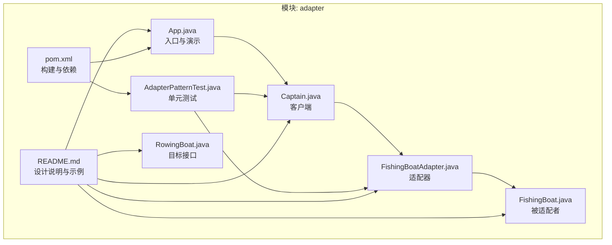
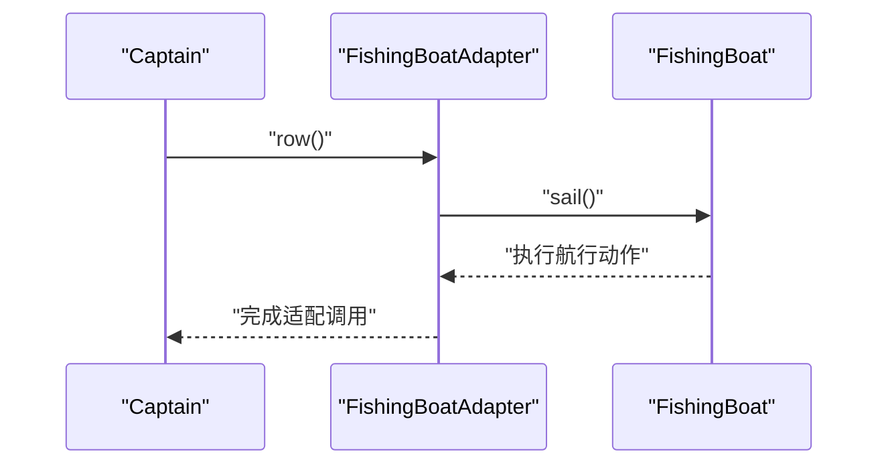
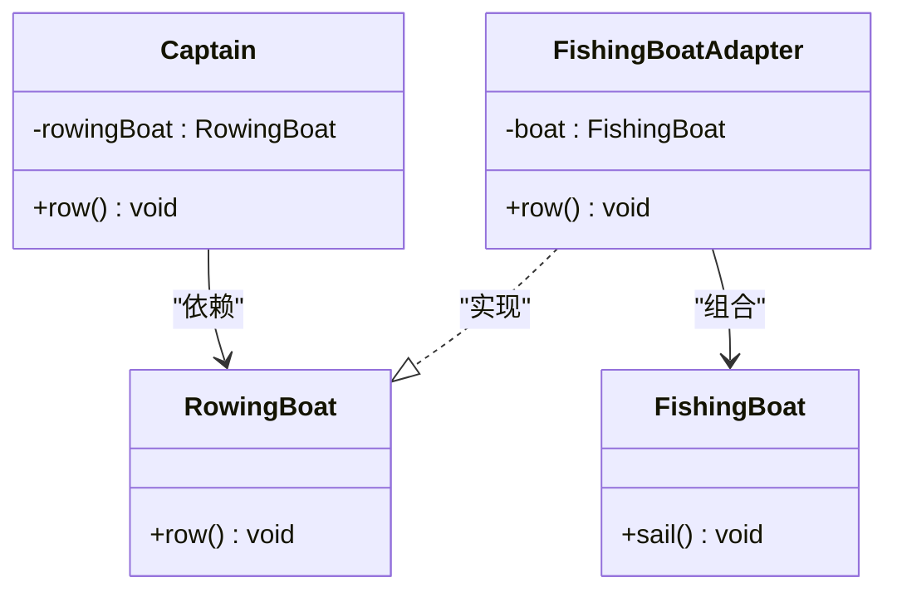
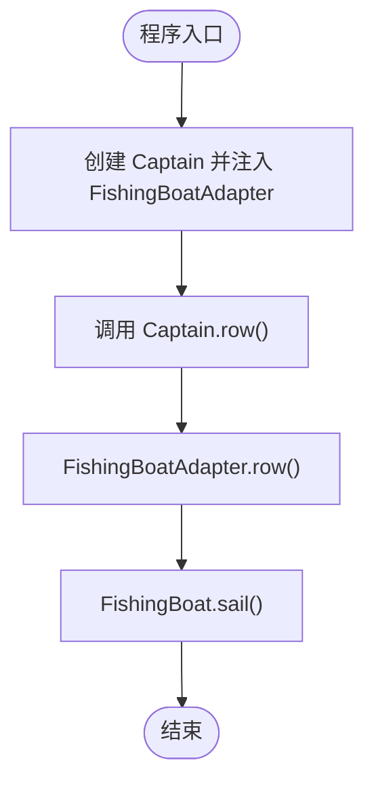
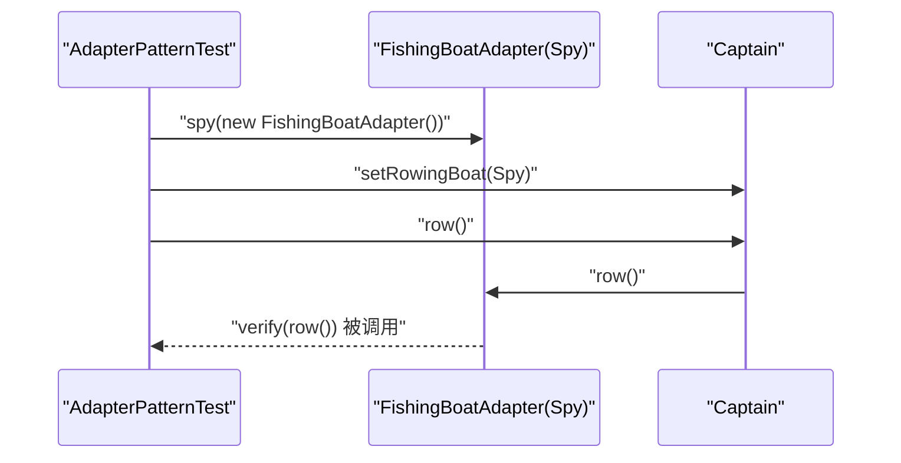
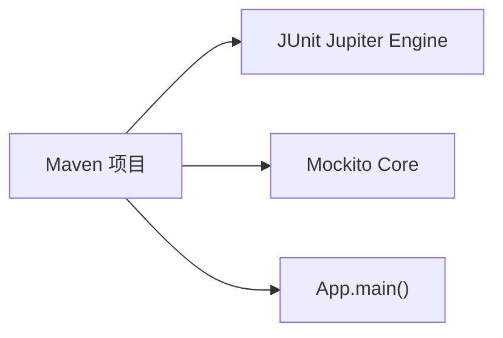

# 适配器模式

<cite>
**本文引用的文件**
- [adapter/README.md](file://adapter/README.md)
- [adapter/pom.xml](file://adapter/pom.xml)
- [adapter/src/main/java/com/iluwatar/adapter/package-info.java](file://adapter/src/main/java/com/iluwatar/adapter/package-info.java)
- [adapter/src/main/java/com/iluwatar/adapter/App.java](file://adapter/src/main/java/com/iluwatar/adapter/App.java)
- [adapter/src/main/java/com/iluwatar/adapter/Captain.java](file://adapter/src/main/java/com/iluwatar/adapter/Captain.java)
- [adapter/src/main/java/com/iluwatar/adapter/FishingBoat.java](file://adapter/src/main/java/com/iluwatar/adapter/FishingBoat.java)
- [adapter/src/main/java/com/iluwatar/adapter/FishingBoatAdapter.java](file://adapter/src/main/java/com/iluwatar/adapter/FishingBoatAdapter.java)
- [adapter/src/test/java/com/iluwatar/adapter/AdapterPatternTest.java](file://adapter/src/test/java/com/iluwatar/adapter/AdapterPatternTest.java)
</cite>

## 目录
1. [引言](#引言)
2. [项目结构](#项目结构)
3. [核心组件](#核心组件)
4. [架构总览](#架构总览)
5. [组件详解](#组件详解)
6. [依赖关系分析](#依赖关系分析)
7. [性能与复杂度](#性能与复杂度)
8. [故障排查指南](#故障排查指南)
9. [结论](#结论)
10. [附录：真实应用与最佳实践](#附录真实应用与最佳实践)

## 引言
本文件系统化阐述 Java 适配器模式（Adapter Pattern）的设计原理、实现方式与典型应用场景。围绕“类适配器 vs 对象适配器”的差异，重点解析本仓库中 FishingBoatAdapter 如何将不兼容的 FishingBoat 接口适配为 Captain 所期望的 RowingBoat 接口，并结合测试用例与 Maven 配置说明其在第三方库集成与解耦方面的价值。同时给出性能考量、优缺点权衡与最佳实践建议。

## 项目结构
该模块采用标准 Maven 结构，核心代码位于主程序与测试目录下，README 提供了完整的概念说明与示例流程。

图表来源
- [adapter/src/main/java/com/iluwatar/adapter/App.java](file://adapter/src/main/java/com/iluwatar/adapter/App.java#L46-L62)
- [adapter/src/main/java/com/iluwatar/adapter/Captain.java](file://adapter/src/main/java/com/iluwatar/adapter/Captain.java#L34-L45)
- [adapter/src/main/java/com/iluwatar/adapter/RowingBoat.java](file://adapter/src/main/java/com/iluwatar/adapter/RowingBoat.java#L27-L34)
- [adapter/src/main/java/com/iluwatar/adapter/FishingBoat.java](file://adapter/src/main/java/com/iluwatar/adapter/FishingBoat.java#L27-L40)
- [adapter/src/main/java/com/iluwatar/adapter/FishingBoatAdapter.java](file://adapter/src/main/java/com/iluwatar/adapter/FishingBoatAdapter.java#L27-L38)
- [adapter/src/test/java/com/iluwatar/adapter/AdapterPatternTest.java](file://adapter/src/test/java/com/iluwatar/adapter/AdapterPatternTest.java#L35-L78)
- [adapter/README.md](file://adapter/README.md#L38-L120)
- [adapter/pom.xml](file://adapter/pom.xml#L28-L68)

章节来源
- [adapter/README.md](file://adapter/README.md#L1-L151)
- [adapter/pom.xml](file://adapter/pom.xml#L28-L68)

## 核心组件
- 目标接口（Target）：RowingBoat，定义客户端期望的行为。
- 客户端（Client）：Captain，持有并使用 RowingBoat。
- 被适配者（Adaptee）：FishingBoat，已有功能但接口不兼容。
- 适配器（Adapter）：FishingBoatAdapter，实现 RowingBoat 并组合/委托 FishingBoat，完成接口转换。

这些角色在示例中通过最小实现清晰体现：FishingBoatAdapter 将“航行”行为映射到“划桨”，使 Captain 可以复用现有能力。

章节来源
- [adapter/src/main/java/com/iluwatar/adapter/RowingBoat.java](file://adapter/src/main/java/com/iluwatar/adapter/RowingBoat.java#L27-L34)
- [adapter/src/main/java/com/iluwatar/adapter/Captain.java](file://adapter/src/main/java/com/iluwatar/adapter/Captain.java#L31-L45)
- [adapter/src/main/java/com/iluwatar/adapter/FishingBoat.java](file://adapter/src/main/java/com/iluwatar/adapter/FishingBoat.java#L27-L40)
- [adapter/src/main/java/com/iluwatar/adapter/FishingBoatAdapter.java](file://adapter/src/main/java/com/iluwatar/adapter/FishingBoatAdapter.java#L27-L38)

## 架构总览
下面的时序图展示了运行期调用链：客户端调用适配器方法，适配器内部委派给被适配者，从而实现“不修改既有代码”的兼容。

图表来源
- [adapter/src/main/java/com/iluwatar/adapter/Captain.java](file://adapter/src/main/java/com/iluwatar/adapter/Captain.java#L41-L43)
- [adapter/src/main/java/com/iluwatar/adapter/FishingBoatAdapter.java](file://adapter/src/main/java/com/iluwatar/adapter/FishingBoatAdapter.java#L35-L37)
- [adapter/src/main/java/com/iluwatar/adapter/FishingBoat.java](file://adapter/src/main/java/com/iluwatar/adapter/FishingBoat.java#L36-L38)

## 组件详解

### 类适配器 vs 对象适配器
- 类适配器：通过继承被适配者来获得其接口或行为，通常在语言支持多继承或允许混入时使用；优点是少一层间接指针、可覆写被适配者行为；缺点是绑定具体类型，难以适配多个不同被适配者。
- 对象适配器：通过组合/聚合持有被适配者实例，在适配器内进行方法转发；优点是可适配多个被适配者及其子类、便于扩展；缺点是引入额外对象与一次间接调用。

本示例采用对象适配器：FishingBoatAdapter 实现 RowingBoat 接口并通过组合一个 FishingBoat 实例完成行为转换。

章节来源
- [adapter/src/main/java/com/iluwatar/adapter/App.java](file://adapter/src/main/java/com/iluwatar/adapter/App.java#L33-L39)
- [adapter/README.md](file://adapter/README.md#L129-L134)

### 关键类关系图

图表来源
- [adapter/src/main/java/com/iluwatar/adapter/Captain.java](file://adapter/src/main/java/com/iluwatar/adapter/Captain.java#L34-L45)
- [adapter/src/main/java/com/iluwatar/adapter/RowingBoat.java](file://adapter/src/main/java/com/iluwatar/adapter/RowingBoat.java#L27-L34)
- [adapter/src/main/java/com/iluwatar/adapter/FishingBoat.java](file://adapter/src/main/java/com/iluwatar/adapter/FishingBoat.java#L27-L40)
- [adapter/src/main/java/com/iluwatar/adapter/FishingBoatAdapter.java](file://adapter/src/main/java/com/iluwatar/adapter/FishingBoatAdapter.java#L27-L38)

### 典型流程：从启动到适配调用

图表来源
- [adapter/src/main/java/com/iluwatar/adapter/App.java](file://adapter/src/main/java/com/iluwatar/adapter/App.java#L56-L61)
- [adapter/src/main/java/com/iluwatar/adapter/Captain.java](file://adapter/src/main/java/com/iluwatar/adapter/Captain.java#L41-L43)
- [adapter/src/main/java/com/iluwatar/adapter/FishingBoatAdapter.java](file://adapter/src/main/java/com/iluwatar/adapter/FishingBoatAdapter.java#L35-L37)
- [adapter/src/main/java/com/iluwatar/adapter/FishingBoat.java](file://adapter/src/main/java/com/iluwatar/adapter/FishingBoat.java#L36-L38)

### 测试验证：适配器行为断言
测试通过 Mockito 对适配器进行打桩与校验，确保客户端调用会触发适配器转发至被适配者的对应方法。

图表来源
- [adapter/src/test/java/com/iluwatar/adapter/AdapterPatternTest.java](file://adapter/src/test/java/com/iluwatar/adapter/AdapterPatternTest.java#L50-L77)

章节来源
- [adapter/src/test/java/com/iluwatar/adapter/AdapterPatternTest.java](file://adapter/src/test/java/com/iluwatar/adapter/AdapterPatternTest.java#L35-L78)

## 依赖关系分析
- 模块依赖 JUnit 与 Mockito 用于测试。
- Maven Assembly 插件配置了主类入口，便于直接运行示例。

图表来源
- [adapter/pom.xml](file://adapter/pom.xml#L36-L46)
- [adapter/pom.xml](file://adapter/pom.xml#L52-L66)
- [adapter/src/main/java/com/iluwatar/adapter/App.java](file://adapter/src/main/java/com/iluwatar/adapter/App.java#L56-L61)

章节来源
- [adapter/pom.xml](file://adapter/pom.xml#L28-L68)

## 性能与复杂度
- 时间复杂度：适配器调用为 O(1)，仅包含一次方法转发与可能的日志输出。
- 空间复杂度：对象适配器引入一个适配器实例与对被适配者的组合引用，空间开销常数级。
- 性能考量：
  - 选择对象适配器可避免固定绑定到单一被适配者类型，利于扩展与多态。
  - 若对性能极度敏感且确定被适配者稳定不变，类适配器可减少一次间接调用；但在 Java 中更常见的是对象适配器。
  - 日志输出属于 I/O 操作，应避免在高频路径中频繁打印。

[本节为通用性能讨论，无需特定文件引用]

## 故障排查指南
- 问题：调用失败或无输出
  - 检查是否正确注入了适配器实例到客户端。
  - 确认适配器实现了目标接口并正确转发方法。
- 问题：测试未覆盖到适配器方法
  - 使用 spy 对适配器进行打桩，再断言 row() 是否被调用。
- 问题：日志未显示
  - 确认日志框架已正确初始化，且被适配者方法确实被调用。

章节来源
- [adapter/src/test/java/com/iluwatar/adapter/AdapterPatternTest.java](file://adapter/src/test/java/com/iluwatar/adapter/AdapterPatternTest.java#L67-L77)
- [adapter/src/main/java/com/iluwatar/adapter/FishingBoat.java](file://adapter/src/main/java/com/iluwatar/adapter/FishingBoat.java#L36-L38)

## 结论
本示例以最小代价展示了适配器模式在“不修改既有代码”的前提下，如何通过对象适配器实现接口转换，使客户端能够复用现有能力。对象适配器在灵活性与可扩展性上更具优势，适合在第三方库集成与系统解耦场景中广泛采用。

[本节为总结性内容，无需特定文件引用]

## 附录：真实应用与最佳实践
- 第三方库集成
  - 适配器作为中间层屏蔽底层库接口差异，当替换或升级库时只需更换适配器，保持上层应用不变。
- 实际案例
  - Java IO：InputStreamReader/OutputStreamWriter 等将字节流适配为字符流。
  - GUI 组件：插件或适配器统一不同组件接口，提升可扩展性。
  - 工具类桥接：如 Arrays.asList、Collections.list/enumeration 等。
- 最佳实践
  - 优先使用对象适配器，增强灵活性与可测试性。
  - 明确职责边界：适配器只做接口转换，不做业务逻辑。
  - 合理命名：适配器名体现“目标接口 + 适配自某实现”的语义。
  - 单元测试：对适配器进行行为验证，确保转发正确。

章节来源
- [adapter/README.md](file://adapter/README.md#L113-L142)
- [adapter/src/main/java/com/iluwatar/adapter/App.java](file://adapter/src/main/java/com/iluwatar/adapter/App.java#L33-L39)