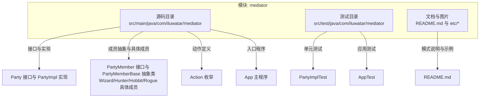
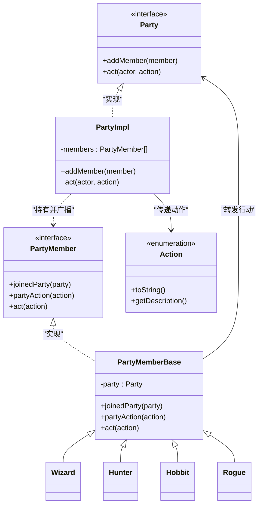
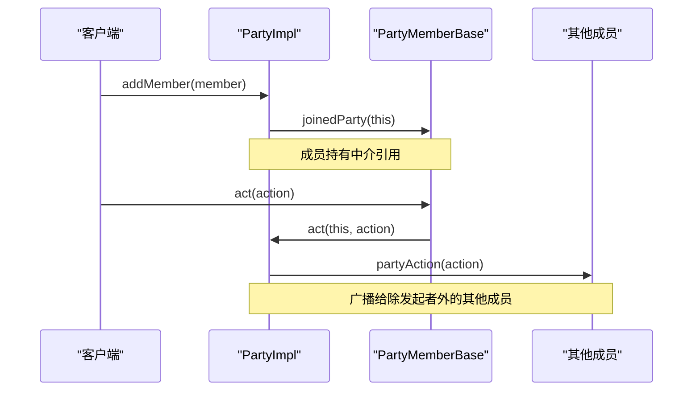
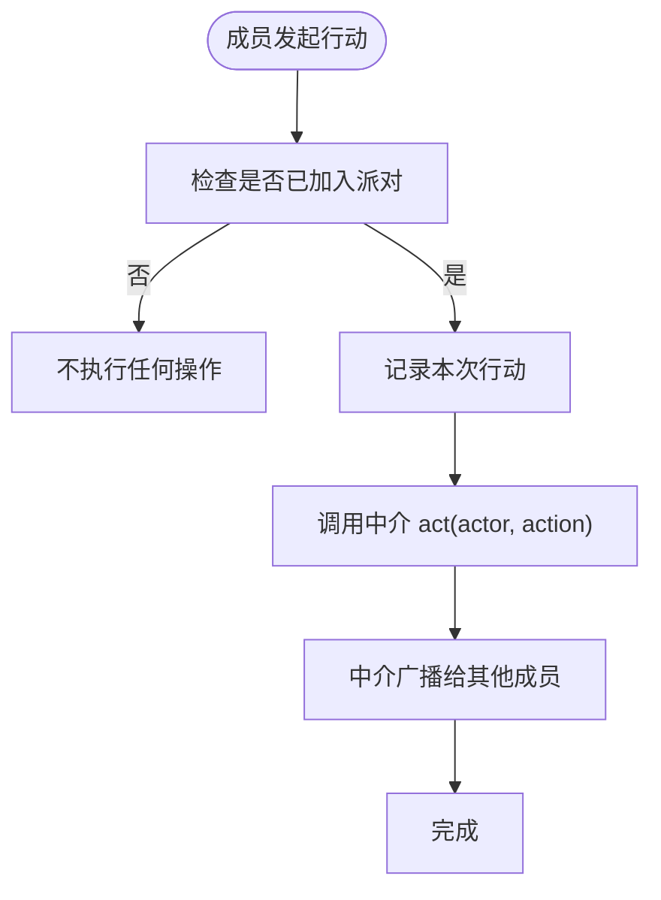
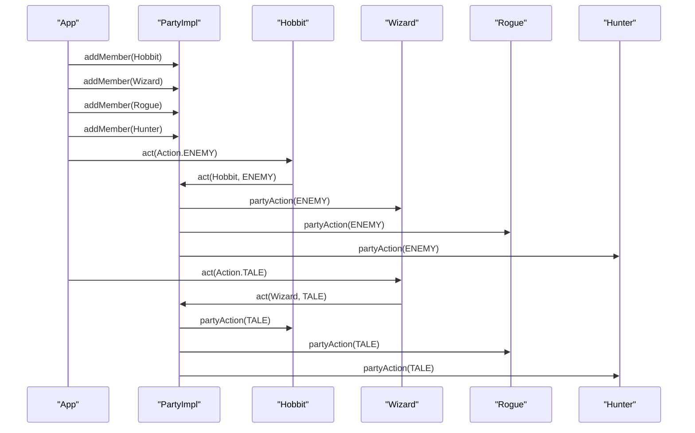
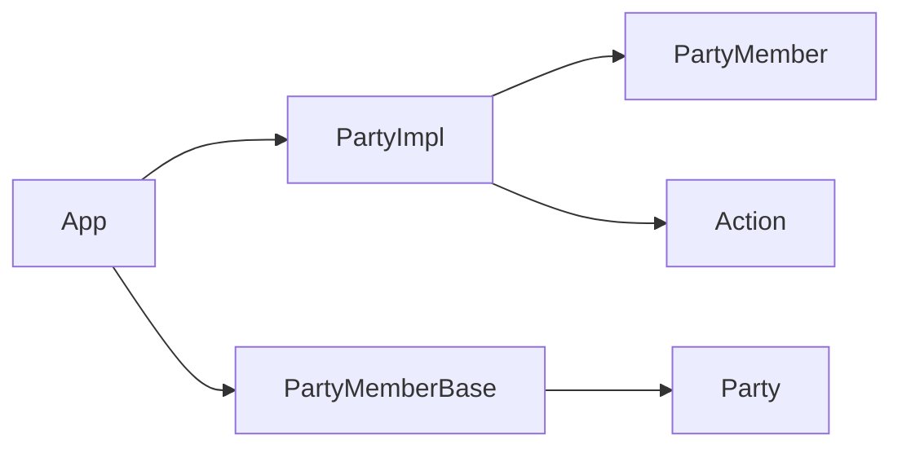

# 中介者模式

<cite>
**本文引用的文件**
- [Party.java](file://mediator/src/main/java/com/iluwatar/mediator/Party.java)
- [PartyImpl.java](file://mediator/src/main/java/com/iluwatar/mediator/PartyImpl.java)
- [PartyMember.java](file://mediator/src/main/java/com/iluwatar/mediator/PartyMember.java)
- [PartyMemberBase.java](file://mediator/src/main/java/com/iluwatar/mediator/PartyMemberBase.java)
- [Wizard.java](file://mediator/src/main/java/com/iluwatar/mediator/Wizard.java)
- [Hunter.java](file://mediator/src/main/java/com/iluwatar/mediator/Hunter.java)
- [Hobbit.java](file://mediator/src/main/java/com/iluwatar/mediator/Hobbit.java)
- [Rogue.java](file://mediator/src/main/java/com/iluwatar/mediator/Rogue.java)
- [Action.java](file://mediator/src/main/java/com/iluwatar/mediator/Action.java)
- [App.java](file://mediator/src/main/java/com/iluwatar/mediator/App.java)
- [README.md](file://mediator/README.md)
- [PartyImplTest.java](file://mediator/src/test/java/com/iluwatar/mediator/PartyImplTest.java)
- [AppTest.java](file://mediator/src/test/java/com/iluwatar/mediator/AppTest.java)
</cite>

## 目录
1. [简介](#简介)
2. [项目结构](#项目结构)
3. [核心组件](#核心组件)
4. [架构总览](#架构总览)
5. [详细组件分析](#详细组件分析)
6. [依赖关系分析](#依赖关系分析)
7. [性能考量](#性能考量)
8. [故障排查指南](#故障排查指南)
9. [结论](#结论)
10. [附录](#附录)

## 简介
本文件系统性阐述中介者模式：通过引入一个中介对象来封装一组对象之间的交互，从而避免对象之间直接耦合。本文以“冒险队伍”为例，展示成员间通过中介（Party）进行协调与通信的过程，并给出类图、时序图与流程图，帮助读者从概念到实现全面掌握该模式。同时讨论中介者在GUI组件通信、聊天系统、多玩家游戏等场景中的应用，以及其对系统复杂度与可维护性的权衡。

## 项目结构
该模块位于 mediator 子目录中，采用标准 Maven 结构组织，包含源码、测试与文档资源：
- 源码路径：mediator/src/main/java/com/iluwatar/mediator
- 测试路径：mediator/src/test/java/com/iluwatar/mediator
- 文档与图片：mediator/README.md 与 mediator/etc

图表来源
- [Party.java](file://mediator/src/main/java/com/iluwatar/mediator/Party.java#L30-L36)
- [PartyImpl.java](file://mediator/src/main/java/com/iluwatar/mediator/PartyImpl.java#L33-L55)
- [PartyMember.java](file://mediator/src/main/java/com/iluwatar/mediator/PartyMember.java#L30-L37)
- [PartyMemberBase.java](file://mediator/src/main/java/com/iluwatar/mediator/PartyMemberBase.java#L33-L59)
- [Wizard.java](file://mediator/src/main/java/com/iluwatar/mediator/Wizard.java#L30-L37)
- [Hunter.java](file://mediator/src/main/java/com/iluwatar/mediator/Hunter.java#L30-L36)
- [Hobbit.java](file://mediator/src/main/java/com/iluwatar/mediator/Hobbit.java#L30-L37)
- [Rogue.java](file://mediator/src/main/java/com/iluwatar/mediator/Rogue.java#L30-L37)
- [Action.java](file://mediator/src/main/java/com/iluwatar/mediator/Action.java#L32-L51)
- [App.java](file://mediator/src/main/java/com/iluwatar/mediator/App.java#L48-L77)
- [README.md](file://mediator/README.md#L1-L221)

章节来源
- [README.md](file://mediator/README.md#L1-L221)

## 核心组件
- Party 接口：定义添加成员与发起行动的能力，是中介者对外暴露的统一入口。
- PartyImpl 实现：持有成员列表，负责在成员间广播消息；当成员加入时通知成员已加入派对。
- PartyMember 接口：定义成员与中介交互的契约：加入派对、接收派对动作、主动发起行动。
- PartyMemberBase 抽象类：提供通用行为（记录派对引用、日志输出、转发行动至中介），具体成员只需关注自身表现形式。
- Wizard/Hunter/Hobbit/Rogue：具体成员类型，继承抽象基类，实现自身标识。
- Action 枚举：描述可执行的动作及其描述文本，作为中介传递的消息载荷。
- App 主程序：创建派对与成员，演示成员通过中介进行通信的完整流程。

章节来源
- [Party.java](file://mediator/src/main/java/com/iluwatar/mediator/Party.java#L30-L36)
- [PartyImpl.java](file://mediator/src/main/java/com/iluwatar/mediator/PartyImpl.java#L33-L55)
- [PartyMember.java](file://mediator/src/main/java/com/iluwatar/mediator/PartyMember.java#L30-L37)
- [PartyMemberBase.java](file://mediator/src/main/java/com/iluwatar/mediator/PartyMemberBase.java#L33-L59)
- [Wizard.java](file://mediator/src/main/java/com/iluwatar/mediator/Wizard.java#L30-L37)
- [Hunter.java](file://mediator/src/main/java/com/iluwatar/mediator/Hunter.java#L30-L36)
- [Hobbit.java](file://mediator/src/main/java/com/iluwatar/mediator/Hobbit.java#L30-L37)
- [Rogue.java](file://mediator/src/main/java/com/iluwatar/mediator/Rogue.java#L30-L37)
- [Action.java](file://mediator/src/main/java/com/iluwatar/mediator/Action.java#L32-L51)
- [App.java](file://mediator/src/main/java/com/iluwatar/mediator/App.java#L48-L77)

## 架构总览
下图展示了中介者模式在“冒险队伍”中的整体交互关系：成员不直接互相调用，而是通过中介（Party）进行通信；中介负责广播与路由。

图表来源
- [Party.java](file://mediator/src/main/java/com/iluwatar/mediator/Party.java#L30-L36)
- [PartyImpl.java](file://mediator/src/main/java/com/iluwatar/mediator/PartyImpl.java#L33-L55)
- [PartyMember.java](file://mediator/src/main/java/com/iluwatar/mediator/PartyMember.java#L30-L37)
- [PartyMemberBase.java](file://mediator/src/main/java/com/iluwatar/mediator/PartyMemberBase.java#L33-L59)
- [Wizard.java](file://mediator/src/main/java/com/iluwatar/mediator/Wizard.java#L30-L37)
- [Hunter.java](file://mediator/src/main/java/com/iluwatar/mediator/Hunter.java#L30-L36)
- [Hobbit.java](file://mediator/src/main/java/com/iluwatar/mediator/Hobbit.java#L30-L37)
- [Rogue.java](file://mediator/src/main/java/com/iluwatar/mediator/Rogue.java#L30-L37)
- [Action.java](file://mediator/src/main/java/com/iluwatar/mediator/Action.java#L32-L51)

## 详细组件分析

### Party 接口与 PartyImpl 实现
- 职责分离：Party 接口仅定义“添加成员”和“发起行动”的能力；具体广播逻辑由 PartyImpl 承担，便于替换或扩展。
- 广播策略：PartyImpl 在收到某成员的行动请求后，遍历成员列表并向除发起者外的所有成员广播该动作，实现一对多的解耦通信。
- 生命周期：成员加入时，PartyImpl 调用成员的 joinedParty 回调，使成员持有对中介的引用，确保后续通信可用。

图表来源
- [PartyImpl.java](file://mediator/src/main/java/com/iluwatar/mediator/PartyImpl.java#L41-L54)
- [PartyMemberBase.java](file://mediator/src/main/java/com/iluwatar/mediator/PartyMemberBase.java#L48-L54)

章节来源
- [Party.java](file://mediator/src/main/java/com/iluwatar/mediator/Party.java#L30-L36)
- [PartyImpl.java](file://mediator/src/main/java/com/iluwatar/mediator/PartyImpl.java#L33-L55)

### PartyMember 接口与 PartyMemberBase 抽象类
- 统一契约：PartyMember 定义了成员与中介交互的三件事：加入派对、接收派对动作、主动发起行动。
- 行为复用：PartyMemberBase 提供通用实现：记录中介引用、日志输出、将成员的行动转发给中介；具体成员仅需实现标识方法。
- 解耦关键：成员通过 act(action) 将自身意图委托给中介，避免直接依赖其他成员。

图表来源
- [PartyMemberBase.java](file://mediator/src/main/java/com/iluwatar/mediator/PartyMemberBase.java#L48-L54)
- [PartyImpl.java](file://mediator/src/main/java/com/iluwatar/mediator/PartyImpl.java#L41-L48)

章节来源
- [PartyMember.java](file://mediator/src/main/java/com/iluwatar/mediator/PartyMember.java#L30-L37)
- [PartyMemberBase.java](file://mediator/src/main/java/com/iluwatar/mediator/PartyMemberBase.java#L33-L59)

### 具体成员类型（Wizard/Hunter/Hobbit/Rogue）
- 角色职责：每个成员类型代表一种角色，通过继承 PartyMemberBase 实现自身标识，不承担通信逻辑。
- 协作方式：成员通过中介进行交互，彼此只感知中介的存在，降低耦合度。
- 可扩展性：新增成员类型无需修改现有成员或中介的代码，符合开闭原则。

章节来源
- [Wizard.java](file://mediator/src/main/java/com/iluwatar/mediator/Wizard.java#L30-L37)
- [Hunter.java](file://mediator/src/main/java/com/iluwatar/mediator/Hunter.java#L30-L36)
- [Hobbit.java](file://mediator/src/main/java/com/iluwatar/mediator/Hobbit.java#L30-L37)
- [Rogue.java](file://mediator/src/main/java/com/iluwatar/mediator/Rogue.java#L30-L37)

### Action 枚举
- 动作载体：Action 枚举承载动作标题与描述，作为中介广播的消息内容。
- 描述驱动：不同动作对应不同的成员响应（如“发现敌人”触发逃跑，“讲个故事”触发聚集）。
- 可扩展性：新增动作只需扩展枚举项，无需改动成员或中介的处理逻辑。

章节来源
- [Action.java](file://mediator/src/main/java/com/iluwatar/mediator/Action.java#L32-L51)

### App 主程序与测试
- 示例演示：App 展示了创建派对与成员、加入成员、发起行动的完整流程，体现中介者如何简化多对多通信。
- 行为验证：测试用例验证成员加入时的回调、行动广播的正确性与自反性（成员不会收到自己的行动）。

图表来源
- [App.java](file://mediator/src/main/java/com/iluwatar/mediator/App.java#L55-L76)
- [PartyImpl.java](file://mediator/src/main/java/com/iluwatar/mediator/PartyImpl.java#L41-L54)
- [PartyMemberBase.java](file://mediator/src/main/java/com/iluwatar/mediator/PartyMemberBase.java#L48-L54)
- [Action.java](file://mediator/src/main/java/com/iluwatar/mediator/Action.java#L32-L51)

章节来源
- [App.java](file://mediator/src/main/java/com/iluwatar/mediator/App.java#L48-L77)
- [PartyImplTest.java](file://mediator/src/test/java/com/iluwatar/mediator/PartyImplTest.java#L39-L60)
- [AppTest.java](file://mediator/src/test/java/com/iluwatar/mediator/AppTest.java#L36-L39)

## 依赖关系分析
- 松耦合：成员只依赖中介接口，中介实现依赖成员接口，形成单向依赖链，避免环状依赖。
- 可替换性：中介实现可替换，成员类型可扩展，符合开闭原则。
- 风险点：中介实现若承担过多业务逻辑，可能演变为“上帝对象”，需要通过职责拆分或引入子中介等方式缓解。

图表来源
- [PartyImpl.java](file://mediator/src/main/java/com/iluwatar/mediator/PartyImpl.java#L33-L55)
- [PartyMemberBase.java](file://mediator/src/main/java/com/iluwatar/mediator/PartyMemberBase.java#L33-L59)
- [Action.java](file://mediator/src/main/java/com/iluwatar/mediator/Action.java#L32-L51)
- [App.java](file://mediator/src/main/java/com/iluwatar/mediator/App.java#L48-L77)

章节来源
- [PartyImpl.java](file://mediator/src/main/java/com/iluwatar/mediator/PartyImpl.java#L33-L55)
- [PartyMemberBase.java](file://mediator/src/main/java/com/iluwatar/mediator/PartyMemberBase.java#L33-L59)

## 性能考量
- 时间复杂度：每次广播遍历成员列表，复杂度为 O(n)，其中 n 为成员数量。对于小规模团队（如本示例的 4 人）影响可忽略。
- 空间复杂度：成员列表存储在内存中，空间开销与成员数量线性相关。
- 优化建议：
  - 对于大规模群体，可考虑分组广播或事件队列异步化。
  - 使用弱引用或生命周期管理避免中介持有不再使用的成员引用。
  - 在高并发场景下，注意广播过程的线程安全与锁粒度。

## 故障排查指南
- 常见问题
  - 成员未收到广播：检查成员是否成功加入派对（应触发 joinedParty 回调）。
  - 自己收到自己的行动：确认中介在广播时排除了发起者。
  - 日志为空：确认成员 act 方法是否调用了中介的 act。
- 单元测试参考
  - 验证成员加入时的回调与广播行为。
  - 验证成员不会收到自己的行动。

章节来源
- [PartyImplTest.java](file://mediator/src/test/java/com/iluwatar/mediator/PartyImplTest.java#L39-L60)
- [AppTest.java](file://mediator/src/test/java/com/iluwatar/mediator/AppTest.java#L36-L39)

## 结论
中介者模式通过引入中介对象，将原本复杂的多对多交互集中到中介中，显著降低了成员之间的耦合度，提升了系统的可维护性与可扩展性。在“冒险队伍”的示例中，成员通过中介进行通信，既保持了角色的独立性，又实现了清晰的协作流程。在实际工程中，应根据团队规模与交互复杂度选择合适的中介实现，并警惕“上帝对象”的风险，必要时拆分职责或引入更细粒度的协调机制。

## 附录
- 应用场景建议
  - GUI 组件通信：按钮、文本框、菜单等通过中介协调状态变化。
  - 聊天系统：房间中介负责消息路由与权限控制。
  - 多玩家游戏：服务器作为中介协调玩家动作与状态同步。
- 相关模式
  - 与观察者模式结合：中介可使用观察者机制通知成员状态变更。
  - 与命令模式结合：将成员动作封装为命令，由中介调度执行。
  - 与外观模式对比：中介强调“通信协调”，外观强调“简化接口”。

章节来源
- [README.md](file://mediator/README.md#L182-L221)