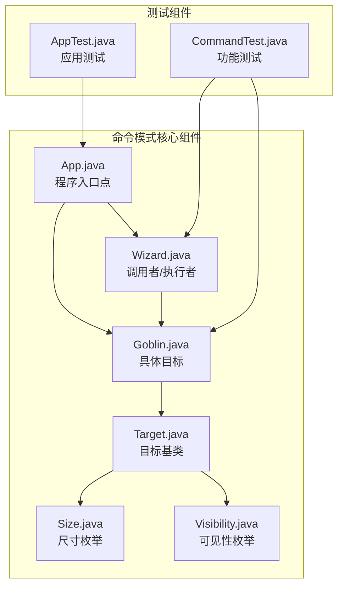
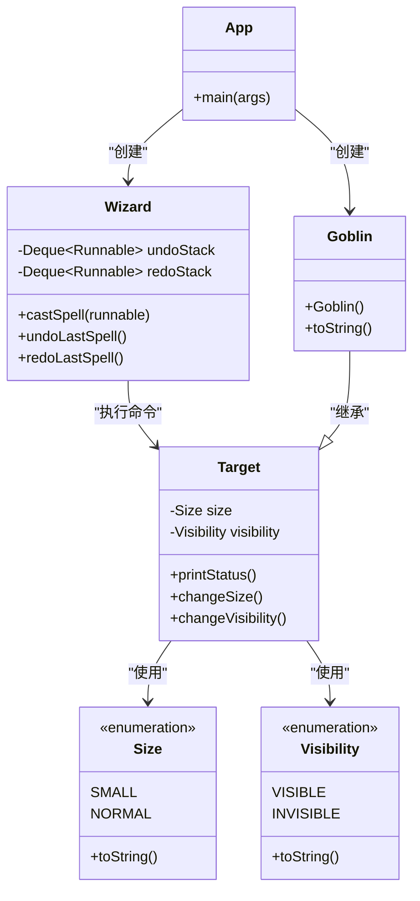
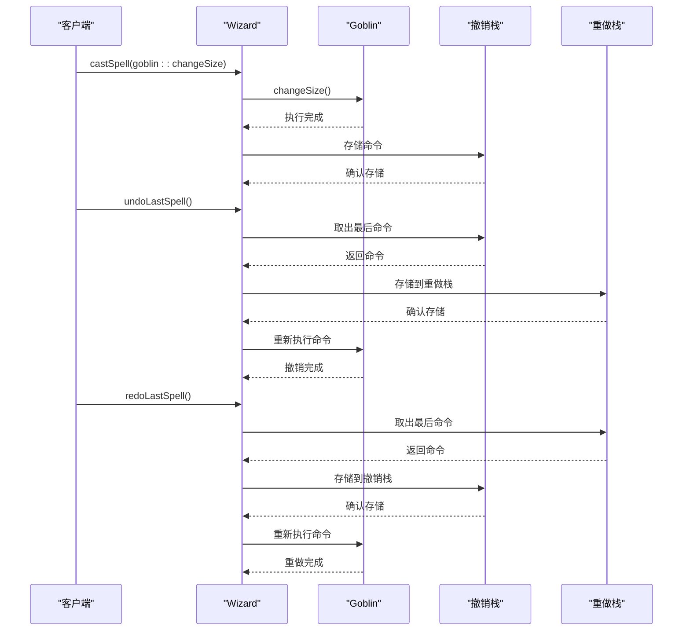
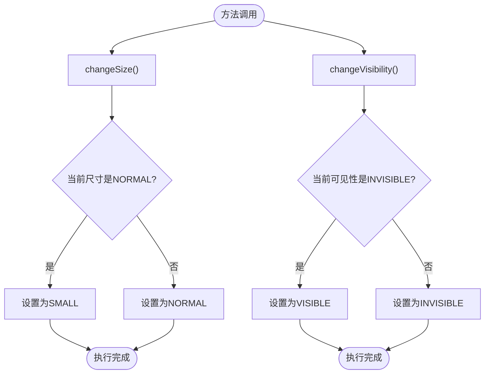
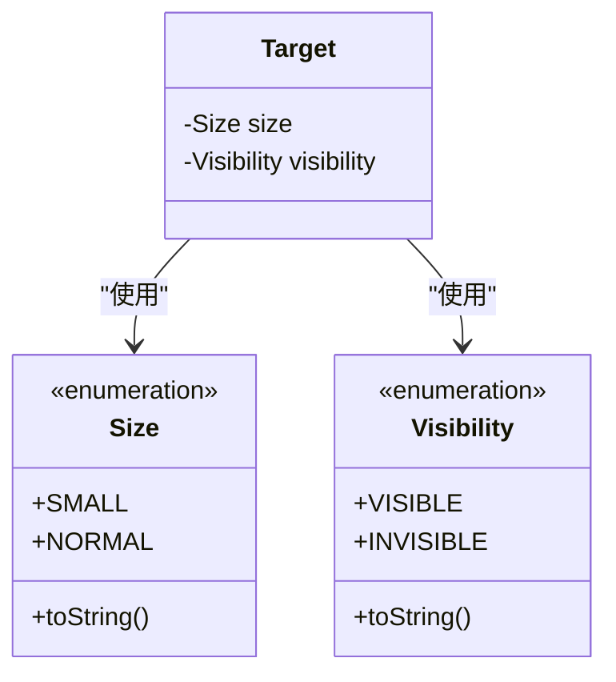
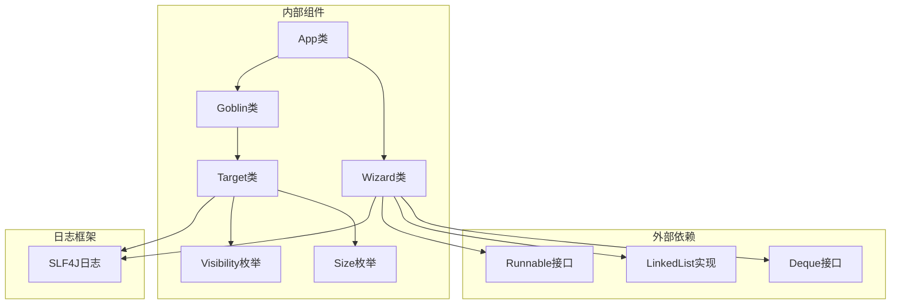
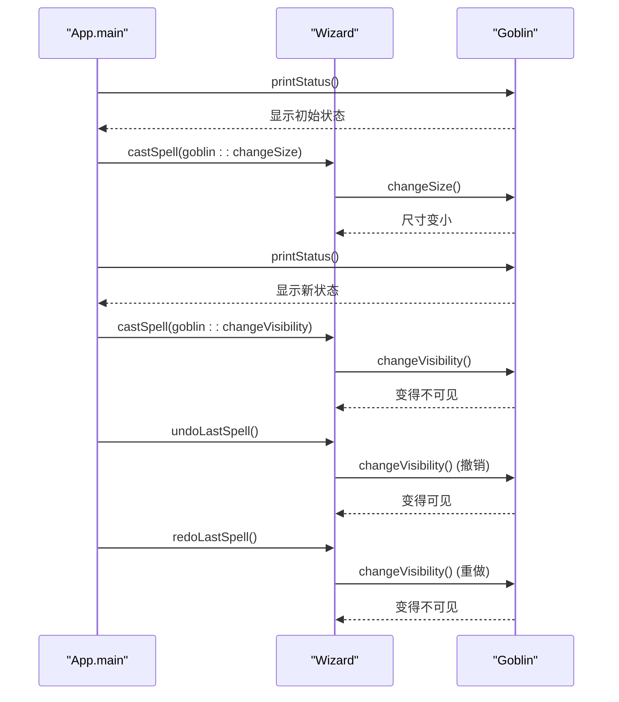
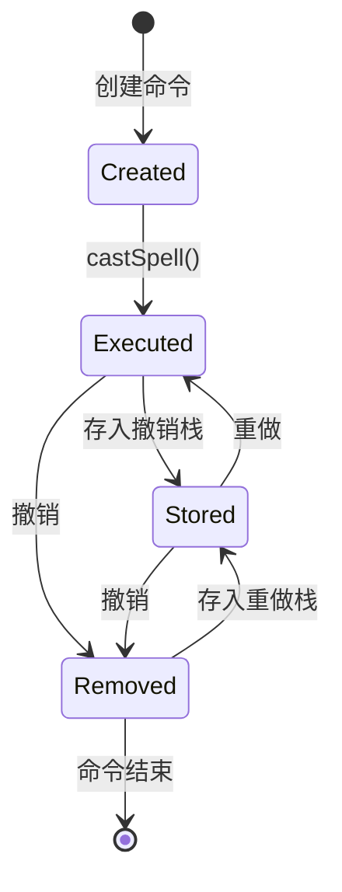

# 命令模式

<cite>
**本文档引用的文件**
- [App.java](file://command/src/main/java/com/iluwatar/command/App.java)
- [Wizard.java](file://command/src/main/java/com/iluwatar/command/Wizard.java)
- [Goblin.java](file://command/src/main/java/com/iluwatar/command/Goblin.java)
- [Target.java](file://command/src/main/java/com/iluwatar/command/Target.java)
- [Size.java](file://command/src/main/java/com/iluwatar/command/Size.java)
- [Visibility.java](file://command/src/main/java/com/iluwatar/command/Visibility.java)
- [AppTest.java](file://command/src/test/java/com/iluwatar/command/AppTest.java)
- [CommandTest.java](file://command/src/test/java/com/iluwatar/command/CommandTest.java)
- [README.md](file://command/README.md)
</cite>

## 目录
1. [简介](#简介)
2. [项目结构](#项目结构)
3. [核心组件](#核心组件)
4. [架构概览](#架构概览)
5. [详细组件分析](#详细组件分析)
6. [依赖关系分析](#依赖关系分析)
7. [性能考虑](#性能考虑)
8. [故障排除指南](#故障排除指南)
9. [结论](#结论)
10. [附录：完整代码示例](#附录完整代码示例)

## 简介

命令模式（Command Pattern）是一种行为型设计模式，它将请求封装为对象，从而使您可以用不同的请求对客户进行参数化，对请求排队或记录请求日志，以及支持可撤销的操作。在本项目中，我们通过一个魔法战斗场景来演示命令模式的实际应用：巫师（Invoker）通过施放法术（Command）来控制哥布林（Receiver）的状态变化，包括尺寸变更和可见性切换，并支持撤销和重做功能。

命令模式的核心思想是将"请求"抽象为"命令对象"，这样可以：
- 参数化客户端与操作的调用
- 支持请求的队列化和调度
- 实现撤销和重做操作
- 将操作的发起者与执行者解耦

## 项目结构

命令模式示例项目的整体结构清晰地体现了设计模式的各个组成部分：

**图表来源**
- [App.java](file://command/src/main/java/com/iluwatar/command/App.java#L43-L75)
- [Wizard.java](file://command/src/main/java/com/iluwatar/command/Wizard.java#L34-L75)
- [Target.java](file://command/src/main/java/com/iluwatar/command/Target.java#L34-L67)

**章节来源**
- [App.java](file://command/src/main/java/com/iluwatar/command/App.java#L1-L75)
- [Wizard.java](file://command/src/main/java/com/iluwatar/command/Wizard.java#L1-L75)
- [Target.java](file://command/src/main/java/com/iluwatar/command/Target.java#L1-L67)

## 核心组件

命令模式在本项目中由以下核心组件构成：

### 1. 调用者（Invoker）- Wizard类
Wizard类作为命令的调用者，负责接收和执行命令对象。它维护两个栈结构来支持撤销和重做功能：
- `undoStack`: 存储已执行的命令，用于撤销操作
- `redoStack`: 存储已撤销的命令，用于重做操作

### 2. 接收者（Receiver）- Target和Goblin类
Target类定义了命令的目标接口，包含尺寸和可见性的状态管理方法。Goblin类继承自Target，实现了具体的魔法生物行为。

### 3. 命令对象
在本实现中，命令被简化为`Runnable`接口的实例，通过方法引用的方式传递给Wizard类。每个命令对象封装了要执行的具体操作。

### 4. 枚举类型
- **Size枚举**：定义目标的尺寸状态（SMALL、NORMAL）
- **Visibility枚举**：定义目标的可见性状态（VISIBLE、INVISIBLE）

**章节来源**
- [Wizard.java](file://command/src/main/java/com/iluwatar/command/Wizard.java#L34-L75)
- [Target.java](file://command/src/main/java/com/iluwatar/command/Target.java#L34-L67)
- [Goblin.java](file://command/src/main/java/com/iluwatar/command/Goblin.java#L30-L42)
- [Size.java](file://command/src/main/java/com/iluwatar/command/Size.java#L32-L45)
- [Visibility.java](file://command/src/main/java/com/iluwatar/command/Visibility.java#L32-L45)

## 架构概览

命令模式的架构设计体现了松耦合和高内聚的设计原则：

**图表来源**
- [Wizard.java](file://command/src/main/java/com/iluwatar/command/Wizard.java#L34-L75)
- [Target.java](file://command/src/main/java/com/iluwatar/command/Target.java#L34-L67)
- [Goblin.java](file://command/src/main/java/com/iluwatar/command/Goblin.java#L30-L42)
- [Size.java](file://command/src/main/java/com/iluwatar/command/Size.java#L32-L45)
- [Visibility.java](file://command/src/main/java/com/iluwatar/command/Visibility.java#L32-L45)
- [App.java](file://command/src/main/java/com/iluwatar/command/App.java#L43-L75)

## 详细组件分析

### Wizard类分析

Wizard类是命令模式的核心执行者，负责管理命令的生命周期：

**图表来源**
- [Wizard.java](file://command/src/main/java/com/iluwatar/command/Wizard.java#L43-L68)
- [Target.java](file://command/src/main/java/com/iluwatar/command/Target.java#L53-L65)

Wizard类的关键特性：
- 使用双栈结构实现撤销和重做功能
- 通过`castSpell()`方法接收命令并立即执行
- 提供线程安全的栈操作（基于LinkedList的并发安全特性）

**章节来源**
- [Wizard.java](file://command/src/main/java/com/iluwatar/command/Wizard.java#L34-L75)

### Target和Goblin类分析

Target类定义了命令的目标接口，提供了状态管理和操作方法：

**图表来源**
- [Target.java](file://command/src/main/java/com/iluwatar/command/Target.java#L53-L65)

Goblin类作为具体的命令接收者，初始化时设置默认状态：
- 尺寸：NORMAL
- 可见性：VISIBLE

**章节来源**
- [Target.java](file://command/src/main/java/com/iluwatar/command/Target.java#L34-L67)
- [Goblin.java](file://command/src/main/java/com/iluwatar/command/Goblin.java#L30-L42)

### 枚举类型分析

Size和Visibility枚举提供了类型安全的状态表示：

**图表来源**
- [Size.java](file://command/src/main/java/com/iluwatar/command/Size.java#L32-L45)
- [Visibility.java](file://command/src/main/java/com/iluwatar/command/Visibility.java#L32-L45)
- [Target.java](file://command/src/main/java/com/iluwatar/command/Target.java#L39-L41)

**章节来源**
- [Size.java](file://command/src/main/java/com/iluwatar/command/Size.java#L32-L45)
- [Visibility.java](file://command/src/main/java/com/iluwatar/command/Visibility.java#L32-L45)

## 依赖关系分析

命令模式的依赖关系体现了清晰的层次结构：

**图表来源**
- [Wizard.java](file://command/src/main/java/com/iluwatar/command/Wizard.java#L27-L39)
- [Target.java](file://command/src/main/java/com/iluwatar/command/Target.java#L27-L29)
- [App.java](file://command/src/main/java/com/iluwatar/command/App.java#L25)

**章节来源**
- [Wizard.java](file://command/src/main/java/com/iluwatar/command/Wizard.java#L27-L39)
- [Target.java](file://command/src/main/java/com/iluwatar/command/Target.java#L27-L29)

## 性能考虑

命令模式在本实现中的性能特征：

### 时间复杂度
- **命令执行**：O(1) - 直接调用Runnable.run()
- **撤销操作**：O(1) - 栈弹出和重新执行
- **重做操作**：O(1) - 栈弹出和重新执行
- **内存使用**：O(n) - n为已执行命令的数量

### 空间复杂度
- **栈空间**：O(n) - 存储撤销和重做命令
- **对象开销**：每个命令对象占用少量内存
- **枚举常量**：使用枚举避免重复对象创建

### 优化建议
1. **内存管理**：对于大量命令的历史记录，考虑限制栈大小
2. **并发安全**：在多线程环境中使用同步机制保护栈操作
3. **延迟执行**：可以实现命令队列来批量处理命令

## 故障排除指南

### 常见问题及解决方案

#### 1. 空栈异常
**问题**：尝试撤销或重做空栈中的命令
**解决方案**：检查栈是否为空后再执行操作

#### 2. 状态不一致
**问题**：撤销后状态与预期不符
**解决方案**：确保命令对象正确保存和恢复状态

#### 3. 内存泄漏
**问题**：长时间运行后内存使用持续增长
**解决方案**：实现命令历史的最大容量限制

**章节来源**
- [Wizard.java](file://command/src/main/java/com/iluwatar/command/Wizard.java#L51-L68)

## 结论

命令模式在本项目中成功展示了其核心价值：将请求封装为对象，从而实现操作的参数化、队列化和撤销功能。通过巫师施法的场景，我们看到了命令模式在游戏开发中的实际应用潜力。

### 主要优势
1. **解耦性**：调用者与接收者完全分离
2. **扩展性**：易于添加新的命令类型
3. **撤销功能**：内置的撤销和重做机制
4. **日志记录**：命令历史便于审计和调试

### 应用场景
- **游戏开发**：动作游戏的指令系统、编辑器的撤销重做功能
- **GUI应用**：按钮点击事件、菜单操作
- **数据库事务**：支持回滚的事务操作
- **宏录制**：应用程序的自动化脚本

### 设计启示
命令模式通过引入额外的抽象层，换取了更大的灵活性和可维护性。在需要复杂操作编排和状态管理的应用中，这种权衡通常是值得的。

## 附录：完整代码示例

### 魔法攻击示例

**图表来源**
- [App.java](file://command/src/main/java/com/iluwatar/command/App.java#L50-L73)
- [Wizard.java](file://command/src/main/java/com/iluwatar/command/Wizard.java#L43-L68)

### 命令生命周期管理

**图表来源**
- [Wizard.java](file://command/src/main/java/com/iluwatar/command/Wizard.java#L37-L46)
- [Wizard.java](file://command/src/main/java/com/iluwatar/command/Wizard.java#L51-L68)

### 测试验证

项目包含完整的单元测试，验证命令模式的核心功能：

- **AppTest**：验证应用程序正常运行
- **CommandTest**：验证撤销和重做功能的正确性

这些测试确保了命令模式在各种场景下的可靠性。

**章节来源**
- [AppTest.java](file://command/src/test/java/com/iluwatar/command/AppTest.java#L41-L45)
- [CommandTest.java](file://command/src/test/java/com/iluwatar/command/CommandTest.java#L54-L77)