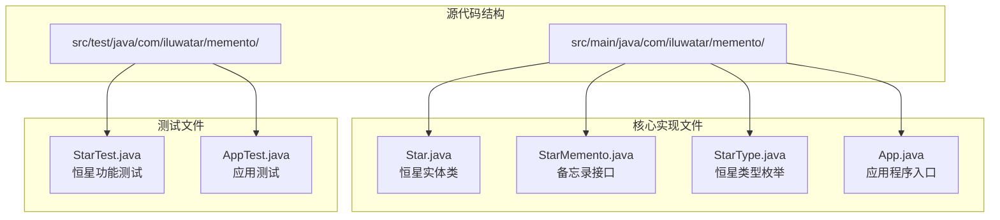
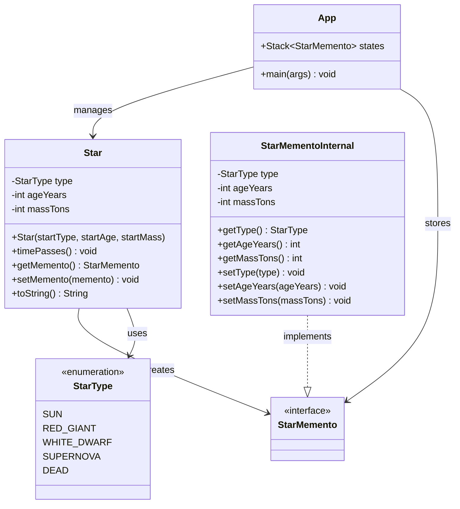
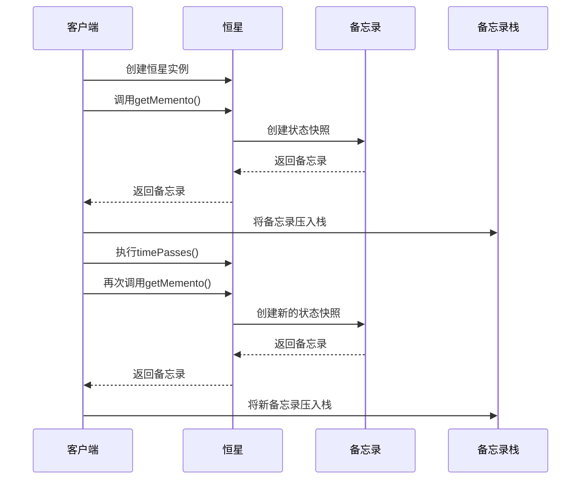
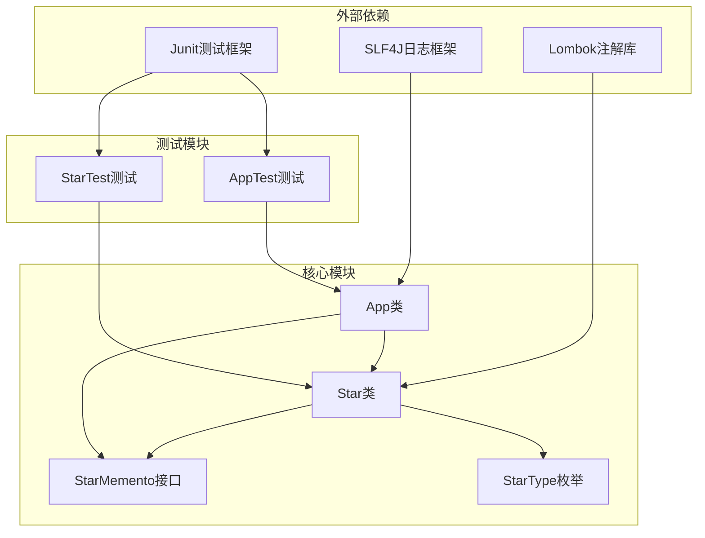
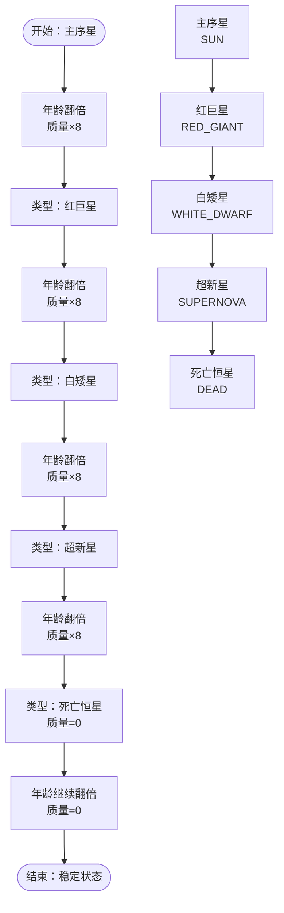
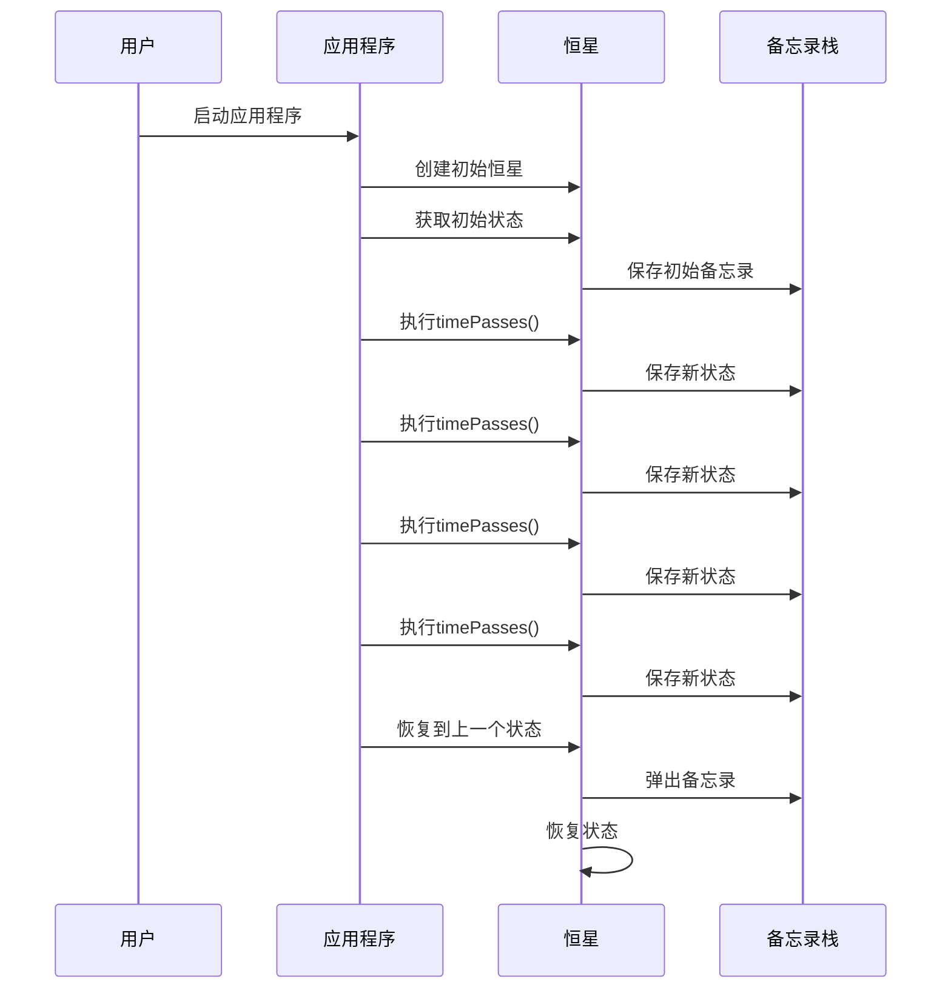

# 备忘录模式

<cite>
**本文档中引用的文件**
- [Star.java](file://memento/src/main/java/com/iluwatar/memento/Star.java)
- [StarMemento.java](file://memento/src/main/java/com/iluwatar/memento/StarMemento.java)
- [StarType.java](file://memento/src/main/java/com/iluwatar/memento/StarType.java)
- [App.java](file://memento/src/main/java/com/iluwatar/memento/App.java)
- [StarTest.java](file://memento/src/test/java/com/iluwatar/memento/StarTest.java)
- [AppTest.java](file://memento/src/test/java/com/iluwatar/memento/AppTest.java)
- [README.md](file://memento/README.md)
</cite>

## 目录
1. [简介](#简介)
2. [项目结构](#项目结构)
3. [核心组件](#核心组件)
4. [架构概览](#架构概览)
5. [详细组件分析](#详细组件分析)
6. [依赖关系分析](#依赖关系分析)
7. [性能考虑](#性能考虑)
8. [故障排除指南](#故障排除指南)
9. [结论](#结论)
10. [附录](#附录)

## 简介

备忘录模式（Memento Pattern）是一种行为型设计模式，它允许在不破坏对象封装性的前提下，捕获并外部化一个对象的内部状态，从而使该对象可以在之后恢复到原先保存的状态。这种模式特别适用于需要实现撤销操作、事务回滚或状态快照的场景。

在本项目中，我们通过恒星生命周期管理的示例来演示备忘录模式的实际应用。恒星从主序星状态开始，经历红巨星、白矮星、超新星，最终变为死亡恒星的完整演化过程，每个阶段的状态都可以通过备忘录进行保存和恢复。

## 项目结构

备忘录模式示例项目采用标准的Java Maven项目结构，主要包含以下关键文件：

**图表来源**
- [Star.java](file://memento/src/main/java/com/iluwatar/memento/Star.java#L1-L100)
- [StarMemento.java](file://memento/src/main/java/com/iluwatar/memento/StarMemento.java#L1-L33)
- [App.java](file://memento/src/main/java/com/iluwatar/memento/App.java#L1-L76)

**章节来源**
- [Star.java](file://memento/src/main/java/com/iluwatar/memento/Star.java#L1-L100)
- [StarMemento.java](file://memento/src/main/java/com/iluwatar/memento/StarMemento.java#L1-L33)
- [StarType.java](file://memento/src/main/java/com/iluwatar/memento/StarType.java#L1-L48)
- [App.java](file://memento/src/main/java/com/iluwatar/memento/App.java#L1-L76)

## 核心组件

备忘录模式的核心由三个主要组件构成：

### 1. 发起人（Originator）
恒星类作为发起人，负责创建和恢复其内部状态。它维护着恒星的类型、年龄和质量等私有状态，并提供获取和设置备忘录的方法。

### 2. 备忘录（Memento）
备忘录接口定义了备忘录的基本契约，但不暴露任何状态细节。在实现中，内部类`StarMementoInternal`持有实际的状态数据。

### 3. 管理者（Caretaker）
应用程序类充当管理者角色，负责维护备忘录栈，实现状态的保存和恢复操作。

**章节来源**
- [Star.java](file://memento/src/main/java/com/iluwatar/memento/Star.java#L33-L100)
- [StarMemento.java](file://memento/src/main/java/com/iluwatar/memento/StarMemento.java#L27-L33)
- [App.java](file://memento/src/main/java/com/iluwatar/memento/App.java#L48-L76)

## 架构概览

备忘录模式的完整架构如下所示：

**图表来源**
- [Star.java](file://memento/src/main/java/com/iluwatar/memento/Star.java#L33-L100)
- [StarMemento.java](file://memento/src/main/java/com/iluwatar/memento/StarMemento.java#L27-L33)
- [StarType.java](file://memento/src/main/java/com/iluwatar/memento/StarType.java#L30-L48)
- [App.java](file://memento/src/main/java/com/iluwatar/memento/App.java#L48-L76)

## 详细组件分析

### 恒星状态管理（Star类）

恒星类是备忘录模式的核心实现，负责管理恒星的完整生命周期状态：

#### 状态属性
- **类型（type）**：恒星的当前状态（主序星、红巨星、白矮星、超新星、死亡恒星）
- **年龄（ageYears）**：以年为单位的恒星年龄
- **质量（massTons）**：以吨为单位的恒星质量

#### 状态转换逻辑
恒星的状态转换遵循特定的物理规律：
- 主序星 → 红巨星：年龄翻倍，质量增加8倍
- 红巨星 → 白矮星：类型转换
- 白矮星 → 超新星：类型转换
- 超新星 → 死亡恒星：类型转换
- 死亡恒星：年龄继续增长，质量归零

#### 备忘录方法实现

**图表来源**
- [Star.java](file://memento/src/main/java/com/iluwatar/memento/Star.java#L68-L81)
- [App.java](file://memento/src/main/java/com/iluwatar/memento/App.java#L54-L74)

**章节来源**
- [Star.java](file://memento/src/main/java/com/iluwatar/memento/Star.java#L33-L100)

### 备忘录接口设计（StarMemento）

备忘录接口采用了最小化设计原则，只定义必要的契约而不暴露任何实现细节：

#### 接口特性
- **透明性**：管理者无法直接访问备忘录中的状态数据
- **封装性**：状态数据被限制在发起人内部类中
- **不可变性**：通过私有字段和受保护的访问控制确保状态的完整性

#### 实现策略
内部类`StarMementoInternal`实现了接口的所有功能，同时保持了对状态数据的完全控制权。

**章节来源**
- [StarMemento.java](file://memento/src/main/java/com/iluwatar/memento/StarMemento.java#L27-L33)
- [Star.java](file://memento/src/main/java/com/iluwatar/memento/Star.java#L91-L98)

### 应用程序协调器（App类）

应用程序类展示了备忘录模式在实际场景中的使用方式：

#### 状态管理流程
1. **初始化**：创建初始恒星状态并保存第一个备忘录
2. **状态演进**：多次调用`timePasses()`方法观察状态变化
3. **历史记录**：每次状态变化后都创建并保存新的备忘录
4. **状态恢复**：通过弹出栈顶元素实现向后的时间旅行

#### 关键实现要点
- 使用`Stack<StarMemento>`维护状态历史
- 通过循环实现多步撤销操作
- 利用日志输出展示状态变化过程

**章节来源**
- [App.java](file://memento/src/main/java/com/iluwatar/memento/App.java#L48-L76)

### 测试验证体系

项目包含完整的测试套件来验证备忘录模式的正确性：

#### 功能测试覆盖
- **状态演进测试**：验证恒星生命周期的正确转换
- **撤销操作测试**：验证备忘录的恢复功能
- **边界条件测试**：验证死亡恒星状态的特殊处理

#### 测试策略
- 使用JUnit框架进行单元测试
- 通过断言验证状态转换的准确性
- 模拟真实的应用场景进行集成测试

**章节来源**
- [StarTest.java](file://memento/src/test/java/com/iluwatar/memento/StarTest.java#L35-L99)
- [AppTest.java](file://memento/src/test/java/com/iluwatar/memento/AppTest.java#L34-L41)

## 依赖关系分析

备忘录模式的依赖关系体现了清晰的分层架构：

**图表来源**
- [Star.java](file://memento/src/main/java/com/iluwatar/memento/Star.java#L27-L28)
- [App.java](file://memento/src/main/java/com/iluwatar/memento/App.java#L27-L28)
- [StarTest.java](file://memento/src/test/java/com/iluwatar/memento/StarTest.java#L27-L29)
- [AppTest.java](file://memento/src/test/java/com/iluwatar/memento/AppTest.java#L27-L29)

**章节来源**
- [Star.java](file://memento/src/main/java/com/iluwatar/memento/Star.java#L1-L100)
- [App.java](file://memento/src/main/java/com/iluwatar/memento/App.java#L1-L76)

## 性能考虑

### 内存使用优化
- **状态快照大小**：每个备忘录包含恒星类型、年龄和质量三个基本数据类型
- **内存开销**：对于大量状态的历史记录，需要谨慎管理内存使用
- **垃圾回收**：及时释放不再使用的备忘录对象避免内存泄漏

### 时间复杂度分析
- **创建备忘录**：O(1) - 基本的赋值操作
- **恢复状态**：O(1) - 直接的状态赋值
- **状态演进**：O(1) - 简单的数学运算和类型转换

### 最佳实践建议
- **适度保存**：根据应用场景选择合适的备忘录保存频率
- **清理策略**：实现自动清理机制，避免无限增长的历史记录
- **增量备份**：考虑实现增量状态保存以减少内存占用

## 故障排除指南

### 常见问题及解决方案

#### 1. 状态恢复异常
**问题描述**：调用`setMemento()`方法时出现类型转换异常
**解决方案**：确保传入的备忘录对象是正确的实现类型

#### 2. 内存溢出问题
**问题描述**：长时间运行后出现内存不足错误
**解决方案**：实现备忘录数量限制和自动清理机制

#### 3. 状态不一致问题
**问题描述**：恢复后的状态与预期不符
**解决方案**：检查状态转换逻辑和边界条件处理

**章节来源**
- [Star.java](file://memento/src/main/java/com/iluwatar/memento/Star.java#L76-L81)
- [StarTest.java](file://memento/src/test/java/com/iluwatar/memento/StarTest.java#L67-L96)

## 结论

备忘录模式为解决状态管理和撤销操作提供了优雅的解决方案。通过将状态封装在专门的备忘录对象中，我们能够在不破坏对象封装性的前提下实现灵活的状态管理。

### 主要优势
- **封装性保护**：状态数据完全封装在发起人内部
- **灵活性**：支持任意数量的状态保存和恢复
- **可扩展性**：易于添加新的状态类型和转换规则

### 应用场景
- **游戏开发**：游戏存档、撤销操作、事务回滚
- **文本编辑器**：撤销/重做功能
- **数据库系统**：事务管理和回滚机制
- **配置管理**：配置的版本控制和恢复

### 设计启示
备忘录模式强调了在设计软件架构时平衡功能需求和封装原则的重要性。通过精心设计的接口和严格的访问控制，我们可以在保持代码清晰性的同时提供强大的功能特性。

## 附录

### 状态转换时序图

**图表来源**
- [Star.java](file://memento/src/main/java/com/iluwatar/memento/Star.java#L51-L66)
- [StarType.java](file://memento/src/main/java/com/iluwatar/memento/StarType.java#L30-L35)

### 备忘录创建时机

**图表来源**
- [App.java](file://memento/src/main/java/com/iluwatar/memento/App.java#L53-L74)
- [Star.java](file://memento/src/main/java/com/iluwatar/memento/Star.java#L68-L81)

### 游戏开发中的应用示例

备忘录模式在游戏开发中有广泛的应用：

#### 游戏存档系统
- **自动保存**：定期创建游戏状态快照
- **手动存档**：玩家可以随时保存当前进度
- **快速存档**：实现快速保存和加载功能

#### 撤销操作机制
- **命令模式结合**：与命令模式配合实现复杂的撤销操作
- **多级撤销**：支持多次连续的撤销操作
- **撤销历史**：维护撤销操作的历史记录

#### 事务回滚
- **数据库事务**：模拟数据库事务的提交和回滚
- **批量操作**：支持多个操作的原子性执行
- **错误恢复**：在发生错误时自动回滚到安全状态

通过这些应用示例，我们可以看到备忘录模式不仅是一个理论设计模式，更是解决实际工程问题的有效工具。