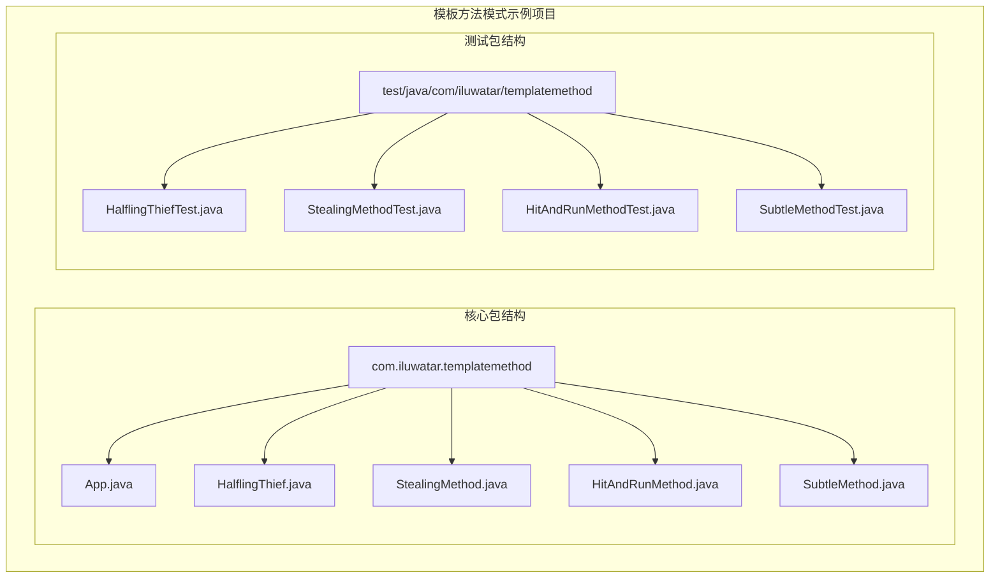
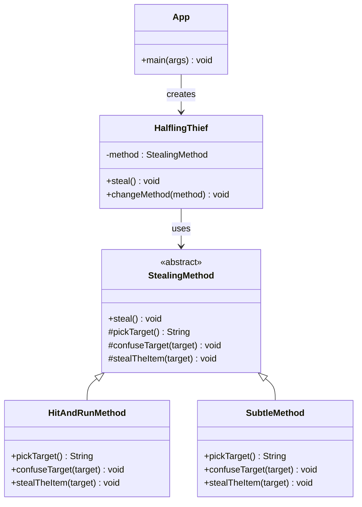
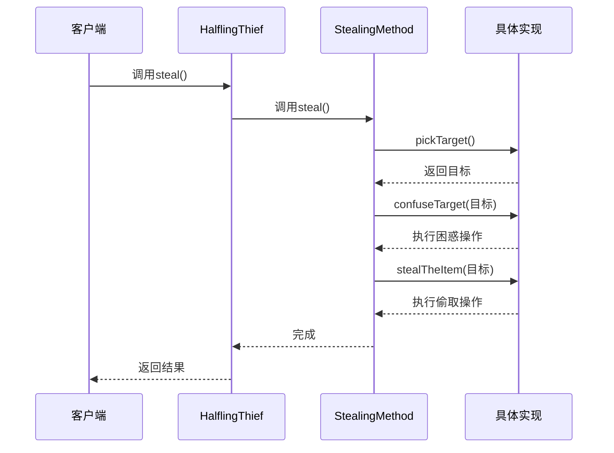
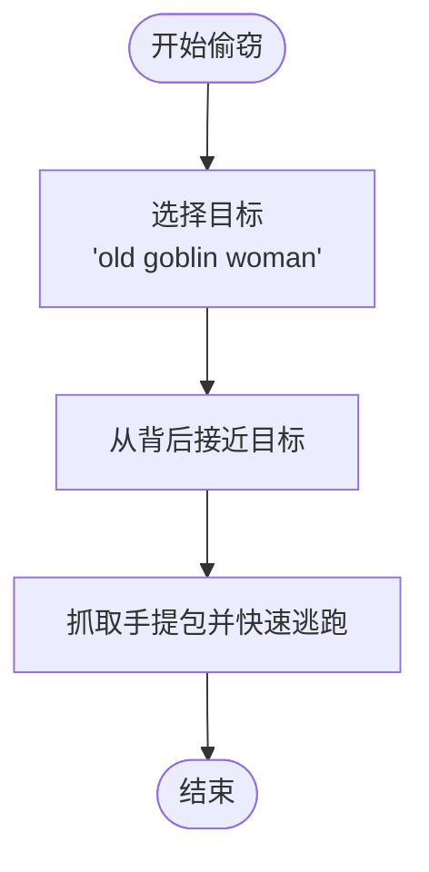
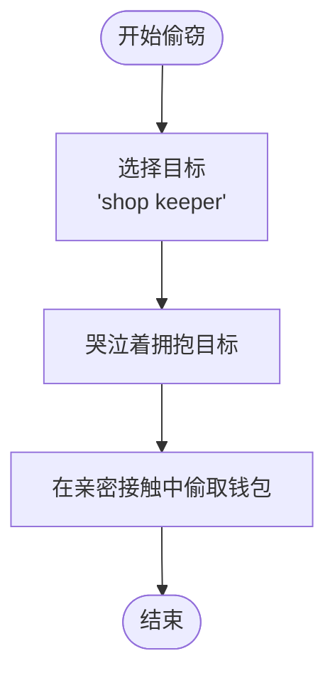
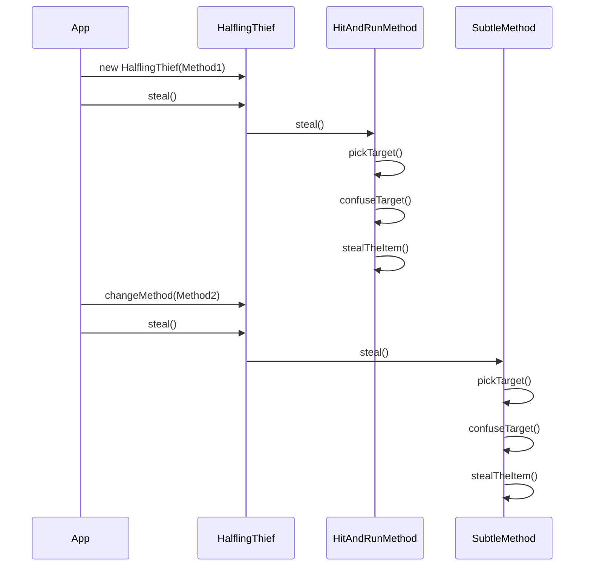
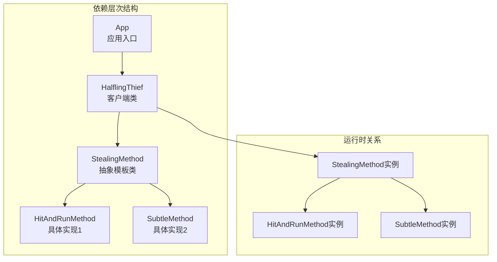
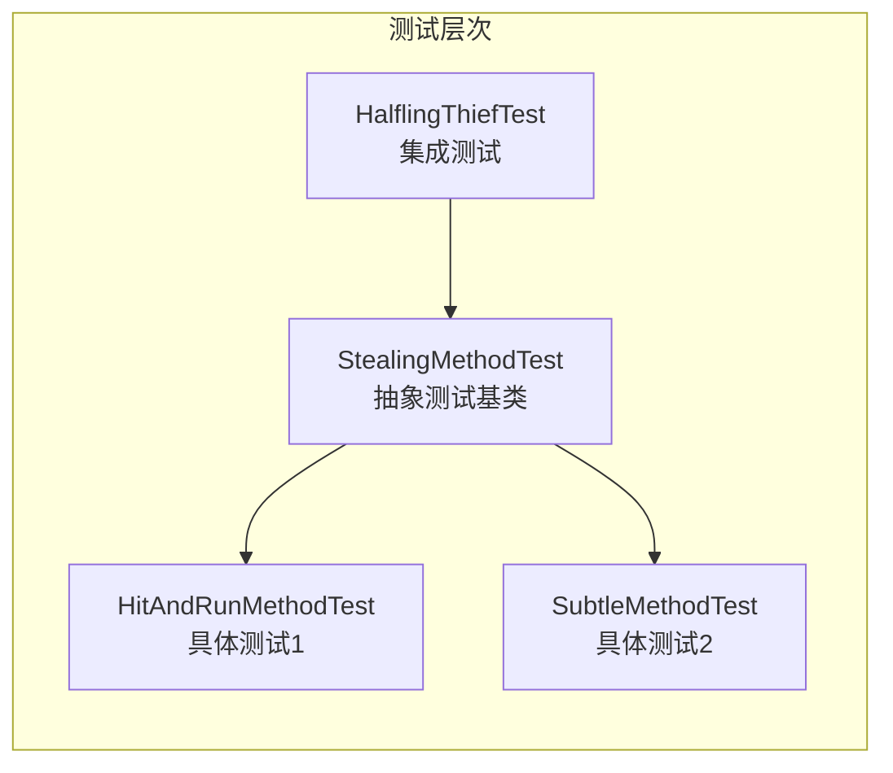

# 模板方法模式

<cite>
**本文档引用的文件**
- [App.java](file://template-method/src/main/java/com/iluwatar/templatemethod/App.java)
- [HalflingThief.java](file://template-method/src/main/java/com/iluwatar/templatemethod/HalflingThief.java)
- [StealingMethod.java](file://template-method/src/main/java/com/iluwatar/templatemethod/StealingMethod.java)
- [HitAndRunMethod.java](file://template-method/src/main/java/com/iluwatar/templatemethod/HitAndRunMethod.java)
- [SubtleMethod.java](file://template-method/src/main/java/com/iluwatar/templatemethod/SubtleMethod.java)
- [README.md](file://template-method/README.md)
- [HalflingThiefTest.java](file://template-method/src/test/java/com/iluwatar/templatemethod/HalflingThiefTest.java)
- [StealingMethodTest.java](file://template-method/src/test/java/com/iluwatar/templatemethod/StealingMethodTest.java)
- [HitAndRunMethodTest.java](file://template-method/src/test/java/com/iluwatar/templatemethod/HitAndRunMethodTest.java)
- [SubtleMethodTest.java](file://template-method/src/test/java/com/iluwatar/templatemethod/SubtleMethodTest.java)
</cite>

## 目录
1. [引言](#引言)
2. [项目结构](#项目结构)
3. [核心组件](#核心组件)
4. [架构概览](#架构概览)
5. [详细组件分析](#详细组件分析)
6. [依赖关系分析](#依赖关系分析)
7. [性能考虑](#性能考虑)
8. [故障排除指南](#故障排除指南)
9. [结论](#结论)
10. [附录](#附录)

## 引言

模板方法模式是Java设计模式中的经典行为型模式之一，它定义了一个算法的骨架，将一些步骤延迟到子类中实现。这种模式通过在抽象基类中定义算法的不变部分，在具体子类中实现可变部分，实现了代码复用和灵活性的平衡。

在本项目中，我们通过"霍比特人盗贼"的场景来演示模板方法模式的应用。该场景展示了如何使用模板方法模式来封装不同的偷窃策略，包括"突袭后逃跑"和"狡猾偷取"两种不同的实现方式。

## 项目结构

模板方法模式示例项目的整体结构清晰地体现了设计模式的分层架构：

**图表来源**
- [App.java](file://template-method/src/main/java/com/iluwatar/templatemethod/App.java#L34-L47)
- [HalflingThief.java](file://template-method/src/main/java/com/iluwatar/templatemethod/HalflingThief.java#L30-L45)
- [StealingMethod.java](file://template-method/src/main/java/com/iluwatar/templatemethod/StealingMethod.java#L33-L50)

**章节来源**
- [README.md](file://template-method/README.md#L1-L189)

## 核心组件

模板方法模式的核心由四个主要组件构成：

### 抽象模板类（StealingMethod）
抽象模板类定义了算法的完整骨架，包含一个`final`修饰的模板方法和多个抽象的可变步骤方法。

### 具体实现类
- **HitAndRunMethod**：实现"突袭后逃跑"策略
- **SubtleMethod**：实现"狡猾偷取"策略

### 客客类（HalflingThief）
客户端类持有并使用具体的模板实现，支持运行时切换不同的策略。

### 应用入口类（App）
程序的入口点，演示了模板方法模式的实际应用场景。

**章节来源**
- [StealingMethod.java](file://template-method/src/main/java/com/iluwatar/templatemethod/StealingMethod.java#L33-L50)
- [HitAndRunMethod.java](file://template-method/src/main/java/com/iluwatar/templatemethod/HitAndRunMethod.java#L33-L49)
- [SubtleMethod.java](file://template-method/src/main/java/com/iluwatar/templatemethod/SubtleMethod.java#L33-L49)
- [HalflingThief.java](file://template-method/src/main/java/com/iluwatar/templatemethod/HalflingThief.java#L30-L45)
- [App.java](file://template-method/src/main/java/com/iluwatar/templatemethod/App.java#L34-L47)

## 架构概览

模板方法模式的架构体现了经典的"好莱坞原则"——不要调用我们，我们会调用你：

**图表来源**
- [StealingMethod.java](file://template-method/src/main/java/com/iluwatar/templatemethod/StealingMethod.java#L33-L50)
- [HitAndRunMethod.java](file://template-method/src/main/java/com/iluwatar/templatemethod/HitAndRunMethod.java#L33-L49)
- [SubtleMethod.java](file://template-method/src/main/java/com/iluwatar/templatemethod/SubtleMethod.java#L33-L49)
- [HalflingThief.java](file://template-method/src/main/java/com/iluwatar/templatemethod/HalflingThief.java#L30-L45)
- [App.java](file://template-method/src/main/java/com/iluwatar/templatemethod/App.java#L34-L47)

## 详细组件分析

### 抽象模板类（StealingMethod）

抽象模板类是整个设计模式的核心，它定义了算法的完整骨架：

**图表来源**
- [StealingMethod.java](file://template-method/src/main/java/com/iluwatar/templatemethod/StealingMethod.java#L44-L49)
- [HalflingThief.java](file://template-method/src/main/java/com/iluwatar/templatemethod/HalflingThief.java#L38-L40)

抽象模板类的关键特性：
- **模板方法**：`steal()`方法被声明为`final`，确保算法骨架不被修改
- **可变步骤**：三个受保护的抽象方法允许子类自定义具体实现
- **日志记录**：使用SLF4J进行详细的执行过程记录

### 具体实现类对比

#### 突袭后逃跑策略（HitAndRunMethod）

**图表来源**
- [HitAndRunMethod.java](file://template-method/src/main/java/com/iluwatar/templatemethod/HitAndRunMethod.java#L36-L48)

#### 狡猾偷取策略（SubtleMethod）

**图表来源**
- [SubtleMethod.java](file://template-method/src/main/java/com/iluwatar/templatemethod/SubtleMethod.java#L36-L48)

### 客户端类（HalflingThief）

客户端类展示了模板方法模式在实际应用中的使用方式：

**图表来源**
- [HalflingThief.java](file://template-method/src/main/java/com/iluwatar/templatemethod/HalflingThief.java#L34-L44)
- [App.java](file://template-method/src/main/java/com/iluwatar/templatemethod/App.java#L42-L45)

**章节来源**
- [StealingMethod.java](file://template-method/src/main/java/com/iluwatar/templatemethod/StealingMethod.java#L33-L50)
- [HitAndRunMethod.java](file://template-method/src/main/java/com/iluwatar/templatemethod/HitAndRunMethod.java#L33-L49)
- [SubtleMethod.java](file://template-method/src/main/java/com/iluwatar/templatemethod/SubtleMethod.java#L33-L49)
- [HalflingThief.java](file://template-method/src/main/java/com/iluwatar/templatemethod/HalflingThief.java#L30-L45)
- [App.java](file://template-method/src/main/java/com/iluwatar/templatemethod/App.java#L34-L47)

## 依赖关系分析

模板方法模式的依赖关系体现了清晰的层次结构：

**图表来源**
- [StealingMethod.java](file://template-method/src/main/java/com/iluwatar/templatemethod/StealingMethod.java#L33-L50)
- [HitAndRunMethod.java](file://template-method/src/main/java/com/iluwatar/templatemethod/HitAndRunMethod.java#L33-L49)
- [SubtleMethod.java](file://template-method/src/main/java/com/iluwatar/templatemethod/SubtleMethod.java#L33-L49)
- [HalflingThief.java](file://template-method/src/main/java/com/iluwatar/templatemethod/HalflingThief.java#L30-L45)
- [App.java](file://template-method/src/main/java/com/iluwatar/templatemethod/App.java#L34-L47)

**章节来源**
- [README.md](file://template-method/README.md#L147-L154)

## 性能考虑

模板方法模式在性能方面的特点：

### 优点
- **调用开销小**：模板方法只是一层薄薄的包装，调用开销极低
- **编译时优化**：由于方法调用是静态绑定，JVM可以进行有效的内联优化
- **内存效率**：避免了重复代码，减少了类的内存占用

### 注意事项
- **方法调用链**：每增加一个抽象步骤，就会增加一次方法调用
- **继承深度**：过深的继承层次可能影响性能
- **日志输出**：生产环境中应谨慎使用大量日志输出

## 故障排除指南

### 常见问题及解决方案

#### 问题1：模板方法被意外重写
**症状**：子类意外重写了`final`修饰的模板方法
**解决方案**：确保模板方法始终声明为`final`

#### 问题2：抽象步骤方法未正确实现
**症状**：编译错误或运行时异常
**解决方案**：确保所有受保护的抽象方法都已在子类中正确实现

#### 问题3：客户端类无法切换策略
**症状**：`changeMethod`方法无效
**解决方案**：检查客户端类的实现，确保正确持有和使用新的策略对象

**章节来源**
- [HalflingThiefTest.java](file://template-method/src/test/java/com/iluwatar/templatemethod/HalflingThiefTest.java#L39-L79)
- [StealingMethodTest.java](file://template-method/src/test/java/com/iluwatar/templatemethod/StealingMethodTest.java#L106-L146)

## 结论

模板方法模式是一个强大且实用的设计模式，它通过在抽象类中定义算法骨架，在具体子类中实现可变步骤，实现了代码复用和灵活性的最佳平衡。

在本项目中，我们成功地展示了模板方法模式在游戏开发中的应用：
- **角色培养系统**：不同职业的修炼路径可以通过模板方法模式实现
- **任务完成流程**：通用的任务框架可以定义不变步骤，具体任务实现自定义步骤
- **战斗系统**：通用的战斗算法可以定义不变的战斗流程，不同技能实现不同的攻击方式

模板方法模式的核心价值在于：
1. **保持算法结构稳定**：通过`final`方法确保算法骨架不被修改
2. **允许灵活定制**：通过抽象方法允许子类实现特定步骤
3. **促进代码复用**：将公共逻辑集中在抽象基类中
4. **简化客户端使用**：客户端只需关注策略的选择和切换

## 附录

### 测试策略

项目包含了完整的测试套件，验证了模板方法模式的正确性：

**图表来源**
- [StealingMethodTest.java](file://template-method/src/test/java/com/iluwatar/templatemethod/StealingMethodTest.java#L45-L101)
- [HitAndRunMethodTest.java](file://template-method/src/test/java/com/iluwatar/templatemethod/HitAndRunMethodTest.java#L31-L44)
- [SubtleMethodTest.java](file://template-method/src/test/java/com/iluwatar/templatemethod/SubtleMethodTest.java#L31-L44)
- [HalflingThiefTest.java](file://template-method/src/test/java/com/iluwatar/templatemethod/HalflingThiefTest.java#L37-L79)

### 实际应用场景

模板方法模式在游戏开发中的典型应用场景：

1. **角色培养系统**
   - 抽象模板：角色升级的通用流程
   - 具体实现：不同职业的特殊培养方式

2. **任务完成流程**
   - 抽象模板：任务接取、完成、奖励的通用流程
   - 具体实现：不同类型任务的特殊要求

3. **战斗系统**
   - 抽象模板：战斗回合的标准流程
   - 具体实现：不同技能的独特效果

**章节来源**
- [README.md](file://template-method/README.md#L159-L162)