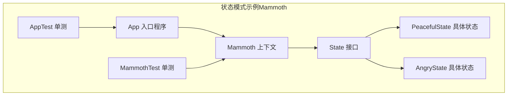
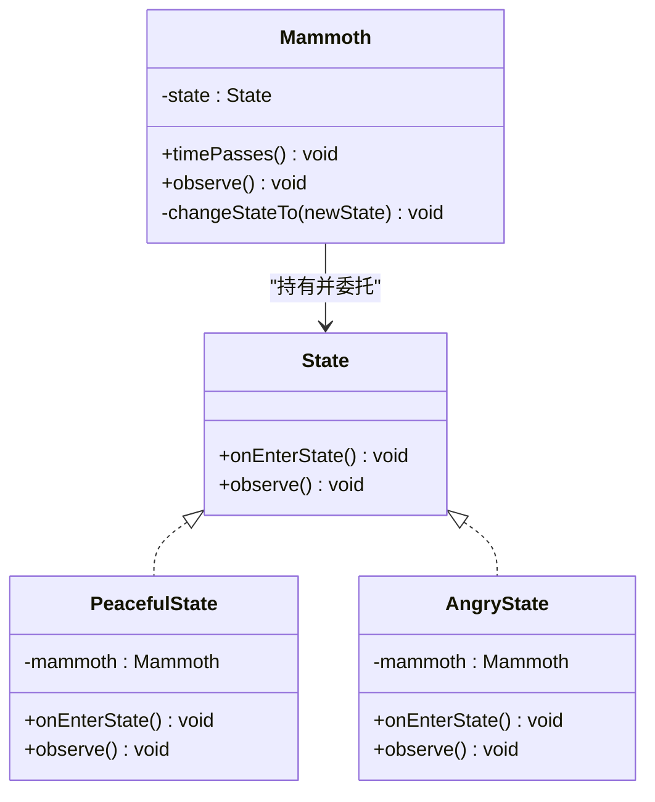
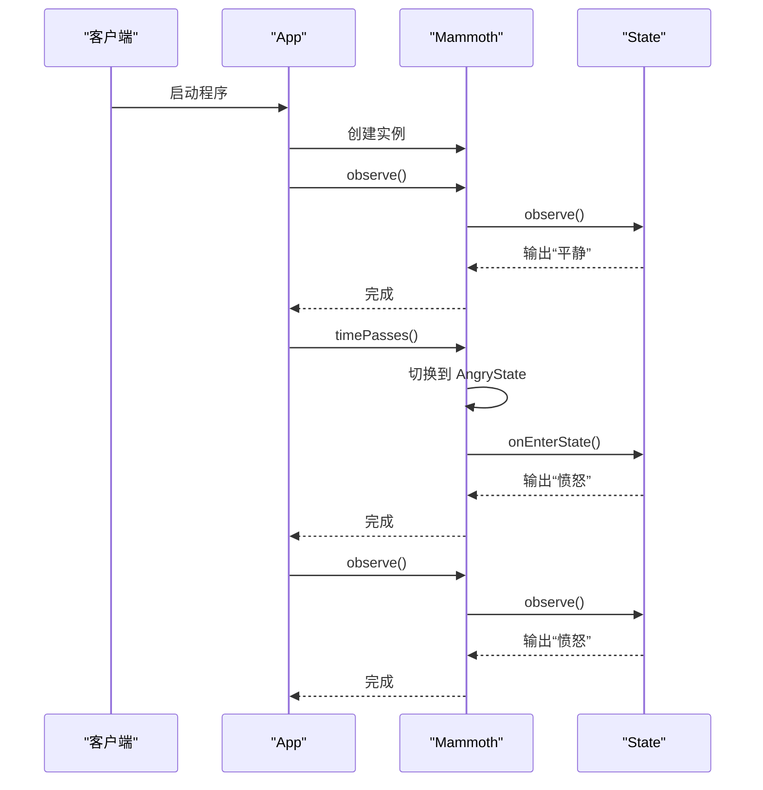
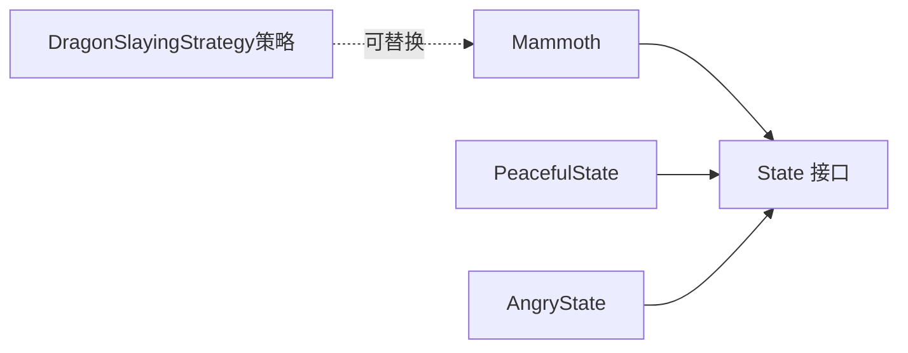
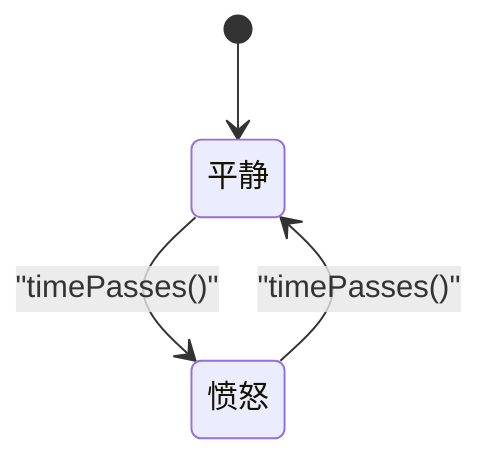
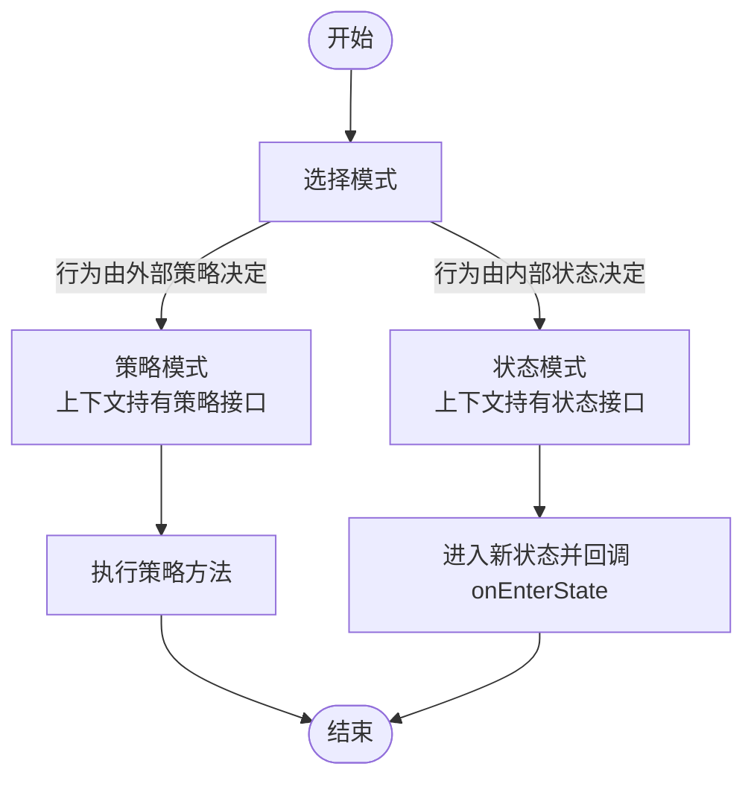

# 状态模式

<cite>
**本文引用的文件**
- [State.java](file://state/src/main/java/com/iluwatar/state/State.java)
- [AngryState.java](file://state/src/main/java/com/iluwatar/state/AngryState.java)
- [PeacefulState.java](file://state/src/main/java/com/iluwatar/state/PeacefulState.java)
- [Mammoth.java](file://state/src/main/java/com/iluwatar/state/Mammoth.java)
- [App.java](file://state/src/main/java/com/iluwatar/state/App.java)
- [AppTest.java](file://state/src/test/java/com/iluwatar/state/AppTest.java)
- [MammothTest.java](file://state/src/test/java/com/iluwatar/state/MammothTest.java)
- [README.md（状态模式）](file://state/README.md)
- [state_urm.png](file://state/etc/state_urm.png)
- [strategy_urm.png](file://strategy/etc/strategy_urm.png)
- [DragonSlayingStrategy.java](file://strategy/src/main/java/com/iluwatar/strategy/DragonSlayingStrategy.java)
</cite>

## 目录
1. [引言](#引言)
2. [项目结构](#项目结构)
3. [核心组件](#核心组件)
4. [架构总览](#架构总览)
5. [详细组件分析](#详细组件分析)
6. [依赖关系分析](#依赖关系分析)
7. [性能考量](#性能考量)
8. [故障排查指南](#故障排查指南)
9. [结论](#结论)
10. [附录：状态转换图与状态机](#附录状态转换图与状态机)

## 引言
本文件围绕“状态模式”进行系统化技术文档整理，结合仓库中“state”示例（Mammoth 的情绪状态切换）与“strategy”示例（策略接口），阐释状态模式如何通过将对象在不同内部状态下的行为封装到独立状态类中，使对象在运行时根据状态变化而改变行为。文档同时对比状态模式与策略模式的异同，并给出在游戏开发（角色状态、UI 状态、工作流状态机）中的应用建议与最佳实践。

## 项目结构
该示例位于 state 模块，包含一个上下文类与两个状态类，以及入口程序与测试用例；同时提供 README.md 作为概念与示例说明，以及一张 UML 图文件。

**图表来源**
- [State.java](file://state/src/main/java/com/iluwatar/state/State.java#L30-L35)
- [PeacefulState.java](file://state/src/main/java/com/iluwatar/state/PeacefulState.java#L32-L51)
- [AngryState.java](file://state/src/main/java/com/iluwatar/state/AngryState.java#L32-L51)
- [Mammoth.java](file://state/src/main/java/com/iluwatar/state/Mammoth.java#L30-L62)
- [App.java](file://state/src/main/java/com/iluwatar/state/App.java#L36-L49)
- [AppTest.java](file://state/src/test/java/com/iluwatar/state/AppTest.java#L34-L39)
- [MammothTest.java](file://state/src/test/java/com/iluwatar/state/MammothTest.java#L44-L86)

**章节来源**
- [README.md（状态模式）](file://state/README.md#L1-L192)
- [state_urm.png](file://state/etc/state_urm.png)

## 核心组件
- State 接口：定义状态对象的行为契约，包括进入状态时的回调与观察行为。
- PeacefulState 与 AngryState：两个具体状态类，分别封装“平静/愤怒”两种行为，并在进入状态与被观察时输出对应日志。
- Mammoth：上下文类，持有当前状态对象并在时间推进时进行状态切换；对外暴露观察与时间推进接口。
- App：示例入口，演示状态切换与行为变化。
- 测试：验证行为输出顺序与 toString 行为。

**章节来源**
- [State.java](file://state/src/main/java/com/iluwatar/state/State.java#L30-L35)
- [PeacefulState.java](file://state/src/main/java/com/iluwatar/state/PeacefulState.java#L32-L51)
- [AngryState.java](file://state/src/main/java/com/iluwatar/state/AngryState.java#L32-L51)
- [Mammoth.java](file://state/src/main/java/com/iluwatar/state/Mammoth.java#L30-L62)
- [App.java](file://state/src/main/java/com/iluwatar/state/App.java#L36-L49)
- [AppTest.java](file://state/src/test/java/com/iluwatar/state/AppTest.java#L34-L39)
- [MammothTest.java](file://state/src/test/java/com/iluwatar/state/MammothTest.java#L44-L86)

## 架构总览
状态模式将“可变行为”从上下文类中抽离到一组状态类中，上下文仅维护当前状态并委托行为给状态对象。当状态切换发生时，上下文更新状态并调用新状态的进入回调，从而实现行为的动态变化。

**图表来源**
- [State.java](file://state/src/main/java/com/iluwatar/state/State.java#L30-L35)
- [PeacefulState.java](file://state/src/main/java/com/iluwatar/state/PeacefulState.java#L32-L51)
- [AngryState.java](file://state/src/main/java/com/iluwatar/state/AngryState.java#L32-L51)
- [Mammoth.java](file://state/src/main/java/com/iluwatar/state/Mammoth.java#L30-L62)

## 详细组件分析

### State 接口
- 职责：定义状态对象的统一行为规范，包括进入状态回调与观察行为。
- 设计要点：接口最小化，便于扩展新的状态类型；避免在上下文中散落大量条件分支。

**章节来源**
- [State.java](file://state/src/main/java/com/iluwatar/state/State.java#L30-L35)

### PeacefulState（平静状态）
- 职责：封装“平静/观察”行为；进入状态时打印“平静”日志。
- 关键点：构造函数注入上下文引用，以便在日志中体现上下文身份。

**章节来源**
- [PeacefulState.java](file://state/src/main/java/com/iluwatar/state/PeacefulState.java#L32-L51)

### AngryState（愤怒状态）
- 职责：封装“愤怒/观察”行为；进入状态时打印“愤怒”日志。
- 关键点：与平静状态形成互补，共同构成二元状态机。

**章节来源**
- [AngryState.java](file://state/src/main/java/com/iluwatar/state/AngryState.java#L32-L51)

### Mammoth（上下文）
- 内部状态：持有当前 State 对象。
- 初始化：默认处于“平静”状态。
- 状态切换：通过 timePasses 判断当前状态并切换到对立状态，随后调用新状态的进入回调。
- 观察行为：将观察请求委托给当前状态。
- toString：返回固定字符串，用于日志输出标识。

**图表来源**
- [App.java](file://state/src/main/java/com/iluwatar/state/App.java#L41-L49)
- [Mammoth.java](file://state/src/main/java/com/iluwatar/state/Mammoth.java#L38-L61)
- [PeacefulState.java](file://state/src/main/java/com/iluwatar/state/PeacefulState.java#L41-L49)
- [AngryState.java](file://state/src/main/java/com/iluwatar/state/AngryState.java#L41-L49)

**章节来源**
- [Mammoth.java](file://state/src/main/java/com/iluwatar/state/Mammoth.java#L30-L62)

### App（示例入口）
- 功能：按顺序调用 observe、timePasses、observe、timePasses、observe，展示状态切换与行为变化。
- 验证：配合单测确保无异常执行。

**章节来源**
- [App.java](file://state/src/main/java/com/iluwatar/state/App.java#L36-L49)
- [AppTest.java](file://state/src/test/java/com/iluwatar/state/AppTest.java#L34-L39)

### 测试（MammothTest）
- 行为验证：依次断言 observe 与 timePasses 的输出顺序，覆盖完整的情绪循环。
- toString 验证：确保上下文字符串表示符合预期。

**章节来源**
- [MammothTest.java](file://state/src/test/java/com/iluwatar/state/MammothTest.java#L44-L86)
- [MammothTest.java](file://state/src/test/java/com/iluwatar/state/MammothTest.java#L91-L96)

## 依赖关系分析
- 上下文对状态接口的依赖：Mammoth 仅依赖 State 接口，不关心具体状态实现，满足开闭原则。
- 状态类之间的关系：彼此独立，可通过共享或缓存复用（参考 README 中的 Flyweight 提示）。
- 与策略模式的关系：两者结构相似，但状态模式强调“状态驱动行为”，策略模式强调“算法可替换”。详见后文对比。

**图表来源**
- [Mammoth.java](file://state/src/main/java/com/iluwatar/state/Mammoth.java#L30-L62)
- [State.java](file://state/src/main/java/com/iluwatar/state/State.java#L30-L35)
- [DragonSlayingStrategy.java](file://strategy/src/main/java/com/iluwatar/strategy/DragonSlayingStrategy.java#L27-L35)

**章节来源**
- [README.md（状态模式）](file://state/README.md#L163-L185)
- [strategy_urm.png](file://strategy/etc/strategy_urm.png)

## 性能考量
- 状态对象复用：可将常用状态作为单例或共享对象，减少频繁创建带来的 GC 压力（参考 README 中的 Singleton/Flyweight 提示）。
- 状态切换成本：切换逻辑简单（一次赋值+一次回调），通常可忽略；若状态数量较多，可考虑映射表或枚举驱动的切换逻辑以降低分支复杂度。
- 日志与 I/O：示例中使用日志输出行为，生产环境应关注日志级别与采样策略，避免高频状态切换造成性能瓶颈。

[本节为通用指导，无需特定文件引用]

## 故障排查指南
- 行为不符合预期：检查上下文是否正确调用 observe 与 timePasses；确认状态切换条件与顺序。
- 状态未生效：确认 changeStateTo 是否被调用且 onEnterState 是否被执行。
- 单测失败：核对日志输出顺序与内容，确保测试中对日志的收集与断言逻辑正确。

**章节来源**
- [MammothTest.java](file://state/src/test/java/com/iluwatar/state/MammothTest.java#L62-L86)
- [Mammoth.java](file://state/src/main/java/com/iluwatar/state/Mammoth.java#L41-L52)

## 结论
状态模式通过将对象在不同内部状态下的行为封装到独立状态类中，实现了行为的动态切换与职责分离，显著提升了可维护性与可扩展性。与策略模式相比，状态模式更强调“状态驱动行为”的语义，适合处理具有明确状态机特征的业务场景。在实际工程中，可结合共享/缓存策略优化性能，并通过测试保障状态切换的正确性。

[本节为总结性内容，无需特定文件引用]

## 附录：状态转换图与状态机

### 状态转换图（Mammoth 情绪状态）

**图表来源**
- [Mammoth.java](file://state/src/main/java/com/iluwatar/state/Mammoth.java#L41-L47)
- [PeacefulState.java](file://state/src/main/java/com/iluwatar/state/PeacefulState.java#L47-L49)
- [AngryState.java](file://state/src/main/java/com/iluwatar/state/AngryState.java#L47-L49)

### 状态模式与策略模式对比流程

**图表来源**
- [State.java](file://state/src/main/java/com/iluwatar/state/State.java#L30-L35)
- [DragonSlayingStrategy.java](file://strategy/src/main/java/com/iluwatar/strategy/DragonSlayingStrategy.java#L27-L35)

### 游戏开发中的应用建议
- 角色状态管理：将角色的“待机/移动/攻击/受击/死亡”等状态封装为状态类，通过状态机驱动行为切换。
- UI 状态切换：页面/面板的“加载中/成功/错误/空数据”等状态可用状态机管理，提升交互一致性。
- 工作流状态机：订单/审批/发布等流程节点的状态流转可采用状态机建模，清晰表达转换条件与触发事件。

[本节为概念性内容，无需特定文件引用]