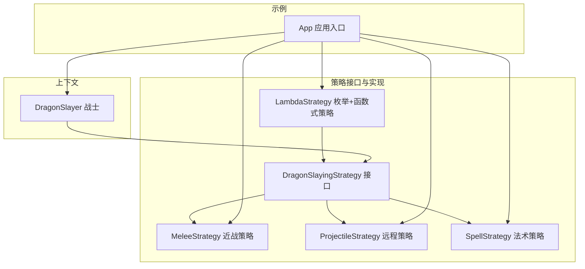
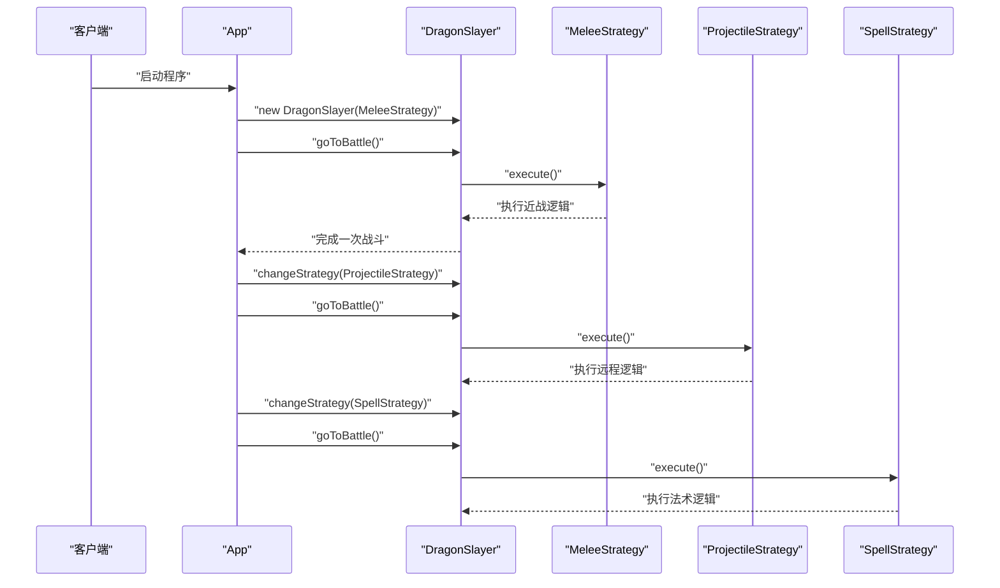
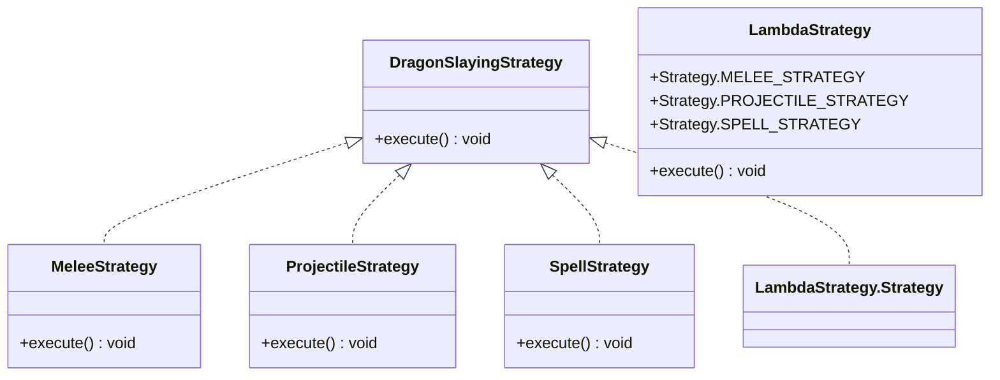
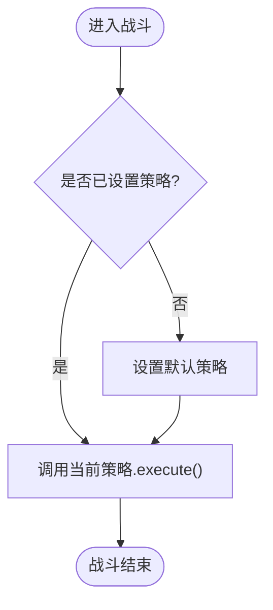
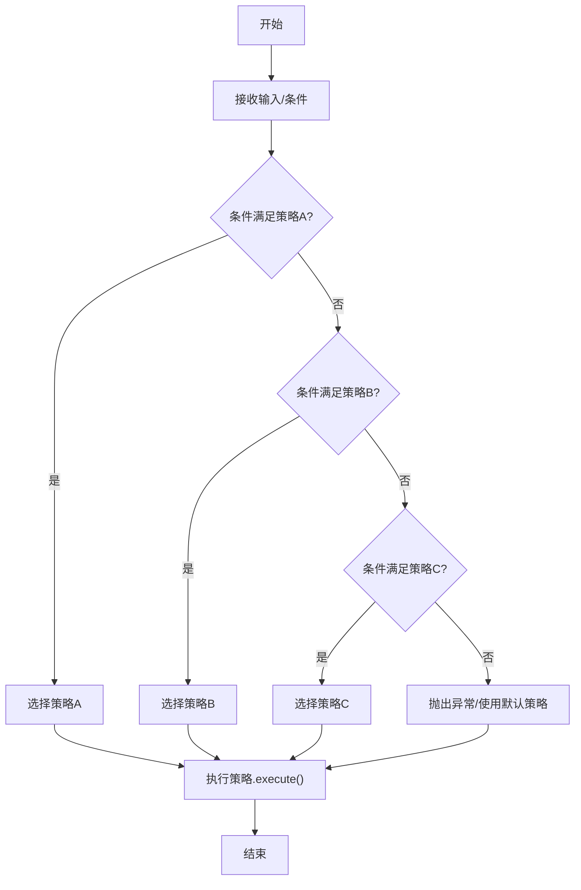
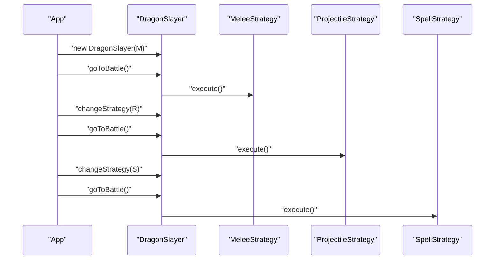
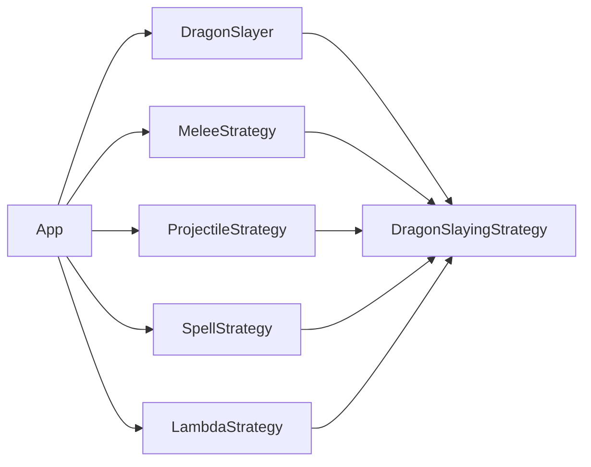

# 策略模式

<cite>
**本文引用的文件**
- [DragonSlayingStrategy.java](file://strategy/src/main/java/com/iluwatar/strategy/DragonSlayingStrategy.java)
- [MeleeStrategy.java](file://strategy/src/main/java/com/iluwatar/strategy/MeleeStrategy.java)
- [ProjectileStrategy.java](file://strategy/src/main/java/com/iluwatar/strategy/ProjectileStrategy.java)
- [SpellStrategy.java](file://strategy/src/main/java/com/iluwatar/strategy/SpellStrategy.java)
- [LambdaStrategy.java](file://strategy/src/main/java/com/iluwatar/strategy/LambdaStrategy.java)
- [DragonSlayer.java](file://strategy/src/main/java/com/iluwatar/strategy/DragonSlayer.java)
- [App.java](file://strategy/src/main/java/com/iluwatar/strategy/App.java)
- [AppTest.java](file://strategy/src/test/java/com/iluwatar/strategy/AppTest.java)
- [DragonSlayerTest.java](file://strategy/src/test/java/com/iluwatar/strategy/DragonSlayerTest.java)
- [DragonSlayingStrategyTest.java](file://strategy/src/test/java/com/iluwatar/strategy/DragonSlayingStrategyTest.java)
- [README.md](file://strategy/README.md)
</cite>

## 目录
1. [引言](#引言)
2. [项目结构](#项目结构)
3. [核心组件](#核心组件)
4. [架构总览](#架构总览)
5. [详细组件分析](#详细组件分析)
6. [依赖分析](#依赖分析)
7. [性能考虑](#性能考虑)
8. [故障排查指南](#故障排查指南)
9. [结论](#结论)
10. [附录](#附录)

## 引言
本文件系统性阐述策略模式（Strategy Pattern）在 Java 中的实现与应用，围绕“可互换算法”的设计理念展开，重点解析以下内容：
- 策略接口与多种策略实现（如近战、远程、法术）如何封装不同行为；
- 上下文对象如何持有并动态切换策略；
- 使用函数式接口、Lambda 表达式与枚举实现策略的现代化实践；
- 在游戏战斗场景中的应用：根据对手类型动态选择最优策略；
- 策略模式在排序算法选择、支付方式切换等常见业务中的扩展思路；
- 提供策略选择流程图与算法对比表，帮助读者快速定位适用场景。

## 项目结构
该模块采用按功能分层的组织方式，核心代码位于 strategy 模块的 main/java 下，测试代码位于 test/java 下。主要文件职责如下：
- DragonSlayingStrategy：策略接口，定义统一的行为契约；
- MeleeStrategy、ProjectileStrategy、SpellStrategy：具体策略实现，分别代表不同的战斗方式；
- LambdaStrategy：基于枚举与函数式接口的策略实现示例；
- DragonSlayer：上下文对象，维护当前策略并在运行时进行切换；
- App：示例入口，演示三种不同策略的动态切换；
- 测试用例：验证策略执行、上下文切换与日志输出。

图表来源
- [DragonSlayingStrategy.java](file://strategy/src/main/java/com/iluwatar/strategy/DragonSlayingStrategy.java#L27-L35)
- [MeleeStrategy.java](file://strategy/src/main/java/com/iluwatar/strategy/MeleeStrategy.java#L29-L39)
- [ProjectileStrategy.java](file://strategy/src/main/java/com/iluwatar/strategy/ProjectileStrategy.java#L29-L39)
- [SpellStrategy.java](file://strategy/src/main/java/com/iluwatar/strategy/SpellStrategy.java#L29-L40)
- [LambdaStrategy.java](file://strategy/src/main/java/com/iluwatar/strategy/LambdaStrategy.java#L33-L56)
- [DragonSlayer.java](file://strategy/src/main/java/com/iluwatar/strategy/DragonSlayer.java#L30-L45)
- [App.java](file://strategy/src/main/java/com/iluwatar/strategy/App.java#L43-L90)

章节来源
- [README.md](file://strategy/README.md#L1-L222)

## 核心组件
- 策略接口（DragonSlayingStrategy）
  - 定义统一的执行方法，作为所有策略的抽象契约；
  - 使用函数式注解，便于以 Lambda 或方法引用形式注入策略。
- 具体策略
  - 近战策略（MeleeStrategy）：模拟使用武器进行物理攻击；
  - 远程策略（ProjectileStrategy）：模拟使用投射武器进行远程打击；
  - 法术策略（SpellStrategy）：模拟使用魔法进行范围或单体攻击；
  - 枚举+函数式策略（LambdaStrategy）：通过枚举项持有函数式策略，实现“枚举即策略”的轻量写法。
- 上下文（DragonSlayer）
  - 维护当前策略实例，提供变更策略的方法；
  - 在战斗阶段调用策略的执行方法，实现行为的动态替换。
- 示例入口（App）
  - 展示三种策略的初始化与切换过程；
  - 同时演示函数式接口与枚举策略的使用方式。

章节来源
- [DragonSlayingStrategy.java](file://strategy/src/main/java/com/iluwatar/strategy/DragonSlayingStrategy.java#L27-L35)
- [MeleeStrategy.java](file://strategy/src/main/java/com/iluwatar/strategy/MeleeStrategy.java#L29-L39)
- [ProjectileStrategy.java](file://strategy/src/main/java/com/iluwatar/strategy/ProjectileStrategy.java#L29-L39)
- [SpellStrategy.java](file://strategy/src/main/java/com/iluwatar/strategy/SpellStrategy.java#L29-L40)
- [LambdaStrategy.java](file://strategy/src/main/java/com/iluwatar/strategy/LambdaStrategy.java#L33-L56)
- [DragonSlayer.java](file://strategy/src/main/java/com/iluwatar/strategy/DragonSlayer.java#L30-L45)
- [App.java](file://strategy/src/main/java/com/iluwatar/strategy/App.java#L43-L90)

## 架构总览
策略模式的典型交互流程如下：客户端创建上下文并注入一个具体策略；随后根据运行时条件切换到另一个策略；上下文仅通过策略接口进行交互，隐藏了具体算法细节。

图表来源
- [App.java](file://strategy/src/main/java/com/iluwatar/strategy/App.java#L54-L89)
- [DragonSlayer.java](file://strategy/src/main/java/com/iluwatar/strategy/DragonSlayer.java#L30-L45)
- [MeleeStrategy.java](file://strategy/src/main/java/com/iluwatar/strategy/MeleeStrategy.java#L32-L39)
- [ProjectileStrategy.java](file://strategy/src/main/java/com/iluwatar/strategy/ProjectileStrategy.java#L32-L39)
- [SpellStrategy.java](file://strategy/src/main/java/com/iluwatar/strategy/SpellStrategy.java#L32-L40)

## 详细组件分析

### 策略接口与实现类关系
策略接口定义统一行为，具体策略实现各自算法，上下文仅依赖接口，从而实现“算法可替换”。

图表来源
- [DragonSlayingStrategy.java](file://strategy/src/main/java/com/iluwatar/strategy/DragonSlayingStrategy.java#L27-L35)
- [MeleeStrategy.java](file://strategy/src/main/java/com/iluwatar/strategy/MeleeStrategy.java#L29-L39)
- [ProjectileStrategy.java](file://strategy/src/main/java/com/iluwatar/strategy/ProjectileStrategy.java#L29-L39)
- [SpellStrategy.java](file://strategy/src/main/java/com/iluwatar/strategy/SpellStrategy.java#L29-L40)
- [LambdaStrategy.java](file://strategy/src/main/java/com/iluwatar/strategy/LambdaStrategy.java#L33-L56)

章节来源
- [DragonSlayingStrategy.java](file://strategy/src/main/java/com/iluwatar/strategy/DragonSlayingStrategy.java#L27-L35)
- [MeleeStrategy.java](file://strategy/src/main/java/com/iluwatar/strategy/MeleeStrategy.java#L29-L39)
- [ProjectileStrategy.java](file://strategy/src/main/java/com/iluwatar/strategy/ProjectileStrategy.java#L29-L39)
- [SpellStrategy.java](file://strategy/src/main/java/com/iluwatar/strategy/SpellStrategy.java#L29-L40)
- [LambdaStrategy.java](file://strategy/src/main/java/com/iluwatar/strategy/LambdaStrategy.java#L33-L56)

### 上下文与策略协作
DragonSlayer 作为上下文，负责持有当前策略并在战斗时委托执行。其设计体现了“对扩展开放，对修改关闭”的原则：新增策略无需改动上下文，只需实现接口即可无缝接入。

图表来源
- [DragonSlayer.java](file://strategy/src/main/java/com/iluwatar/strategy/DragonSlayer.java#L30-L45)

章节来源
- [DragonSlayer.java](file://strategy/src/main/java/com/iluwatar/strategy/DragonSlayer.java#L30-L45)

### 策略选择流程图
该流程图展示了在运行时根据环境或需求选择合适策略的过程，强调“可插拔”与“可替换”的特性。

（该图为概念性流程示意，不直接映射到具体源码文件）

### 算法对比表
以下表格从“适用场景、优点、缺点、复杂度”维度对比三种策略，帮助快速决策：

- 近战策略（MeleeStrategy）
  - 适用场景：面对高防御或近身敌人，需要高爆发伤害；
  - 优点：实现简单、执行直接；
  - 缺点：对距离敏感，易被远程单位消耗；
  - 复杂度：O(1) 执行时间，无额外空间开销。
- 远程策略（ProjectileStrategy）
  - 适用场景：需要保持安全距离，对移动目标进行打击；
  - 优点：灵活性强，可风筝战术；
  - 缺点：可能被控制技能打断；
  - 复杂度：O(1)，受弹道与命中判定影响。
- 法术策略（SpellStrategy）
  - 适用场景：群体伤害或控制型敌人；
  - 优点：范围效果显著，可配合控制；
  - 缺点：冷却与资源限制明显；
  - 复杂度：O(1)，但受法力/能量上限约束。

（该表为概念性总结，不直接映射到具体源码文件）

### 示例：完整策略切换演示
App 类中演示了三种策略的初始化与切换，并输出对应日志信息，验证策略模式在运行时的动态选择与执行。

图表来源
- [App.java](file://strategy/src/main/java/com/iluwatar/strategy/App.java#L54-L89)
- [DragonSlayer.java](file://strategy/src/main/java/com/iluwatar/strategy/DragonSlayer.java#L30-L45)
- [MeleeStrategy.java](file://strategy/src/main/java/com/iluwatar/strategy/MeleeStrategy.java#L32-L39)
- [ProjectileStrategy.java](file://strategy/src/main/java/com/iluwatar/strategy/ProjectileStrategy.java#L32-L39)
- [SpellStrategy.java](file://strategy/src/main/java/com/iluwatar/strategy/SpellStrategy.java#L32-L40)

章节来源
- [App.java](file://strategy/src/main/java/com/iluwatar/strategy/App.java#L54-L89)

## 依赖分析
- 组件内聚与耦合
  - 策略接口与实现之间为单向依赖，策略实现不依赖上下文，降低耦合；
  - 上下文仅依赖策略接口，遵循“面向接口编程”的原则；
  - LambdaStrategy 通过枚举持有策略，进一步减少类数量，提升可读性。
- 外部依赖
  - 日志框架（SLF4J）用于输出策略执行结果；
  - JUnit/Mockito 用于单元测试，验证策略执行与上下文切换。
- 可能的循环依赖
  - 当前结构无循环依赖，接口与实现分层清晰。

图表来源
- [DragonSlayer.java](file://strategy/src/main/java/com/iluwatar/strategy/DragonSlayer.java#L30-L45)
- [DragonSlayingStrategy.java](file://strategy/src/main/java/com/iluwatar/strategy/DragonSlayingStrategy.java#L27-L35)
- [MeleeStrategy.java](file://strategy/src/main/java/com/iluwatar/strategy/MeleeStrategy.java#L29-L39)
- [ProjectileStrategy.java](file://strategy/src/main/java/com/iluwatar/strategy/ProjectileStrategy.java#L29-L39)
- [SpellStrategy.java](file://strategy/src/main/java/com/iluwatar/strategy/SpellStrategy.java#L29-L40)
- [LambdaStrategy.java](file://strategy/src/main/java/com/iluwatar/strategy/LambdaStrategy.java#L33-L56)
- [App.java](file://strategy/src/main/java/com/iluwatar/strategy/App.java#L43-L90)

章节来源
- [DragonSlayer.java](file://strategy/src/main/java/com/iluwatar/strategy/DragonSlayer.java#L30-L45)
- [DragonSlayingStrategy.java](file://strategy/src/main/java/com/iluwatar/strategy/DragonSlayingStrategy.java#L27-L35)
- [MeleeStrategy.java](file://strategy/src/main/java/com/iluwatar/strategy/MeleeStrategy.java#L29-L39)
- [ProjectileStrategy.java](file://strategy/src/main/java/com/iluwatar/strategy/ProjectileStrategy.java#L29-L39)
- [SpellStrategy.java](file://strategy/src/main/java/com/iluwatar/strategy/SpellStrategy.java#L29-L40)
- [LambdaStrategy.java](file://strategy/src/main/java/com/iluwatar/strategy/LambdaStrategy.java#L33-L56)
- [App.java](file://strategy/src/main/java/com/iluwatar/strategy/App.java#L43-L90)

## 性能考虑
- 时间复杂度
  - 策略执行通常为 O(1)，策略切换为 O(1)，整体开销极低；
  - 若策略内部涉及复杂计算或 IO，需关注其自身复杂度与缓存策略。
- 空间复杂度
  - 增加了策略对象实例，但避免了大量条件分支带来的分支预测开销；
  - 函数式策略与枚举策略可减少类数量，降低内存占用。
- 可维护性
  - 新增策略只需实现接口，不影响现有代码；
  - 通过配置或工厂模式可进一步解耦策略选择逻辑。

（本节为通用指导，不直接分析具体文件）

## 故障排查指南
- 现象：策略未生效或未输出日志
  - 检查上下文是否正确持有策略实例；
  - 确认策略的 execute 方法是否被调用；
  - 参考测试用例验证策略执行路径。
- 现象：策略切换后仍执行旧逻辑
  - 确认 changeStrategy 是否被调用且传入新策略；
  - 避免在多线程环境下共享同一策略实例导致竞态。
- 单元测试参考
  - AppTest：验证主程序可正常运行；
  - DragonSlayerTest：验证上下文在切换前后调用正确的策略；
  - DragonSlayingStrategyTest：验证各策略执行输出符合预期。

章节来源
- [AppTest.java](file://strategy/src/test/java/com/iluwatar/strategy/AppTest.java#L34-L40)
- [DragonSlayerTest.java](file://strategy/src/test/java/com/iluwatar/strategy/DragonSlayerTest.java#L37-L70)
- [DragonSlayingStrategyTest.java](file://strategy/src/test/java/com/iluwatar/strategy/DragonSlayingStrategyTest.java#L45-L114)

## 结论
策略模式通过“将算法封装为对象并使其可互换”，实现了行为的动态选择与扩展。在本示例中，DragonSlayer 作为上下文，通过持有 DragonSlayingStrategy 接口，能够在运行时灵活切换 MeleeStrategy、ProjectileStrategy、SpellStrategy 以及 LambdaStrategy 的枚举策略。该模式在游戏 AI、排序算法选择、支付方式切换等场景具有广泛适用性，能够有效降低条件分支复杂度、提升系统的可维护性与可扩展性。

（本节为总结性内容，不直接分析具体文件）

## 附录
- 实际代码示例路径（不含代码内容）
  - 策略接口定义：[DragonSlayingStrategy.java](file://strategy/src/main/java/com/iluwatar/strategy/DragonSlayingStrategy.java#L27-L35)
  - 近战策略实现：[MeleeStrategy.java](file://strategy/src/main/java/com/iluwatar/strategy/MeleeStrategy.java#L29-L39)
  - 远程策略实现：[ProjectileStrategy.java](file://strategy/src/main/java/com/iluwatar/strategy/ProjectileStrategy.java#L29-L39)
  - 法术策略实现：[SpellStrategy.java](file://strategy/src/main/java/com/iluwatar/strategy/SpellStrategy.java#L29-L40)
  - 枚举+函数式策略：[LambdaStrategy.java](file://strategy/src/main/java/com/iluwatar/strategy/LambdaStrategy.java#L33-L56)
  - 上下文与策略协作：[DragonSlayer.java](file://strategy/src/main/java/com/iluwatar/strategy/DragonSlayer.java#L30-L45)
  - 完整示例入口：[App.java](file://strategy/src/main/java/com/iluwatar/strategy/App.java#L43-L90)
  - 测试用例参考：[AppTest.java](file://strategy/src/test/java/com/iluwatar/strategy/AppTest.java#L34-L40)、[DragonSlayerTest.java](file://strategy/src/test/java/com/iluwatar/strategy/DragonSlayerTest.java#L37-L70)、[DragonSlayingStrategyTest.java](file://strategy/src/test/java/com/iluwatar/strategy/DragonSlayingStrategyTest.java#L45-L114)
- 更多背景与实践建议
  - 参考模块自述文档：[README.md](file://strategy/README.md#L1-L222)