# 行为型模式

<cite>
**本文引用的文件**
- [README.md](file://README.md)
- [observer/README.md](file://observer/README.md)
- [observer/src/main/java/com/iluwatar/observer/App.java](file://observer/src/main/java/com/iluwatar/observer/App.java)
- [observer/src/main/java/com/iluwatar/observer/Hobbits.java](file://observer/src/main/java/com/iluwatar/observer/Hobbits.java)
- [observer/src/main/java/com/iluwatar/observer/Orcs.java](file://observer/src/main/java/com/iluwatar/observer/Orcs.java)
- [observer/src/main/java/com/iluwatar/observer/Weather.java](file://observer/src/main/java/com/iluwatar/observer/Weather.java)
- [observer/src/main/java/com/iluwatar/observer/WeatherObserver.java](file://observer/src/main/java/com/iluwatar/observer/WeatherObserver.java)
- [observer/src/main/java/com/iluwatar/observer/WeatherType.java](file://observer/src/main/java/com/iluwatar/observer/WeatherType.java)
- [observer/src/main/java/com/iluwatar/observer/generic/Observable.java](file://observer/src/main/java/com/iluwatar/observer/generic/Observable.java)
- [observer/src/main/java/com/iluwatar/observer/generic/Observer.java](file://observer/src/main/java/com/iluwatar/observer/generic/Observer.java)
- [observer/src/main/java/com/iluwatar/observer/generic/Race.java](file://observer/src/main/java/com/iluwatar/observer/generic/Race.java)
- [observer/src/main/java/com/iluwatar/observer/generic/GenHobbits.java](file://observer/src/main/java/com/iluwatar/observer/generic/GenHobbits.java)
- [observer/src/main/java/com/iluwatar/observer/generic/GenOrcs.java](file://observer/src/main/java/com/iluwatar/observer/generic/GenOrcs.java)
- [observer/src/main/java/com/iluwatar/observer/generic/GenWeather.java](file://observer/src/main/java/com/iluwatar/observer/generic/GenWeather.java)
- [command/README.md](file://command/README.md)
- [command/src/main/java/com/iluwatar/command/App.java](file://command/src/main/java/com/iluwatar/command/App.java)
- [command/src/main/java/com/iluwatar/command/Goblin.java](file://command/src/main/java/com/iluwatar/command/Goblin.java)
- [command/src/main/java/com/iluwatar/command/Size.java](file://command/src/main/java/com/iluwatar/command/Size.java)
- [command/src/main/java/com/iluwatar/command/Target.java](file://command/src/main/java/com/iluwatar/command/Target.java)
- [command/src/main/java/com/iluwatar/command/Visibility.java](file://command/src/main/java/com/iluwatar/command/Visibility.java)
- [command/src/main/java/com/iluwatar/command/Wizard.java](file://command/src/main/java/com/iluwatar/command/Wizard.java)
- [strategy/README.md](file://strategy/README.md)
- [strategy/src/main/java/com/iluwatar/strategy/App.java](file://strategy/src/main/java/com/iluwatar/strategy/App.java)
- [strategy/src/main/java/com/iluwatar/strategy/DragonSlayer.java](file://strategy/src/main/java/com/iluwatar/strategy/DragonSlayer.java)
- [strategy/src/main/java/com/iluwatar/strategy/DragonSlayingStrategy.java](file://strategy/src/main/java/com/iluwatar/strategy/DragonSlayingStrategy.java)
- [strategy/src/main/java/com/iluwatar/strategy/LambdaStrategy.java](file://strategy/src/main/java/com/iluwatar/strategy/LambdaStrategy.java)
- [strategy/src/main/java/com/iluwatar/strategy/MeleeStrategy.java](file://strategy/src/main/java/com/iluwatar/strategy/MeleeStrategy.java)
- [strategy/src/main/java/com/iluwatar/strategy/ProjectileStrategy.java](file://strategy/src/main/java/com/iluwatar/strategy/ProjectileStrategy.java)
- [strategy/src/main/java/com/iluwatar/strategy/SpellStrategy.java](file://strategy/src/main/java/com/iluwatar/strategy/SpellStrategy.java)
- [state/README.md](file://state/README.md)
- [state/src/main/java/com/iluwatar/state/App.java](file://state/src/main/java/com/iluwatar/state/App.java)
- [state/src/main/java/com/iluwatar/state/Mammoth.java](file://state/src/main/java/com/iluwatar/state/Mammoth.java)
- [state/src/main/java/com/iluwatar/state/PeacefulState.java](file://state/src/main/java/com/iluwatar/state/PeacefulState.java)
- [state/src/main/java/com/iluwatar/state/AngryState.java](file://state/src/main/java/com/iluwatar/state/AngryState.java)
- [state/src/main/java/com/iluwatar/state/State.java](file://state/src/main/java/com/iluwatar/state/State.java)
- [template-method/README.md](file://template-method/README.md)
- [template-method/src/main/java/com/iluwatar/templatemethod/App.java](file://template-method/src/main/java/com/iluwatar/templatemethod/App.java)
- [template-method/src/main/java/com/iluwatar/templatemethod/HalflingThief.java](file://template-method/src/main/java/com/iluwatar/templatemethod/HalflingThief.java)
- [template-method/src/main/java/com/iluwatar/templatemethod/StealingMethod.java](file://template-method/src/main/java/com/iluwatar/templatemethod/StealingMethod.java)
- [template-method/src/main/java/com/iluwatar/templatemethod/HitAndRunMethod.java](file://template-method/src/main/java/com/iluwatar/templatemethod/HitAndRunMethod.java)
- [template-method/src/main/java/com/iluwatar/templatemethod/SubtleMethod.java](file://template-method/src/main/java/com/iluwatar/templatemethod/SubtleMethod.java)
- [chain-of-responsibility/README.md](file://chain-of-responsibility/README.md)
- [chain-of-responsibility/src/main/java/com/iluwatar/chain/App.java](file://chain-of-responsibility/src/main/java/com/iluwatar/chain/App.java)
- [chain-of-responsibility/src/main/java/com/iluwatar/chain/OrcCommander.java](file://chain-of-responsibility/src/main/java/com/iluwatar/chain/OrcCommander.java)
- [chain-of-responsibility/src/main/java/com/iluwatar/chain/OrcKing.java](file://chain-of-responsibility/src/main/java/com/iluwatar/chain/OrcKing.java)
- [chain-of-responsibility/src/main/java/com/iluwatar/chain/OrcOfficer.java](file://chain-of-responsibility/src/main/java/com/iluwatar/chain/OrcOfficer.java)
- [chain-of-responsibility/src/main/java/com/iluwatar/chain/OrcSoldier.java](file://chain-of-responsibility/src/main/java/com/iluwatar/chain/OrcSoldier.java)
- [chain-of-responsibility/src/main/java/com/iluwatar/chain/Request.java](file://chain-of-responsibility/src/main/java/com/iluwatar/chain/Request.java)
- [chain-of-responsibility/src/main/java/com/iluwatar/chain/RequestHandler.java](file://chain-of-responsibility/src/main/java/com/iluwatar/chain/RequestHandler.java)
- [chain-of-responsibility/src/main/java/com/iluwatar/chain/RequestType.java](file://chain-of-responsibility/src/main/java/com/iluwatar/chain/RequestType.java)
- [iterator/README.md](file://iterator/README.md)
- [iterator/src/main/java/com/iluwatar/iterator/App.java](file://iterator/src/main/java/com/iluwatar/iterator/App.java)
- [iterator/src/main/java/com/iluwatar/iterator/Iterator.java](file://iterator/src/main/java/com/iluwatar/iterator/Iterator.java)
- [iterator/src/main/java/com/iluwatar/iterator/bst/BstIterator.java](file://iterator/src/main/java/com/iluwatar/iterator/bst/BstIterator.java)
- [iterator/src/main/java/com/iluwatar/iterator/bst/TreeNode.java](file://iterator/src/main/java/com/iluwatar/iterator/bst/TreeNode.java)
- [iterator/src/main/java/com/iluwatar/iterator/list/TreasureChest.java](file://iterator/src/main/java/com/iluwatar/iterator/list/TreasureChest.java)
- [iterator/src/main/java/com/iluwatar/iterator/list/TreasureChestItemIterator.java](file://iterator/src/main/java/com/iluwatar/iterator/list/TreasureChestItemIterator.java)
- [iterator/src/main/java/com/iluwatar/iterator/list/Item.java](file://iterator/src/main/java/com/iluwatar/iterator/list/Item.java)
- [iterator/src/main/java/com/iluwatar/iterator/list/ItemType.java](file://iterator/src/main/java/com/iluwatar/iterator/list/ItemType.java)
- [memento/README.md](file://memento/README.md)
- [memento/src/main/java/com/iluwatar/memento/App.java](file://memento/src/main/java/com/iluwatar/memento/App.java)
- [memento/src/main/java/com/iluwatar/memento/Star.java](file://memento/src/main/java/com/iluwatar/memento/Star.java)
- [memento/src/main/java/com/iluwatar/memento/StarMemento.java](file://memento/src/main/java/com/iluwatar/memento/StarMemento.java)
- [memento/src/main/java/com/iluwatar/memento/StarType.java](file://memento/src/main/java/com/iluwatar/memento/StarType.java)
- [interpreter/README.md](file://interpreter/README.md)
- [interpreter/src/main/java/com/iluwatar/interpreter/App.java](file://interpreter/src/main/java/com/iluwatar/interpreter/App.java)
- [interpreter/src/main/java/com/iluwatar/interpreter/ast/Expression.java](file://interpreter/src/main/java/com/iluwatar/interpreter/ast/Expression.java)
- [interpreter/src/main/java/com/iluwatar/interpreter/ast/Number.java](file://interpreter/src/main/java/com/iluwatar/interpreter/ast/Number.java)
- [interpreter/src/main/java/com/iluwatar/interpreter/ast/Product.java](file://interpreter/src/main/java/com/iluwatar/interpreter/ast/Product.java)
- [interpreter/src/main/java/com/iluwatar/interpreter/ast/Sum.java](file://interpreter/src/main/java/com/iluwatar/interpreter/ast/Sum.java)
- [interpreter/src/main/java/com/iluwatar/interpreter/ast/Variable.java](file://interpreter/src/main/java/com/iluwatar/interpreter/ast/Variable.java)
- [interpreter/src/main/java/com/iluwatar/interpreter/evaluator/Evaluator.java](file://interpreter/src/main/java/com/iluwatar/interpreter/evaluator/Evaluator.java)
- [interpreter/src/main/java/com/iluwatar/interpreter/parser/Parser.java](file://interpreter/src/main/java/com/iluwatar/interpreter/parser/Parser.java)
- [interpreter/src/main/java/com/iluwatar/interpreter/parser/Tokenizer.java](file://interpreter/src/main/java/com/iluwatar/interpreter/parser/Tokenizer.java)
- [visitor/README.md](file://visitor/README.md)
- [visitor/src/main/java/com/iluwatar/visitor/App.java](file://visitor/src/main/java/com/iluwatar/visitor/App.java)
- [visitor/src/main/java/com/iluwatar/visitor/ComputerPart.java](file://visitor/src/main/java/com/iluwatar/visitor/ComputerPart.java)
- [visitor/src/main/java/com/iluwatar/visitor/ComputerPartVisitor.java](file://visitor/src/main/java/com/iluwatar/visitor/ComputerPartVisitor.java)
- [visitor/src/main/java/com/iluwatar/visitor/ComputerPartVisitorImpl.java](file://visitor/src/main/java/com/iluwatar/visitor/ComputerPartVisitorImpl.java)
- [visitor/src/main/java/com/iluwatar/visitor/Cpu.java](file://visitor/src/main/java/com/iluwatar/visitor/Cpu.java)
- [visitor/src/main/java/com/iluwatar/visitor/Memory.java](file://visitor/src/main/java/com/iluwatar/visitor/Memory.java)
- [visitor/src/main/java/com/iluwatar/visitor/Keyboard.java](file://visitor/src/main/java/com/iluwatar/visitor/Keyboard.java)
- [visitor/src/main/java/com/iluwatar/visitor/Mouse.java](file://visitor/src/main/java/com/iluwatar/visitor/Mouse.java)
- [mediator/README.md](file://mediator/README.md)
- [mediator/src/main/java/com/iluwatar/mediator/App.java](file://mediator/src/main/java/com/iluwatar/mediator/App.java)
- [mediator/src/main/java/com/iluwatar/mediator/ChatRoom.java](file://mediator/src/main/java/com/iluwatar/mediator/ChatRoom.java)
- [mediator/src/main/java/com/iluwatar/mediator/Participant.java](file://mediator/src/main/java/com/iluwatar/mediator/Participant.java)
- [mediator/src/main/java/com/iluwatar/mediator/FacebookUser.java](file://mediator/src/main/java/com/iluwatar/mediator/FacebookUser.java)
- [mediator/src/main/java/com/iluwatar/mediator/GoogleUser.java](file://mediator/src/main/java/com/iluwatar/mediator/GoogleUser.java)
- [mediator/src/main/java/com/iluwatar/mediator/LinkedInUser.java](file://mediator/src/main/java/com/iluwatar/mediator/LinkedInUser.java)
</cite>

## 目录
1. [引言](#引言)
2. [项目结构](#项目结构)
3. [核心组件](#核心组件)
4. [架构总览](#架构总览)
5. [详细组件分析](#详细组件分析)
6. [依赖分析](#依赖分析)
7. [性能考虑](#性能考虑)
8. [故障排查指南](#故障排查指南)
9. [结论](#结论)
10. [附录](#附录)

## 引言
本技术文档聚焦于Java行为型设计模式，系统梳理并深入解析以下模式在仓库中的实现与实践：观察者模式、命令模式、策略模式、状态模式、模板方法模式、责任链模式、迭代器模式、备忘录模式、解释器模式、访问者模式与中介者模式。文档从行为特征、交互序列、状态转换、核心算法、扩展机制等方面展开，并结合事件驱动系统、工作流引擎、游戏状态机等真实业务场景，说明这些模式如何管理复杂行为逻辑，提升系统的灵活性与可扩展性。

## 项目结构
该仓库采用多模块组织方式，每个设计模式独立为一个子模块，包含源码、测试与示例，便于学习与复用。行为型模式相关模块如下：
- 观察者模式：observer
- 命令模式：command
- 策略模式：strategy
- 状态模式：state
- 模板方法模式：template-method
- 责任链模式：chain-of-responsibility
- 迭代器模式：iterator
- 备忘录模式：memento
- 解释器模式：interpreter
- 访问者模式：visitor
- 中介者模式：mediator

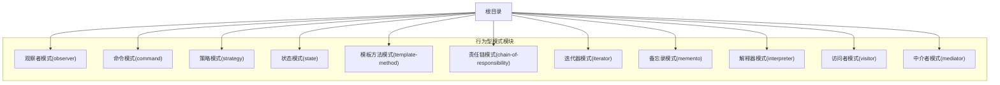

图表来源
- [README.md](file://README.md#L1-L50)
- [observer/README.md](file://observer/README.md#L1-L50)
- [command/README.md](file://command/README.md#L1-L50)
- [strategy/README.md](file://strategy/README.md#L1-L50)
- [state/README.md](file://state/README.md#L1-L50)
- [template-method/README.md](file://template-method/README.md#L1-L50)
- [chain-of-responsibility/README.md](file://chain-of-responsibility/README.md#L1-L50)
- [iterator/README.md](file://iterator/README.md#L1-L50)
- [memento/README.md](file://memento/README.md#L1-L50)
- [interpreter/README.md](file://interpreter/README.md#L1-L50)
- [visitor/README.md](file://visitor/README.md#L1-L50)
- [mediator/README.md](file://mediator/README.md#L1-L50)

章节来源
- [README.md](file://README.md#L1-L120)

## 核心组件
本节概述各行为型模式的核心组成与职责边界，帮助快速定位到具体实现文件。

- 观察者模式
  - 关键角色：主题（被观察者）、观察者接口、具体观察者、泛型版本
  - 典型文件：Weather、WeatherObserver、Hobbits、Orcs、Observable、Observer、Race 及其泛型变体
- 命令模式
  - 关键角色：命令接口、具体命令（如调整地精尺寸、可见性等）、请求者（Wizard）、接收者（Goblin）
  - 典型文件：App、Wizard、Goblin、Size、Visibility、Target
- 策略模式
  - 关键角色：上下文（DragonSlayer）、策略接口（DragonSlayingStrategy）及多种策略实现
  - 典型文件：DragonSlayer、DragonSlayingStrategy、MeleeStrategy、ProjectileStrategy、SpellStrategy、LambdaStrategy
- 状态模式
  - 关键角色：状态接口、具体状态（PeacefulState、AngryState）、环境对象（Mammoth）
  - 典型文件：Mammoth、State、PeacefulState、AngryState
- 模板方法模式
  - 关键角色：抽象模板（StealingMethod）、具体模板（HitAndRunMethod、SubtleMethod）、调用者（HalflingThief）
  - 典型文件：HalflingThief、StealingMethod、HitAndRunMethod、SubtleMethod
- 责任链模式
  - 关键角色：处理器接口、具体处理器（OrcCommander、OrcKing、OrcOfficer、OrcSoldier）、请求类型与请求对象
  - 典型文件：OrcCommander、OrcKing、OrcOfficer、OrcSoldier、Request、RequestHandler、RequestType
- 迭代器模式
  - 关键角色：迭代器接口、具体迭代器（列表、二叉搜索树）、聚合对象
  - 典型文件：Iterator、TreasureChest、BstIterator、TreeNode
- 备忘录模式
  - 关键角色：发起人（Star）、备忘录（StarMemento）、负责人（仅示例未实现）
  - 典型文件：Star、StarMemento、StarType
- 解释器模式
  - 关键角色：抽象表达式、终结符与非终结符表达式、语法解析器、求值器
  - 典型文件：Expression、Number、Product、Sum、Variable、Evaluator、Parser、Tokenizer
- 访问者模式
  - 关键角色：访问者接口、具体访问者、元素接口与具体元素
  - 典型文件：ComputerPart、ComputerPartVisitor、ComputerPartVisitorImpl、Cpu、Memory、Keyboard、Mouse
- 中介者模式
  - 关键角色：中介者（ChatRoom）、同事（FacebookUser、GoogleUser、LinkedInUser）
  - 典型文件：ChatRoom、Participant、FacebookUser、GoogleUser、LinkedInUser

章节来源
- [observer/src/main/java/com/iluwatar/observer/Weather.java](file://observer/src/main/java/com/iluwatar/observer/Weather.java#L1-L200)
- [observer/src/main/java/com/iluwatar/observer/WeatherObserver.java](file://observer/src/main/java/com/iluwatar/observer/WeatherObserver.java#L1-L200)
- [observer/src/main/java/com/iluwatar/observer/Hobbits.java](file://observer/src/main/java/com/iluwatar/observer/Hobbits.java#L1-L200)
- [observer/src/main/java/com/iluwatar/observer/Orcs.java](file://observer/src/main/java/com/iluwatar/observer/Orcs.java#L1-L200)
- [observer/src/main/java/com/iluwatar/observer/generic/Observable.java](file://observer/src/main/java/com/iluwatar/observer/generic/Observable.java#L1-L200)
- [observer/src/main/java/com/iluwatar/observer/generic/Observer.java](file://observer/src/main/java/com/iluwatar/observer/generic/Observer.java#L1-L200)
- [observer/src/main/java/com/iluwatar/observer/generic/Race.java](file://observer/src/main/java/com/iluwatar/observer/generic/Race.java#L1-L200)
- [command/src/main/java/com/iluwatar/command/Wizard.java](file://command/src/main/java/com/iluwatar/command/Wizard.java#L1-L200)
- [command/src/main/java/com/iluwatar/command/Goblin.java](file://command/src/main/java/com/iluwatar/command/Goblin.java#L1-L200)
- [strategy/src/main/java/com/iluwatar/strategy/DragonSlayer.java](file://strategy/src/main/java/com/iluwatar/strategy/DragonSlayer.java#L1-L200)
- [strategy/src/main/java/com/iluwatar/strategy/DragonSlayingStrategy.java](file://strategy/src/main/java/com/iluwatar/strategy/DragonSlayingStrategy.java#L1-L200)
- [state/src/main/java/com/iluwatar/state/Mammoth.java](file://state/src/main/java/com/iluwatar/state/Mammoth.java#L1-L200)
- [state/src/main/java/com/iluwatar/state/State.java](file://state/src/main/java/com/iluwatar/state/State.java#L1-L200)
- [template-method/src/main/java/com/iluwatar/templatemethod/HalflingThief.java](file://template-method/src/main/java/com/iluwatar/templatemethod/HalflingThief.java#L1-L200)
- [template-method/src/main/java/com/iluwatar/templatemethod/StealingMethod.java](file://template-method/src/main/java/com/iluwatar/templatemethod/StealingMethod.java#L1-L200)
- [chain-of-responsibility/src/main/java/com/iluwatar/chain/OrcKing.java](file://chain-of-responsibility/src/main/java/com/iluwatar/chain/OrcKing.java#L1-L200)
- [chain-of-responsibility/src/main/java/com/iluwatar/chain/RequestHandler.java](file://chain-of-responsibility/src/main/java/com/iluwatar/chain/RequestHandler.java#L1-L200)
- [iterator/src/main/java/com/iluwatar/iterator/Iterator.java](file://iterator/src/main/java/com/iluwatar/iterator/Iterator.java#L1-L200)
- [iterator/src/main/java/com/iluwatar/iterator/list/TreasureChest.java](file://iterator/src/main/java/com/iluwatar/iterator/list/TreasureChest.java#L1-L200)
- [memento/src/main/java/com/iluwatar/memento/Star.java](file://memento/src/main/java/com/iluwatar/memento/Star.java#L1-L200)
- [interpreter/src/main/java/com/iluwatar/interpreter/ast/Expression.java](file://interpreter/src/main/java/com/iluwatar/interpreter/ast/Expression.java#L1-L200)
- [interpreter/src/main/java/com/iluwatar/interpreter/evaluator/Evaluator.java](file://interpreter/src/main/java/com/iluwatar/interpreter/evaluator/Evaluator.java#L1-L200)
- [visitor/src/main/java/com/iluwatar/visitor/ComputerPart.java](file://visitor/src/main/java/com/iluwatar/visitor/ComputerPart.java#L1-L200)
- [visitor/src/main/java/com/iluwatar/visitor/ComputerPartVisitor.java](file://visitor/src/main/java/com/iluwatar/visitor/ComputerPartVisitor.java#L1-L200)
- [mediator/src/main/java/com/iluwatar/mediator/ChatRoom.java](file://mediator/src/main/java/com/iluwatar/mediator/ChatRoom.java#L1-L200)

## 架构总览
下图给出行为型模式在仓库中的整体关系：每个模式模块自包含示例与测试；部分模式存在泛型或扩展版本以演示不同实现风格。

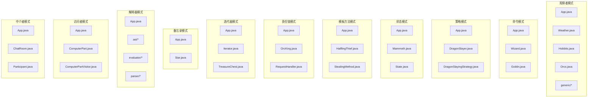

图表来源
- [observer/src/main/java/com/iluwatar/observer/App.java](file://observer/src/main/java/com/iluwatar/observer/App.java#L1-L200)
- [observer/src/main/java/com/iluwatar/observer/Weather.java](file://observer/src/main/java/com/iluwatar/observer/Weather.java#L1-L200)
- [observer/src/main/java/com/iluwatar/observer/Hobbits.java](file://observer/src/main/java/com/iluwatar/observer/Hobbits.java#L1-L200)
- [observer/src/main/java/com/iluwatar/observer/Orcs.java](file://observer/src/main/java/com/iluwatar/observer/Orcs.java#L1-L200)
- [observer/src/main/java/com/iluwatar/observer/generic/Observable.java](file://observer/src/main/java/com/iluwatar/observer/generic/Observable.java#L1-L200)
- [command/src/main/java/com/iluwatar/command/App.java](file://command/src/main/java/com/iluwatar/command/App.java#L1-L200)
- [command/src/main/java/com/iluwatar/command/Wizard.java](file://command/src/main/java/com/iluwatar/command/Wizard.java#L1-L200)
- [command/src/main/java/com/iluwatar/command/Goblin.java](file://command/src/main/java/com/iluwatar/command/Goblin.java#L1-L200)
- [strategy/src/main/java/com/iluwatar/strategy/App.java](file://strategy/src/main/java/com/iluwatar/strategy/App.java#L1-L200)
- [strategy/src/main/java/com/iluwatar/strategy/DragonSlayer.java](file://strategy/src/main/java/com/iluwatar/strategy/DragonSlayer.java#L1-L200)
- [strategy/src/main/java/com/iluwatar/strategy/DragonSlayingStrategy.java](file://strategy/src/main/java/com/iluwatar/strategy/DragonSlayingStrategy.java#L1-L200)
- [state/src/main/java/com/iluwatar/state/App.java](file://state/src/main/java/com/iluwatar/state/App.java#L1-L200)
- [state/src/main/java/com/iluwatar/state/Mammoth.java](file://state/src/main/java/com/iluwatar/state/Mammoth.java#L1-L200)
- [state/src/main/java/com/iluwatar/state/State.java](file://state/src/main/java/com/iluwatar/state/State.java#L1-L200)
- [template-method/src/main/java/com/iluwatar/templatemethod/App.java](file://template-method/src/main/java/com/iluwatar/templatemethod/App.java#L1-L200)
- [template-method/src/main/java/com/iluwatar/templatemethod/HalflingThief.java](file://template-method/src/main/java/com/iluwatar/templatemethod/HalflingThief.java#L1-L200)
- [template-method/src/main/java/com/iluwatar/templatemethod/StealingMethod.java](file://template-method/src/main/java/com/iluwatar/templatemethod/StealingMethod.java#L1-L200)
- [chain-of-responsibility/src/main/java/com/iluwatar/chain/App.java](file://chain-of-responsibility/src/main/java/com/iluwatar/chain/App.java#L1-L200)
- [chain-of-responsibility/src/main/java/com/iluwatar/chain/OrcKing.java](file://chain-of-responsibility/src/main/java/com/iluwatar/chain/OrcKing.java#L1-L200)
- [chain-of-responsibility/src/main/java/com/iluwatar/chain/RequestHandler.java](file://chain-of-responsibility/src/main/java/com/iluwatar/chain/RequestHandler.java#L1-L200)
- [iterator/src/main/java/com/iluwatar/iterator/App.java](file://iterator/src/main/java/com/iluwatar/iterator/App.java#L1-L200)
- [iterator/src/main/java/com/iluwatar/iterator/Iterator.java](file://iterator/src/main/java/com/iluwatar/iterator/Iterator.java#L1-L200)
- [iterator/src/main/java/com/iluwatar/iterator/list/TreasureChest.java](file://iterator/src/main/java/com/iluwatar/iterator/list/TreasureChest.java#L1-L200)
- [memento/src/main/java/com/iluwatar/memento/App.java](file://memento/src/main/java/com/iluwatar/memento/App.java#L1-L200)
- [memento/src/main/java/com/iluwatar/memento/Star.java](file://memento/src/main/java/com/iluwatar/memento/Star.java#L1-L200)
- [interpreter/src/main/java/com/iluwatar/interpreter/App.java](file://interpreter/src/main/java/com/iluwatar/interpreter/App.java#L1-L200)
- [interpreter/src/main/java/com/iluwatar/interpreter/ast/Expression.java](file://interpreter/src/main/java/com/iluwatar/interpreter/ast/Expression.java#L1-L200)
- [interpreter/src/main/java/com/iluwatar/interpreter/evaluator/Evaluator.java](file://interpreter/src/main/java/com/iluwatar/interpreter/evaluator/Evaluator.java#L1-L200)
- [interpreter/src/main/java/com/iluwatar/interpreter/parser/Parser.java](file://interpreter/src/main/java/com/iluwatar/interpreter/parser/Parser.java#L1-L200)
- [visitor/src/main/java/com/iluwatar/visitor/App.java](file://visitor/src/main/java/com/iluwatar/visitor/App.java#L1-L200)
- [visitor/src/main/java/com/iluwatar/visitor/ComputerPart.java](file://visitor/src/main/java/com/iluwatar/visitor/ComputerPart.java#L1-L200)
- [visitor/src/main/java/com/iluwatar/visitor/ComputerPartVisitor.java](file://visitor/src/main/java/com/iluwatar/visitor/ComputerPartVisitor.java#L1-L200)
- [mediator/src/main/java/com/iluwatar/mediator/App.java](file://mediator/src/main/java/com/iluwatar/mediator/App.java#L1-L200)
- [mediator/src/main/java/com/iluwatar/mediator/ChatRoom.java](file://mediator/src/main/java/com/iluwatar/mediator/ChatRoom.java#L1-L200)
- [mediator/src/main/java/com/iluwatar/mediator/Participant.java](file://mediator/src/main/java/com/iluwatar/mediator/Participant.java#L1-L200)

## 详细组件分析

### 观察者模式
- 行为特征
  - 主题维护观察者集合，在状态变化时通知所有观察者；支持泛型以约束被观察对象与观察者类型。
  - 示例中天气变化触发霍比特人与兽人的反应，体现松耦合与动态订阅。
- 交互序列
  - 主题更新 -> 遍历观察者列表 -> 调用观察者回调 -> 观察者响应
- 状态转换图
  - 天气类型枚举驱动状态变化，观察者对不同天气做出不同反应。
- 核心算法实现
  - 主题注册/移除观察者、变更通知、泛型约束
- 扩展机制设计
  - 泛型版本通过类型参数限定观察者与被观察对象，增强类型安全

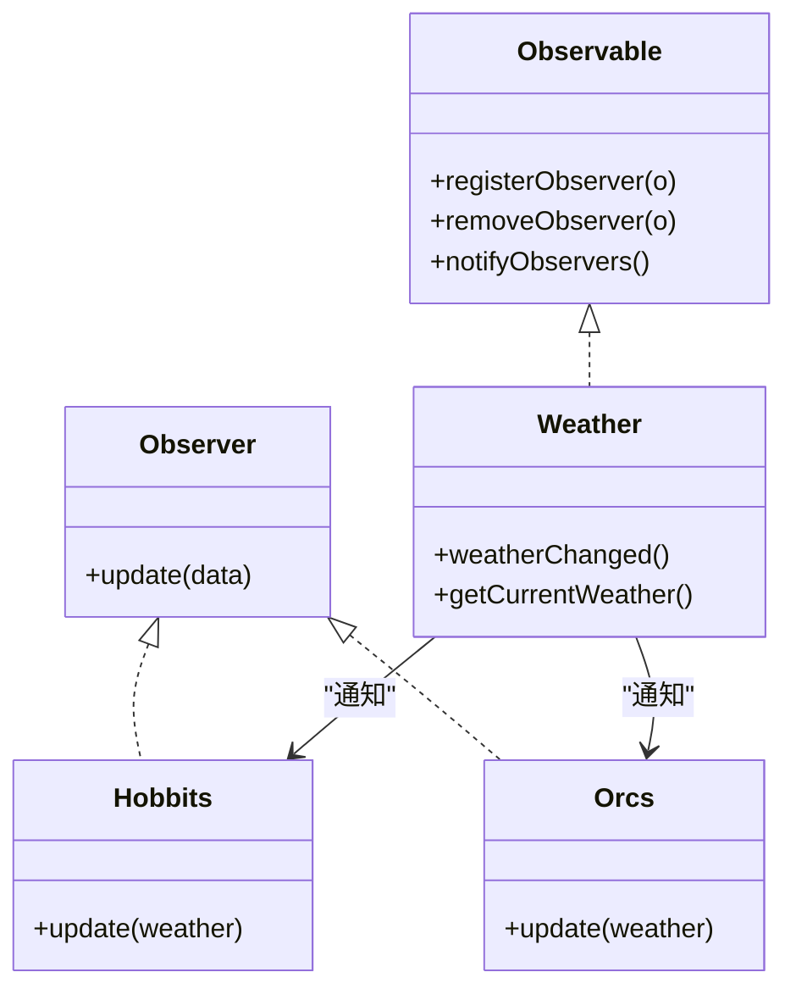

图表来源
- [observer/src/main/java/com/iluwatar/observer/generic/Observable.java](file://observer/src/main/java/com/iluwatar/observer/generic/Observable.java#L1-L200)
- [observer/src/main/java/com/iluwatar/observer/generic/Observer.java](file://observer/src/main/java/com/iluwatar/observer/generic/Observer.java#L1-L200)
- [observer/src/main/java/com/iluwatar/observer/Weather.java](file://observer/src/main/java/com/iluwatar/observer/Weather.java#L1-L200)
- [observer/src/main/java/com/iluwatar/observer/Hobbits.java](file://observer/src/main/java/com/iluwatar/observer/Hobbits.java#L1-L200)
- [observer/src/main/java/com/iluwatar/observer/Orcs.java](file://observer/src/main/java/com/iluwatar/observer/Orcs.java#L1-L200)

章节来源
- [observer/src/main/java/com/iluwatar/observer/Weather.java](file://observer/src/main/java/com/iluwatar/observer/Weather.java#L1-L200)
- [observer/src/main/java/com/iluwatar/observer/WeatherObserver.java](file://observer/src/main/java/com/iluwatar/observer/WeatherObserver.java#L1-L200)
- [observer/src/main/java/com/iluwatar/observer/Hobbits.java](file://observer/src/main/java/com/iluwatar/observer/Hobbits.java#L1-L200)
- [observer/src/main/java/com/iluwatar/observer/Orcs.java](file://observer/src/main/java/com/iluwatar/observer/Orcs.java#L1-L200)
- [observer/src/main/java/com/iluwatar/observer/WeatherType.java](file://observer/src/main/java/com/iluwatar/observer/WeatherType.java#L1-L200)
- [observer/src/main/java/com/iluwatar/observer/generic/Observable.java](file://observer/src/main/java/com/iluwatar/observer/generic/Observable.java#L1-L200)
- [observer/src/main/java/com/iluwatar/observer/generic/Observer.java](file://observer/src/main/java/com/iluwatar/observer/generic/Observer.java#L1-L200)
- [observer/src/main/java/com/iluwatar/observer/generic/Race.java](file://observer/src/main/java/com/iluwatar/observer/generic/Race.java#L1-L200)
- [observer/src/main/java/com/iluwatar/observer/generic/GenHobbits.java](file://observer/src/main/java/com/iluwatar/observer/generic/GenHobbits.java#L1-L200)
- [observer/src/main/java/com/iluwatar/observer/generic/GenOrcs.java](file://observer/src/main/java/com/iluwatar/observer/generic/GenOrcs.java#L1-L200)
- [observer/src/main/java/com/iluwatar/observer/generic/GenWeather.java](file://observer/src/main/java/com/iluwatar/observer/generic/GenWeather.java#L1-L200)

### 命令模式
- 行为特征
  - 将请求封装为对象，使你可用不同请求对客户进行参数化，支持撤销/重做。
  - 示例中Wizard作为请求者，Goblin作为接收者，命令对象封装动作参数。
- 交互序列
  - 客户创建命令 -> 请求者持有命令 -> 接收者执行命令 -> 可选记录历史以便撤销

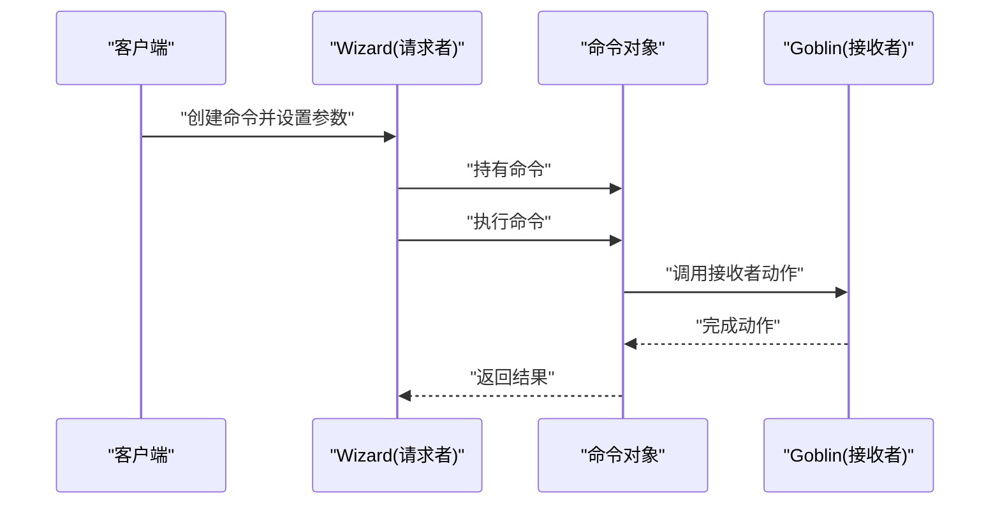

图表来源
- [command/src/main/java/com/iluwatar/command/App.java](file://command/src/main/java/com/iluwatar/command/App.java#L1-L200)
- [command/src/main/java/com/iluwatar/command/Wizard.java](file://command/src/main/java/com/iluwatar/command/Wizard.java#L1-L200)
- [command/src/main/java/com/iluwatar/command/Goblin.java](file://command/src/main/java/com/iluwatar/command/Goblin.java#L1-L200)
- [command/src/main/java/com/iluwatar/command/Size.java](file://command/src/main/java/com/iluwatar/command/Size.java#L1-L200)
- [command/src/main/java/com/iluwatar/command/Visibility.java](file://command/src/main/java/com/iluwatar/command/Visibility.java#L1-L200)
- [command/src/main/java/com/iluwatar/command/Target.java](file://command/src/main/java/com/iluwatar/command/Target.java#L1-L200)

章节来源
- [command/src/main/java/com/iluwatar/command/App.java](file://command/src/main/java/com/iluwatar/command/App.java#L1-L200)
- [command/src/main/java/com/iluwatar/command/Wizard.java](file://command/src/main/java/com/iluwatar/command/Wizard.java#L1-L200)
- [command/src/main/java/com/iluwatar/command/Goblin.java](file://command/src/main/java/com/iluwatar/command/Goblin.java#L1-L200)

### 策略模式
- 行为特征
  - 定义一系列算法，把它们一个个封装起来，并且使它们可以相互替换；让算法的变化独立于使用算法的客户。
- 交互序列
  - 客户选择策略 -> 上下文委托策略执行 -> 返回结果
- 核心算法实现
  - DragonSlayingStrategy接口与多种实现（近战、远程、法术、Lambda策略）

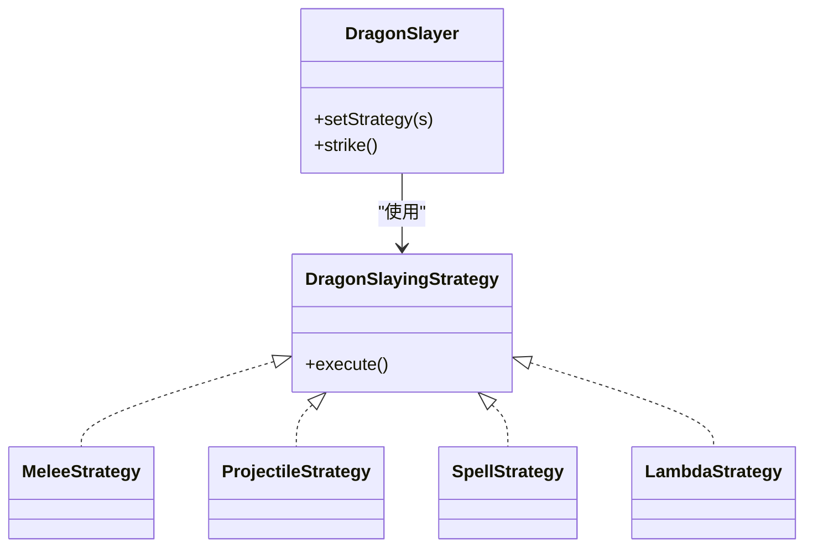

图表来源
- [strategy/src/main/java/com/iluwatar/strategy/DragonSlayer.java](file://strategy/src/main/java/com/iluwatar/strategy/DragonSlayer.java#L1-L200)
- [strategy/src/main/java/com/iluwatar/strategy/DragonSlayingStrategy.java](file://strategy/src/main/java/com/iluwatar/strategy/DragonSlayingStrategy.java#L1-L200)
- [strategy/src/main/java/com/iluwatar/strategy/MeleeStrategy.java](file://strategy/src/main/java/com/iluwatar/strategy/MeleeStrategy.java#L1-L200)
- [strategy/src/main/java/com/iluwatar/strategy/ProjectileStrategy.java](file://strategy/src/main/java/com/iluwatar/strategy/ProjectileStrategy.java#L1-L200)
- [strategy/src/main/java/com/iluwatar/strategy/SpellStrategy.java](file://strategy/src/main/java/com/iluwatar/strategy/SpellStrategy.java#L1-L200)
- [strategy/src/main/java/com/iluwatar/strategy/LambdaStrategy.java](file://strategy/src/main/java/com/iluwatar/strategy/LambdaStrategy.java#L1-L200)

章节来源
- [strategy/src/main/java/com/iluwatar/strategy/App.java](file://strategy/src/main/java/com/iluwatar/strategy/App.java#L1-L200)
- [strategy/src/main/java/com/iluwatar/strategy/DragonSlayer.java](file://strategy/src/main/java/com/iluwatar/strategy/DragonSlayer.java#L1-L200)
- [strategy/src/main/java/com/iluwatar/strategy/DragonSlayingStrategy.java](file://strategy/src/main/java/com/iluwatar/strategy/DragonSlayingStrategy.java#L1-L200)

### 状态模式
- 行为特征
  - 允许对象在内部状态改变时改变它的行为，看起来好像对象修改了它的类。
- 状态转换图
  - 平静态 <-> 愤怒态，由外部事件触发

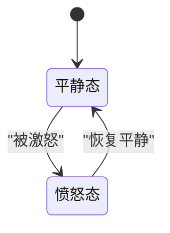

图表来源
- [state/src/main/java/com/iluwatar/state/Mammoth.java](file://state/src/main/java/com/iluwatar/state/Mammoth.java#L1-L200)
- [state/src/main/java/com/iluwatar/state/PeacefulState.java](file://state/src/main/java/com/iluwatar/state/PeacefulState.java#L1-L200)
- [state/src/main/java/com/iluwatar/state/AngryState.java](file://state/src/main/java/com/iluwatar/state/AngryState.java#L1-L200)
- [state/src/main/java/com/iluwatar/state/State.java](file://state/src/main/java/com/iluwatar/state/State.java#L1-L200)

章节来源
- [state/src/main/java/com/iluwatar/state/App.java](file://state/src/main/java/com/iluwatar/state/App.java#L1-L200)
- [state/src/main/java/com/iluwatar/state/Mammoth.java](file://state/src/main/java/com/iluwatar/state/Mammoth.java#L1-L200)
- [state/src/main/java/com/iluwatar/state/State.java](file://state/src/main/java/com/iluwatar/state/State.java#L1-L200)

### 模板方法模式
- 行为特征
  - 定义算法的骨架，而将一些步骤延迟到子类；使得子类可以不改变算法结构即可重定义特定步骤。
- 交互序列
  - 调用者调用模板方法 -> 模板方法按固定顺序执行步骤 -> 子类覆盖可变步骤

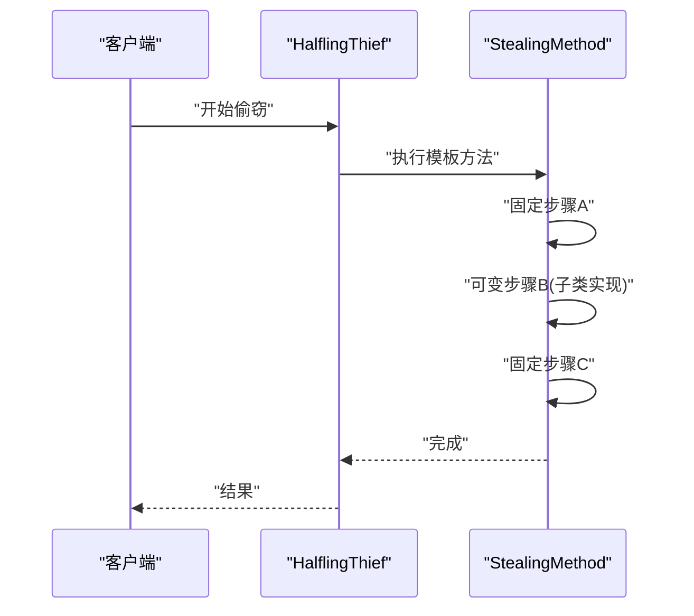

图表来源
- [template-method/src/main/java/com/iluwatar/templatemethod/App.java](file://template-method/src/main/java/com/iluwatar/templatemethod/App.java#L1-L200)
- [template-method/src/main/java/com/iluwatar/templatemethod/HalflingThief.java](file://template-method/src/main/java/com/iluwatar/templatemethod/HalflingThief.java#L1-L200)
- [template-method/src/main/java/com/iluwatar/templatemethod/StealingMethod.java](file://template-method/src/main/java/com/iluwatar/templatemethod/StealingMethod.java#L1-L200)
- [template-method/src/main/java/com/iluwatar/templatemethod/HitAndRunMethod.java](file://template-method/src/main/java/com/iluwatar/templatemethod/HitAndRunMethod.java#L1-L200)
- [template-method/src/main/java/com/iluwatar/templatemethod/SubtleMethod.java](file://template-method/src/main/java/com/iluwatar/templatemethod/SubtleMethod.java#L1-L200)

章节来源
- [template-method/src/main/java/com/iluwatar/templatemethod/App.java](file://template-method/src/main/java/com/iluwatar/templatemethod/App.java#L1-L200)
- [template-method/src/main/java/com/iluwatar/templatemethod/HalflingThief.java](file://template-method/src/main/java/com/iluwatar/templatemethod/HalflingThief.java#L1-L200)
- [template-method/src/main/java/com/iluwatar/templatemethod/StealingMethod.java](file://template-method/src/main/java/com/iluwatar/templatemethod/StealingMethod.java#L1-L200)

### 责任链模式
- 行为特征
  - 使多个对象都有机会处理请求，将这些对象连成一条链，并沿着这条链传递请求直到被处理。
- 交互序列
  - 发起请求 -> 链上处理器依次判断是否处理 -> 处理后返回或继续传递

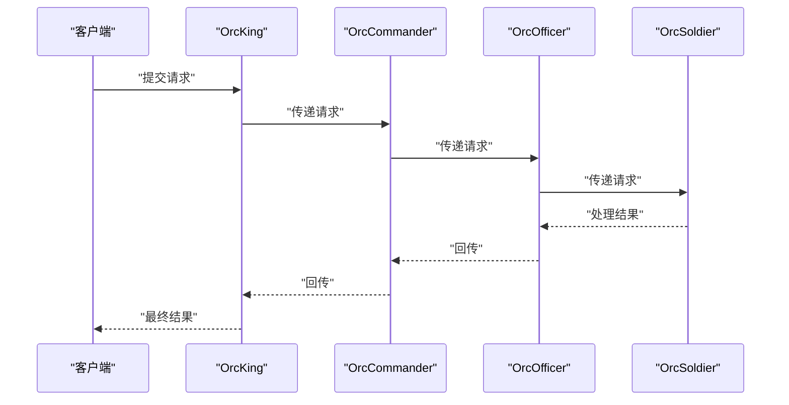

图表来源
- [chain-of-responsibility/src/main/java/com/iluwatar/chain/App.java](file://chain-of-responsibility/src/main/java/com/iluwatar/chain/App.java#L1-L200)
- [chain-of-responsibility/src/main/java/com/iluwatar/chain/OrcKing.java](file://chain-of-responsibility/src/main/java/com/iluwatar/chain/OrcKing.java#L1-L200)
- [chain-of-responsibility/src/main/java/com/iluwatar/chain/OrcCommander.java](file://chain-of-responsibility/src/main/java/com/iluwatar/chain/OrcCommander.java#L1-L200)
- [chain-of-responsibility/src/main/java/com/iluwatar/chain/OrcOfficer.java](file://chain-of-responsibility/src/main/java/com/iluwatar/chain/OrcOfficer.java#L1-L200)
- [chain-of-responsibility/src/main/java/com/iluwatar/chain/OrcSoldier.java](file://chain-of-responsibility/src/main/java/com/iluwatar/chain/OrcSoldier.java#L1-L200)
- [chain-of-responsibility/src/main/java/com/iluwatar/chain/RequestHandler.java](file://chain-of-responsibility/src/main/java/com/iluwatar/chain/RequestHandler.java#L1-L200)
- [chain-of-responsibility/src/main/java/com/iluwatar/chain/Request.java](file://chain-of-responsibility/src/main/java/com/iluwatar/chain/Request.java#L1-L200)
- [chain-of-responsibility/src/main/java/com/iluwatar/chain/RequestType.java](file://chain-of-responsibility/src/main/java/com/iluwatar/chain/RequestType.java#L1-L200)

章节来源
- [chain-of-responsibility/src/main/java/com/iluwatar/chain/App.java](file://chain-of-responsibility/src/main/java/com/iluwatar/chain/App.java#L1-L200)
- [chain-of-responsibility/src/main/java/com/iluwatar/chain/RequestHandler.java](file://chain-of-responsibility/src/main/java/com/iluwatar/chain/RequestHandler.java#L1-L200)

### 迭代器模式
- 行为特征
  - 提供一种方法顺序访问一个聚合对象中的各个元素，而又不暴露其内部的表示。
- 核心算法实现
  - 列表迭代器遍历宝箱物品；二叉搜索树迭代器中序遍历节点

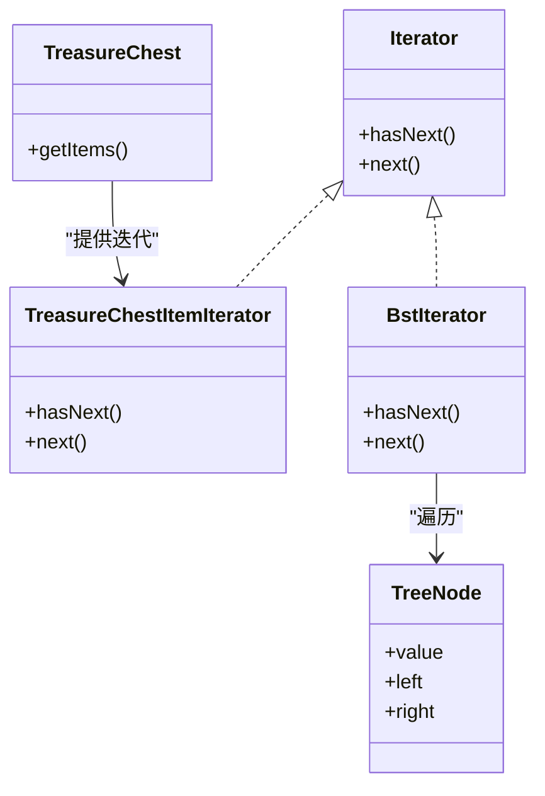

图表来源
- [iterator/src/main/java/com/iluwatar/iterator/Iterator.java](file://iterator/src/main/java/com/iluwatar/iterator/Iterator.java#L1-L200)
- [iterator/src/main/java/com/iluwatar/iterator/list/TreasureChestItemIterator.java](file://iterator/src/main/java/com/iluwatar/iterator/list/TreasureChestItemIterator.java#L1-L200)
- [iterator/src/main/java/com/iluwatar/iterator/bst/BstIterator.java](file://iterator/src/main/java/com/iluwatar/iterator/bst/BstIterator.java#L1-L200)
- [iterator/src/main/java/com/iluwatar/iterator/bst/TreeNode.java](file://iterator/src/main/java/com/iluwatar/iterator/bst/TreeNode.java#L1-L200)
- [iterator/src/main/java/com/iluwatar/iterator/list/TreasureChest.java](file://iterator/src/main/java/com/iluwatar/iterator/list/TreasureChest.java#L1-L200)

章节来源
- [iterator/src/main/java/com/iluwatar/iterator/App.java](file://iterator/src/main/java/com/iluwatar/iterator/App.java#L1-L200)
- [iterator/src/main/java/com/iluwatar/iterator/Iterator.java](file://iterator/src/main/java/com/iluwatar/iterator/Iterator.java#L1-L200)

### 备忘录模式
- 行为特征
  - 在不破坏封装性的前提下，捕获一个对象的内部状态，并在该对象之外保存这个状态，以便以后恢复。
- 核心算法实现
  - 发起人保存当前状态为备忘录；外部存储备忘录用于恢复

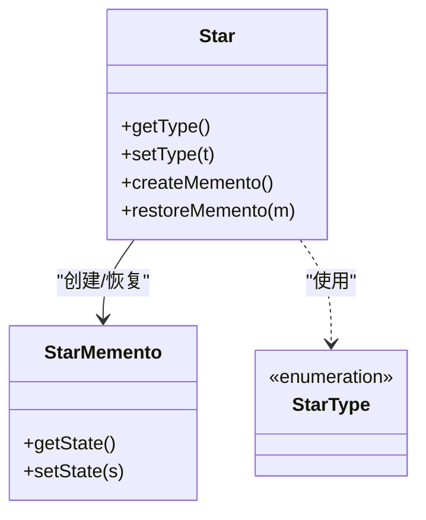

图表来源
- [memento/src/main/java/com/iluwatar/memento/Star.java](file://memento/src/main/java/com/iluwatar/memento/Star.java#L1-L200)
- [memento/src/main/java/com/iluwatar/memento/StarMemento.java](file://memento/src/main/java/com/iluwatar/memento/StarMemento.java#L1-L200)
- [memento/src/main/java/com/iluwatar/memento/StarType.java](file://memento/src/main/java/com/iluwatar/memento/StarType.java#L1-L200)

章节来源
- [memento/src/main/java/com/iluwatar/memento/App.java](file://memento/src/main/java/com/iluwatar/memento/App.java#L1-L200)
- [memento/src/main/java/com/iluwatar/memento/Star.java](file://memento/src/main/java/com/iluwatar/memento/Star.java#L1-L200)

### 解释器模式
- 行为特征
  - 给定一种语言，定义其文法的一种表示，并定义一个解释器，这个解释器使用该表示来解释语言中的句子。
- 核心算法实现
  - 词法分析(Tokenizer) -> 语法分析(Parser) -> 抽象语法树构建 -> 求值(Evaluator)

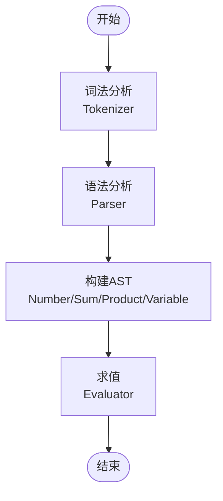

图表来源
- [interpreter/src/main/java/com/iluwatar/interpreter/App.java](file://interpreter/src/main/java/com/iluwatar/interpreter/App.java#L1-L200)
- [interpreter/src/main/java/com/iluwatar/interpreter/ast/Expression.java](file://interpreter/src/main/java/com/iluwatar/interpreter/ast/Expression.java#L1-L200)
- [interpreter/src/main/java/com/iluwatar/interpreter/ast/Number.java](file://interpreter/src/main/java/com/iluwatar/interpreter/ast/Number.java#L1-L200)
- [interpreter/src/main/java/com/iluwatar/interpreter/ast/Sum.java](file://interpreter/src/main/java/com/iluwatar/interpreter/ast/Sum.java#L1-L200)
- [interpreter/src/main/java/com/iluwatar/interpreter/ast/Product.java](file://interpreter/src/main/java/com/iluwatar/interpreter/ast/Product.java#L1-L200)
- [interpreter/src/main/java/com/iluwatar/interpreter/ast/Variable.java](file://interpreter/src/main/java/com/iluwatar/interpreter/ast/Variable.java#L1-L200)
- [interpreter/src/main/java/com/iluwatar/interpreter/evaluator/Evaluator.java](file://interpreter/src/main/java/com/iluwatar/interpreter/evaluator/Evaluator.java#L1-L200)
- [interpreter/src/main/java/com/iluwatar/interpreter/parser/Parser.java](file://interpreter/src/main/java/com/iluwatar/interpreter/parser/Parser.java#L1-L200)
- [interpreter/src/main/java/com/iluwatar/interpreter/parser/Tokenizer.java](file://interpreter/src/main/java/com/iluwatar/interpreter/parser/Tokenizer.java#L1-L200)

章节来源
- [interpreter/src/main/java/com/iluwatar/interpreter/App.java](file://interpreter/src/main/java/com/iluwatar/interpreter/App.java#L1-L200)

### 访问者模式
- 行为特征
  - 表示一个作用于某对象结构中的各元素的操作，使你可以在不改变各元素类的前提下定义作用于这些元素的新操作。
- 核心算法实现
  - 元素接受访问者 -> 访问者访问元素 -> 对不同元素执行不同操作

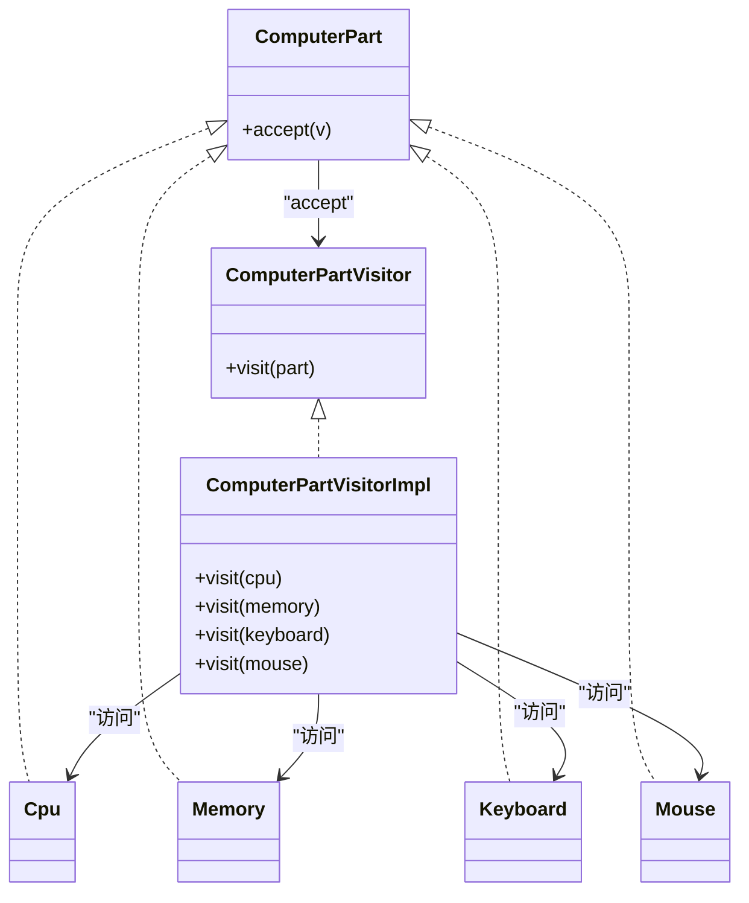

图表来源
- [visitor/src/main/java/com/iluwatar/visitor/ComputerPart.java](file://visitor/src/main/java/com/iluwatar/visitor/ComputerPart.java#L1-L200)
- [visitor/src/main/java/com/iluwatar/visitor/ComputerPartVisitor.java](file://visitor/src/main/java/com/iluwatar/visitor/ComputerPartVisitor.java#L1-L200)
- [visitor/src/main/java/com/iluwatar/visitor/ComputerPartVisitorImpl.java](file://visitor/src/main/java/com/iluwatar/visitor/ComputerPartVisitorImpl.java#L1-L200)
- [visitor/src/main/java/com/iluwatar/visitor/Cpu.java](file://visitor/src/main/java/com/iluwatar/visitor/Cpu.java#L1-L200)
- [visitor/src/main/java/com/iluwatar/visitor/Memory.java](file://visitor/src/main/java/com/iluwatar/visitor/Memory.java#L1-L200)
- [visitor/src/main/java/com/iluwatar/visitor/Keyboard.java](file://visitor/src/main/java/com/iluwatar/visitor/Keyboard.java#L1-L200)
- [visitor/src/main/java/com/iluwatar/visitor/Mouse.java](file://visitor/src/main/java/com/iluwatar/visitor/Mouse.java#L1-L200)

章节来源
- [visitor/src/main/java/com/iluwatar/visitor/App.java](file://visitor/src/main/java/com/iluwatar/visitor/App.java#L1-L200)
- [visitor/src/main/java/com/iluwatar/visitor/ComputerPart.java](file://visitor/src/main/java/com/iluwatar/visitor/ComputerPart.java#L1-L200)

### 中介者模式
- 行为特征
  - 用一个中介对象来封装一系列的对象交互。中介者使各对象不需要显式地相互引用，从而使其耦合松散，而且可以独立地改变它们之间的交互。
- 核心算法实现
  - 同事向中介者发送消息 -> 中介者路由到目标同事 -> 同事间解耦

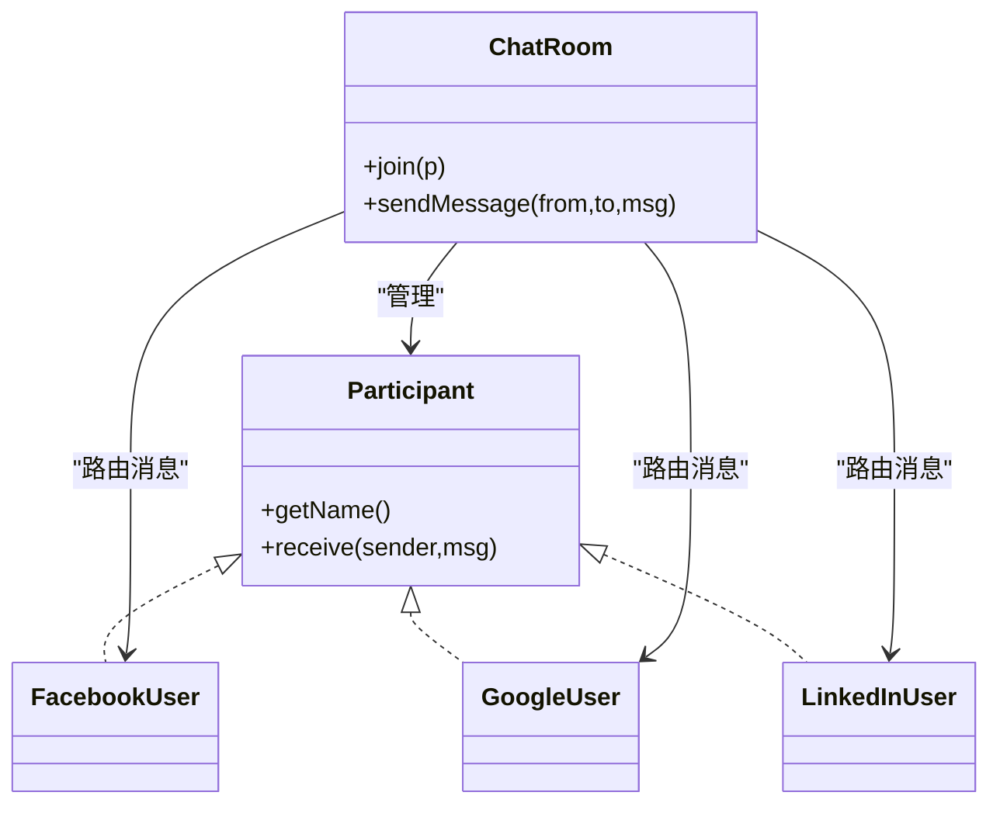

图表来源
- [mediator/src/main/java/com/iluwatar/mediator/ChatRoom.java](file://mediator/src/main/java/com/iluwatar/mediator/ChatRoom.java#L1-L200)
- [mediator/src/main/java/com/iluwatar/mediator/Participant.java](file://mediator/src/main/java/com/iluwatar/mediator/Participant.java#L1-L200)
- [mediator/src/main/java/com/iluwatar/mediator/FacebookUser.java](file://mediator/src/main/java/com/iluwatar/mediator/FacebookUser.java#L1-L200)
- [mediator/src/main/java/com/iluwatar/mediator/GoogleUser.java](file://mediator/src/main/java/com/iluwatar/mediator/GoogleUser.java#L1-L200)
- [mediator/src/main/java/com/iluwatar/mediator/LinkedInUser.java](file://mediator/src/main/java/com/iluwatar/mediator/LinkedInUser.java#L1-L200)

章节来源
- [mediator/src/main/java/com/iluwatar/mediator/App.java](file://mediator/src/main/java/com/iluwatar/mediator/App.java#L1-L200)
- [mediator/src/main/java/com/iluwatar/mediator/ChatRoom.java](file://mediator/src/main/java/com/iluwatar/mediator/ChatRoom.java#L1-L200)

## 依赖分析
- 内聚性
  - 每个模式模块内聚度高，核心类围绕单一职责组织，便于理解与复用。
- 耦合性
  - 观察者与命令、策略、状态、模板方法等模式之间无直接耦合，通过接口与抽象类实现低耦合。
- 外部依赖
  - 代码均为纯Java实现，无第三方库依赖，适合教学与演示。

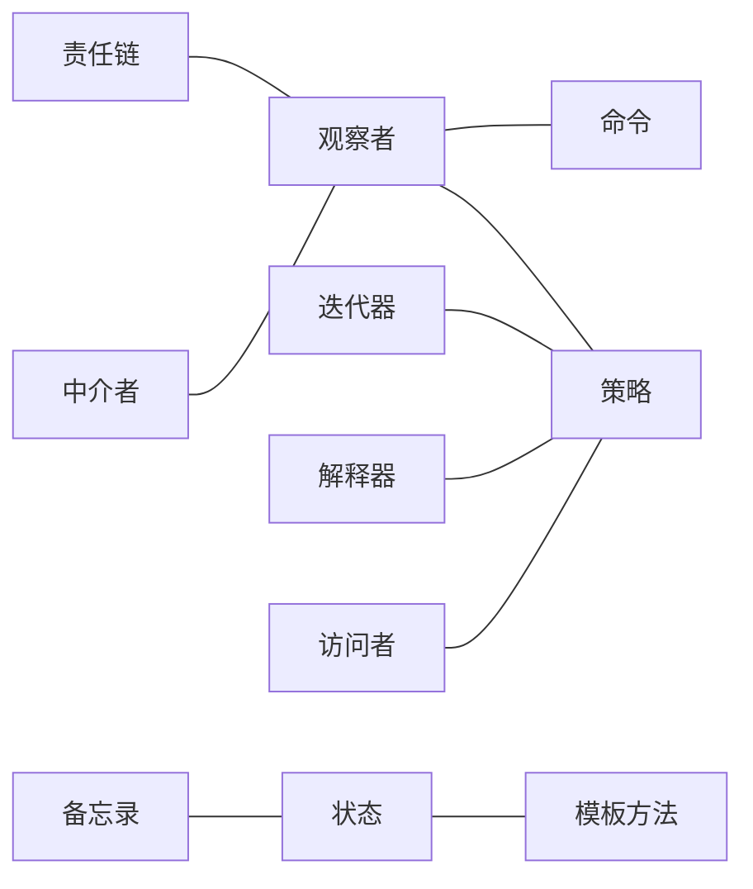

图表来源
- [observer/src/main/java/com/iluwatar/observer/Weather.java](file://observer/src/main/java/com/iluwatar/observer/Weather.java#L1-L200)
- [command/src/main/java/com/iluwatar/command/Wizard.java](file://command/src/main/java/com/iluwatar/command/Wizard.java#L1-L200)
- [strategy/src/main/java/com/iluwatar/strategy/DragonSlayer.java](file://strategy/src/main/java/com/iluwatar/strategy/DragonSlayer.java#L1-L200)
- [state/src/main/java/com/iluwatar/state/Mammoth.java](file://state/src/main/java/com/iluwatar/state/Mammoth.java#L1-L200)
- [template-method/src/main/java/com/iluwatar/templatemethod/StealingMethod.java](file://template-method/src/main/java/com/iluwatar/templatemethod/StealingMethod.java#L1-L200)
- [chain-of-responsibility/src/main/java/com/iluwatar/chain/OrcKing.java](file://chain-of-responsibility/src/main/java/com/iluwatar/chain/OrcKing.java#L1-L200)
- [iterator/src/main/java/com/iluwatar/iterator/list/TreasureChest.java](file://iterator/src/main/java/com/iluwatar/iterator/list/TreasureChest.java#L1-L200)
- [memento/src/main/java/com/iluwatar/memento/Star.java](file://memento/src/main/java/com/iluwatar/memento/Star.java#L1-L200)
- [interpreter/src/main/java/com/iluwatar/interpreter/App.java](file://interpreter/src/main/java/com/iluwatar/interpreter/App.java#L1-L200)
- [visitor/src/main/java/com/iluwatar/visitor/ComputerPart.java](file://visitor/src/main/java/com/iluwatar/visitor/ComputerPart.java#L1-L200)
- [mediator/src/main/java/com/iluwatar/mediator/ChatRoom.java](file://mediator/src/main/java/com/iluwatar/mediator/ChatRoom.java#L1-L200)

## 性能考虑
- 观察者
  - 通知开销与观察者数量线性相关；建议控制观察者规模或采用批量通知策略。
- 命令
  - 命令对象创建与分发成本较低；撤销栈增长需注意内存占用。
- 策略
  - 策略切换为常数时间；避免在热路径频繁创建策略实例。
- 状态
  - 状态切换为常数时间；状态对象生命周期管理需关注GC压力。
- 模板方法
  - 固定步骤与可变步骤组合，减少重复代码；子类覆盖应保持简单。
- 责任链
  - 链长度影响请求处理延迟；可通过短路条件优化。
- 迭代器
  - 时间复杂度取决于数据结构；BST迭代器中序遍历为O(n)。
- 备忘录
  - 状态快照可能占用较多内存；建议按需保存或压缩。
- 解释器
  - AST构建与求值为O(n)；词法/语法分析复杂度取决于输入规模。
- 访问者
  - 对每种元素执行一次访问，总体O(n)；元素种类增加带来维护成本。
- 中介者
  - 中介者成为瓶颈时需拆分或引入异步消息队列。

## 故障排查指南
- 观察者
  - 症状：观察者未收到通知
  - 排查：确认主题已注册观察者、通知流程未被中断、观察者实现正确
- 命令
  - 症状：命令执行无效
  - 排查：确认命令参数完整、接收者状态允许执行、命令历史未被篡改
- 策略
  - 症状：策略未生效
  - 排查：确认上下文已设置策略、策略接口实现一致、Lambda策略闭包正确
- 状态
  - 症状：状态切换异常
  - 排查：确认触发条件、状态转换逻辑、并发访问安全
- 模板方法
  - 症状：子类覆盖未生效
  - 排查：确认模板方法未被覆写、子类实现符合约定
- 责任链
  - 症状：请求未被处理
  - 排查：确认处理器顺序、处理条件、链尾兜底逻辑
- 迭代器
  - 症状：遍历异常或死循环
  - 排查：确认hasNext与next配对使用、集合结构一致性
- 备忘录
  - 症状：恢复失败
  - 排查：确认备忘录版本兼容、状态不可变性
- 解释器
  - 症状：表达式解析错误
  - 排查：确认Token流、语法树构建、求值顺序
- 访问者
  - 症状：访问者未覆盖新元素
  - 排查：确认访问者实现、元素类型扩展
- 中介者
  - 症状：消息未送达
  - 排查：确认参与者加入、路由规则、并发安全

## 结论
本仓库的行为型模式实现清晰展示了如何通过接口与抽象类解耦行为，如何通过模板、策略、状态、观察者等模式管理复杂逻辑，以及如何借助责任链、迭代器、访问者、解释器、备忘录、命令与中介者等模式提升系统的灵活性与可扩展性。结合事件驱动系统、工作流引擎、游戏状态机等真实场景，这些模式能够有效降低耦合并增强可维护性。

## 附录
- 实际业务场景建议
  - 事件驱动系统：使用观察者模式实现事件发布/订阅；使用责任链模式实现事件过滤与处理流水线。
  - 工作流引擎：使用状态模式建模流程节点状态；使用命令模式封装任务；使用责任链模式实现审批流。
  - 游戏状态机：使用状态模式管理角色状态；使用观察者模式响应事件；使用策略模式实现不同AI行为。
  - 配置与脚本：使用解释器模式解析配置语言；使用访问者模式对AST进行分析与转换。
  - 协同系统：使用中介者模式统一通信；使用命令模式实现操作日志与回放。