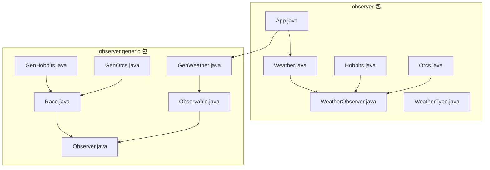
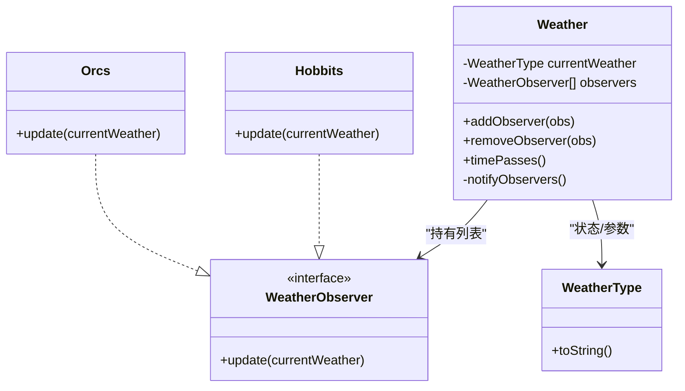
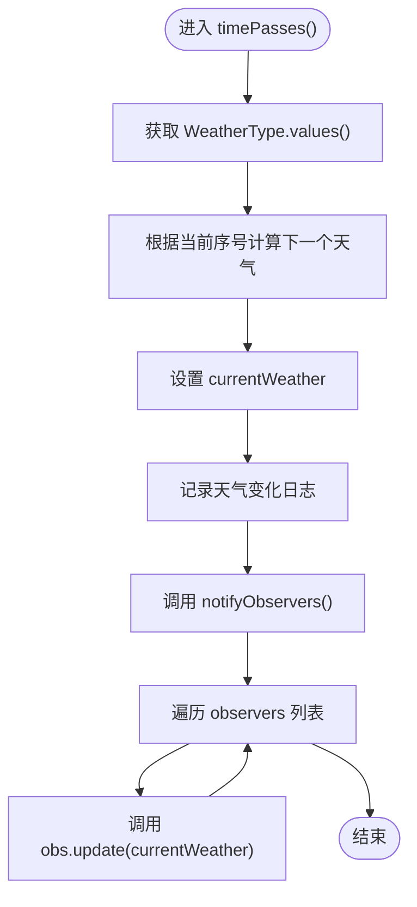
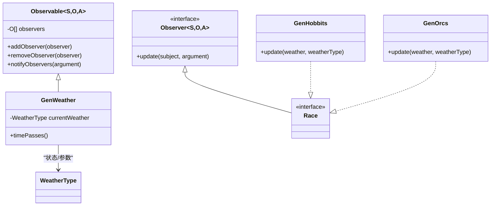
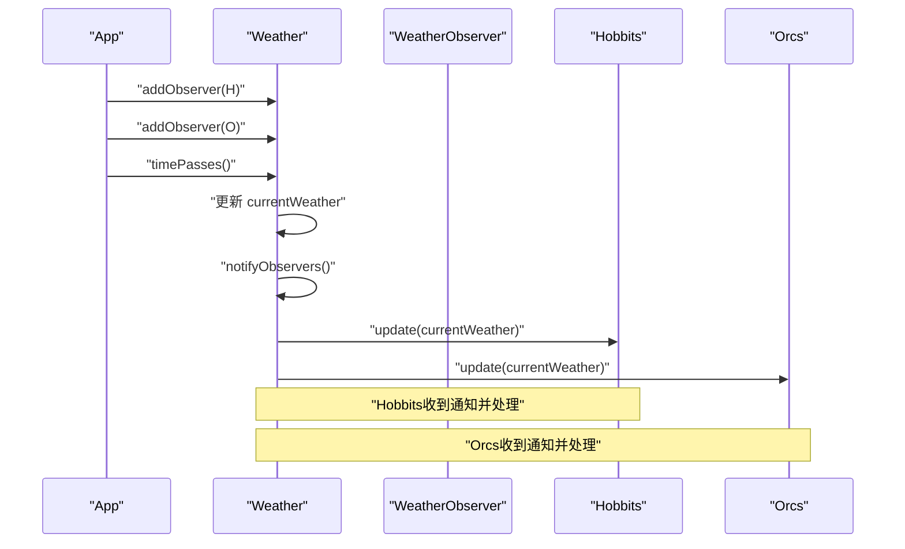
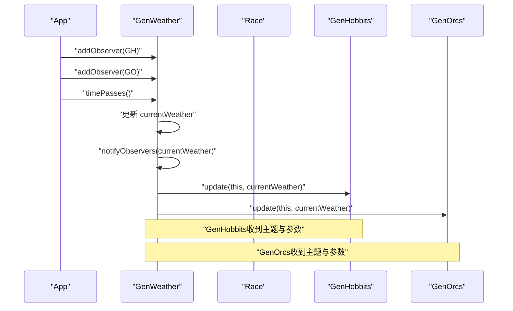
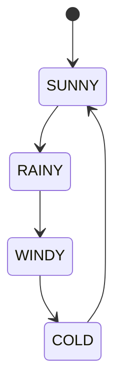
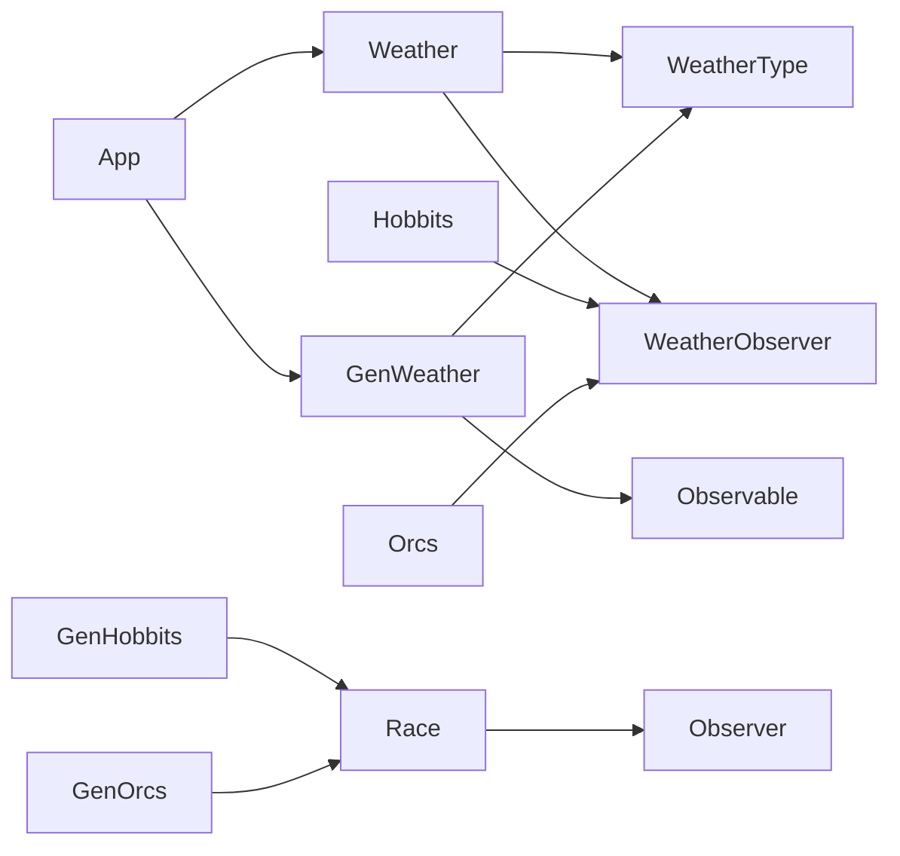

# 观察者模式

<cite>
**本文引用的文件**
- [App.java](file://observer/src/main/java/com/iluwatar/observer/App.java)
- [Weather.java](file://observer/src/main/java/com/iluwatar/observer/Weather.java)
- [WeatherObserver.java](file://observer/src/main/java/com/iluwatar/observer/WeatherObserver.java)
- [Hobbits.java](file://observer/src/main/java/com/iluwatar/observer/Hobbits.java)
- [Orcs.java](file://observer/src/main/java/com/iluwatar/observer/Orcs.java)
- [WeatherType.java](file://observer/src/main/java/com/iluwatar/observer/WeatherType.java)
- [Observable.java](file://observer/src/main/java/com/iluwatar/observer/generic/Observable.java)
- [Observer.java](file://observer/src/main/java/com/iluwatar/observer/generic/Observer.java)
- [GenWeather.java](file://observer/src/main/java/com/iluwatar/observer/generic/GenWeather.java)
- [GenHobbits.java](file://observer/src/main/java/com/iluwatar/observer/generic/GenHobbits.java)
- [GenOrcs.java](file://observer/src/main/java/com/iluwatar/observer/generic/GenOrcs.java)
- [Race.java](file://observer/src/main/java/com/iluwatar/observer/generic/Race.java)
- [WeatherTest.java](file://observer/src/test/java/com/iluwatar/observer/WeatherTest.java)
- [GWeatherTest.java](file://observer/src/test/java/com/iluwatar/observer/generic/GWeatherTest.java)
- [README.md](file://observer/README.md)
</cite>

## 目录
1. [引言](#引言)
2. [项目结构](#项目结构)
3. [核心组件](#核心组件)
4. [架构总览](#架构总览)
5. [详细组件分析](#详细组件分析)
6. [依赖分析](#依赖分析)
7. [性能考量](#性能考量)
8. [故障排查指南](#故障排查指南)
9. [结论](#结论)
10. [附录](#附录)

## 引言
本文件围绕观察者模式在仓库中的实现进行系统化技术文档整理，重点阐释“一对多的依赖关系”与“主题与观察者之间的松耦合设计”。通过对Weather类的状态管理、WeatherObserver接口的回调机制，以及Orcs与Hobbits的具体实现进行深入剖析，并补充泛型版本的实现差异、潜在内存泄漏风险与性能考虑。同时提供状态转换图与交互序列图，帮助读者全面理解notifyObservers()方法的执行流程与典型应用场景（事件驱动系统、GUI组件更新、日志监控等）。

## 项目结构
该模块位于observer目录下，采用按功能分层的组织方式：
- 主要实现位于com.iluwatar.observer包中，包含非泛型版本的Weather、WeatherObserver、Hobbits、Orcs、WeatherType及应用入口App。
- 泛型版本位于com.iluwatar.observer.generic包中，包含Observable、Observer、GenWeather、GenHobbits、GenOrcs、Race等。

图表来源
- [App.java](file://observer/src/main/java/com/iluwatar/observer/App.java#L51-L72)
- [Weather.java](file://observer/src/main/java/com/iluwatar/observer/Weather.java#L36-L69)
- [Observable.java](file://observer/src/main/java/com/iluwatar/observer/generic/Observable.java#L37-L62)

章节来源
- [README.md](file://observer/README.md#L1-L200)

## 核心组件
- Weather类：维护当前天气状态与观察者列表，提供添加/移除观察者与时间推进方法；内部通过notifyObservers()遍历调用观察者update()。
- WeatherObserver接口：定义update(WeatherType)回调方法，具体观察者实现该接口以响应状态变化。
- Hobbits与Orcs：两个具体观察者，分别在update中记录当前天气描述。
- WeatherType：枚举类型，提供天气名称与描述字符串。
- 泛型版本：Observable抽象类与Observer接口通过泛型参数约束“主题-观察者-参数”的类型安全；GenWeather继承Observable并持有WeatherType作为通知参数；GenHobbits与GenOrcs实现Race接口（继承自Observer），接收主题与参数。

章节来源
- [Weather.java](file://observer/src/main/java/com/iluwatar/observer/Weather.java#L36-L69)
- [WeatherObserver.java](file://observer/src/main/java/com/iluwatar/observer/WeatherObserver.java#L30-L34)
- [Hobbits.java](file://observer/src/main/java/com/iluwatar/observer/Hobbits.java#L32-L39)
- [Orcs.java](file://observer/src/main/java/com/iluwatar/observer/Orcs.java#L32-L39)
- [WeatherType.java](file://observer/src/main/java/com/iluwatar/observer/WeatherType.java#L30-L48)
- [Observable.java](file://observer/src/main/java/com/iluwatar/observer/generic/Observable.java#L37-L62)
- [Observer.java](file://observer/src/main/java/com/iluwatar/observer/generic/Observer.java#L34-L37)
- [GenWeather.java](file://observer/src/main/java/com/iluwatar/observer/generic/GenWeather.java#L34-L51)
- [Race.java](file://observer/src/main/java/com/iluwatar/observer/generic/Race.java#L32-L33)

## 架构总览
观察者模式在本实现中体现为“主题-观察者”解耦架构：
- 主题（Weather/GenWeather）负责维护状态与观察者集合，并在状态变更时统一通知。
- 观察者（Hobbits/Orcs或Race）仅关注自身业务逻辑，无需了解其他观察者。
- 非泛型版本直接传递WeatherType；泛型版本传递主题实例与参数，增强类型安全与扩展性。

图表来源
- [Weather.java](file://observer/src/main/java/com/iluwatar/observer/Weather.java#L36-L69)
- [WeatherObserver.java](file://observer/src/main/java/com/iluwatar/observer/WeatherObserver.java#L30-L34)
- [Hobbits.java](file://observer/src/main/java/com/iluwatar/observer/Hobbits.java#L32-L39)
- [Orcs.java](file://observer/src/main/java/com/iluwatar/observer/Orcs.java#L32-L39)
- [WeatherType.java](file://observer/src/main/java/com/iluwatar/observer/WeatherType.java#L30-L48)

## 详细组件分析

### Weather类状态管理与通知流程
- 状态字段：currentWeather保存当前天气枚举值；构造函数初始化为SUNNY。
- 观察者集合：使用ArrayList存储WeatherObserver实例。
- 时间推进：timePasses()循环切换WeatherType并调用notifyObservers()。
- 通知机制：notifyObservers()遍历观察者列表，逐个调用update(currentWeather)。

图表来源
- [Weather.java](file://observer/src/main/java/com/iluwatar/observer/Weather.java#L54-L68)

章节来源
- [Weather.java](file://observer/src/main/java/com/iluwatar/observer/Weather.java#L36-L69)

### 回调机制：WeatherObserver接口与具体实现
- 接口定义：update(WeatherType)用于接收主题状态变化。
- Hobbits实现：在update中输出当前天气描述。
- Orcs实现：在update中输出当前天气描述。

章节来源
- [WeatherObserver.java](file://observer/src/main/java/com/iluwatar/observer/WeatherObserver.java#L30-L34)
- [Hobbits.java](file://observer/src/main/java/com/iluwatar/observer/Hobbits.java#L32-L39)
- [Orcs.java](file://observer/src/main/java/com/iluwatar/observer/Orcs.java#L32-L39)

### 泛型版本：Observable与Observer
- Observable抽象类：使用CopyOnWriteArrayList存储观察者，提供add/remove/notifyObservers(A)方法；notifyObservers通过强制类型转换将自身传入观察者update。
- Observer接口：update(S subject, A argument)接收主题实例与参数，提升类型安全与可扩展性。
- GenWeather：继承Observable<GenWeather, Race, WeatherType>，持有WeatherType状态，timePasses()调用notifyObservers(currentWeather)。
- GenHobbits/GenOrcs：实现Race接口，接收GenWeather与WeatherType，在update中输出描述。
- Race接口：继承Observer<GenWeather, Race, WeatherType>，作为具体观察者类型的统一标记。

图表来源
- [Observable.java](file://observer/src/main/java/com/iluwatar/observer/generic/Observable.java#L37-L62)
- [Observer.java](file://observer/src/main/java/com/iluwatar/observer/generic/Observer.java#L34-L37)
- [GenWeather.java](file://observer/src/main/java/com/iluwatar/observer/generic/GenWeather.java#L34-L51)
- [Race.java](file://observer/src/main/java/com/iluwatar/observer/generic/Race.java#L32-L33)
- [GenHobbits.java](file://observer/src/main/java/com/iluwatar/observer/generic/GenHobbits.java#L34-L40)
- [GenOrcs.java](file://observer/src/main/java/com/iluwatar/observer/generic/GenOrcs.java#L34-L40)

### 通知序列：从主题到观察者的调用链

图表来源
- [App.java](file://observer/src/main/java/com/iluwatar/observer/App.java#L51-L61)
- [Weather.java](file://observer/src/main/java/com/iluwatar/observer/Weather.java#L46-L68)
- [Hobbits.java](file://observer/src/main/java/com/iluwatar/observer/Hobbits.java#L35-L38)
- [Orcs.java](file://observer/src/main/java/com/iluwatar/observer/Orcs.java#L35-L38)

### 泛型版本通知序列

图表来源
- [App.java](file://observer/src/main/java/com/iluwatar/observer/App.java#L62-L72)
- [GenWeather.java](file://observer/src/main/java/com/iluwatar/observer/generic/GenWeather.java#L45-L50)
- [GenHobbits.java](file://observer/src/main/java/com/iluwatar/observer/generic/GenHobbits.java#L36-L39)
- [GenOrcs.java](file://observer/src/main/java/com/iluwatar/observer/generic/GenOrcs.java#L36-L39)

### 状态转换图：WeatherType轮转

图表来源
- [WeatherType.java](file://observer/src/main/java/com/iluwatar/observer/WeatherType.java#L30-L48)
- [Weather.java](file://observer/src/main/java/com/iluwatar/observer/Weather.java#L57-L61)

## 依赖分析
- 非泛型路径：App依赖Weather；Weather依赖WeatherObserver与WeatherType；Hobbits与Orcs依赖WeatherObserver。
- 泛型路径：App依赖GenWeather；GenWeather继承Observable并持有WeatherType；GenHobbits与GenOrcs实现Race接口；Race接口继承Observer并约束泛型参数。

图表来源
- [App.java](file://observer/src/main/java/com/iluwatar/observer/App.java#L51-L72)
- [Weather.java](file://observer/src/main/java/com/iluwatar/observer/Weather.java#L36-L69)
- [Observable.java](file://observer/src/main/java/com/iluwatar/observer/generic/Observable.java#L37-L62)
- [Observer.java](file://observer/src/main/java/com/iluwatar/observer/generic/Observer.java#L34-L37)
- [Race.java](file://observer/src/main/java/com/iluwatar/observer/generic/Race.java#L32-L33)

章节来源
- [App.java](file://observer/src/main/java/com/iluwatar/observer/App.java#L51-L72)
- [Weather.java](file://observer/src/main/java/com/iluwatar/observer/Weather.java#L36-L69)
- [Observable.java](file://observer/src/main/java/com/iluwatar/observer/generic/Observable.java#L37-L62)

## 性能考量
- 遍历通知成本：非泛型版本notifyObservers()对observers列表进行顺序遍历，时间复杂度为O(N)，N为观察者数量。若观察者数量较多，建议评估批量通知策略或异步通知。
- 并发安全性：泛型版本Observable使用CopyOnWriteArrayList存储观察者，适合读多写少场景，避免迭代期间修改列表导致的并发问题；但频繁添加/删除会带来额外开销。
- 日志与I/O：示例中大量使用日志输出，频繁I/O可能成为瓶颈，生产环境应结合异步日志或批量化输出。
- 内存泄漏风险：若观察者未在生命周期结束时从主题中移除，或主题持有观察者的强引用且未释放，可能导致GC无法回收。建议在适当时机调用removeObserver，并确保观察者不持有主题的长期引用（例如避免闭包捕获）。

## 故障排查指南
- 未收到通知：检查是否正确调用addObserver注册观察者；确认timePasses()已触发notifyObservers()；验证update参数是否符合预期。
- 通知顺序异常：非泛型版本使用ArrayList，顺序由注册顺序决定；若需严格顺序，可在主题侧增加有序集合或显式排序。
- 并发问题：使用泛型版本时，若在通知过程中修改观察者列表，可能引发ConcurrentModificationException；应避免在update中直接修改观察者集合。
- 测试验证：通过单元测试验证添加/移除观察者的行为与通知顺序，确保update被正确调用且参数匹配。

章节来源
- [WeatherTest.java](file://observer/src/test/java/com/iluwatar/observer/WeatherTest.java#L60-L97)
- [GWeatherTest.java](file://observer/src/test/java/com/iluwatar/observer/generic/GWeatherTest.java#L62-L99)

## 结论
本实现清晰展示了观察者模式的核心思想：主题与观察者松耦合、一对多的通知机制。非泛型版本简洁直观，适合简单场景；泛型版本通过类型参数约束提升了可扩展性与类型安全。在工程实践中，应结合并发需求选择合适的集合容器，关注内存泄漏与性能影响，并通过测试保障行为正确性。

## 附录
- 实际应用场景建议：
  - 事件驱动系统：主题发布事件，观察者订阅并处理。
  - GUI组件更新：模型状态变化自动刷新视图。
  - 日志监控：日志事件触发多种处理器（邮件、告警、持久化）。
- 参考路径（用于定位代码片段）
  - 非泛型通知流程：[Weather.java](file://observer/src/main/java/com/iluwatar/observer/Weather.java#L64-L68)
  - 泛型通知流程：[Observable.java](file://observer/src/main/java/com/iluwatar/observer/generic/Observable.java#L56-L61)
  - 应用入口与示例运行：[App.java](file://observer/src/main/java/com/iluwatar/observer/App.java#L51-L72)