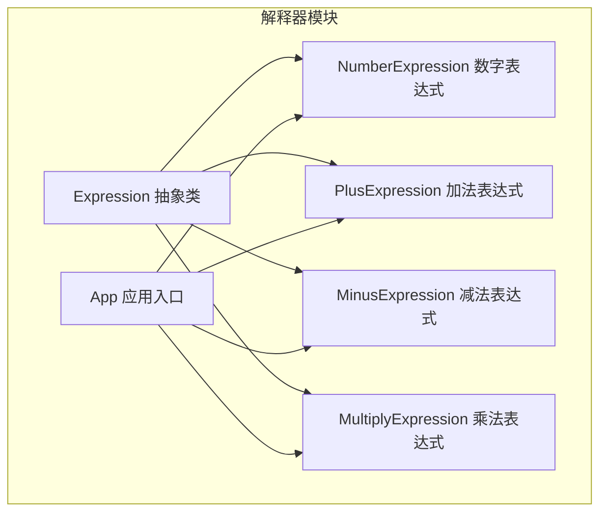
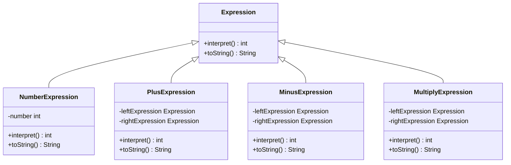
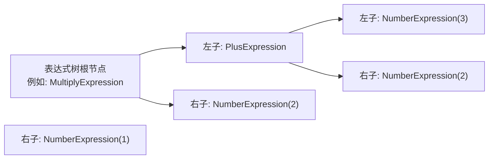
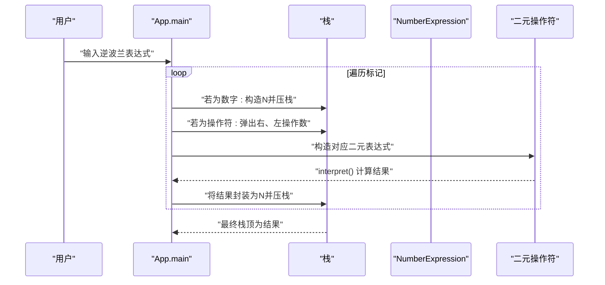
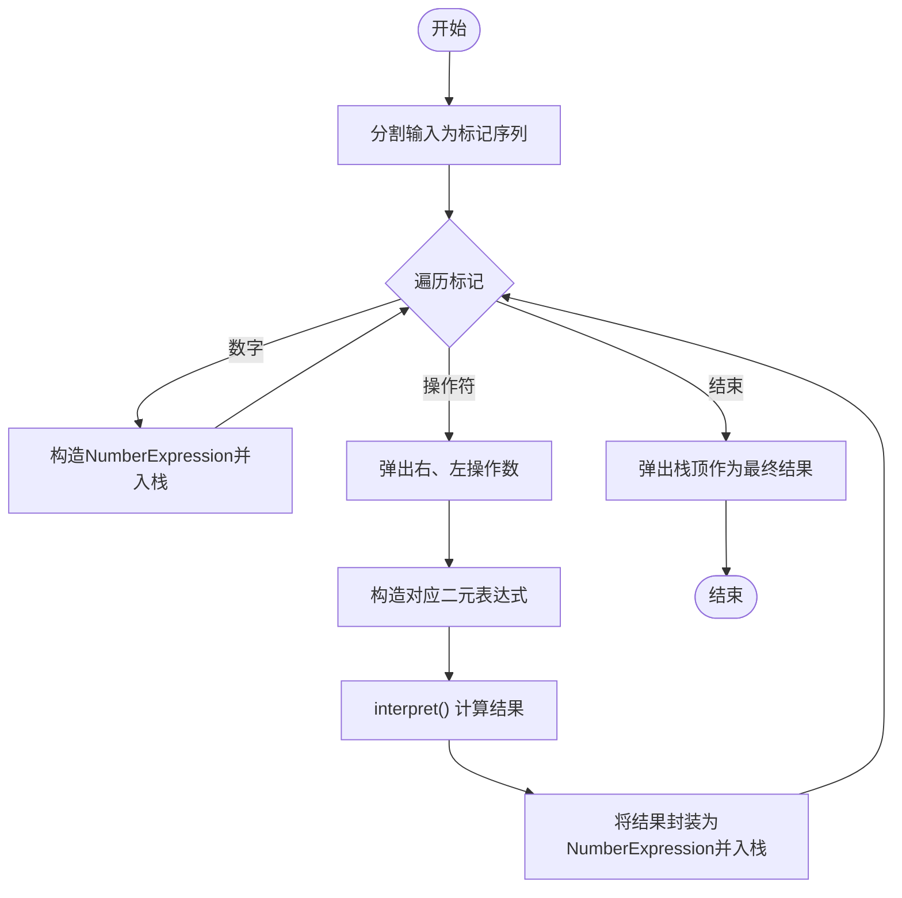
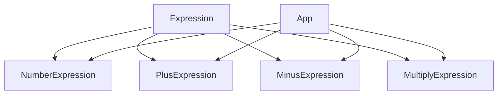

# 解释器模式

<cite>
**本文引用的文件**
- [Expression.java](file://interpreter/src/main/java/com/iluwatar/interpreter/Expression.java)
- [NumberExpression.java](file://interpreter/src/main/java/com/iluwatar/interpreter/NumberExpression.java)
- [PlusExpression.java](file://interpreter/src/main/java/com/iluwatar/interpreter/PlusExpression.java)
- [MinusExpression.java](file://interpreter/src/main/java/com/iluwatar/interpreter/MinusExpression.java)
- [MultiplyExpression.java](file://interpreter/src/main/java/com/iluwatar/interpreter/MultiplyExpression.java)
- [App.java](file://interpreter/src/main/java/com/iluwatar/interpreter/App.java)
- [README.md](file://interpreter/README.md)
</cite>

## 目录
1. [引言](#引言)
2. [项目结构](#项目结构)
3. [核心组件](#核心组件)
4. [架构总览](#架构总览)
5. [组件详解](#组件详解)
6. [依赖关系分析](#依赖关系分析)
7. [性能与适用性](#性能与适用性)
8. [故障排查指南](#故障排查指南)
9. [结论](#结论)
10. [附录](#附录)

## 引言
本文件系统化阐述解释器模式在仓库中的实现与应用，围绕“为某语言定义文法表示并提供解释器”的设计理念，深入分析抽象表达式与各具体表达式（NumberExpression、PlusExpression、MinusExpression、MultiplyExpression）的职责与协作方式；展示如何通过组合表达式构建复杂算术运算；给出语法树图与表达式求值流程图，说明递归下降解析与运算符优先级处理；并讨论该模式在领域特定语言（DSL）、规则引擎、正则表达式等场景的应用与局限。

## 项目结构
解释器模式示例位于 interpreter 模块中，采用按职责分层的组织方式：
- 表达式层次：抽象表达式与若干具体表达式类
- 应用入口：App 类负责将输入字符串解析为表达式树并执行求值
- 文档与示例：README 提供意图、示例与运行输出

图表来源
- [Expression.java](file://interpreter/src/main/java/com/iluwatar/interpreter/Expression.java#L30-L36)
- [NumberExpression.java](file://interpreter/src/main/java/com/iluwatar/interpreter/NumberExpression.java#L30-L51)
- [PlusExpression.java](file://interpreter/src/main/java/com/iluwatar/interpreter/PlusExpression.java#L30-L49)
- [MinusExpression.java](file://interpreter/src/main/java/com/iluwatar/interpreter/MinusExpression.java#L30-L50)
- [MultiplyExpression.java](file://interpreter/src/main/java/com/iluwatar/interpreter/MultiplyExpression.java#L30-L50)
- [App.java](file://interpreter/src/main/java/com/iluwatar/interpreter/App.java)

章节来源
- [README.md](file://interpreter/README.md#L1-L218)

## 核心组件
- 抽象表达式 Expression：定义统一接口 interpret() 与 toString()，作为所有表达式类型的根类型
- 具体表达式：
  - NumberExpression：叶子节点，封装整型数值，interpret 返回自身值
  - PlusExpression：二元操作符，interpret 返回左右子表达式结果之和
  - MinusExpression：二元操作符，interpret 返回左右子表达式结果之差
  - MultiplyExpression：二元操作符，interpret 返回左右子表达式结果之积

这些类共同构成一个表达式树（复合模式），每个节点要么是终结符（数字），要么是非终结符（操作符），通过递归解释完成求值。

章节来源
- [Expression.java](file://interpreter/src/main/java/com/iluwatar/interpreter/Expression.java#L30-L36)
- [NumberExpression.java](file://interpreter/src/main/java/com/iluwatar/interpreter/NumberExpression.java#L30-L51)
- [PlusExpression.java](file://interpreter/src/main/java/com/iluwatar/interpreter/PlusExpression.java#L30-L49)
- [MinusExpression.java](file://interpreter/src/main/java/com/iluwatar/interpreter/MinusExpression.java#L30-L50)
- [MultiplyExpression.java](file://interpreter/src/main/java/com/iluwatar/interpreter/MultiplyExpression.java#L30-L50)

## 架构总览
下图展示了表达式类之间的继承与组合关系，以及 App 如何利用这些表达式进行求值。

图表来源
- [Expression.java](file://interpreter/src/main/java/com/iluwatar/interpreter/Expression.java#L30-L36)
- [NumberExpression.java](file://interpreter/src/main/java/com/iluwatar/interpreter/NumberExpression.java#L30-L51)
- [PlusExpression.java](file://interpreter/src/main/java/com/iluwatar/interpreter/PlusExpression.java#L30-L49)
- [MinusExpression.java](file://interpreter/src/main/java/com/iluwatar/interpreter/MinusExpression.java#L30-L50)
- [MultiplyExpression.java](file://interpreter/src/main/java/com/iluwatar/interpreter/MultiplyExpression.java#L30-L50)

## 组件详解

### 表达式层次与职责
- Expression：定义 interpret() 与 toString()，确保所有表达式具备统一的解释与显示能力
- NumberExpression：终结符，封装常量值，interpret 直接返回该值
- PlusExpression/MinusExpression/MultiplyExpression：非终结符，组合两个子表达式，interpret 递归调用子节点并合并结果

图表来源
- [PlusExpression.java](file://interpreter/src/main/java/com/iluwatar/interpreter/PlusExpression.java#L30-L49)
- [MinusExpression.java](file://interpreter/src/main/java/com/iluwatar/interpreter/MinusExpression.java#L30-L50)
- [MultiplyExpression.java](file://interpreter/src/main/java/com/iluwatar/interpreter/MultiplyExpression.java#L30-L50)
- [NumberExpression.java](file://interpreter/src/main/java/com/iluwatar/interpreter/NumberExpression.java#L30-L51)

章节来源
- [Expression.java](file://interpreter/src/main/java/com/iluwatar/interpreter/Expression.java#L30-L36)
- [NumberExpression.java](file://interpreter/src/main/java/com/iluwatar/interpreter/NumberExpression.java#L30-L51)
- [PlusExpression.java](file://interpreter/src/main/java/com/iluwatar/interpreter/PlusExpression.java#L30-L49)
- [MinusExpression.java](file://interpreter/src/main/java/com/iluwatar/interpreter/MinusExpression.java#L30-L50)
- [MultiplyExpression.java](file://interpreter/src/main/java/com/iluwatar/interpreter/MultiplyExpression.java#L30-L50)

### 递归下降解析与运算符优先级
- 输入采用逆波兰表达式（RPN）风格，避免显式括号与优先级处理
- App 使用栈结构自左至右扫描标记：
  - 遇到数字：构造 NumberExpression 并入栈
  - 遇到操作符：从栈弹出右、左操作数，构造对应二元表达式，interpret 后再以 NumberExpression 压回栈
- 由于 RPN 的特性，无需手动处理运算符优先级，最终栈顶即为结果

图表来源
- [App.java](file://interpreter/src/main/java/com/iluwatar/interpreter/App.java)
- [NumberExpression.java](file://interpreter/src/main/java/com/iluwatar/interpreter/NumberExpression.java#L30-L51)
- [PlusExpression.java](file://interpreter/src/main/java/com/iluwatar/interpreter/PlusExpression.java#L30-L49)
- [MinusExpression.java](file://interpreter/src/main/java/com/iluwatar/interpreter/MinusExpression.java#L30-L50)
- [MultiplyExpression.java](file://interpreter/src/main/java/com/iluwatar/interpreter/MultiplyExpression.java#L30-L50)

章节来源
- [README.md](file://interpreter/README.md#L103-L156)

### 复杂表达式的构建与求值流程
- 通过组合多个二元表达式可构建任意复杂度的表达式树
- 求值时自底向上递归调用 interpret，先解释子节点，再合并结果
- 该流程天然支持复合表达式与嵌套结构

图表来源
- [App.java](file://interpreter/src/main/java/com/iluwatar/interpreter/App.java)
- [NumberExpression.java](file://interpreter/src/main/java/com/iluwatar/interpreter/NumberExpression.java#L30-L51)
- [PlusExpression.java](file://interpreter/src/main/java/com/iluwatar/interpreter/PlusExpression.java#L30-L49)
- [MinusExpression.java](file://interpreter/src/main/java/com/iluwatar/interpreter/MinusExpression.java#L30-L50)
- [MultiplyExpression.java](file://interpreter/src/main/java/com/iluwatar/interpreter/MultiplyExpression.java#L30-L50)

## 依赖关系分析
- 表达式类之间无循环依赖，均为单向继承于 Expression
- App 依赖所有具体表达式类以构造表达式树
- 依赖方向清晰，符合开闭原则：新增表达式只需扩展 Expression，不修改既有代码

图表来源
- [Expression.java](file://interpreter/src/main/java/com/iluwatar/interpreter/Expression.java#L30-L36)
- [NumberExpression.java](file://interpreter/src/main/java/com/iluwatar/interpreter/NumberExpression.java#L30-L51)
- [PlusExpression.java](file://interpreter/src/main/java/com/iluwatar/interpreter/PlusExpression.java#L30-L49)
- [MinusExpression.java](file://interpreter/src/main/java/com/iluwatar/interpreter/MinusExpression.java#L30-L50)
- [MultiplyExpression.java](file://interpreter/src/main/java/com/iluwatar/interpreter/MultiplyExpression.java#L30-L50)
- [App.java](file://interpreter/src/main/java/com/iluwatar/interpreter/App.java)

章节来源
- [Expression.java](file://interpreter/src/main/java/com/iluwatar/interpreter/Expression.java#L30-L36)
- [NumberExpression.java](file://interpreter/src/main/java/com/iluwatar/interpreter/NumberExpression.java#L30-L51)
- [PlusExpression.java](file://interpreter/src/main/java/com/iluwatar/interpreter/PlusExpression.java#L30-L49)
- [MinusExpression.java](file://interpreter/src/main/java/com/iluwatar/interpreter/MinusExpression.java#L30-L50)
- [MultiplyExpression.java](file://interpreter/src/main/java/com/iluwatar/interpreter/MultiplyExpression.java#L30-L50)
- [App.java](file://interpreter/src/main/java/com/iluwatar/interpreter/App.java)

## 性能与适用性
- 时间复杂度：对长度为 n 的标记序列，每个标记最多一次入栈与一次出栈，整体为 O(n)
- 空间复杂度：最坏情况下栈深与操作数规模相关，约为 O(n)
- 适用场景：
  - 语法简单、规则明确的语言或 DSL
  - 需要动态扩展新操作且不频繁修改既有语法的情况
- 局限性：
  - 对复杂语法，类数量与维护成本上升
  - 直接解释语法树通常不如编译为中间形式或状态机高效
- 运算符优先级：示例采用 RPN，避免了显式优先级处理；若改用中缀表达式，需引入额外机制（如调度场算法）以保证正确性

章节来源
- [README.md](file://interpreter/README.md#L181-L207)

## 故障排查指南
- 输入格式错误
  - 确保输入为合法标记序列，数字与操作符之间以空格分隔
  - 操作符数量应比数字数量少一，否则会导致栈上元素不足
- 类型与转换异常
  - NumberExpression 支持整型字符串构造，非法字符串会抛出转换异常
- 结果异常
  - 若表达式树构建错误（例如左右操作数顺序颠倒），将导致结果偏差
- 调试建议
  - 在 App 中逐标记打印当前栈状态与解释结果，便于定位问题

章节来源
- [NumberExpression.java](file://interpreter/src/main/java/com/iluwatar/interpreter/NumberExpression.java#L38-L40)
- [PlusExpression.java](file://interpreter/src/main/java/com/iluwatar/interpreter/PlusExpression.java#L35-L38)
- [MinusExpression.java](file://interpreter/src/main/java/com/iluwatar/interpreter/MinusExpression.java#L35-L38)
- [MultiplyExpression.java](file://interpreter/src/main/java/com/iluwatar/interpreter/MultiplyExpression.java#L35-L38)
- [README.md](file://interpreter/README.md#L158-L175)

## 结论
本实现以表达式树为核心，通过抽象表达式与具体表达式的组合，实现了对算术表达式的解析与求值。借助逆波兰表达式，避免了复杂的优先级处理，使解释过程简洁高效。该模式适合语法简单、易于扩展的场景；对于复杂语法与高性能需求，可结合编译/预处理或状态机策略进一步优化。

## 附录
- 示例运行输出参考：README 中记录了典型输入与日志输出，可对照验证实现行为
- 扩展建议：
  - 新增操作符：遵循现有二元表达式模式，仅需实现 interpret 与 toString
  - 支持浮点数：在 NumberExpression 中引入浮点类型与相应 interpret 实现
  - 支持函数调用：引入函数表达式类，组合参数列表与函数名，interpret 内部根据名称分派

章节来源
- [README.md](file://interpreter/README.md#L158-L175)