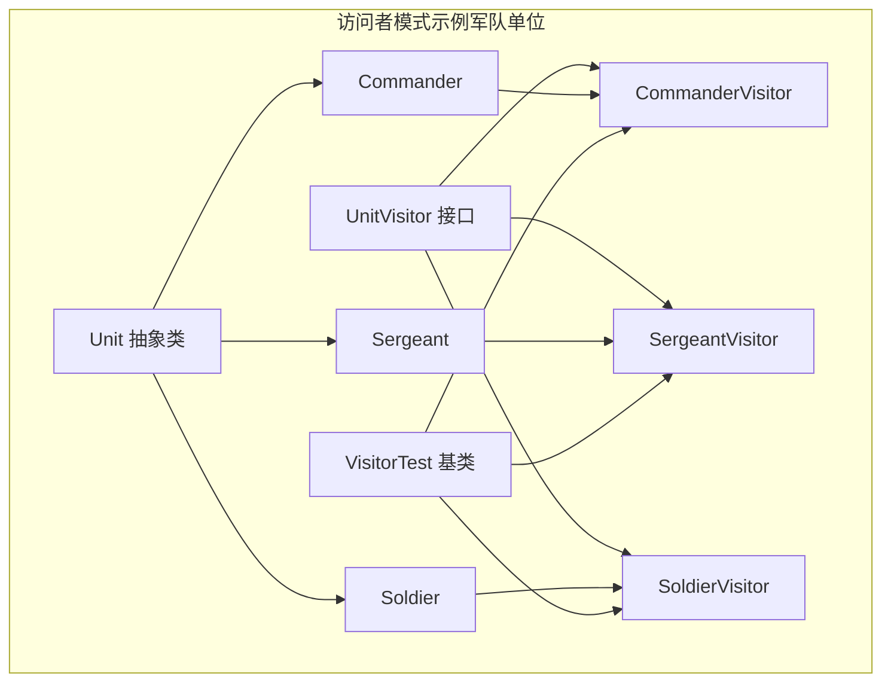
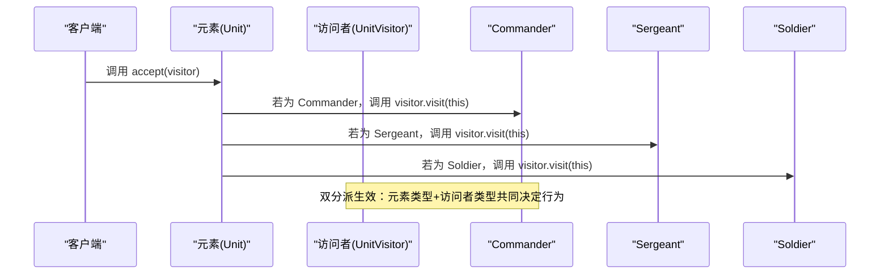
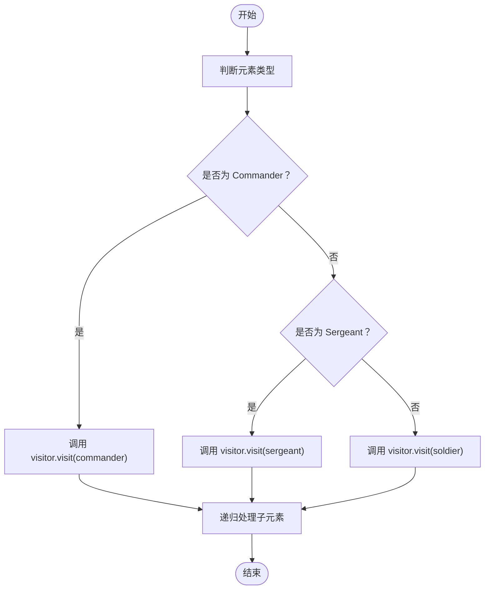
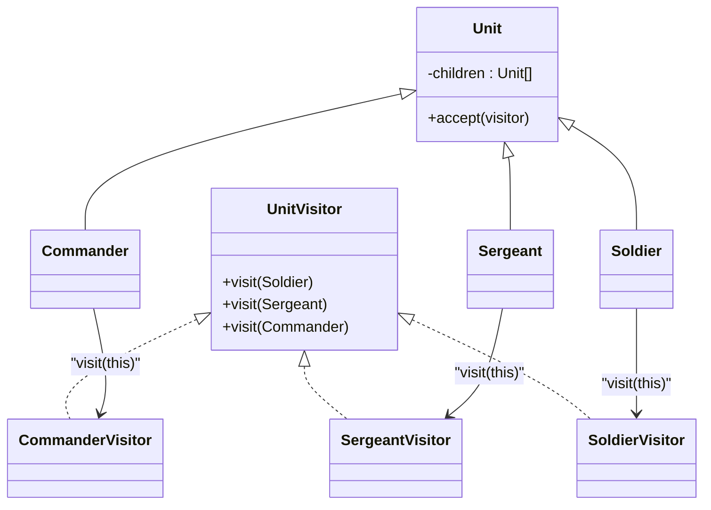
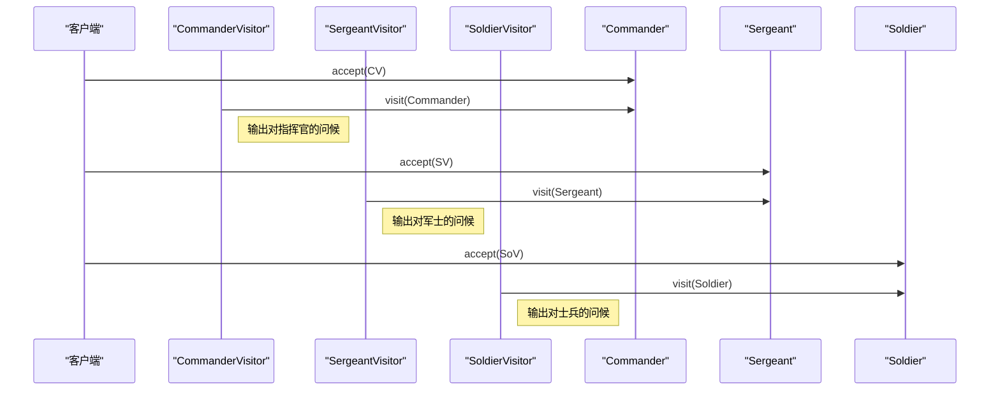
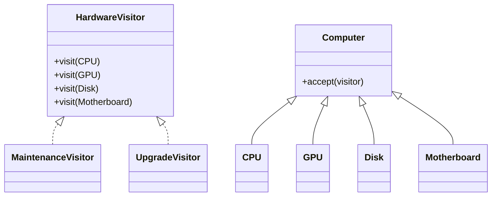
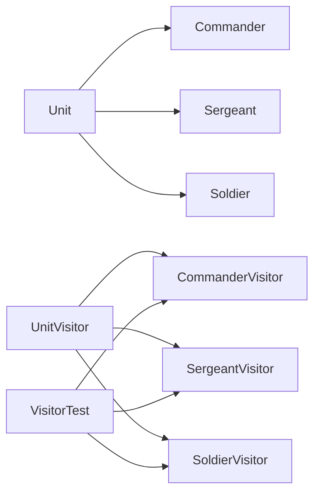

# 访问者模式

<cite>
**本文引用的文件**
- [README.md](file://visitor/README.md)
- [Unit.java](file://visitor/src/main/java/com/iluwatar/visitor/Unit.java)
- [UnitVisitor.java](file://visitor/src/main/java/com/iluwatar/visitor/UnitVisitor.java)
- [Commander.java](file://visitor/src/main/java/com/iluwatar/visitor/Commander.java)
- [Sergeant.java](file://visitor/src/main/java/com/iluwatar/visitor/Sergeant.java)
- [Soldier.java](file://visitor/src/main/java/com/iluwatar/visitor/Soldier.java)
- [CommanderVisitor.java](file://visitor/src/main/java/com/iluwatar/visitor/CommanderVisitor.java)
- [SergeantVisitor.java](file://visitor/src/main/java/com/iluwatar/visitor/SergeantVisitor.java)
- [SoldierVisitor.java](file://visitor/src/main/java/com/iluwatar/visitor/SoldierVisitor.java)
- [VisitorTest.java](file://visitor/src/test/java/com/iluwatar/visitor/VisitorTest.java)
</cite>

## 目录
1. [引言](#引言)
2. [项目结构](#项目结构)
3. [核心组件](#核心组件)
4. [架构总览](#架构总览)
5. [组件详解](#组件详解)
6. [依赖关系分析](#依赖关系分析)
7. [性能考量](#性能考量)
8. [故障排查指南](#故障排查指南)
9. [结论](#结论)
10. [附录](#附录)

## 引言
本文件系统化阐述访问者模式：一种将“作用于某对象结构中的各元素的操作”与“元素本身解耦的设计思想。通过在不改变元素类的前提下，为这些元素定义新的操作，访问者模式实现了算法与对象结构的分离，从而支持开闭原则并降低维护成本。本文结合仓库中的军队单位示例，深入解析元素接口与访问者接口的双向访问机制、Computer类（此处以Unit及其子类为代表）如何接受访问、各类硬件组件（以Unit子类为例）的访问实现，并给出完整的代码示例路径与可视化图示。

## 项目结构
访问者模式示例位于 visitor 模块，采用按职责分层的组织方式：
- 接口与抽象层：定义元素接口与访问者接口
- 元素实现层：具体元素类型（Commander、Sergeant、Soldier）
- 访问者实现层：针对不同角色的访问者（CommanderVisitor、SergeantVisitor、SoldierVisitor）
- 测试层：统一的测试基类用于验证访问者行为

图表来源
- [Unit.java](file://visitor/src/main/java/com/iluwatar/visitor/Unit.java#L32-L46)
- [UnitVisitor.java](file://visitor/src/main/java/com/iluwatar/visitor/UnitVisitor.java#L30-L38)
- [Commander.java](file://visitor/src/main/java/com/iluwatar/visitor/Commander.java#L30-L50)
- [Sergeant.java](file://visitor/src/main/java/com/iluwatar/visitor/Sergeant.java#L30-L50)
- [Soldier.java](file://visitor/src/main/java/com/iluwatar/visitor/Soldier.java#L30-L50)
- [CommanderVisitor.java](file://visitor/src/main/java/com/iluwatar/visitor/CommanderVisitor.java#L33-L61)
- [SergeantVisitor.java](file://visitor/src/main/java/com/iluwatar/visitor/SergeantVisitor.java#L33-L61)
- [SoldierVisitor.java](file://visitor/src/main/java/com/iluwatar/visitor/SoldierVisitor.java#L33-L61)
- [VisitorTest.java](file://visitor/src/test/java/com/iluwatar/visitor/VisitorTest.java#L44-L95)

章节来源
- [README.md](file://visitor/README.md#L15-L34)
- [Unit.java](file://visitor/src/main/java/com/iluwatar/visitor/Unit.java#L29-L46)
- [UnitVisitor.java](file://visitor/src/main/java/com/iluwatar/visitor/UnitVisitor.java#L27-L38)

## 核心组件
- 元素接口（Element）：在本示例中体现为 Unit 抽象类，负责声明 accept 方法以接收访问者，并递归地向子元素广播访问。
- 访问者接口（Visitor）：在本示例中体现为 UnitVisitor 接口，声明对各具体元素类型的访问方法（visit）。
- 具体元素（Concrete Elements）：Commander、Sergeant、Soldier 继承自 Unit，各自覆盖 accept 方法以先调用访问者的对应 visit，再向下传播。
- 具体访问者（Concrete Visitors）：CommanderVisitor、SergeantVisitor、SoldierVisitor 实现 UnitVisitor，针对不同元素输出差异化行为。
- 测试基类（VisitorTest）：提供统一的日志捕获与断言逻辑，便于验证访问者对不同元素的响应。

章节来源
- [Unit.java](file://visitor/src/main/java/com/iluwatar/visitor/Unit.java#L32-L46)
- [UnitVisitor.java](file://visitor/src/main/java/com/iluwatar/visitor/UnitVisitor.java#L30-L38)
- [Commander.java](file://visitor/src/main/java/com/iluwatar/visitor/Commander.java#L30-L50)
- [Sergeant.java](file://visitor/src/main/java/com/iluwatar/visitor/Sergeant.java#L30-L50)
- [Soldier.java](file://visitor/src/main/java/com/iluwatar/visitor/Soldier.java#L30-L50)
- [CommanderVisitor.java](file://visitor/src/main/java/com/iluwatar/visitor/CommanderVisitor.java#L33-L61)
- [SergeantVisitor.java](file://visitor/src/main/java/com/iluwatar/visitor/SergeantVisitor.java#L33-L61)
- [SoldierVisitor.java](file://visitor/src/main/java/com/iluwatar/visitor/SoldierVisitor.java#L33-L61)
- [VisitorTest.java](file://visitor/src/test/java/com/iluwatar/visitor/VisitorTest.java#L44-L145)

## 架构总览
访问者模式的关键在于“双分派”：元素通过 accept 将自身类型信息传递给访问者；访问者基于元素的实际类型选择对应的 visit 方法。该机制使得新增操作（访问者）无需修改元素类，同时新增元素类型需要同步更新访问者接口及其实现。

图表来源
- [Unit.java](file://visitor/src/main/java/com/iluwatar/visitor/Unit.java#L43-L45)
- [Commander.java](file://visitor/src/main/java/com/iluwatar/visitor/Commander.java#L40-L44)
- [Sergeant.java](file://visitor/src/main/java/com/iluwatar/visitor/Sergeant.java#L40-L44)
- [Soldier.java](file://visitor/src/main/java/com/iluwatar/visitor/Soldier.java#L40-L44)
- [UnitVisitor.java](file://visitor/src/main/java/com/iluwatar/visitor/UnitVisitor.java#L30-L38)

## 组件详解

### 元素层次与接受访问流程
- Unit 抽象类提供 accept 方法，遍历子元素并逐个调用其 accept，形成树形结构的深度传播。
- Commander、Sergeant、Soldier 各自覆盖 accept，在处理自身后，再调用父类的 accept 以继续向下传播。
- 这种设计确保了访问者能够“先处理当前节点，再处理子节点”的前序遍历效果。

图表来源
- [Unit.java](file://visitor/src/main/java/com/iluwatar/visitor/Unit.java#L43-L45)
- [Commander.java](file://visitor/src/main/java/com/iluwatar/visitor/Commander.java#L40-L44)
- [Sergeant.java](file://visitor/src/main/java/com/iluwatar/visitor/Sergeant.java#L40-L44)
- [Soldier.java](file://visitor/src/main/java/com/iluwatar/visitor/Soldier.java#L40-L44)

章节来源
- [Unit.java](file://visitor/src/main/java/com/iluwatar/visitor/Unit.java#L32-L46)
- [Commander.java](file://visitor/src/main/java/com/iluwatar/visitor/Commander.java#L30-L50)
- [Sergeant.java](file://visitor/src/main/java/com/iluwatar/visitor/Sergeant.java#L30-L50)
- [Soldier.java](file://visitor/src/main/java/com/iluwatar/visitor/Soldier.java#L30-L50)

### 访问者接口与双向访问机制
- UnitVisitor 接口声明对三种元素类型的访问方法，访问者通过实现该接口表达“对元素集合的新操作”。
- 元素通过 accept 将自身传入访问者，访问者据此进行分支处理，体现了“运行时多态 + 双分派”的协作。

图表来源
- [UnitVisitor.java](file://visitor/src/main/java/com/iluwatar/visitor/UnitVisitor.java#L30-L38)
- [Unit.java](file://visitor/src/main/java/com/iluwatar/visitor/Unit.java#L32-L46)
- [Commander.java](file://visitor/src/main/java/com/iluwatar/visitor/Commander.java#L30-L50)
- [Sergeant.java](file://visitor/src/main/java/com/iluwatar/visitor/Sergeant.java#L30-L50)
- [Soldier.java](file://visitor/src/main/java/com/iluwatar/visitor/Soldier.java#L30-L50)
- [CommanderVisitor.java](file://visitor/src/main/java/com/iluwatar/visitor/CommanderVisitor.java#L33-L61)
- [SergeantVisitor.java](file://visitor/src/main/java/com/iluwatar/visitor/SergeantVisitor.java#L33-L61)
- [SoldierVisitor.java](file://visitor/src/main/java/com/iluwatar/visitor/SoldierVisitor.java#L33-L61)

章节来源
- [UnitVisitor.java](file://visitor/src/main/java/com/iluwatar/visitor/UnitVisitor.java#L27-L38)
- [Unit.java](file://visitor/src/main/java/com/iluwatar/visitor/Unit.java#L39-L46)

### 具体访问者实现与差异化行为
- CommanderVisitor：仅对 Commander 输出问候信息，对其他元素不做处理。
- SergeantVisitor：仅对 Sergeant 输出问候信息，对其他元素不做处理。
- SoldierVisitor：仅对 Soldier 输出问候信息，对其他元素不做处理。

图表来源
- [CommanderVisitor.java](file://visitor/src/main/java/com/iluwatar/visitor/CommanderVisitor.java#L33-L61)
- [SergeantVisitor.java](file://visitor/src/main/java/com/iluwatar/visitor/SergeantVisitor.java#L33-L61)
- [SoldierVisitor.java](file://visitor/src/main/java/com/iluwatar/visitor/SoldierVisitor.java#L33-L61)
- [Commander.java](file://visitor/src/main/java/com/iluwatar/visitor/Commander.java#L40-L44)
- [Sergeant.java](file://visitor/src/main/java/com/iluwatar/visitor/Sergeant.java#L40-L44)
- [Soldier.java](file://visitor/src/main/java/com/iluwatar/visitor/Soldier.java#L40-L44)

章节来源
- [CommanderVisitor.java](file://visitor/src/main/java/com/iluwatar/visitor/CommanderVisitor.java#L33-L61)
- [SergeantVisitor.java](file://visitor/src/main/java/com/iluwatar/visitor/SergeantVisitor.java#L33-L61)
- [SoldierVisitor.java](file://visitor/src/main/java/com/iluwatar/visitor/SoldierVisitor.java#L33-L61)

### 计算机硬件维护与升级示例（概念性演示）
虽然仓库示例以军队单位为主，但访问者模式同样适用于计算机硬件结构。可将 Computer 视为元素结构，CPU、GPU、Disk、Motherboard 等视为具体元素，维护与升级操作作为访问者。通过访问者模式，可在不修改硬件类的前提下，为不同硬件添加“健康检查、兼容性检测、升级建议”等新操作。

图表来源
- [UnitVisitor.java](file://visitor/src/main/java/com/iluwatar/visitor/UnitVisitor.java#L30-L38)
- [Unit.java](file://visitor/src/main/java/com/iluwatar/visitor/Unit.java#L32-L46)

## 依赖关系分析
- 元素与访问者之间为单向依赖：元素持有访问者并触发访问；访问者不持有元素实例，仅通过参数接收。
- 元素间存在继承关系，但彼此独立，互不影响访问者实现。
- 访问者实现之间相互独立，可自由组合以实现不同的业务操作。
- 测试基类 VisitorTest 通过日志捕获与断言，统一验证访问者的行为一致性。

图表来源
- [Unit.java](file://visitor/src/main/java/com/iluwatar/visitor/Unit.java#L32-L46)
- [UnitVisitor.java](file://visitor/src/main/java/com/iluwatar/visitor/UnitVisitor.java#L30-L38)
- [Commander.java](file://visitor/src/main/java/com/iluwatar/visitor/Commander.java#L30-L50)
- [Sergeant.java](file://visitor/src/main/java/com/iluwatar/visitor/Sergeant.java#L30-L50)
- [Soldier.java](file://visitor/src/main/java/com/iluwatar/visitor/Soldier.java#L30-L50)
- [CommanderVisitor.java](file://visitor/src/main/java/com/iluwatar/visitor/CommanderVisitor.java#L33-L61)
- [SergeantVisitor.java](file://visitor/src/main/java/com/iluwatar/visitor/SergeantVisitor.java#L33-L61)
- [SoldierVisitor.java](file://visitor/src/main/java/com/iluwatar/visitor/SoldierVisitor.java#L33-L61)
- [VisitorTest.java](file://visitor/src/test/java/com/iluwatar/visitor/VisitorTest.java#L44-L95)

章节来源
- [VisitorTest.java](file://visitor/src/test/java/com/iluwatar/visitor/VisitorTest.java#L44-L145)

## 性能考量
- 时间复杂度：对树形结构的遍历为 O(N)，其中 N 为元素总数。每个元素仅被访问一次，访问者内部的分支判断为常数时间。
- 空间复杂度：递归调用栈深度等于树的最大高度，最坏情况下为 O(N)。
- 扩展性：新增访问者不会影响现有元素类，符合开闭原则；新增元素类型需同步更新访问者接口与所有实现，可能带来一定维护成本。

## 故障排查指南
- 行为未触发：确认元素是否正确覆盖 accept 并在内部调用 visitor.visit(this)。
- 日志断言失败：检查测试基类日志捕获器是否正确注册，以及访问者输出格式是否与断言一致。
- 新增访问者无效：若新增访问方法未被调用，检查元素 accept 是否转发到正确的 visit 方法。

章节来源
- [VisitorTest.java](file://visitor/src/test/java/com/iluwatar/visitor/VisitorTest.java#L124-L145)

## 结论
访问者模式通过“将算法从对象结构中分离”，实现了对稳定对象结构的灵活扩展。在本示例中，元素类保持稳定，而访问者可随需求演进；当需要为对象结构引入新的操作时，只需新增访问者，无需改动元素类，从而更好地支持开闭原则并降低长期维护成本。对于更复杂的硬件结构，可参考本示例的类图与序列图，将 Computer 与硬件组件映射为元素与访问者，以实现维护与升级等多样化操作。

## 附录
- 访问者模式适用场景举例（来自仓库文档）：
  - 编译器设计中的 AST 遍历、语义检查、美化打印等
  - 文档结构处理（HTML/XML）
  - 文件系统遍历（FileVisitor）
  - Java 标准库中的 ElementVisitor、AnnotationValueVisitor 等

章节来源
- [README.md](file://visitor/README.md#L242-L251)