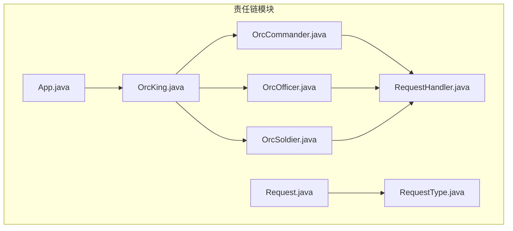
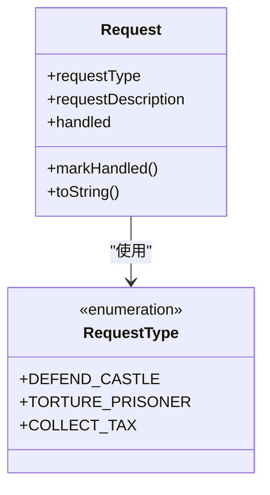
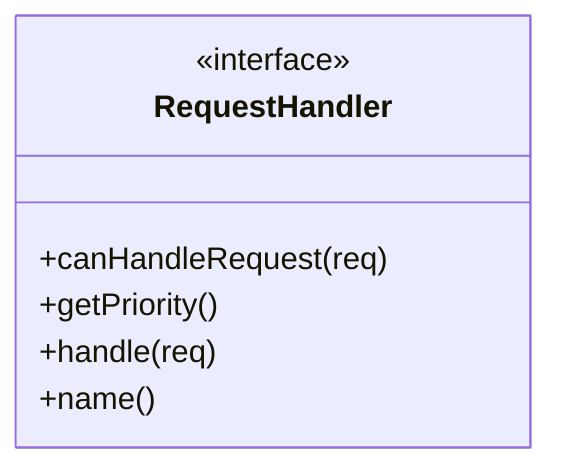
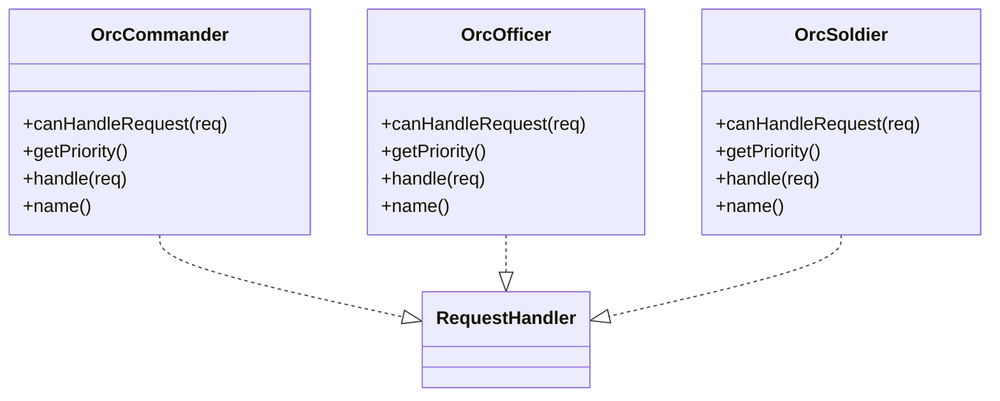
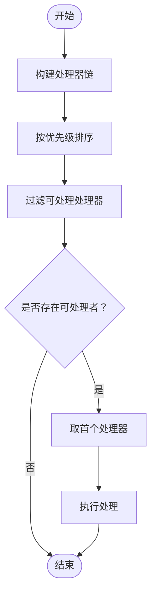
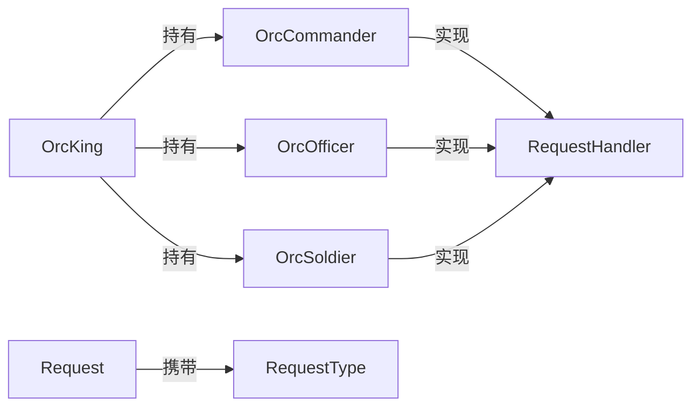
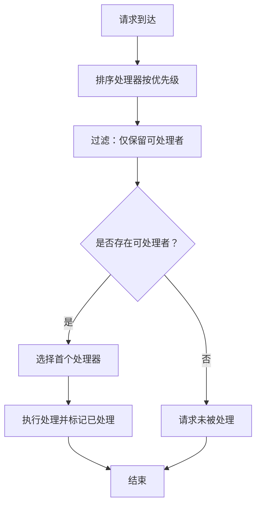

# 责任链模式

<cite>
**本文引用的文件**
- [App.java](file://chain-of-responsibility/src/main/java/com/iluwatar/chain/App.java)
- [OrcKing.java](file://chain-of-responsibility/src/main/java/com/iluwatar/chain/OrcKing.java)
- [OrcCommander.java](file://chain-of-responsibility/src/main/java/com/iluwatar/chain/OrcCommander.java)
- [OrcOfficer.java](file://chain-of-responsibility/src/main/java/com/iluwatar/chain/OrcOfficer.java)
- [OrcSoldier.java](file://chain-of-responsibility/src/main/java/com/iluwatar/chain/OrcSoldier.java)
- [RequestHandler.java](file://chain-of-responsibility/src/main/java/com/iluwatar/chain/RequestHandler.java)
- [Request.java](file://chain-of-responsibility/src/main/java/com/iluwatar/chain/Request.java)
- [RequestType.java](file://chain-of-responsibility/src/main/java/com/iluwatar/chain/RequestType.java)
- [AppTest.java](file://chain-of-responsibility/src/test/java/com/iluwatar/chain/AppTest.java)
- [OrcKingTest.java](file://chain-of-responsibility/src/test/java/com/iluwatar/chain/OrcKingTest.java)
- [README.md](file://chain-of-responsibility/README.md)
</cite>

## 目录
1. [引言](#引言)
2. [项目结构](#项目结构)
3. [核心组件](#核心组件)
4. [架构总览](#架构总览)
5. [详细组件分析](#详细组件分析)
6. [依赖分析](#依赖分析)
7. [性能考虑](#性能考虑)
8. [故障排查指南](#故障排查指南)
9. [结论](#结论)
10. [附录：完整用例与流程图](#附录完整用例与流程图)

## 引言
本技术文档围绕责任链（Chain of Responsibility）设计模式展开，系统性解析其在“兽人军队命令传递”场景中的实现与应用。该模式通过让多个对象都有机会处理请求，从而避免请求的发送者与接收者之间的紧耦合；请求沿着由处理器组成的链路传递，直到被某个处理器接受并处理为止。

在本仓库中，责任链模式通过以下关键构件协同工作：
- 请求载体：Request 与 RequestType 枚举
- 处理接口：RequestHandler
- 具体处理器：OrcCommander、OrcOfficer、OrcSoldier
- 链构建与调度：OrcKing
- 示例入口：App

此外，文档还将讨论该模式在游戏开发中的典型应用场景，例如聊天系统的消息过滤、权限验证、事件处理等，并提供责任链流程图与处理顺序图，帮助读者从整体到细节全面掌握该模式的设计思想与实践要点。

## 项目结构
责任链模式示例位于 chain-of-responsibility 模块中，采用按职责分层的组织方式：
- 主要源码位于 com.iluwatar.chain 包下，包含请求模型、处理器接口与具体处理器、链构建者以及示例入口。
- 测试位于 test/java/com.iluwatar.chain 包下，覆盖应用主流程与链处理正确性。



图表来源
- [App.java](file://chain-of-responsibility/src/main/java/com/iluwatar/chain/App.java#L38-L52)
- [OrcKing.java](file://chain-of-responsibility/src/main/java/com/iluwatar/chain/OrcKing.java#L34-L57)
- [RequestHandler.java](file://chain-of-responsibility/src/main/java/com/iluwatar/chain/RequestHandler.java#L30-L39)
- [Request.java](file://chain-of-responsibility/src/main/java/com/iluwatar/chain/Request.java#L34-L76)
- [RequestType.java](file://chain-of-responsibility/src/main/java/com/iluwatar/chain/RequestType.java#L30-L36)
- [OrcCommander.java](file://chain-of-responsibility/src/main/java/com/iluwatar/chain/OrcCommander.java#L33-L54)
- [OrcOfficer.java](file://chain-of-responsibility/src/main/java/com/iluwatar/chain/OrcOfficer.java#L33-L55)
- [OrcSoldier.java](file://chain-of-responsibility/src/main/java/com/iluwatar/chain/OrcSoldier.java#L33-L54)

章节来源
- [App.java](file://chain-of-responsibility/src/main/java/com/iluwatar/chain/App.java#L38-L52)
- [README.md](file://chain-of-responsibility/README.md#L1-L210)

## 核心组件
- Request：封装请求类型与描述，并维护“已处理”状态。用于承载业务请求并在链上传递。
- RequestType：定义可识别的请求类型集合，作为处理器匹配的依据。
- RequestHandler：定义统一的处理契约，包括是否能处理、优先级、处理动作与名称。
- OrcCommander/OrcOfficer/OrcSoldier：三类处理器，分别对应不同类型的请求，具备各自优先级与处理行为。
- OrcKing：负责构建处理器链并对请求进行调度，按优先级排序后筛选首个可处理者执行。

章节来源
- [Request.java](file://chain-of-responsibility/src/main/java/com/iluwatar/chain/Request.java#L34-L76)
- [RequestType.java](file://chain-of-responsibility/src/main/java/com/iluwatar/chain/RequestType.java#L30-L36)
- [RequestHandler.java](file://chain-of-responsibility/src/main/java/com/iluwatar/chain/RequestHandler.java#L30-L39)
- [OrcCommander.java](file://chain-of-responsibility/src/main/java/com/iluwatar/chain/OrcCommander.java#L33-L54)
- [OrcOfficer.java](file://chain-of-responsibility/src/main/java/com/iluwatar/chain/OrcOfficer.java#L33-L55)
- [OrcSoldier.java](file://chain-of-responsibility/src/main/java/com/iluwatar/chain/OrcSoldier.java#L33-L54)
- [OrcKing.java](file://chain-of-responsibility/src/main/java/com/iluwatar/chain/OrcKing.java#L34-L57)

## 架构总览
责任链的整体交互流程如下：调用方（App）构造请求并交由 OrcKing 发起处理；OrcKing 将处理器列表按优先级排序，过滤出能处理当前请求的处理器，取第一个执行处理；处理器在处理时会标记请求为已处理。

```mermaid
sequenceDiagram
participant App as "App"
participant King as "OrcKing"
participant Chain as "处理器链"
participant Cmd as "OrcCommander"
participant Off as "OrcOfficer"
participant Sol as "OrcSoldier"
App->>King : "makeRequest(Request)"
King->>Chain : "按优先级排序并过滤"
alt "DEFEND_CASTLE"
Chain-->>Cmd : "匹配"
Cmd->>Cmd : "处理并标记已处理"
else "TORTURE_PRISONER"
Chain-->>Off : "匹配"
Off->>Off : "处理并标记已处理"
else "COLLECT_TAX"
Chain-->>Sol : "匹配"
Sol->>Sol : "处理并标记已处理"
end
```

图表来源
- [App.java](file://chain-of-responsibility/src/main/java/com/iluwatar/chain/App.java#L45-L51)
- [OrcKing.java](file://chain-of-responsibility/src/main/java/com/iluwatar/chain/OrcKing.java#L49-L56)
- [OrcCommander.java](file://chain-of-responsibility/src/main/java/com/iluwatar/chain/OrcCommander.java#L34-L48)
- [OrcOfficer.java](file://chain-of-responsibility/src/main/java/com/iluwatar/chain/OrcOfficer.java#L34-L48)
- [OrcSoldier.java](file://chain-of-responsibility/src/main/java/com/iluwatar/chain/OrcSoldier.java#L34-L48)

## 详细组件分析

### Request 与 RequestType：请求建模
- Request 提供请求类型、描述与“已处理”状态管理，确保请求在链上只被处理一次。
- RequestType 定义了三种可识别的请求类型，是处理器匹配的关键条件。



图表来源
- [Request.java](file://chain-of-responsibility/src/main/java/com/iluwatar/chain/Request.java#L34-L76)
- [RequestType.java](file://chain-of-responsibility/src/main/java/com/iluwatar/chain/RequestType.java#L30-L36)

章节来源
- [Request.java](file://chain-of-responsibility/src/main/java/com/iluwatar/chain/Request.java#L34-L76)
- [RequestType.java](file://chain-of-responsibility/src/main/java/com/iluwatar/chain/RequestType.java#L30-L36)

### RequestHandler：处理契约
- 统一接口定义了四个方法：canHandleRequest、getPriority、handle、name。
- 该契约使处理器具备可替换性与可扩展性，便于动态增删处理器或调整处理顺序。



图表来源
- [RequestHandler.java](file://chain-of-responsibility/src/main/java/com/iluwatar/chain/RequestHandler.java#L30-L39)

章节来源
- [RequestHandler.java](file://chain-of-responsibility/src/main/java/com/iluwatar/chain/RequestHandler.java#L30-L39)

### 具体处理器：OrcCommander、OrcOfficer、OrcSoldier
- 三个处理器分别绑定一种请求类型，并设置各自的优先级；处理时会标记请求为已处理并输出日志信息。
- 优先级决定了在链上的排序位置，影响首个可处理者的选取。



图表来源
- [OrcCommander.java](file://chain-of-responsibility/src/main/java/com/iluwatar/chain/OrcCommander.java#L33-L54)
- [OrcOfficer.java](file://chain-of-responsibility/src/main/java/com/iluwatar/chain/OrcOfficer.java#L33-L55)
- [OrcSoldier.java](file://chain-of-responsibility/src/main/java/com/iluwatar/chain/OrcSoldier.java#L33-L54)
- [RequestHandler.java](file://chain-of-responsibility/src/main/java/com/iluwatar/chain/RequestHandler.java#L30-L39)

章节来源
- [OrcCommander.java](file://chain-of-responsibility/src/main/java/com/iluwatar/chain/OrcCommander.java#L33-L54)
- [OrcOfficer.java](file://chain-of-responsibility/src/main/java/com/iluwatar/chain/OrcOfficer.java#L33-L55)
- [OrcSoldier.java](file://chain-of-responsibility/src/main/java/com/iluwatar/chain/OrcSoldier.java#L33-L54)

### 链构建与调度：OrcKing
- 构造函数中构建处理器链（命令官、军官、士兵）。
- makeRequest 方法对处理器按优先级排序，过滤出能处理当前请求的处理器，取首个执行处理。



图表来源
- [OrcKing.java](file://chain-of-responsibility/src/main/java/com/iluwatar/chain/OrcKing.java#L42-L56)

章节来源
- [OrcKing.java](file://chain-of-responsibility/src/main/java/com/iluwatar/chain/OrcKing.java#L34-L57)

### 应用入口：App
- 示例程序通过三次请求分别触发不同处理器，验证链的正确性与输出顺序。

章节来源
- [App.java](file://chain-of-responsibility/src/main/java/com/iluwatar/chain/App.java#L45-L51)

## 依赖分析
- 组件内聚与解耦：OrcKing 仅负责链的构建与调度，不关心具体处理器的实现细节；处理器通过统一接口与优先级参与调度，降低耦合度。
- 可扩展性：新增处理器只需实现 RequestHandler 并加入链中，即可参与请求处理；通过调整优先级可改变处理顺序。
- 可测试性：测试覆盖主流程与链处理正确性，确保每种请求类型都能被处理。



图表来源
- [OrcKing.java](file://chain-of-responsibility/src/main/java/com/iluwatar/chain/OrcKing.java#L36-L44)
- [OrcCommander.java](file://chain-of-responsibility/src/main/java/com/iluwatar/chain/OrcCommander.java#L33-L54)
- [OrcOfficer.java](file://chain-of-responsibility/src/main/java/com/iluwatar/chain/OrcOfficer.java#L33-L55)
- [OrcSoldier.java](file://chain-of-responsibility/src/main/java/com/iluwatar/chain/OrcSoldier.java#L33-L54)
- [RequestHandler.java](file://chain-of-responsibility/src/main/java/com/iluwatar/chain/RequestHandler.java#L30-L39)
- [Request.java](file://chain-of-responsibility/src/main/java/com/iluwatar/chain/Request.java#L34-L76)
- [RequestType.java](file://chain-of-responsibility/src/main/java/com/iluwatar/chain/RequestType.java#L30-L36)

章节来源
- [OrcKing.java](file://chain-of-responsibility/src/main/java/com/iluwatar/chain/OrcKing.java#L34-L57)
- [RequestHandler.java](file://chain-of-responsibility/src/main/java/com/iluwatar/chain/RequestHandler.java#L30-L39)
- [Request.java](file://chain-of-responsibility/src/main/java/com/iluwatar/chain/Request.java#L34-L76)
- [RequestType.java](file://chain-of-responsibility/src/main/java/com/iluwatar/chain/RequestType.java#L30-L36)

## 性能考虑
- 排序与过滤：OrcKing 在每次处理前对处理器列表进行排序与过滤，时间复杂度近似 O(n log n + n)，其中 n 为处理器数量。若处理器数量较多，可考虑缓存排序结果或在构建链时预先排序以减少重复计算。
- 查找策略：当前实现使用流式查找并取首个匹配处理器，时间复杂度 O(n)。若链较长且频繁调用，可考虑基于请求类型的索引映射优化查找效率。
- 处理开销：处理器内部处理逻辑应尽量轻量，避免在链上引入不必要的阻塞操作。

## 故障排查指南
- 请求未被处理：检查链中是否存在能处理该类型请求的处理器，或确认处理器的优先级是否过低导致未被选中。
- 处理顺序异常：核对各处理器的优先级设置，确保排序后符合预期的处理顺序。
- 单元测试验证：通过测试断言确保所有请求最终都被标记为已处理，便于快速定位问题。

章节来源
- [OrcKingTest.java](file://chain-of-responsibility/src/test/java/com/iluwatar/chain/OrcKingTest.java#L47-L58)
- [AppTest.java](file://chain-of-responsibility/src/test/java/com/iluwatar/chain/AppTest.java#L43-L47)

## 结论
责任链模式通过“处理器接口 + 处理器链 + 调度器”的组合，实现了请求处理的高内聚、低耦合与强扩展性。在兽人军队示例中，OrcKing 作为调度器，OrcCommander、OrcOfficer、OrcSoldier 作为处理器，Request 与 RequestType 作为请求载体，共同构成了清晰的责任链结构。该模式同样适用于游戏开发中的聊天消息过滤、权限校验、事件传播等场景，能够有效提升系统的可维护性与可扩展性。

## 附录：完整用例与流程图

### 用例：兽人军队命令传递
- 步骤
  1) 创建请求（防御城堡、拷问囚徒、收税）
  2) 交由 OrcKing 进行处理
  3) OrcKing 对处理器按优先级排序并过滤
  4) 取首个可处理者执行处理并标记已处理
- 预期输出
  - 命令官处理“防御城堡”
  - 军官处理“拷问囚徒”
  - 士兵处理“收税”

章节来源
- [App.java](file://chain-of-responsibility/src/main/java/com/iluwatar/chain/App.java#L45-L51)
- [OrcKing.java](file://chain-of-responsibility/src/main/java/com/iluwatar/chain/OrcKing.java#L49-L56)
- [OrcCommander.java](file://chain-of-responsibility/src/main/java/com/iluwatar/chain/OrcCommander.java#L44-L48)
- [OrcOfficer.java](file://chain-of-responsibility/src/main/java/com/iluwatar/chain/OrcOfficer.java#L44-L48)
- [OrcSoldier.java](file://chain-of-responsibility/src/main/java/com/iluwatar/chain/OrcSoldier.java#L44-L48)

### 责任链流程图（算法视角）


图表来源
- [OrcKing.java](file://chain-of-responsibility/src/main/java/com/iluwatar/chain/OrcKing.java#L49-L56)