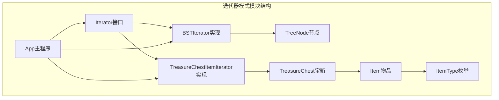
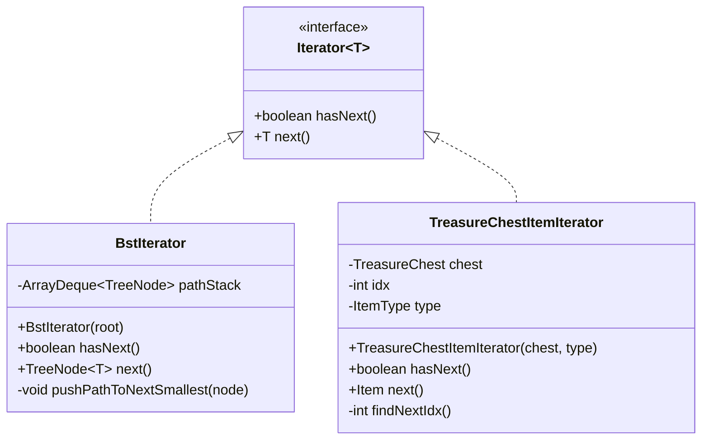
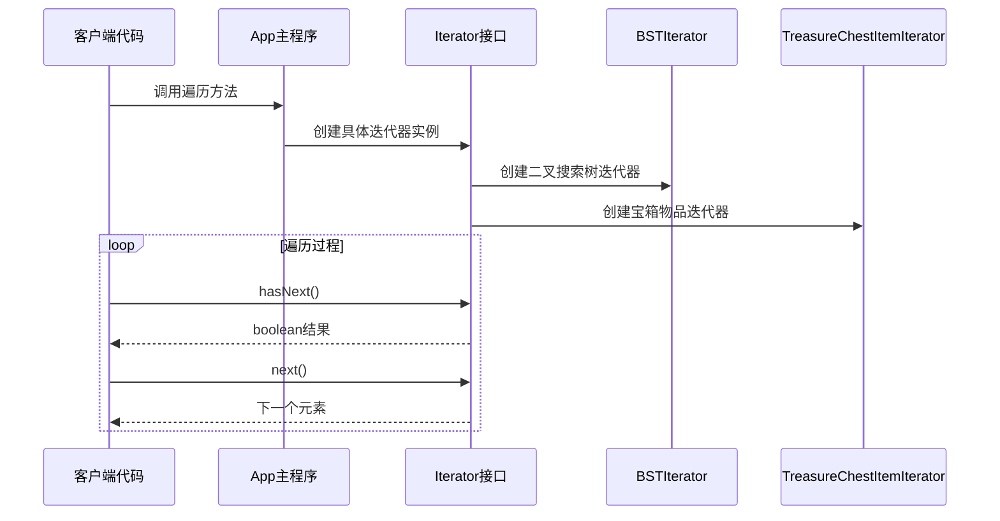
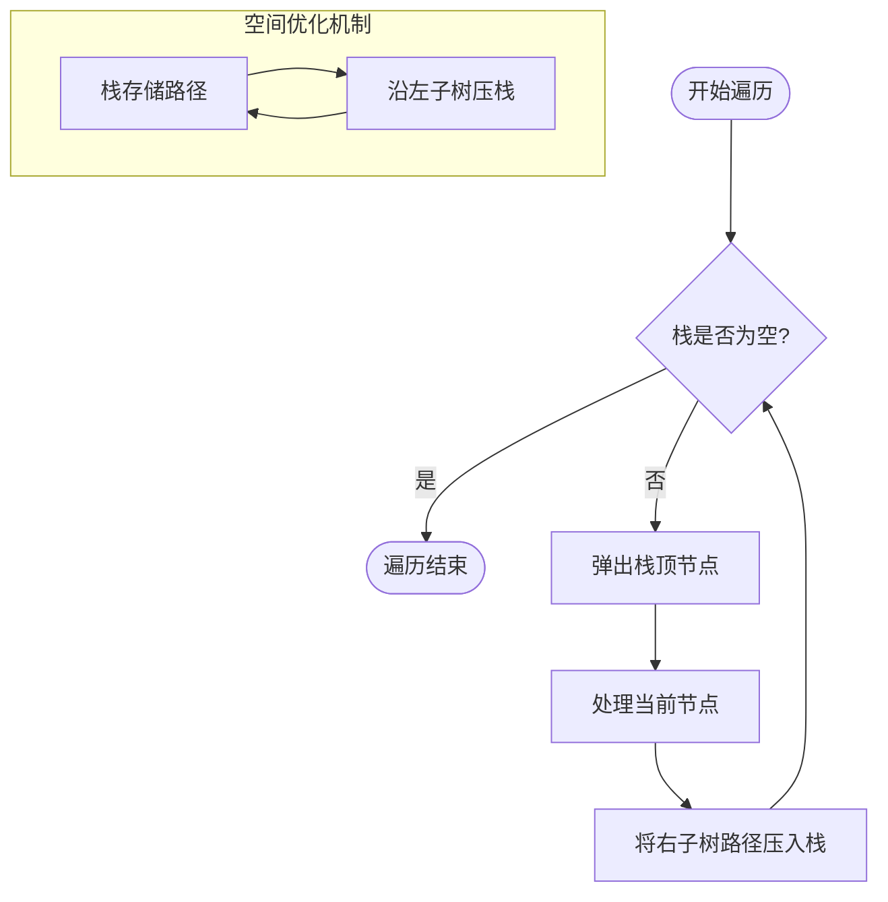
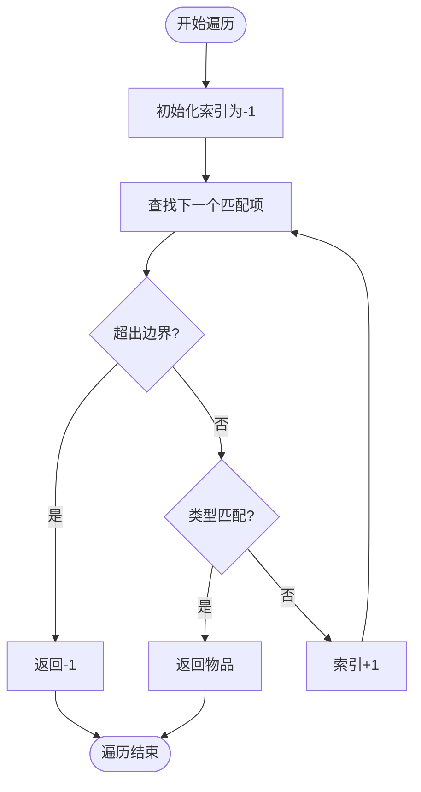
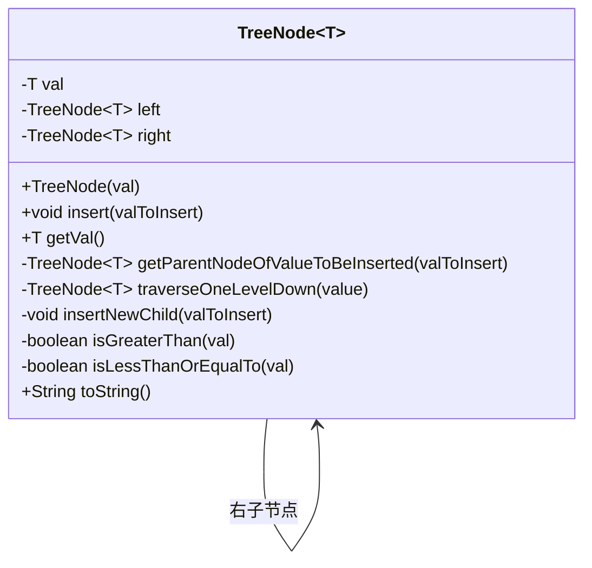
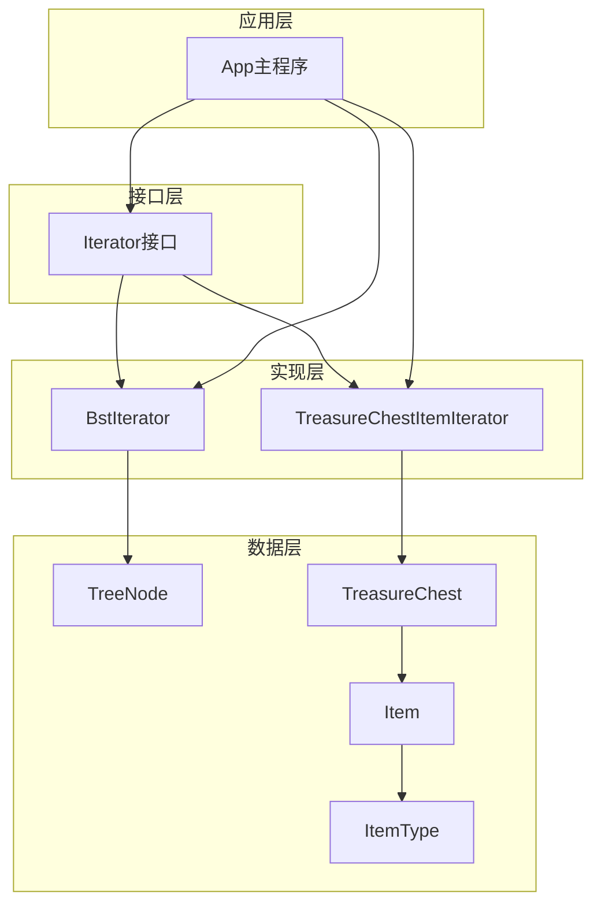

# 迭代器模式

<cite>
**本文档引用的文件**
- [Iterator.java](file://iterator/src/main/java/com/iluwatar/iterator/Iterator.java)
- [BstIterator.java](file://iterator/src/main/java/com/iluwatar/iterator/bst/BstIterator.java)
- [TreasureChestItemIterator.java](file://iterator/src/main/java/com/iluwatar/iterator/list/TreasureChestItemIterator.java)
- [TreeNode.java](file://iterator/src/main/java/com/iluwatar/iterator/bst/TreeNode.java)
- [TreasureChest.java](file://iterator/src/main/java/com/iluwatar/iterator/list/TreasureChest.java)
- [Item.java](file://iterator/src/main/java/com/iluwatar/iterator/list/Item.java)
- [ItemType.java](file://iterator/src/main/java/com/iluwatar/iterator/list/ItemType.java)
- [App.java](file://iterator/src/main/java/com/iluwatar/iterator/App.java)
- [BstIteratorTest.java](file://iterator/src/test/java/com/iluwatar/iterator/bst/BstIteratorTest.java)
- [TreasureChestTest.java](file://iterator/src/test/java/com/iluwatar/iterator/list/TreasureChestTest.java)
- [README.md](file://iterator/README.md)
</cite>

## 目录
1. [简介](#简介)
2. [项目结构](#项目结构)
3. [核心组件](#核心组件)
4. [架构概览](#架构概览)
5. [详细组件分析](#详细组件分析)
6. [依赖关系分析](#依赖关系分析)
7. [性能考虑](#性能考虑)
8. [故障排除指南](#故障排除指南)
9. [结论](#结论)

## 简介

迭代器模式（Iterator Pattern）是23种经典设计模式之一，属于行为型模式。该模式提供了一种方法来顺序访问聚合对象中的各个元素，而无需暴露其内部表示。这种设计模式的核心理念是将算法与容器解耦，使得客户端可以以统一的方式遍历不同的数据结构。

在本项目中，迭代器模式通过两个具体的实现展示了如何为不同类型的数据结构提供统一的访问接口：
- **BSTIterator**：用于二叉搜索树的中序遍历
- **TreasureChestItemIterator**：用于宝箱物品的分类遍历

这种设计使得客户端代码可以不关心底层数据结构的具体实现，只需要通过统一的Iterator接口即可完成遍历操作。

## 项目结构

迭代器模式模块采用清晰的分层组织结构，按照功能和数据类型进行分离：

**图表来源**
- [Iterator.java](file://iterator/src/main/java/com/iluwatar/iterator/Iterator.java#L32-L37)
- [BstIterator.java](file://iterator/src/main/java/com/iluwatar/iterator/bst/BstIterator.java#L38-L87)
- [TreasureChestItemIterator.java](file://iterator/src/main/java/com/iluwatar/iterator/list/TreasureChestItemIterator.java#L32-L76)

**章节来源**
- [README.md](file://iterator/README.md#L1-L253)

## 核心组件

### Iterator接口

Iterator接口是整个迭代器模式的核心抽象，定义了遍历操作的标准方法：

**图表来源**
- [Iterator.java](file://iterator/src/main/java/com/iluwatar/iterator/Iterator.java#L32-L37)
- [BstIterator.java](file://iterator/src/main/java/com/iluwatar/iterator/bst/BstIterator.java#L38-L87)
- [TreasureChestItemIterator.java](file://iterator/src/main/java/com/iluwatar/iterator/list/TreasureChestItemIterator.java#L32-L76)

**章节来源**
- [Iterator.java](file://iterator/src/main/java/com/iluwatar/iterator/Iterator.java#L27-L37)

### 数据结构组件

#### TreeNode类（二叉搜索树节点）

TreeNode类实现了泛型化的二叉搜索树节点，支持任意可比较类型的值存储：

**章节来源**
- [TreeNode.java](file://iterator/src/main/java/com/iluwatar/iterator/bst/TreeNode.java#L36-L131)

#### TreasureChest类（宝箱集合）

TreasureChest类作为集合容器，提供了统一的迭代器创建接口：

**章节来源**
- [TreasureChest.java](file://iterator/src/main/java/com/iluwatar/iterator/list/TreasureChest.java#L34-L66)

#### Item和ItemType类

Item类代表宝箱中的物品，ItemType枚举定义了物品的分类类型。

**章节来源**
- [Item.java](file://iterator/src/main/java/com/iluwatar/iterator/list/Item.java#L34-L46)
- [ItemType.java](file://iterator/src/main/java/com/iluwatar/iterator/list/ItemType.java#L30-L34)

## 架构概览

迭代器模式的整体架构体现了"接口抽象 + 多态实现"的设计思想：

**图表来源**
- [App.java](file://iterator/src/main/java/com/iluwatar/iterator/App.java#L49-L97)
- [BstIterator.java](file://iterator/src/main/java/com/iluwatar/iterator/bst/BstIterator.java#L42-L85)
- [TreasureChestItemIterator.java](file://iterator/src/main/java/com/iluwatar/iterator/list/TreasureChestItemIterator.java#L41-L59)

## 详细组件分析

### BSTIterator实现分析

BSTIterator实现了二叉搜索树的中序遍历，具有O(h)的空间复杂度，其中h为树的高度。

#### 核心算法流程

**图表来源**
- [BstIterator.java](file://iterator/src/main/java/com/iluwatar/iterator/bst/BstIterator.java#L54-L59)
- [BstIterator.java](file://iterator/src/main/java/com/iluwatar/iterator/bst/BstIterator.java#L77-L85)

#### 实现特点

1. **空间效率**：使用栈只保存从根到当前节点的路径，避免存储整棵树
2. **时间复杂度**：摊还分析下，每个节点最多被访问常数次
3. **异常处理**：当栈为空时抛出NoSuchElementException异常

**章节来源**
- [BstIterator.java](file://iterator/src/main/java/com/iluwatar/iterator/bst/BstIterator.java#L47-L85)

### TreasureChestItemIterator实现分析

TreasureChestItemIterator实现了对宝箱物品的分类遍历，支持按类型过滤。

#### 遍历策略

**图表来源**
- [TreasureChestItemIterator.java](file://iterator/src/main/java/com/iluwatar/iterator/list/TreasureChestItemIterator.java#L61-L75)

#### 类型过滤机制

迭代器支持四种类型过滤：
- **ANY**：遍历所有物品
- **POTION**：仅遍历药水类物品
- **RING**：仅遍历戒指类物品
- **WEAPON**：仅遍历武器类物品

**章节来源**
- [TreasureChestItemIterator.java](file://iterator/src/main/java/com/iluwatar/iterator/list/TreasureChestItemIterator.java#L32-L76)

### TreeNode数据结构分析

TreeNode类实现了二叉搜索树的基本操作，包括插入和查找：

**图表来源**
- [TreeNode.java](file://iterator/src/main/java/com/iluwatar/iterator/bst/TreeNode.java#L36-L131)

**章节来源**
- [TreeNode.java](file://iterator/src/main/java/com/iluwatar/iterator/bst/TreeNode.java#L68-L126)

## 依赖关系分析

迭代器模式的依赖关系体现了清晰的层次结构：

**图表来源**
- [App.java](file://iterator/src/main/java/com/iluwatar/iterator/App.java#L32-L36)
- [TreasureChest.java](file://iterator/src/main/java/com/iluwatar/iterator/list/TreasureChest.java#L34-L66)

**章节来源**
- [App.java](file://iterator/src/main/java/com/iluwatar/iterator/App.java#L25-L36)

## 性能考虑

### 时间复杂度分析

| 操作 | BSTIterator | TreasureChestItemIterator |
|------|-------------|---------------------------|
| 初始化 | O(h) | O(1) |
| hasNext() | O(1) | O(1) |
| next() | 均摊O(1) | O(n) 最坏情况 |
| 空间复杂度 | O(h) | O(1) |

### 内存使用优化

1. **BSTIterator的内存优势**：
   - 使用栈存储路径而非整棵树
   - 支持懒加载，只在需要时才展开节点

2. **TreasureChestItemIterator的内存优势**：
   - 使用索引而非额外数据结构
   - 避免创建中间集合

### 性能测试验证

单元测试验证了两种迭代器的正确性和性能特征：

**章节来源**
- [BstIteratorTest.java](file://iterator/src/test/java/com/iluwatar/iterator/bst/BstIteratorTest.java#L64-L102)
- [TreasureChestTest.java](file://iterator/src/test/java/com/iluwatar/iterator/list/TreasureChestTest.java#L65-L86)

## 故障排除指南

### 常见问题及解决方案

#### NoSuchElementException异常

**问题描述**：调用next()方法时抛出NoSuchElementException异常

**可能原因**：
- 迭代器已到达末尾
- 访问空树或空集合

**解决方案**：
- 在调用next()前检查hasNext()返回值
- 确保数据结构非空

#### 类型不匹配问题

**问题描述**：TreasureChestItemIterator无法正确过滤物品类型

**可能原因**：
- ItemType枚举值不匹配
- 物品类型设置错误

**解决方案**：
- 验证ItemType枚举定义
- 检查Item对象的类型属性

**章节来源**
- [BstIteratorTest.java](file://iterator/src/test/java/com/iluwatar/iterator/bst/BstIteratorTest.java#L57-L61)
- [TreasureChestTest.java](file://iterator/src/test/java/com/iluwatar/iterator/list/TreasureChestTest.java#L89-L113)

## 结论

迭代器模式通过提供统一的遍历接口，成功地将算法与数据结构解耦。本项目中的实现展示了以下关键价值：

### 设计优势

1. **统一接口**：客户端代码通过Iterator接口访问不同类型的数据结构
2. **封装性**：数据结构的内部实现细节被完全隐藏
3. **可扩展性**：新增数据结构只需实现Iterator接口
4. **灵活性**：支持多种遍历策略和过滤条件

### 实际应用场景

1. **集合遍历**：Java集合框架的基础
2. **文件系统遍历**：目录和文件的递归访问
3. **数据库游标**：结果集的顺序访问
4. **网络协议解析**：数据包的逐字段解析

### 最佳实践建议

1. **异常处理**：始终检查hasNext()后再调用next()
2. **资源管理**：及时释放迭代器占用的资源
3. **类型安全**：使用泛型确保编译时类型检查
4. **性能考量**：根据数据结构特点选择合适的遍历策略

迭代器模式作为设计模式的经典代表，其简洁而强大的设计理念使其成为软件开发中的重要工具。通过本项目的实现分析，开发者可以更好地理解和应用这一重要的设计模式。