# 设计模式详解

<cite>
**本文引用的文件**
- [README.md](file://README.md)
- [abstract-factory/README.md](file://abstract-factory/README.md)
- [singleton/README.md](file://singleton/README.md)
- [factory-method/README.md](file://factory-method/README.md)
- [builder/README.md](file://builder/README.md)
- [observer/README.md](file://observer/README.md)
- [strategy/README.md](file://strategy/README.md)
- [template-method/README.md](file://template-method/README.md)
- [command/README.md](file://command/README.md)
- [chain-of-responsibility/README.md](file://chain-of-responsibility/README.md)
- [adapter/README.md](file://adapter/README.md)
- [bridge/README.md](file://bridge/README.md)
- [composite/README.md](file://composite/README.md)
- [decorator/README.md](file://decorator/README.md)
- [facade/README.md](file://facade/README.md)
- [flyweight/README.md](file://flyweight/README.md)
</cite>

## 目录
1. [引言](#引言)
2. [项目结构](#项目结构)
3. [核心组件](#核心组件)
4. [架构总览](#架构总览)
5. [详细组件分析](#详细组件分析)
6. [依赖关系分析](#依赖关系分析)
7. [性能考量](#性能考量)
8. [故障排查指南](#故障排查指南)
9. [结论](#结论)
10. [附录](#附录)

## 引言
本指南基于 Gang of Four（GoF）经典分类体系，系统梳理 Java 设计模式中的创建型、结构型与行为型模式。每个模式均提供清晰的概念解释、典型应用场景、代码实现示例路径、优缺点分析、适用场景判断与潜在风险提示，并给出模式间的对比与组合使用建议。内容兼顾初学者易懂与资深工程师深度洞察，帮助读者在真实项目中正确选择与落地设计模式。

## 项目结构
该仓库以“按模式分目录”的方式组织，每个模式包含独立的 README 文档与示例代码，便于按需查阅与学习。整体采用“文档 + 示例 + 测试”的结构，覆盖 GoF 三类设计模式的主要成员。

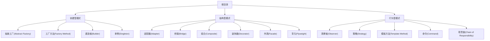

图示来源
- [README.md](file://README.md#L1-L532)

章节来源
- [README.md](file://README.md#L1-L532)

## 核心组件
- 创建型模式：关注对象创建过程，降低耦合并提升扩展性。
  - 抽象工厂：提供创建一系列相关或相互依赖对象的接口。
  - 工厂方法：定义创建对象的接口，由子类决定实例化哪一个类。
  - 建造者：将复杂对象的构建与其表示分离，使同样的构建过程可以创建不同表示。
  - 单例：保证一个类仅有一个实例，并提供一个访问它的全局访问点。
- 结构型模式：关注类与对象的组合，帮助形成更大的结构。
  - 适配器：使原本由于接口不兼容而不能一起工作的类可以协同工作。
  - 桥接：将抽象部分与它的实现部分分离，使它们都可以独立变化。
  - 组合：将对象组合成树形结构以表示“部分-整体”的层次结构。
  - 装饰器：动态地给对象添加一些额外的职责。
  - 外观：为子系统中的一组接口提供一个一致的界面。
  - 享元：运用共享技术有效地支持大量细粒度的对象。
- 行为型模式：关注对象之间的通信与职责分配。
  - 观察者：定义对象间的一种一对多的依赖关系，当一个对象的状态发生改变时，所有依赖于它的对象都得到通知并自动更新。
  - 策略：定义一系列算法，把它们一个个封装起来，并且使它们可以相互替换。
  - 模板方法：定义一个操作中的算法骨架，而将一些步骤延迟到子类中。
  - 命令：将请求封装为对象，使得可以用不同的请求对客户进行参数化。
  - 职责链：使多个对象都有机会处理请求，将这些对象连成一条链，并沿着这条链传递请求直到被处理。

章节来源
- [abstract-factory/README.md](file://abstract-factory/README.md#L1-L228)
- [singleton/README.md](file://singleton/README.md#L1-L110)
- [factory-method/README.md](file://factory-method/README.md#L1-L133)
- [builder/README.md](file://builder/README.md#L1-L205)
- [observer/README.md](file://observer/README.md#L1-L208)
- [strategy/README.md](file://strategy/README.md#L1-L222)
- [template-method/README.md](file://template-method/README.md#L1-L189)
- [command/README.md](file://command/README.md#L1-L220)
- [chain-of-responsibility/README.md](file://chain-of-responsibility/README.md#L1-L210)
- [adapter/README.md](file://adapter/README.md#L1-L151)
- [bridge/README.md](file://bridge/README.md#L1-L257)
- [composite/README.md](file://composite/README.md#L1-L219)
- [decorator/README.md](file://decorator/README.md#L1-L186)
- [facade/README.md](file://facade/README.md#L1-L247)
- [flyweight/README.md](file://flyweight/README.md#L1-L218)

## 架构总览
下图从系统视角展示了各模式在不同层次上的作用与交互关系，体现“解耦、复用、可扩展”的设计目标。

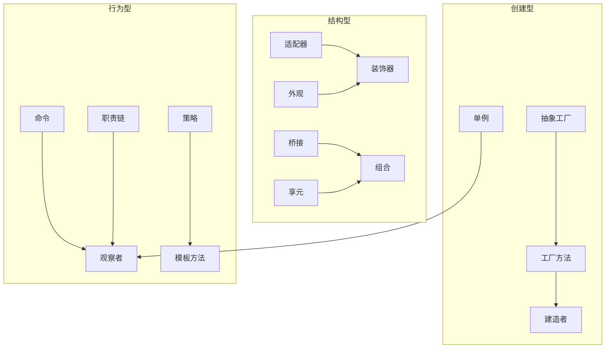

图示来源
- [abstract-factory/README.md](file://abstract-factory/README.md#L1-L228)
- [factory-method/README.md](file://factory-method/README.md#L1-L133)
- [builder/README.md](file://builder/README.md#L1-L205)
- [singleton/README.md](file://singleton/README.md#L1-L110)
- [adapter/README.md](file://adapter/README.md#L1-L151)
- [bridge/README.md](file://bridge/README.md#L1-L257)
- [composite/README.md](file://composite/README.md#L1-L219)
- [decorator/README.md](file://decorator/README.md#L1-L186)
- [facade/README.md](file://facade/README.md#L1-L247)
- [flyweight/README.md](file://flyweight/README.md#L1-L218)
- [observer/README.md](file://observer/README.md#L1-L208)
- [strategy/README.md](file://strategy/README.md#L1-L222)
- [template-method/README.md](file://template-method/README.md#L1-L189)
- [command/README.md](file://command/README.md#L1-L220)
- [chain-of-responsibility/README.md](file://chain-of-responsibility/README.md#L1-L210)

## 详细组件分析

### 创建型模式

#### 抽象工厂（Abstract Factory）
- 概念：提供创建一系列相关或相互依赖对象的接口，而不指定它们具体的类。
- 典型场景：需要在运行时根据配置或参数切换产品族；GUI 外观库、XML 工厂等。
- 优缺点：
  - 优点：易于切换产品族；客户端与具体类解耦；利于扩展新族。
  - 缺点：新增产品困难；类层次复杂。
- 适用性：产品族内强关联、需要统一风格与一致性。
- 风险提示：过度抽象导致调用方对具体实现产生隐式依赖。
- 组合使用：常与工厂方法、单例配合；通过枚举或配置选择具体工厂。

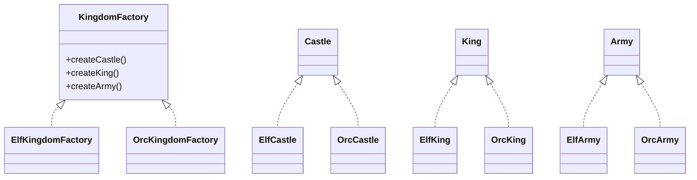

图示来源
- [abstract-factory/README.md](file://abstract-factory/README.md#L40-L166)

章节来源
- [abstract-factory/README.md](file://abstract-factory/README.md#L1-L228)

#### 工厂方法（Factory Method）
- 概念：定义创建对象的接口，让子类决定实例化哪一个类。
- 典型场景：框架扩展点、运行时选择具体实现。
- 优缺点：降低耦合；新增产品需新增子类。
- 适用性：无法预知具体类、希望委托给子类决定实例化。
- 风险提示：子类爆炸；需明确职责边界。
- 组合使用：常与抽象工厂、原型模式协作。

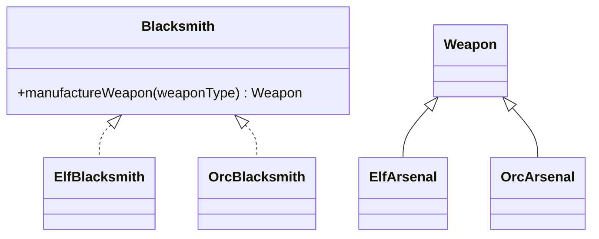

图示来源
- [factory-method/README.md](file://factory-method/README.md#L40-L90)

章节来源
- [factory-method/README.md](file://factory-method/README.md#L1-L133)

#### 建造者（Builder）
- 概念：将复杂对象的构建与其表示分离，使同样的构建过程可以创建不同表示。
- 典型场景：构造函数参数过多、步骤顺序严格、需要差异化配置。
- 优缺点：避免“胖构造函数”；提升可读性与可维护性；增加类数量。
- 适用性：对象构建步骤多、参数可选且顺序重要。
- 风险提示：过度设计；内存占用可能上升。
- 组合使用：与抽象工厂、原型、步骤建造者组合。

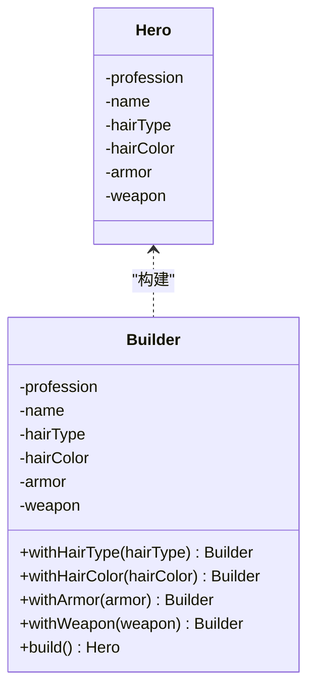

图示来源
- [builder/README.md](file://builder/README.md#L49-L114)

章节来源
- [builder/README.md](file://builder/README.md#L1-L205)

#### 单例（Singleton）
- 概念：保证一个类仅有一个实例，并提供一个访问它的全局访问点。
- 典型场景：日志、配置、连接池、安全组件。
- 优缺点：受控访问、减少命名空间；测试困难、并发瓶颈。
- 适用性：全局状态、资源受限、协调动作。
- 风险提示：隐藏依赖、并发问题；滥用会引入全局状态。
- 组合使用：常与工厂方法、抽象工厂协作。

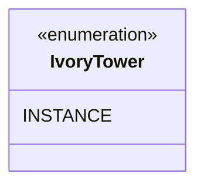

图示来源
- [singleton/README.md](file://singleton/README.md#L36-L62)

章节来源
- [singleton/README.md](file://singleton/README.md#L1-L110)

### 结构型模式

#### 适配器（Adapter）
- 概念：将一个类的接口转换为客户期望的另一个接口。
- 典型场景：第三方库集成、遗留系统对接。
- 优缺点：解耦现有接口；可能增加间接层与性能开销。
- 适用性：接口不兼容、复用已有类。
- 风险提示：过度适配导致系统复杂度上升。
- 组合使用：与装饰器、外观互补。

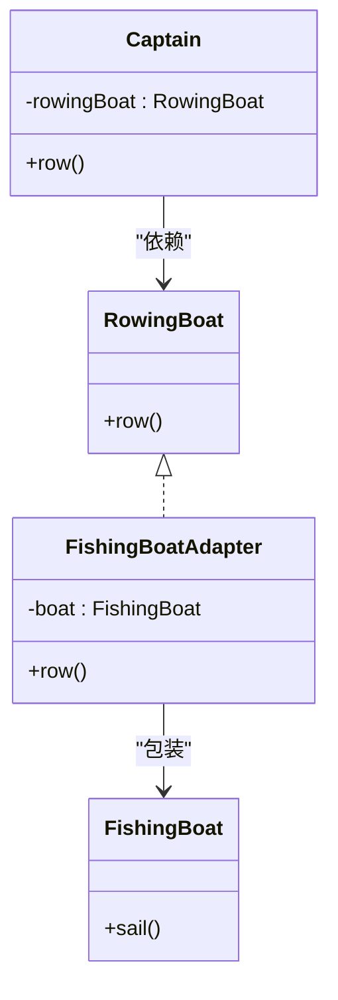

图示来源
- [adapter/README.md](file://adapter/README.md#L38-L104)

章节来源
- [adapter/README.md](file://adapter/README.md#L1-L151)

#### 桥接（Bridge）
- 概念：将抽象部分与它的实现部分分离，使它们都可以独立变化。
- 典型场景：驱动程序、GUI 框架、数据库连接。
- 优缺点：提高扩展性；增加对象层级与复杂度。
- 适用性：抽象与实现均可能扩展。
- 风险提示：运行时开销；设计不当易造成层次混乱。
- 组合使用：与组合、策略、抽象工厂协作。

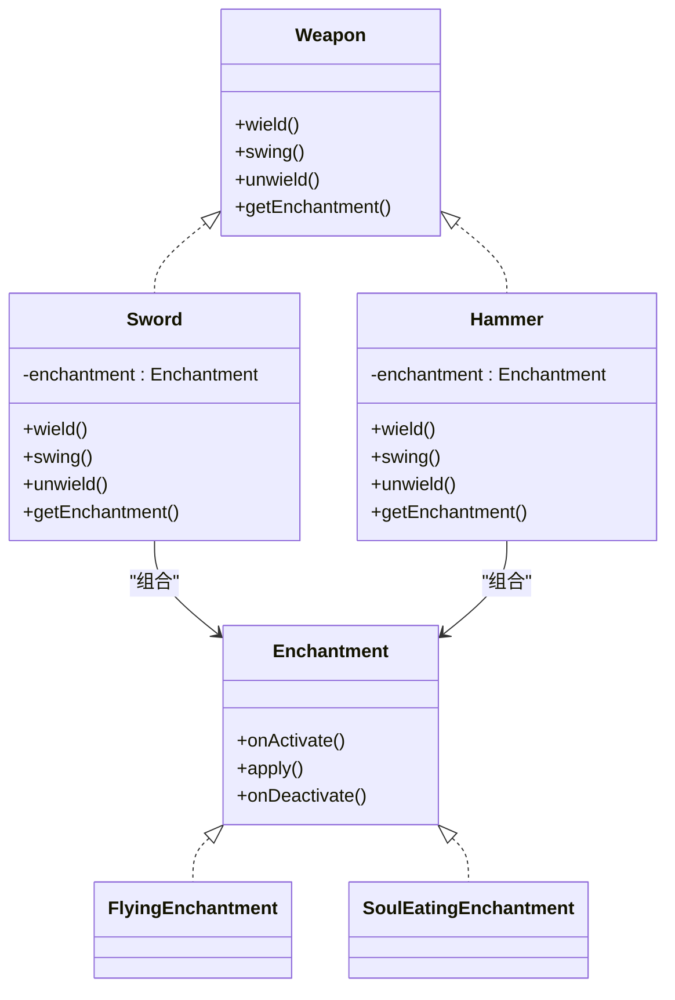

图示来源
- [bridge/README.md](file://bridge/README.md#L39-L184)

章节来源
- [bridge/README.md](file://bridge/README.md#L1-L257)

#### 组合（Composite）
- 概念：将对象组合成树形结构以表示“部分-整体”的层次结构。
- 典型场景：文件系统、菜单、图形组件树。
- 优缺点：统一处理叶子与分支；限制类型较难。
- 适用性：树形结构、统一遍历与操作。
- 风险提示：过度通用导致约束困难。
- 组合使用：与迭代器、访问者、享元协作。

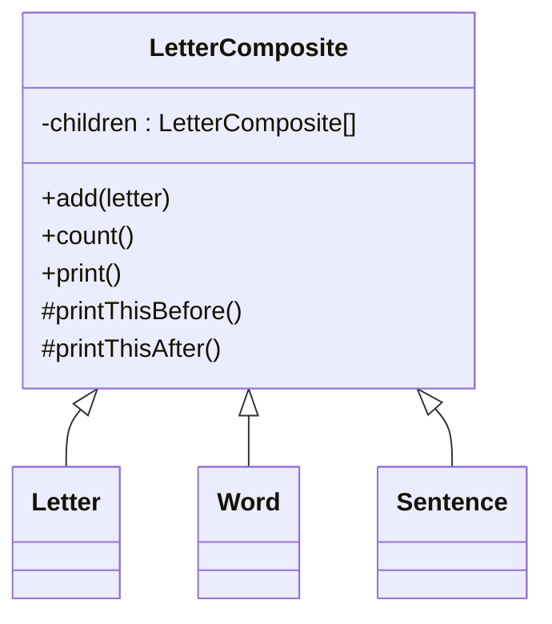

图示来源
- [composite/README.md](file://composite/README.md#L37-L111)

章节来源
- [composite/README.md](file://composite/README.md#L1-L219)

#### 装饰器（Decorator）
- 概念：在不改变原对象的情况下，动态地给对象添加职责。
- 典型场景：IO 流、GUI 组件增强。
- 优缺点：优于继承的灵活性；小对象增多、配置复杂。
- 适用性：动态增减职责、避免类膨胀。
- 风险提示：类型判断失效；调试困难。
- 组合使用：与适配器、组合、策略区分使用。

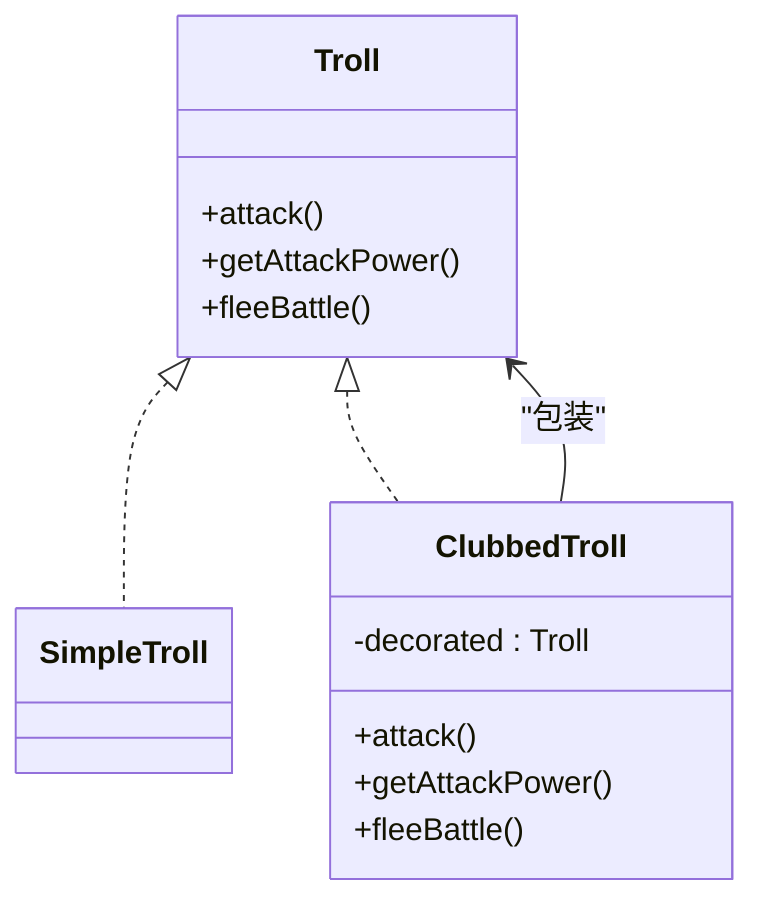

图示来源
- [decorator/README.md](file://decorator/README.md#L38-L97)

章节来源
- [decorator/README.md](file://decorator/README.md#L1-L186)

#### 外观（Facade）
- 概念：为复杂子系统提供统一的简单接口。
- 典型场景：子系统众多、入口统一。
- 优缺点：简化调用；可能演变为“上帝对象”。
- 适用性：子系统复杂、需要分层入口。
- 风险提示：过度封装导致扩展困难。
- 组合使用：与适配器、中介者协作。

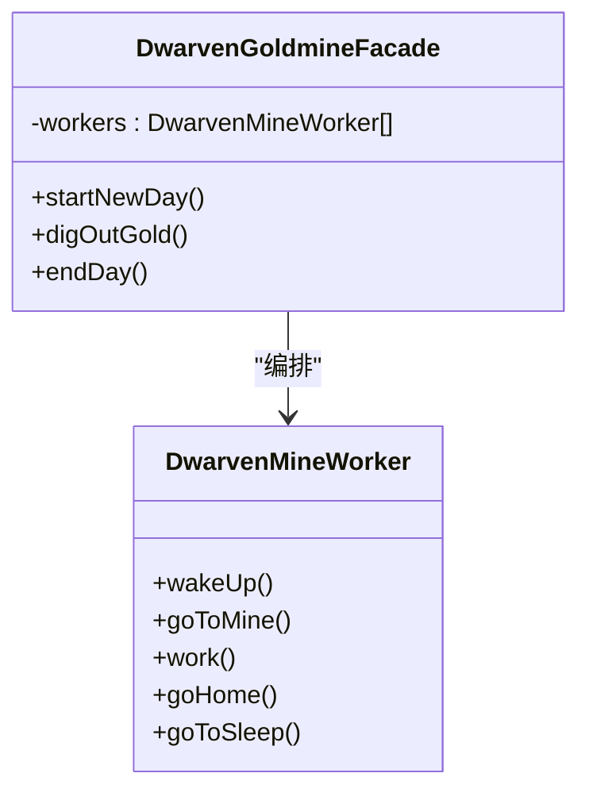

图示来源
- [facade/README.md](file://facade/README.md#L36-L168)

章节来源
- [facade/README.md](file://facade/README.md#L1-L247)

#### 享元（Flyweight）
- 概念：通过共享技术有效支持大量细粒度对象。
- 典型场景：文本编辑器字符、游戏精灵。
- 优缺点：显著节省内存；管理共享对象带来复杂度。
- 适用性：大量相似对象、可区分内外部状态。
- 风险提示：身份测试失效；共享状态一致性。
- 组合使用：与组合、状态模式协作。

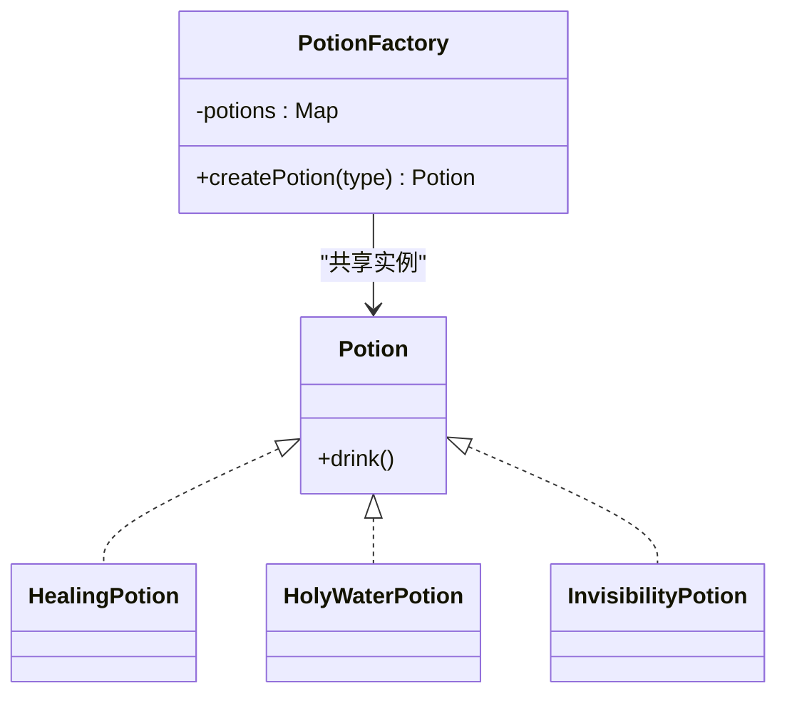

图示来源
- [flyweight/README.md](file://flyweight/README.md#L33-L100)

章节来源
- [flyweight/README.md](file://flyweight/README.md#L1-L218)

### 行为型模式

#### 观察者（Observer）
- 概念：定义对象间一对多依赖，当一个对象状态改变时通知所有依赖者。
- 典型场景：事件驱动、MVC、响应式编程。
- 优缺点：松耦合；可能内存泄漏、通知顺序不确定。
- 适用性：多对象需同步状态、发布订阅。
- 风险提示：未注销观察者导致泄漏；大量观察者影响性能。
- 组合使用：与命令、中介者协作。

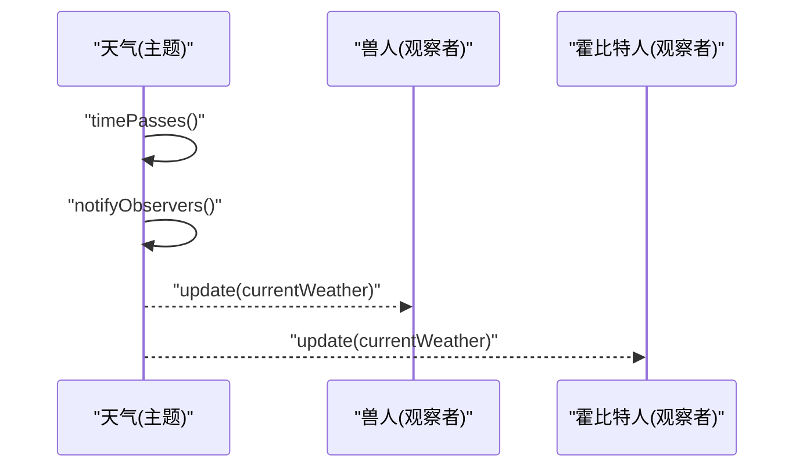

图示来源
- [observer/README.md](file://observer/README.md#L36-L133)

章节来源
- [observer/README.md](file://observer/README.md#L1-L208)

#### 策略（Strategy）
- 概念：定义一系列算法，把它们一个个封装起来并可相互替换。
- 典型场景：排序策略、支付方式、导航算法。
- 优缺点：避免条件分支；对象数量增加。
- 适用性：多种算法、运行时切换。
- 风险提示：客户端需了解策略差异；对象膨胀。
- 组合使用：与模板方法、装饰器区分使用。

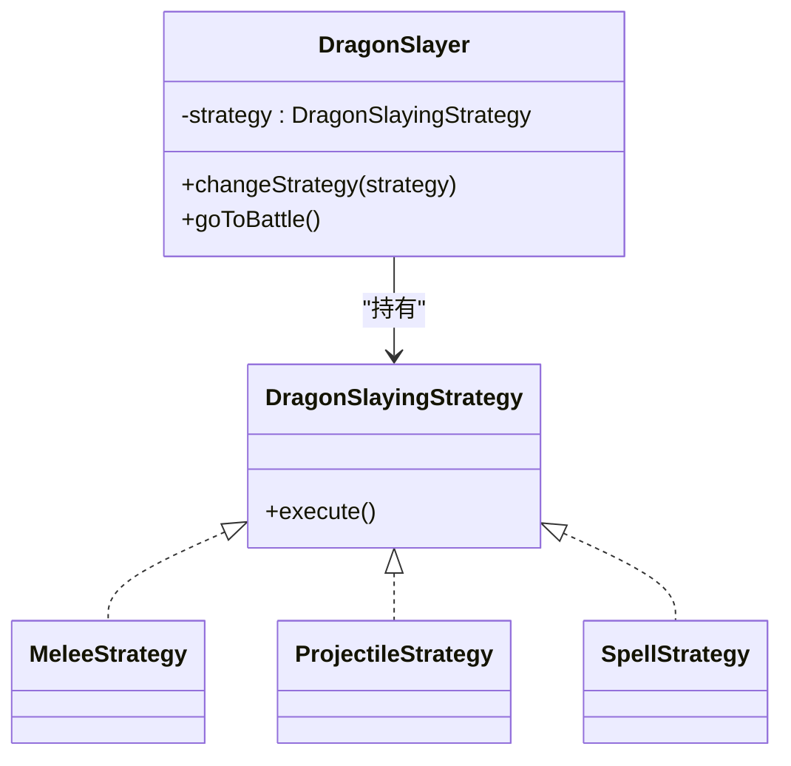

图示来源
- [strategy/README.md](file://strategy/README.md#L37-L102)

章节来源
- [strategy/README.md](file://strategy/README.md#L1-L222)

#### 模板方法（Template Method）
- 概念：在父类中定义算法骨架，允许子类重定义某些步骤。
- 典型场景：框架扩展、流程标准化。
- 优缺点：复用不变逻辑；子类过多。
- 适用性：算法骨架稳定、步骤可变。
- 风险提示：过度继承；钩子设计不当。
- 组合使用：与工厂方法、子类沙箱协作。

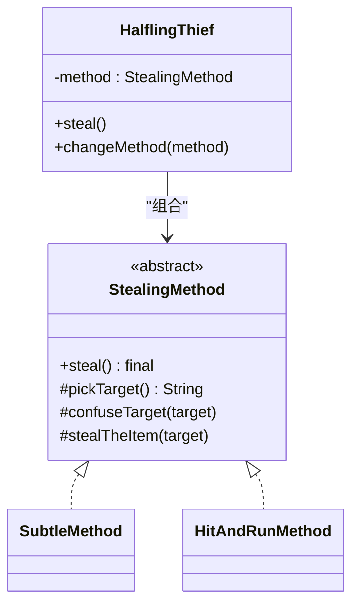

图示来源
- [template-method/README.md](file://template-method/README.md#L37-L122)

章节来源
- [template-method/README.md](file://template-method/README.md#L1-L189)

#### 命令（Command）
- 概念：将请求封装为对象，支持撤销与队列执行。
- 典型场景：宏命令、事务、回调。
- 优缺点：解耦发送者与接收者；命令对象增多。
- 适用性：需要撤销、日志、队列。
- 风险提示：命令膨胀；历史记录管理。
- 组合使用：与备忘录、组合、观察者协作。

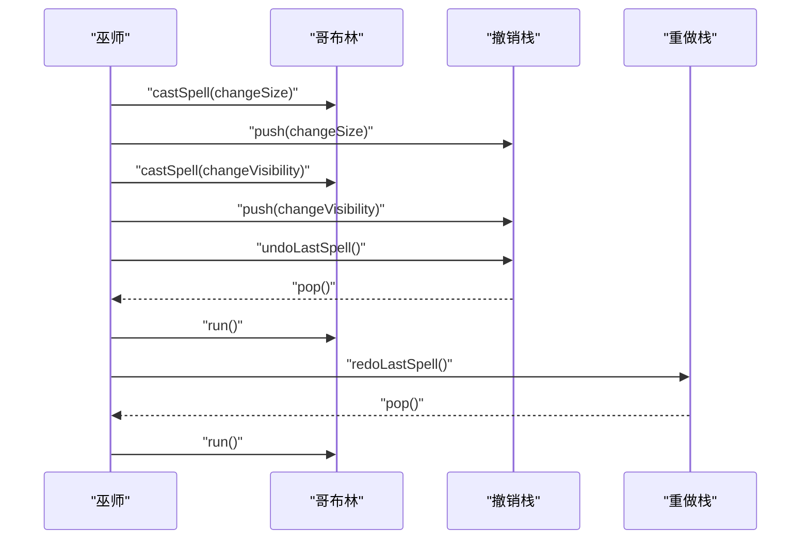

图示来源
- [command/README.md](file://command/README.md#L37-L154)

章节来源
- [command/README.md](file://command/README.md#L1-L220)

#### 职责链（Chain of Responsibility）
- 概念：多个对象有机会处理请求，链上传递直到被处理。
- 典型场景：审批流、过滤器、事件冒泡。
- 优缺点：降低耦合；定位困难、性能隐患。
- 适用性：多处理者、动态选择处理器。
- 风险提示：无默认处理器导致请求丢失；链过长。
- 组合使用：与命令、装饰器、组合协作。

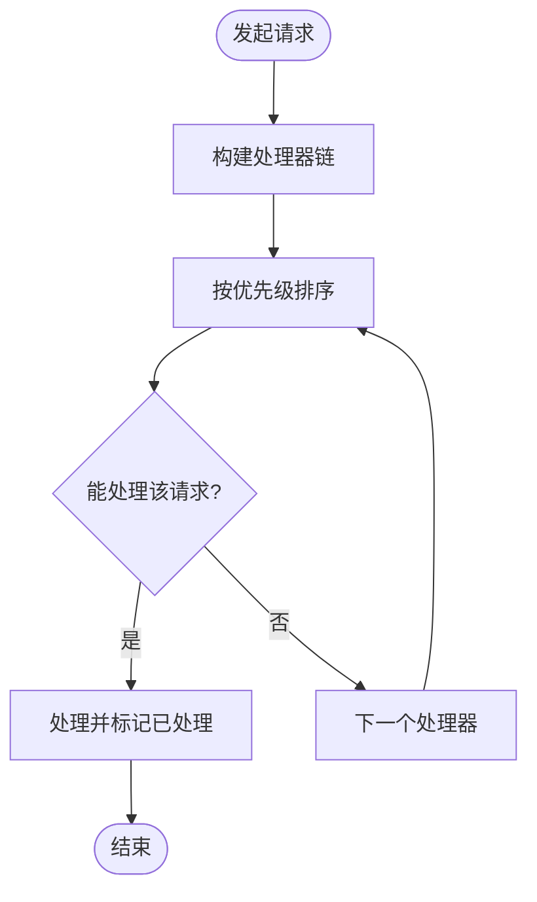

图示来源
- [chain-of-responsibility/README.md](file://chain-of-responsibility/README.md#L116-L138)

章节来源
- [chain-of-responsibility/README.md](file://chain-of-responsibility/README.md#L1-L210)

## 依赖关系分析
- 模式间耦合与协作：
  - 抽象工厂与工厂方法：前者组合多个工厂方法创建产品族。
  - 单例常作为其他模式的基础设施（如外观、工厂）。
  - 适配器与装饰器：前者改接口，后者增职责；可组合使用。
  - 桥接与组合：桥接分离抽象与实现，组合表达树形结构；可共同用于复杂 UI 或数据模型。
  - 外观与适配器：外观统一子系统接口，适配器连接不兼容接口；可配合分层。
  - 享元与组合：共享细粒度对象，组合形成更大结构；注意内外部状态分离。
  - 观察者与命令：观察者触发命令执行；命令可记录以便撤销。
  - 策略与模板方法：策略替换算法，模板方法固定流程骨架。
  - 职责链与命令：命令可沿链传递执行或撤销。
- 外部依赖与集成：
  - 许多模式在 JDK 中有天然实现参考（如适配器、观察者、命令、外观等），可直接借鉴其设计思想。

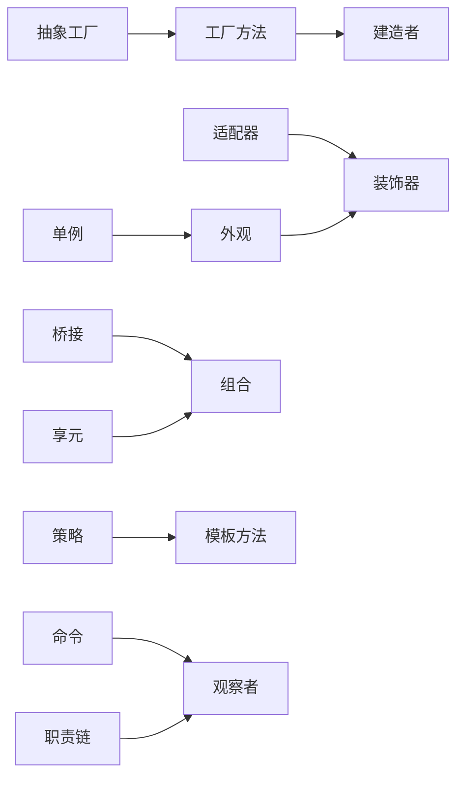

图示来源
- [abstract-factory/README.md](file://abstract-factory/README.md#L1-L228)
- [factory-method/README.md](file://factory-method/README.md#L1-L133)
- [builder/README.md](file://builder/README.md#L1-L205)
- [singleton/README.md](file://singleton/README.md#L1-L110)
- [adapter/README.md](file://adapter/README.md#L1-L151)
- [bridge/README.md](file://bridge/README.md#L1-L257)
- [composite/README.md](file://composite/README.md#L1-L219)
- [decorator/README.md](file://decorator/README.md#L1-L186)
- [facade/README.md](file://facade/README.md#L1-L247)
- [flyweight/README.md](file://flyweight/README.md#L1-L218)
- [observer/README.md](file://observer/README.md#L1-L208)
- [strategy/README.md](file://strategy/README.md#L1-L222)
- [template-method/README.md](file://template-method/README.md#L1-L189)
- [command/README.md](file://command/README.md#L1-L220)
- [chain-of-responsibility/README.md](file://chain-of-responsibility/README.md#L1-L210)

章节来源
- [README.md](file://README.md#L1-L532)

## 性能考量
- 内存与对象数量
  - 享元显著降低内存占用，但需管理共享对象与外部状态。
  - 装饰器与适配器引入额外对象与间接调用，需权衡性能。
- 并发与线程安全
  - 单例在多线程环境下需谨慎初始化与可见性；可采用枚举或延迟初始化的线程安全策略。
  - 观察者与命令在高并发下需注意通知顺序与撤销历史的线程安全。
- 扩展性与复杂度
  - 桥接与组合提升扩展性，但也可能增加系统复杂度与调试难度。
  - 模板方法与策略在频繁切换算法时需评估对象数量增长。

## 故障排查指南
- 常见问题与症状
  - 观察者未注销：内存泄漏、重复通知。
  - 命令撤销链过长：内存压力、回放成本高。
  - 适配器误用：性能下降、行为异常。
  - 享元共享不当：状态污染、身份测试失败。
  - 职责链无默认处理器：请求丢失。
- 排查建议
  - 使用单元测试验证模式边界行为（如撤销、通知顺序、对象身份）。
  - 对多线程场景进行并发测试，确保单例与命令撤销的线程安全。
  - 对复杂链路（职责链、模板方法）进行流程图与日志审计。
  - 对内存敏感场景（享元、装饰器）进行对象数量与生命周期监控。

章节来源
- [observer/README.md](file://observer/README.md#L183-L194)
- [command/README.md](file://command/README.md#L194-L205)
- [adapter/README.md](file://adapter/README.md#L129-L133)
- [flyweight/README.md](file://flyweight/README.md#L204-L207)
- [chain-of-responsibility/README.md](file://chain-of-responsibility/README.md#L191-L195)

## 结论
本指南基于 GoF 分类体系，系统梳理了 Java 设计模式在创建型、结构型与行为型三大类中的代表性成员。通过概念解释、场景分析、优缺点与风险提示、组合使用建议以及代码示例路径，帮助读者在实践中做出合理选择。建议在项目初期明确需求与扩展点，再针对性地选用合适的模式，避免过度设计与隐式耦合。

## 附录
- 参考资料与扩展阅读
  - 《设计模式：可复用面向对象软件的基础》
  - 《Effective Java》
  - 各模式 README 中列出的教程与实战链接