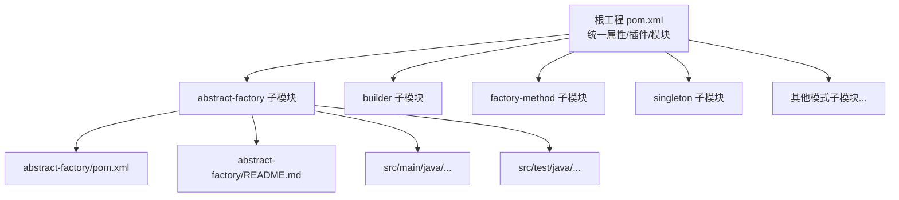
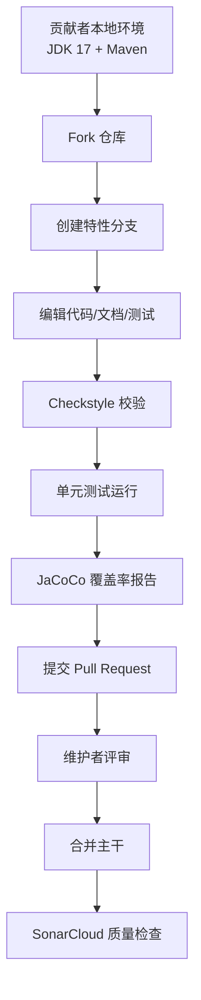
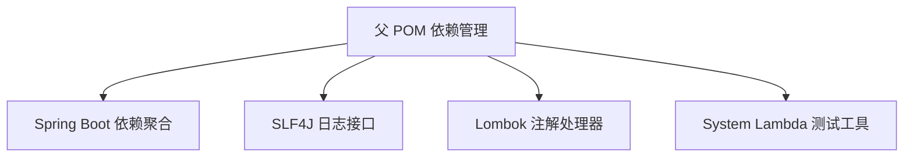

# 贡献指南

<cite>
**本文引用的文件**
- [README.md](file://README.md)
- [CONTRIBUTING.MD](file://CONTRIBUTING.MD)
- [PULL_REQUEST_TEMPLATE.md](file://PULL_REQUEST_TEMPLATE.md)
- [LICENSE.md](file://LICENSE.md)
- [pom.xml](file://pom.xml)
- [.editorconfig](file://.editorconfig)
- [checkstyle-suppressions.xml](file://checkstyle-suppressions.xml)
- [.github/dependabot.yml](file://.github/dependabot.yml)
- [.github/stale.yml](file://.github/stale.yml)
- [.github/FUNDING.yml](file://.github/FUNDING.yml)
- [abstract-factory/README.md](file://abstract-factory/README.md)
- [abstract-factory/pom.xml](file://abstract-factory/pom.xml)
- [abstract-factory/src/main/java/com/iluwatar/abstractfactory/App.java](file://abstract-factory/src/main/java/com/iluwatar/abstractfactory/App.java)
- [abstract-factory/src/test/java/com/iluwatar/abstractfactory/AppTest.java](file://abstract-factory/src/test/java/com/iluwatar/abstractfactory/AppTest.java)
</cite>

## 目录
1. [简介](#简介)
2. [项目结构](#项目结构)
3. [核心组件](#核心组件)
4. [架构总览](#架构总览)
5. [详细组件分析](#详细组件分析)
6. [依赖分析](#依赖分析)
7. [性能考虑](#性能考虑)
8. [故障排查指南](#故障排查指南)
9. [结论](#结论)
10. [附录](#附录)

## 简介
本指南面向所有希望为“Java 设计模式”项目做出贡献的开发者，覆盖从环境搭建、代码风格与测试规范，到分支管理、提交与 PR 流程、社区协作与问题处理机制等全流程。项目采用多模块 Maven 结构，统一使用 Checkstyle、JaCoCo、SonarCloud 等工具保障质量与一致性。

## 项目结构
- 根工程采用聚合 POM，声明统一的构建属性、插件与模块清单，便于跨模块统一质量控制与发布策略。
- 每个设计模式示例为独立子模块，包含源码、测试、文档与构建脚本，遵循一致的目录组织与命名规范。
- 顶层 README 提供总体介绍、贡献入口与社区渠道；各模块 README 提供模式说明与示例。

图表来源
- [pom.xml](file://pom.xml#L60-L219)
- [abstract-factory/pom.xml](file://abstract-factory/pom.xml#L30-L64)

章节来源
- [pom.xml](file://pom.xml#L37-L59)
- [README.md](file://README.md#L1-L60)

## 核心组件
- 质量与合规工具链
  - Checkstyle：统一代码风格，通过 google_checks.xml 与自定义抑制规则保证一致性。
  - JaCoCo：生成覆盖率报告，确保测试覆盖面。
  - SonarCloud：持续质量度量与安全扫描。
  - 许可证头：通过 license-maven-plugin 统一添加与校验。
- 构建与打包
  - Maven 编译插件指定 JDK 版本（17）。
  - maven-assembly-plugin 用于生成可执行 fat jar。
- 依赖管理
  - 使用 Spring Boot BOM 管理版本，集中声明常用依赖。
- 文档与图示
  - urm-maven-plugin 自动生成类图并输出至 etc 目录，便于文档配套。

章节来源
- [pom.xml](file://pom.xml#L285-L434)
- [.editorconfig](file://.editorconfig#L28-L47)
- [checkstyle-suppressions.xml](file://checkstyle-suppressions.xml#L1-L12)

## 架构总览
下图展示了贡献流程的关键节点与工具交互关系：

图表来源
- [pom.xml](file://pom.xml#L334-L434)
- [README.md](file://README.md#L1-L60)

## 详细组件分析

### 贡献入口与社区协作
- 官方贡献指南位于项目 Wiki，建议首次贡献者先阅读入门页面。
- 社区沟通主要通过 Gitter 聊天室进行，便于快速获得帮助与反馈。
- 项目设有资金支持入口，鼓励社区可持续发展。

章节来源
- [README.md](file://README.md#L1-L60)
- [.github/FUNDING.yml](file://.github/FUNDING.yml#L1-L2)

### 分支管理与提交规范
- 建议采用功能分支模型：基于主干创建 feature/<描述> 或 fix/<描述> 分支，完成后发起 PR。
- 提交信息建议遵循简洁清晰的格式，描述变更目的与影响范围。
- 遵循 Checkstyle 规则，避免因风格问题导致 CI 失败。

章节来源
- [CONTRIBUTING.MD](file://CONTRIBUTING.MD#L1-L4)
- [checkstyle-suppressions.xml](file://checkstyle-suppressions.xml#L1-L12)

### Pull Request 流程
- 使用统一的 PR 模板，明确问题背景与解决思路，必要时关联 Issue。
- 维护者会进行代码评审与质量检查，通过后合并入主干。
- 对于长期不活动的 PR，系统会按 stale 策略标记或关闭，保持仓库活跃度。

章节来源
- [PULL_REQUEST_TEMPLATE.md](file://PULL_REQUEST_TEMPLATE.md#L1-L15)
- [.github/stale.yml](file://.github/stale.yml#L1-L62)

### 代码风格与文档规范
- 统一使用 EditorConfig 与 Checkstyle 规则，确保跨模块风格一致。
- Java 文件最大行长 100，缩进与空行等细节在 editorconfig 中有明确配置。
- 文档示例遵循模块 README 的结构与语言约定，必要时补充类图与用例说明。

章节来源
- [.editorconfig](file://.editorconfig#L28-L47)
- [abstract-factory/README.md](file://abstract-factory/README.md#L1-L40)

### 测试与覆盖率标准
- 单元测试使用 JUnit Jupiter，建议每个新增或修改的功能均配套测试。
- 通过 JaCoCo 生成覆盖率报告，建议覆盖率不低于项目当前水平，逐步提升。
- 模块示例中常见做法是提供 main 入口类与最小化测试，验证无异常执行。

章节来源
- [abstract-factory/pom.xml](file://abstract-factory/pom.xml#L36-L42)
- [abstract-factory/src/test/java/com/iluwatar/abstractfactory/AppTest.java](file://abstract-factory/src/test/java/com/iluwatar/abstractfactory/AppTest.java#L34-L41)
- [pom.xml](file://pom.xml#L391-L409)

### 开发环境搭建与调试
- JDK：使用 17（由编译插件指定），确保本地与 CI 一致。
- Maven：直接执行 mvn 命令即可完成编译、测试与报告生成。
- 可执行 jar：通过 maven-assembly-plugin 生成，便于快速运行示例。
- 调试技巧：在 IDE 中设置断点，结合日志输出定位问题；对并发或异步场景可借助日志时间戳与线程名分析。

章节来源
- [pom.xml](file://pom.xml#L288-L295)
- [abstract-factory/pom.xml](file://abstract-factory/pom.xml#L43-L63)

### 性能分析与质量度量
- SonarCloud：自动分析代码质量、重复率与安全问题，PR 将触发质量门禁。
- JaCoCo：生成覆盖率报告，建议在 PR 中附带覆盖率变化说明。
- Checkstyle：在 validate 阶段执行，失败即阻断 CI，确保风格一致。

章节来源
- [pom.xml](file://pom.xml#L328-L356)
- [pom.xml](file://pom.xml#L391-L409)

### 问题报告与功能请求
- 问题报告：优先在 GitHub Issues 中搜索是否已有类似问题，确认后新建 Issue 并按模板填写。
- 功能请求：描述需求背景、预期行为与收益，维护者将评估并纳入路线图。
- 关联 PR：在 PR 描述中使用“Closes #xxx”关联已解决问题，保持追踪清晰。

章节来源
- [README.md](file://README.md#L1-L60)
- [PULL_REQUEST_TEMPLATE.md](file://PULL_REQUEST_TEMPLATE.md#L11-L15)

### 新贡献者入门与导师制度
- 新人建议从简单模块入手，如单例、工厂等基础模式，熟悉目录结构与测试方式。
- 参考模块示例中的 README 与源码注释，理解模式意图与实现要点。
- 社区通过 Gitter 提供即时交流渠道，遇到问题可及时寻求帮助。

章节来源
- [abstract-factory/README.md](file://abstract-factory/README.md#L1-L40)
- [README.md](file://README.md#L1-L60)

### 知识产权与许可
- 主项目采用 MIT 许可证，允许自由使用、复制、修改与再分发，需保留版权与许可声明。
- 模型视图视图模型模块使用 LGPL 许可（ZK 框架），请遵守相应条款。

章节来源
- [LICENSE.md](file://LICENSE.md#L1-L25)

## 依赖分析
- 依赖管理：通过 Spring Boot BOM 管理核心依赖版本，减少冲突。
- 日志与注解：SLF4J 与 Lombok 作为通用依赖引入，简化日志与样板代码。
- 测试辅助：System Lambda 等工具用于测试环境模拟。

图表来源
- [pom.xml](file://pom.xml#L226-L262)

章节来源
- [pom.xml](file://pom.xml#L226-L284)

## 性能考虑
- 构建性能：合理拆分子模块，避免过度耦合；利用并行构建与缓存策略。
- 测试性能：优先使用内存级测试与轻量级框架，减少外部依赖。
- 覆盖率与质量：持续关注覆盖率与技术债指标，避免回归。

## 故障排查指南
- CI 失败
  - Checkstyle 失败：根据报错修正代码风格，参考 editorconfig 与 checkstyle 规则。
  - 测试失败：检查测试用例与边界条件，确保逻辑正确性。
  - 覆盖率不足：补充针对性测试，提升关键路径覆盖率。
- 依赖更新
  - 使用 Dependabot 自动化拉取依赖更新，定期审阅变更并验证兼容性。

章节来源
- [.github/dependabot.yml](file://.github/dependabot.yml#L1-L11)
- [.github/stale.yml](file://.github/stale.yml#L1-L62)

## 结论
本指南提供了从环境准备到贡献落地的完整路径，强调风格一致、测试完备与质量门禁。建议贡献者在提交前自检风格与测试，保持与社区沟通渠道畅通，共同维护高质量的设计模式知识库。

## 附录
- 示例模块结构参考
  - 模块入口类与测试类位置清晰，便于快速定位与验证。
  - README 提供模式说明与类图，有助于理解与传播。

章节来源
- [abstract-factory/src/main/java/com/iluwatar/abstractfactory/App.java](file://abstract-factory/src/main/java/com/iluwatar/abstractfactory/App.java#L30-L85)
- [abstract-factory/src/test/java/com/iluwatar/abstractfactory/AppTest.java](file://abstract-factory/src/test/java/com/iluwatar/abstractfactory/AppTest.java#L34-L41)
- [abstract-factory/README.md](file://abstract-factory/README.md#L168-L171)