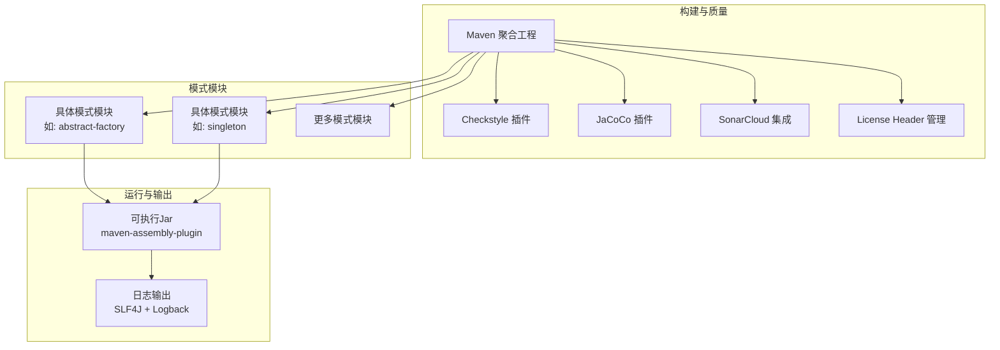
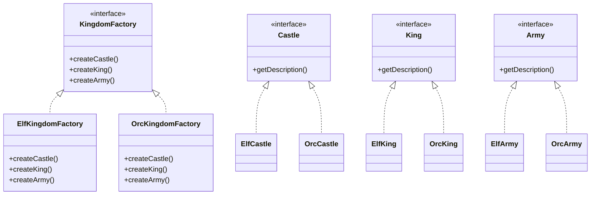
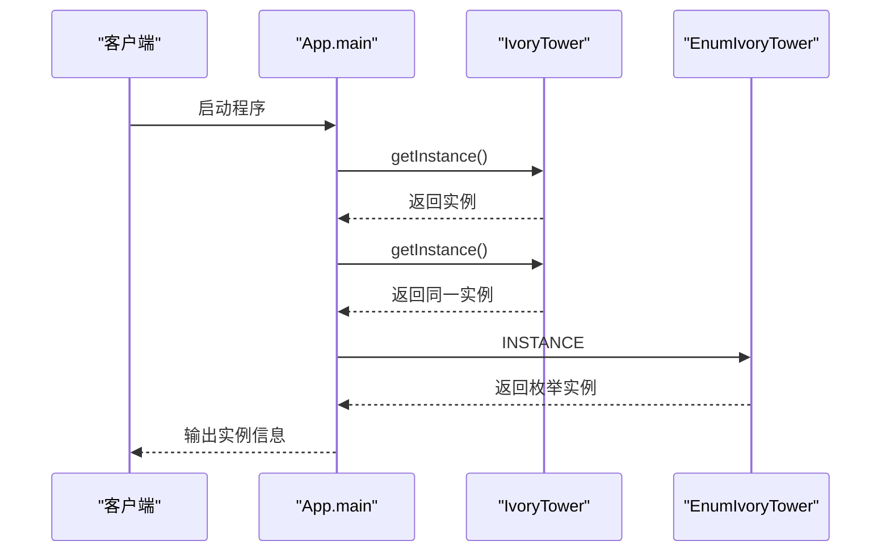
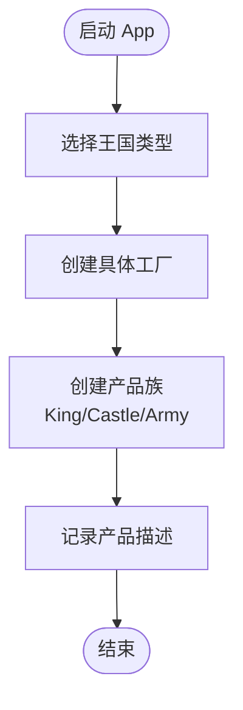
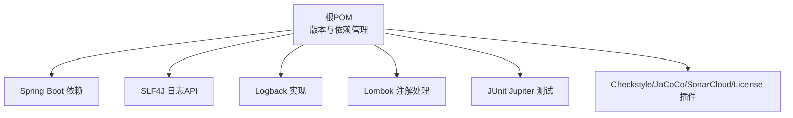

# 项目概览

<cite>
**本文档引用的文件**
- [README.md](file://README.md)
- [CONTRIBUTING.MD](file://CONTRIBUTING.MD)
- [LICENSE.md](file://LICENSE.md)
- [pom.xml](file://pom.xml)
- [.github/FUNDING.yml](file://.github/FUNDING.yml)
- [localization/zh/README.md](file://localization/zh/README.md)
- [localization/es/README.md](file://localization/es/README.md)
- [abstract-factory/README.md](file://abstract-factory/README.md)
- [abstract-factory/pom.xml](file://abstract-factory/pom.xml)
- [abstract-factory/src/main/java/com/iluwatar/abstractfactory/App.java](file://abstract-factory/src/main/java/com/iluwatar/abstractfactory/App.java)
- [singleton/src/main/java/com/iluwatar/singleton/App.java](file://singleton/src/main/java/com/iluwatar/singleton/App.java)
</cite>

## 目录
1. [简介](#简介)
2. [项目结构](#项目结构)
3. [核心组件](#核心组件)
4. [架构总览](#架构总览)
5. [详细组件分析](#详细组件分析)
6. [依赖关系分析](#依赖关系分析)
7. [性能考虑](#性能考虑)
8. [故障排除指南](#故障排除指南)
9. [结论](#结论)
10. [附录](#附录)

## 简介
本项目是一个专注于Java设计模式的综合性学习与实践平台，旨在通过200多个真实可运行的模式示例，帮助开发者系统掌握经典与现代设计模式。项目不仅提供清晰的理论说明与类图，还配套完整的源码示例、单元测试与构建脚本，使学习者能够在实践中加深理解。

项目的核心价值主张包括：
- **权威性与实用性**：基于经典的《设计模式》（Gang of Four）以及现代Java生态的实际应用，覆盖创建型、结构型、行为型等主流分类。
- **可复用的学习资源**：每个模式均配有独立模块，包含README讲解、源码实现与测试，便于按需学习与复用。
- **开源协作与国际化**：采用MIT开源许可，支持多语言文档，鼓励社区贡献与持续演进。
- **工程化实践**：统一的Maven多模块结构、代码规范检查、覆盖率与静态分析工具集成，体现企业级工程最佳实践。

## 项目结构
项目采用Maven聚合工程结构，顶层pom管理全局属性、插件与依赖，各设计模式作为独立子模块存在，形成“一个模式一个模块”的清晰组织方式。这种模块化设计使得：
- 学习者可以单独编译、运行某个模式示例；
- 维护者可以独立更新、测试单个模式；
- 团队协作时减少模块间的耦合与冲突。

```mermaid
graph TB
Root["根项目<br/>聚合工程"] --> AF["abstract-factory<br/>抽象工厂"]
Root --> SM["singleton<br/>单例"]
Root --> BM["builder<br/>建造者"]
Root --> FM["factory-method<br/>工厂方法"]
Root --> PR["prototype<br/>原型"]
Root --> AD["adapter<br/>适配器"]
Root --> BR["bridge<br/>桥接"]
Root --> CP["composite<br/>组合"]
Root --> DC["decorator<br/>装饰器"]
Root --> FD["facade<br/>外观"]
Root --> FW["flyweight<br/>享元"]
Root --> PJ["proxy<br/>代理"]
Root --> CR["chain-of-responsibility<br/>职责链"]
Root --> CM["command<br/>命令"]
Root --> IT["interpreter<br/>解释器"]
Root --> ITT["iterator<br/>迭代器"]
Root --> MD["mediator<br/>中介者"]
Root --> ME["memento<br/>备忘录"]
Root --> OB["observer<br/>观察者"]
Root --> ST["state<br/>状态"]
Root --> STY["strategy<br/>策略"]
Root --> TM["template-method<br/>模板方法"]
Root --> VS["visitor<br/>访问者"]
Root --> Others["更多模式模块..."]
```

图表来源
- [pom.xml](file://pom.xml#L60-L219)

章节来源
- [pom.xml](file://pom.xml#L1-L436)

## 核心组件
- 模式示例模块：每个模式对应一个独立子模块，包含源码、测试与构建配置，如抽象工厂、单例、建造者等。
- 文档与说明：每个模块提供详细的README，涵盖意图、适用场景、优缺点、实际应用与相关模式链接。
- 构建与质量保障：统一的Maven配置、Checkstyle、JaCoCo、SonarCloud与许可证校验插件，确保代码风格一致与质量可控。
- 多语言支持：提供多种语言的README文档，覆盖中文、西班牙语等，便于全球开发者学习。

章节来源
- [abstract-factory/README.md](file://abstract-factory/README.md#L1-L228)
- [abstract-factory/pom.xml](file://abstract-factory/pom.xml#L1-L65)
- [pom.xml](file://pom.xml#L285-L434)

## 架构总览
项目整体采用“多模块聚合 + 单模块独立运行”的架构。顶层pom负责版本与插件管理，子模块各自定义依赖与打包方式；部分模块通过maven-assembly-plugin生成可执行的fat jar，便于直接运行示例程序。

图表来源
- [pom.xml](file://pom.xml#L285-L434)
- [abstract-factory/pom.xml](file://abstract-factory/pom.xml#L43-L63)

章节来源
- [pom.xml](file://pom.xml#L285-L434)
- [abstract-factory/pom.xml](file://abstract-factory/pom.xml#L43-L63)

## 详细组件分析

### 抽象工厂模式（Abstract Factory）
- 目标与定位：演示如何通过抽象工厂为一组相关或相互依赖的对象提供统一接口，而不指定具体类。
- 实现要点：定义产品族接口（如Castle、King、Army），并提供不同实现（如Elf、Orc），通过工厂选择器在运行时决定具体产品族。
- 教学价值：帮助理解解耦、可替换性与一致性约束在大型系统中的作用。

图表来源
- [abstract-factory/README.md](file://abstract-factory/README.md#L40-L137)

章节来源
- [abstract-factory/README.md](file://abstract-factory/README.md#L1-L228)
- [abstract-factory/src/main/java/com/iluwatar/abstractfactory/App.java](file://abstract-factory/src/main/java/com/iluwatar/abstractfactory/App.java#L30-L85)

### 单例模式（Singleton）
- 目标与定位：演示多种单例实现方式（急切初始化、枚举、双重检查锁定、按需初始化持有者等），并展示其线程安全与性能权衡。
- 实践价值：帮助理解单例在并发环境下的正确实现方式，避免分布式与序列化带来的陷阱。

图表来源
- [singleton/src/main/java/com/iluwatar/singleton/App.java](file://singleton/src/main/java/com/iluwatar/singleton/App.java#L65-L110)

章节来源
- [singleton/src/main/java/com/iluwatar/singleton/App.java](file://singleton/src/main/java/com/iluwatar/singleton/App.java#L1-L111)

### 模块运行流程（以抽象工厂为例）
- 入口：App类的main方法启动示例。
- 执行：根据类型参数选择具体工厂，创建产品族（国王、城堡、军队）。
- 输出：记录各产品描述，验证产品族的一致性。

图表来源
- [abstract-factory/src/main/java/com/iluwatar/abstractfactory/App.java](file://abstract-factory/src/main/java/com/iluwatar/abstractfactory/App.java#L55-L85)

章节来源
- [abstract-factory/src/main/java/com/iluwatar/abstractfactory/App.java](file://abstract-factory/src/main/java/com/iluwatar/abstractfactory/App.java#L1-L85)

## 依赖关系分析
- 版本与依赖管理：顶层pom集中声明Spring Boot、SLF4J、Logback、Lombok等依赖版本，子模块通过dependencyManagement继承，保证一致性。
- 测试框架：JUnit Jupiter用于单元测试，部分模块通过maven-assembly-plugin指定主类生成可执行jar。
- 工具链：Checkstyle、JaCoCo、SonarCloud与许可证头部校验插件统一管理，提升代码质量与合规性。

图表来源
- [pom.xml](file://pom.xml#L226-L284)
- [pom.xml](file://pom.xml#L285-L434)

章节来源
- [pom.xml](file://pom.xml#L226-L284)
- [pom.xml](file://pom.xml#L285-L434)

## 性能考虑
- 模块化带来的编译与测试隔离：每个模式独立构建，便于并行开发与增量测试。
- 运行时开销最小化：示例程序聚焦于模式演示，避免冗余逻辑，适合初学者快速理解。
- 可扩展性：通过统一的构建与质量工具链，新模块可快速接入并保持一致的工程标准。

## 故障排除指南
- 构建失败（依赖或版本冲突）：检查子模块是否正确继承父POM的dependencyManagement，确认本地仓库缓存与网络代理设置。
- 测试失败：优先查看JUnit报告与日志输出，定位具体断言或异常点。
- 代码风格不通过：运行checkstyle插件修复或调整规则配置，确保符合Google风格要求。
- 许可证头部缺失：运行license-maven-plugin自动注入或手动添加标准头部。

章节来源
- [pom.xml](file://pom.xml#L338-L356)
- [pom.xml](file://pom.xml#L357-L409)
- [pom.xml](file://pom.xml#L358-L390)

## 结论
本项目以“200多个高质量Java设计模式示例”为核心，构建了一个兼具权威性、实用性与可扩展性的学习平台。通过模块化架构、完善的质量工具链与多语言文档，项目不仅服务于个人学习，也为团队协作与知识传播提供了标准化范式。建议学习者从创建型与行为型入手，逐步扩展到结构型与现代模式，结合实际项目进行迁移与重构。

## 附录

### 开源协作与社区
- 贡献指南：参见开发者Wiki与贡献入口，遵循Issue与PR流程。
- 社区渠道：通过Gitter聊天室交流与答疑。
- 赞助支持：GitHub赞助入口。

章节来源
- [CONTRIBUTING.MD](file://CONTRIBUTING.MD#L1-L4)
- [.github/FUNDING.yml](file://.github/FUNDING.yml#L1-L2)

### 许可证与法律
- 主项目采用MIT许可证，允许自由使用、复制、修改与再发布，需保留版权与许可声明。
- 特定模块（如model-view-viewmodel）使用LGPL许可，需遵循相应条款。

章节来源
- [LICENSE.md](file://LICENSE.md#L1-L25)

### 多语言支持现状
- 中文README：提供入门介绍、使用方式与贡献说明。
- 西班牙语README：提供本地化版本，便于拉美地区用户学习。
- 更多语言：项目提供localization目录，包含多语言README，欢迎社区贡献翻译。

章节来源
- [localization/zh/README.md](file://localization/zh/README.md#L1-L42)
- [localization/es/README.md](file://localization/es/README.md#L1-L51)